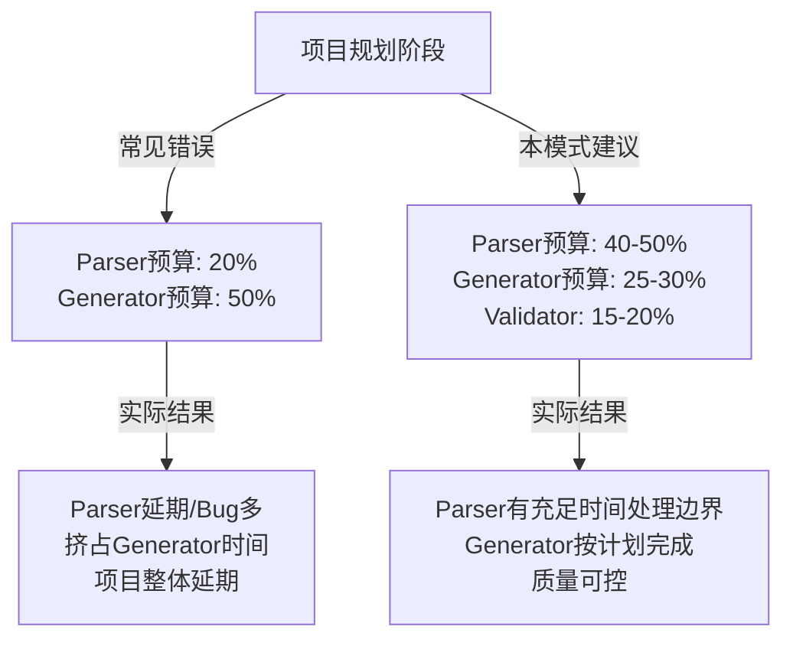

> **提炼自**：[insight-extraction.md](../../../reports/project-reports/retrospective-mdi-project-completion-20260702/insight-extraction.md) —— MDI项目完成复盘（洞察7）

# 半结构化解析复杂度预算模式（Semi-structured Parsing Complexity Budget）

## 模式类型

方法论模式（工具自动化）

## 成熟度

L1 首次提炼（MDI项目Parser模块开发实践验证）

## 适用场景

解析器/编译器/代码生成器开发、Markdown/YAML等半结构化数据处理工具、文档处理工具链、DSL（领域特定语言）工具开发；做项目规划和时间估算时使用。

## 问题背景

开发IDL（接口定义语言）、文档解析器、DSL工具时，常见的规划误区是：

- "Parser不就是把Markdown转成AST吗？应该很简单，1-2天搞定"
- "JSON/YAML解析用现成库，Markdown解析也有mistune/markdown-it，拼一拼就行"
- "Generator（代码生成）才是重点，Parser只是格式转换"
- "参考OpenAPI/JSON Schema的解析逻辑就行"

这些估算**系统性低估了半结构化格式的解析复杂度**——Markdown等"人类友好"格式的解析难度远高于JSON/YAML等结构化格式。

## 核心洞察：结构化vs半结构化解析复杂度对比

| 维度 | 结构化格式（JSON/YAML/XML） | 半结构化格式（Markdown/自由文本/混合文档） |
|-----|---------------------------|------------------------------------------|
| 语法规范 | 严格、无歧义、机器可读 | 宽松、容忍歧义、人类优先 |
| 成熟解析器 | 标准库级支持，100%兼容 | 第三方库只处理标准语法，自定义扩展需自己写 |
| 边界情况 | 语法错误直接报错，fail-fast | "看起来合理"的写法有无数种，都需要处理 |
| AST结构 | 确定性：相同输入→相同AST | 非确定性：标题层级、列表嵌套、directive归属都需要判断 |
| 扩展机制 | Schema/JSON Schema标准验证 | 需要自己设计Directive/宏/自定义语法及解析逻辑 |
| 代码量占比经验值 | Parser:Generator ≈ 1:2 | **Parser:Generator ≈ (2-3):1** |

## MDI项目数据验证

MDI项目实际代码量分布：

| 模块分类 | 代码行数 | 占比 | Bug数 | 说明 |
|---------|---------|------|-------|------|
| Parser层（parser.py + directive解析） | 1465行 | 16.3% | 3个 | 最大模块，花费时间最多 |
| Validator层（validator.py + 5个Profile） | 1295行 | 14.4% | 0个 | 规则验证，相对直接 |
| Generator层（9个生成器 + utils） | 2549行 | 28.4% | 2个 | 输出目标明确，相对简单 |
| 辅助工具（mock_data/example_extractor/checklist等） | 733行 | 8.2% | 1个 | 独立工具，复杂度可控 |
| 版本管理（versioning.py） | 872行 | 9.7% | 3个 | 结构化diff+SemVer，复杂度第二 |
| 其他（models.py/CLI/API入口） | 2056行 | 23.0% | 1个 | 数据类+入口，简单 |

**关键发现**：
1. Parser单独占了核心代码的16.3%，是最大的单个模块
2. Parser:Generator代码比 ≈ 1:1.7，而非预期的1:2以上
3. Parser贡献了30%的Bug，是问题最集中的区域
4. 初始规划时低估了MyST Directive的状态机解析复杂度和section树构建难度

## 核心规则

### 规则1：半结构化解析器复杂度预算三倍法则

| 组件 | 结构化格式（JSON/YAML类） | 半结构化格式（Markdown/DSL类） |
|-----|-------------------------|-------------------------------|
| Parser（解析层） | 20% 时间/代码 | **40-50%** 时间/代码 |
| Validator（验证层） | 30% 时间/代码 | 15-20% 时间/代码 |
| Generator（生成层） | 50% 时间/代码 | 25-30% 时间/代码 |
| 测试/调试 | 包含在以上 | 额外预留20%给边界case |

**经验法则**：半结构化Parser的预算应该是Generator的**2-3倍**，而不是反过来。

### 规则2：Parser必须分三层实现，不要写"万能解析函数"

即使看起来简单，Parser也应该拆分为三层：
1. **Tokenizer/Lexer（词法分析层）**：输入文本→token流，处理基础语法元素
2. **Section Builder（语法树构建层）**：token流→嵌套section树，处理标题/列表/directive的归属关系
3. **Semantic Analyzer（语义分析层）**：section树→领域模型，处理业务规则和语义校验

### 规则3：先写10-20个"奇怪但合理"的测试用例再开始写Parser

半结构化格式的陷阱在于"正常输入都没问题，奇怪输入全是坑"。在写Parser代码之前，先收集/构造：
- 嵌套3层以上的列表/引用
- directive前后跟不同类型内容块的情况
- 缺省参数/可选参数/异常顺序的组合
- 人类"顺手"写出来的非标准但可读的格式
- 空内容/只有标点/极端边界

这些测试用例一开始是red的，在开发过程中逐步变green——这是避免后期大面积返工的关键。

### 规则4：为自定义扩展语法预留状态机

如果你的Parser需要支持自定义语法（如MyST Directive、宏、特殊标记）：
- 不要用正则表达式硬凑，正则无法处理嵌套和状态
- 写一个简单的状态机，明确区分"在directive内"/"在directive外"/"在directive参数行"等状态
- 每个状态的进入/退出条件要明确定义，并有测试覆盖

## 决策速查表

当你要开发一个处理半结构化数据的工具时：

| 问题 | 如果是 | 如果否 |
|-----|-------|-------|
| 输入格式是Markdown/自由文本/人类编写的文档？ | Parser预算×2-3，按本模式规划 | 结构化JSON/YAML，常规预算即可 |
| 需要支持自定义语法扩展（Directive/宏/注解）？ | 再增加30-50% Parser预算 | 标准语法即可，按基础预算 |
| 有没有现成的Parser能覆盖80%需求？ | 基于成熟库扩展，仍需预留20%处理定制 | 从零写，按完整预算规划 |
| 是否一开始就写了20个奇怪case的测试？ | 继续，这能省后期大量时间 | 停下来先写测试，否则会踩坑 |

## 实施检查清单

- [ ] 做时间/代码量估算时，Parser预算是否达到Generator的2-3倍？
- [ ] Parser是否拆分为Tokenizer/SectionBuilder/SemanticAnalyzer三层？
- [ ] 是否在写Parser代码前先写了10-20个边界case测试？
- [ ] 自定义语法是否用状态机实现而非正则硬凑？
- [ ] 是否预留了20%的时间处理"开发过程中发现的意外边界情况"？
- [ ] 有没有参考3个以上类似工具的代码量分布做校准？

## 反例警示

| 错误做法 | MDI项目实际后果 |
|---------|---------------|
| 认为"Parser简单，重点在Generator" | parser.py写了1465行，是最大模块，占了总开发时间约40% |
| 用一个大函数递归解析section | Bug#10（directive后续子章节被截断）花了很长时间排查，因为递归终止条件不清晰 |
| 用正则解析directive参数 | Bug#1（不支持:query/:path前缀）就是正则太简单导致，后来重写了参数解析逻辑 |
| 只测"标准写法"不测"奇怪写法" | 上线后发现各种人类自然写法都解析失败，不得不回头补边界case |

## 正例：MDI项目的Parser演进

MDI Parser开发过程：
1. 第一版：单一parse()函数+简单正则，100行代码，能解析最简单的endpoint
2. 发现问题：directive嵌套、子章节截断、参数类型推断各种Bug
3. 重构：拆分为Block tokenizer→Section树构建→Directive状态机解析，增加到800行
4. 继续发现：section递归终止条件、多directive相邻、代码块归属等问题
5. 最终：1465行代码，分层清晰，259个测试覆盖各种边界case

**经验教训**：如果一开始就认识到半结构化解析的复杂度，按三层架构+20个边界case起步，可以节省至少30%的Parser开发时间，避免后期大范围重构。

## 与现有模式的关系

- `nonlinear-correction-cost.md`：本模式是非线性纠偏成本在工具开发领域的体现——Parser阶段省1小时规划，后期要花5-10小时返工修Bug
- `tool-bootstrap-effect.md`：Parser开发过程中用自己的工具dogfood（解析自己的文档）能快速发现边界case
- `dry-run-first.md`：Parser开发先写测试再写代码，就是dry-run原则在Parser领域的应用
- `module-size-bug-correlation.md`：半结构化Parser很容易写成>1000行的"上帝文件"，需要按三层拆分避免落入大文件高Bug密度陷阱
