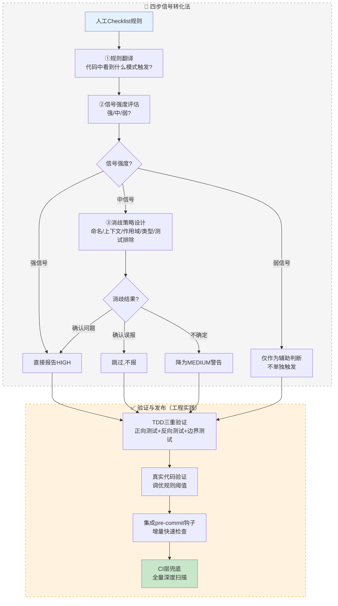

# 信号识别四步法：人工Checklist→自动化工具转化方法论

## 模式类型
方法论模式（工具开发流程）

## 成熟度
L2 已验证（2次成功案例：敏感信息检测 + 并发安全六维检查）

## 适用场景
将任何人工代码审查 Checklist、最佳实践文档、经验性规则转化为可自动化执行的静态分析工具/检查脚本时使用。

典型场景：
- 团队有代码审查 Checklist，但依赖人工执行效率低
- 需要将安全编码规范转化为自动化扫描工具
- 需要将性能反模式、并发陷阱等经验规则转化为 pre-commit/CI 检查
- 从文档型规范到可执行工具的转化

## 问题背景

人工审查 Checklist 包含大量经验性判断，例如：
- - "超时设置不合理"
- - "幂等性缺失"
- - "敏感信息不应硬编码"
- - "SQL注入风险"

这些概念对人类审查者清晰易懂，但直接翻译成代码会遇到"能看出来但写不出规则"的困境——自动化工具需要明确的、可计算的信号来判断。

核心矛盾：**人工语言是模糊的、依赖上下文的；机器语言是精确的、模式匹配的。**

## 核心方法：四步信号转化法

### 第一步：规则翻译（Rule Translation）

将每条审查规则从"人工语言"翻译为"机器语言"——回答："在代码中看到什么模式时触发这条规则？"

| 审查维度（人工语言） | 可检测信号（机器语言） |
|---------------------|---------------------|
| 超时设置不合理 | `acquire()`/`join()`/`wait()` 调用是否有 timeout 参数 |
| 幂等性缺失 | `list.append()` 前是否有 `not in` 守卫 |
| 敏感信息硬编码 | 字符串匹配 `sk-` 前缀、PEM 私钥头部、`password=` 赋值 |
| SQL注入风险 | 字符串拼接构建 SQL 语句 |
| 可变默认参数 | 函数定义中默认参数是 `[]`/`{}` 等可变对象 |

**关键**：不要试图实现"理解这条规则的语义"，而是找到"这条规则在代码上留下的可观测痕迹"。

### 第二步：信号强度评估（Signal Strength Assessment）

评估每个信号的强度，决定检测策略：

| 信号强度 | 定义 | 示例 | 处理策略 |
|---------|------|------|---------|
| **强信号** | AST/正则直接可见，无歧义 | `time.sleep(5)` 字面量参数、`def f(x=[])` 可变默认值 | 直接报告 HIGH |
| **中信号** | 需要上下文分析，依赖启发式 | `x in list`（在循环内 vs 顶层）、方法名匹配 | 结合消歧策略，不确定时报 MEDIUM |
| **弱信号** | 依赖命名约定或项目规范 | 变量名 `*_list` 表示列表、`*_lock` 表示锁 | 仅作为辅助判断，不单独触发 |

**铁律**：弱信号不能单独作为 HIGH 报错的依据，必须配合强信号或上下文。

### 第三步：消歧策略设计（Disambiguation Strategy）

对中信号，设计启发式消歧策略降低误报（弱信号本身不单独触发，但可配合强信号使用）。以下是五类常用消歧策略：

| 消歧维度 | 策略 | 示例 |
|---------|------|------|
| **命名约定** | 利用变量名/函数名后缀/前缀推断类型 | `thread.join()` vs `str.join()`：变量名含 thread/worker |
| **作用域分析** | 限制分析范围，不做跨过程分析 | 函数参数类型仅根据参数名推断，不追踪调用点 |
| **上下文追踪** | 维护循环深度、类/函数上下文 | `x in list` 在 loop_depth > 0 时才是线性查找 |
| **类型追踪** | 追踪赋值语句中的构造函数 | `x = threading.Lock()` → x 是锁类型 |
| **测试排除** | 自动跳过测试代码中的故意反例 | 函数名 `test_*`、类名 `Test*` 自动跳过 |

> 各类消歧策略的详细实现、边界case和正反示例见 [ast-disambiguation-five-methods.md](../../code-patterns/ast-disambiguation-five-methods.md)。

### 第四步：边界接受（Boundary Acceptance）

接受静态分析的理论极限，明确划定"能自动检测"和"不能自动检测"的边界：

1. **宁可漏报，不可误报**：误报会让开发者不信任工具，最终 `--no-verify` 跳过所有检查
2. **分层防御**：pre-commit 做快速增量检查，CI 做全量深度扫描，Code Review 做最终兜底（详见 [three-tier-check-tool.md](../../code-patterns/three-tier-check-tool.md)）
3. **不确定时保守处理**：消歧失败时降级为 MEDIUM 警告，或直接不报，交由人工判断
4. **持续迭代**：先发布强信号检测，收集中间误报数据，逐步扩展中信号覆盖

> ⚠️ 四步法是核心方法论，完成后还需要通过TDD测试、真实代码验证才能发布——见下方流程图的"验证与发布"阶段。

## 信号转化流程图



> **说明**：四步法是核心方法论（虚线框内），TDD验证+真实代码调优+pre-commit/CI集成是转化完成后的工程实践（橙色虚线框内），两者共同构成完整的工具开发流程。

## 两个验证案例

### 案例一：敏感信息检测

| 人工规则 | 信号 | 强度 | 消歧策略 |
|---------|------|------|---------|
| API密钥不应硬编码 | `sk-` 前缀、PEM 私钥头部等模式 | 强 | 正则精确匹配 + nosec 注释豁免 |
| 数据库密码不应硬编码 | `password=`/`pwd=` 后接字符串字面量 | 中 | 排除 `os.environ.get()` 等安全模式 |
| 手机号/身份证不应泄露 | 正则匹配11位手机号/18位身份证 | 中 | 排除测试数据、示例数据 |

**结果**：52个单元测试通过，0 HIGH/MEDIUM 误报，6 LOW（公开客服邮箱）。

### 案例二：并发安全六维检查

| 人工规则 | 信号 | 强度 | 消歧策略 |
|---------|------|------|---------|
| 超时设置不合理 | `acquire()`/`join()`/`wait()` 无 timeout 参数 | 强 | 区分 `str.join()` 和 `Thread.join()`（变量名模式） |
| 幂等性缺失 | `list.append()` 前无 `not in` 守卫 | 中 | 排除 `_set`/`_dict` 后缀的集合变量 |
| 防御性不足 | 可变默认参数 `def f(x=[])` | 强 | AST 直接可见 |
| 国际化问题 | 字符串比较中包含中文字面量 | 强 | AST 直接可见 |

**结果**：33个单元测试通过，5轮误判修复，在真实代码上验证有效（干净代码100分，缺陷代码9分）。

## 正反案例对照

### ✅ 正确做法

```python
# 强信号：可变默认参数 - AST直接可见
def add_item(item, items=[]):  # ❌ 直接报 HIGH
    items.append(item)
    return items

# 中信号 + 消歧：thread.join() vs str.join()
worker_thread.join()  # ✅ 变量名含thread→线程join→检查timeout
result = ",".join(items)  # ✅ 变量名不含thread→字符串join→跳过
```

### ❌ 错误做法

```python
# 弱信号单独触发：仅凭方法名join()就报错
result = ",".join(items)  # ❌ 误报！这是字符串join不是线程join

# 追求100%召回率：试图检测所有可能的超时缺失
lock.acquire()  # 可能是自定义Lock类，不确定时也报HIGH→误报
```

## 检查清单

将 Checklist 转化为自动化工具前，逐项确认：

- [ ] 每条规则是否已翻译为"代码中看到什么模式触发"？
- [ ] 是否评估了每条信号的强度（强/中/弱）？
- [ ] 中信号是否设计了对应的消歧策略？
- [ ] 是否接受边界：宁可漏报不可误报？
- [ ] TDD测试是否覆盖：正向（应报）+ 反向（不应报）+ 边界用例？
- [ ] 是否在真实项目代码上验证过（不是只在人造测试用例上）？
- [ ] 不确定的场景是否保守处理（MEDIUM或不报）？
- [ ] 是否规划了CI层全量扫描作为pre-commit的兜底？

## 常见误区

| 误区 | 后果 | 正确做法 |
|------|------|---------|
| 试图让工具"理解"代码语义 | 实现复杂且误报率高 | 找可观测的代码模式/信号 |
| 追求100%检测率 | 误报泛滥，开发者跳过工具 | 精度优先，接受边界，CI兜底 |
| 弱信号单独触发HIGH | 大量误报 | 弱信号仅作辅助，不确定降MEDIUM |
| 只写正向测试不测反向 | 误报无法发现 | 反向测试（防误报）比正向更重要 |
| 只在测试用例上验证 | 温室花朵，真实代码上失效 | 在真实项目代码上验证调优 |
| pre-commit做全量扫描 | 每次commit>10秒→开发者--no-verify | pre-commit增量，CI全量兜底 |

## 与其他模式的关系

- **[precision-over-recall.md](precision-over-recall.md)**：第四步"边界接受"的核心原则——宁可漏报不可误报，精度优先于召回率
- **[ast-disambiguation-five-methods.md](../../code-patterns/ast-disambiguation-five-methods.md)**：第三步"消歧策略"的具体技术实现
- **[multi-signal-detection.md](multi-signal-detection.md)**：中弱信号组合判断的进阶策略
- **[chain-pre-commit-hooks.md](../../code-patterns/chain-pre-commit-hooks.md)**：转化完成后集成到pre-commit的链式架构
- **[three-tier-check-tool.md](../../code-patterns/three-tier-check-tool.md)**：第四步"分层防御"的架构实现

## 沉淀状态

- ✅ 敏感信息检测工具（验证案例1）
- ✅ 并发安全六维检查器（验证案例2）
- ⏳ 待复用：未来新的Checklist自动化转化
