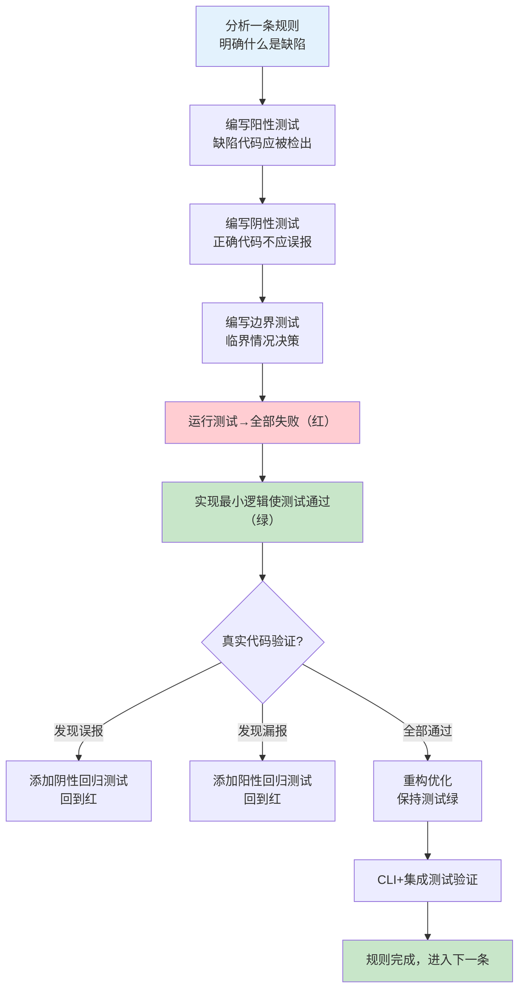

# TDD驱动静态分析开发：测试五件套方法论

## 模式类型
方法论模式（工具开发测试策略）

## 成熟度
L2 已验证（2次成功案例：敏感信息检测 + 并发安全六维检查）

## 适用场景
开发任何静态分析工具、代码检查器、lint规则、AST扫描器时使用。尤其适用于：
- 基于AST/正则的代码缺陷检测工具
- pre-commit/CI 自动化检查脚本
- 安全扫描、代码规范检查、性能反模式检测
- 任何需要在"检出率"和"误报率"之间做平衡的检测类工具

## 问题背景

静态分析工具的测试与普通业务代码有本质区别：

**普通业务代码**：输入→处理→输出，测试验证"正确的输入得到正确的输出"。
**静态分析工具**：存在两类根本不同的风险——

| 风险类型 | 含义 | 代价 |
|---------|------|------|
| **漏报（False Negative）** | 有问题的代码没检测出来 | 问题逃逸到Code Review/CI，但仍有人工兜底 |
| **误报（False Positive）** | 正确的代码被错误报警 | 开发者不信任工具 → `--no-verify` 跳过 → 防线全面失效 |

普通TDD只关注"功能正确性"，但静态分析工具必须同时控制漏报和误报——**阴性测试（防误报）比阳性测试（防漏报）更重要**。

传统测试方法只写"应该报错"的用例，导致：
- 误报无法发现，直到真实代码上出现才知道
- 修复一个误报可能破坏另一个检测能力，没有回归防护
- 工具在人造测试用例上完美，在真实代码上"一塌糊涂"

## 核心方法：测试五件套

为每个检测规则/维度编写以下五类测试，缺一不可：

### 第一套：阳性测试（Positive Tests）— 验证召回率

**目的**：确认有缺陷的代码能被正确检测到。
**方法**：为每个规则编写"含有该缺陷"的代码片段，断言工具报告了对应issue。

```python
def test_timeout_missing_positive():
    code = """
import threading
def worker():
    lock = threading.Lock()
    lock.acquire()  # 没有timeout
"""
    issues = scan_code(code)
    assert len(issues) == 1
    assert issues[0].dimension == "TIMEOUT"
    assert issues[0].severity == "HIGH"
```

### 第二套：阴性测试（Negative Tests）— 验证精确率 ⭐最重要

**目的**：确认正确的代码不会被误报——这是静态分析工具的生命线。
**方法**：为每个容易混淆的场景编写"正确代码"，断言工具不报告任何issue。

```python
def test_string_join_not_flagged_negative():
    code = """
items = ['a', 'b', 'c']
result = ','.join(items)  # str.join()，不是Thread.join()
"""
    issues = scan_code(code)
    assert len(issues) == 0, f"str.join()不应被标记为超时问题: {issues}"
```

> **铁律**：每增加一个阳性测试，必须至少增加一个对应的阴性测试。修复一个误报后，必须将触发误报的代码片段添加为阴性回归测试。

### 第三套：边界测试（Boundary Tests）— 验证规则边界

**目的**：确认工具在规则边界处的行为符合预期，不产生"边界惊喜"。
**方法**：测试处于规则临界值的代码——刚好应该报/刚好不该报的场景。

```python
def test_timeout_with_zero_boundary():
    code = """
lock.acquire(timeout=0)  # timeout=0是"非阻塞"，算不算设置了timeout？
"""
    issues = scan_code(code)
    # 根据规则设计决定预期行为，并固化为测试
    assert len(issues) == 0  # 或 == 1，但必须有明确决策
```

典型边界场景：
- timeout=0 / timeout=None / timeout=-1
- 空列表/单元素列表/嵌套列表
- 字符串长度恰好为阈值/超过阈值1个字符
- 注释中的代码/文档字符串中的示例

### 第四套：CLI测试（CLI Tests）— 验证接口契约

**目的**：确保命令行接口的所有输出格式、退出码、参数都能正常工作。
**方法**：通过subprocess调用CLI，验证stdout/stderr/exit code/output format。

```python
def test_cli_json_output():
    result = subprocess.run(
        ["python", "check-concurrent-safety.py", "--json", "test_file.py"],
        capture_output=True, text=True
    )
    assert result.returncode in (0, 1)  # 0=pass, 1=fail
    output = json.loads(result.stdout)
    assert "files" in output
    assert "summary" in output

def test_cli_exit_code_on_issues():
    result = subprocess.run([...], capture_output=True)
    assert result.returncode == 1  # 发现问题时必须exit 1阻断commit
```

必须覆盖：
- 所有输出格式（text/json）
- 干净代码→exit 0，有缺陷→exit 1
- 所有命令行参数（--dim/--verbose/--warn-only等）
- SKIP环境变量绕过机制

### 第五套：集成测试（Integration Tests）— 真实代码验证

**目的**：防止"温室花朵"问题——在人造测试用例上100分，在真实代码上失效。
**方法**：在项目真实代码文件上运行工具，验证"干净代码得满分，已知缺陷代码能检出"。

```python
def test_real_clean_code_passes():
    # 使用项目中已审查通过的真实文件作为基准
    issues = scan_file("lib/check_concurrent_safety/scanner.py")
    assert len(issues) == 0, f"已知干净代码不应有issue: {issues}"

def test_real_defective_code_detected():
    # 故意构造/选取有已知缺陷的真实文件
    issues = scan_file("tests/fixtures/defective_code.py")
    assert any(i.dimension == "TIMEOUT" for i in issues)
```

## TDD开发流程（红→绿→重构）



> **关键实践**：在真实代码上验证时，每发现一个误报，立即添加对应的阴性测试用例——这构建了防误报的回归防护网。并发安全检查器开发中，5轮误判修复全部通过此机制捕获，最终33个测试0回归。

## 两个验证案例

### 案例一：敏感信息检测（52个测试）

| 测试套件 | 数量 | 覆盖内容 |
|---------|------|---------|
| 阳性测试 | ~20 | API密钥、密码、手机号、身份证、PEM密钥等各类敏感信息 |
| 阴性测试 | ~20 | os.environ.get()安全模式、公开邮箱、测试数据、nosec注释豁免 |
| 边界测试 | ~5 | 部分密钥格式、字符串截断、注释中的密钥示例 |
| CLI测试 | ~5 | text/json输出、--fix、exit code、环境变量SKIP |
| 集成测试 | 2 | 真实代码扫描（干净代码0 issue，含密钥代码正确检出） |

**结果**：0 HIGH/MEDIUM 误报，6 LOW（公开客服邮箱，设计预期内）。

### 案例二：并发安全六维检查（33个测试）

| 测试套件 | 数量 | 覆盖内容 |
|---------|------|---------|
| 阳性测试 | ~12 | 六维每个维度至少2个缺陷用例 |
| 阴性测试 | ~10 | str.join()/list字面量/安全模式等消歧场景 |
| 边界测试 | ~5 | timeout=0/None、可变默认参数边界、中文比较边界 |
| CLI测试 | ~4 | text/json输出、exit code、--dim选择、环境变量 |
| 集成测试 | 2 | conflict_resolution.py干净代码100分，故意缺陷代码9分 |

**结果**：5轮误判修复→全部转化为阴性回归测试，最终33个测试全通过。

## 正反案例对照

### ✅ 正确做法

```python
# 每修一个误报，立即加阴性回归测试
def test_list_append_on_set_variable_not_flagged():
    """修复：_pending_set后缀变量不应被标记为幂等缺失"""
    code = """
_pending_set = set()
_pending_set.add(item)  # set.add()不是list.append()
"""
    issues = scan_code(code)
    assert len(issues) == 0  # 这个用例保证误报不会回归
```

### ❌ 错误做法

```python
# 只写阳性测试，不测阴性——上线后误报泛滥
def test_timeout_detection():
    code = "lock.acquire()"
    issues = scan_code(code)
    assert len(issues) == 1  # 只测"能检出"，不测"不误报"

# 结果：str.join()被误报、dict[key]被误报、正确代码全报错
# 开发者：--no-verify！
```

```python
# 在人造fixture上测试，不在真实代码上验证
def test_all_clean_fixtures_pass():
    for file in TEST_FIXTURES_DIR.glob("*.py"):
        issues = scan_file(file)
        assert len(issues) == 0  # fixture都是专门写的"干净代码"
# 结果：在真实项目代码上一跑，几十个误报！
```

## 检查清单

开发静态分析工具前，逐项确认：

- [ ] 每条规则是否都有对应的阳性测试（应报）？
- [ ] 每条规则是否都有**至少同等数量**的阴性测试（不应报）？
- [ ] 是否覆盖了边界场景（临界值、空值、异常输入）？
- [ ] CLI的所有输出格式（text/json）是否有测试覆盖？
- [ ] exit code语义是否测试（0=通过，1=阻断）？
- [ ] 是否在真实项目代码上做了集成测试验证？
- [ ] 每修复一个误报，是否添加了对应的阴性回归测试？
- [ ] 每修复一个漏报，是否添加了对应的阳性回归测试？
- [ ] 环境变量绕过机制（SKIP/WARN_ONLY）是否有测试覆盖？

## 常见误区

| 误区 | 后果 | 正确做法 |
|------|------|---------|
| 只写阳性测试不写阴性 | 误报无法发现，上线即翻车 | 阳性:阴性 ≥ 1:1，阴性更重要 |
| 只在人造测试用例上验证 | 温室花朵，真实代码失效 | 必须包含真实项目代码集成测试 |
| 修复误报不加回归测试 | 版本迭代中误报反复出现 | 每个误报修复必须伴随阴性测试 |
| 忽略CLI/输出格式测试 | 集成到pre-commit后格式错乱无法解析 | CLI是工具的公共API，必须测 |
| 追求100%阳性覆盖忽略阴性 | 工具"什么都报"等于"什么都没报" | 精度优先于召回率（见precision-over-recall） |
| 阴性测试只测"明显正确"的代码 | 容易混淆的边界场景成为误报温床 | 阴性测试要刻意找"看起来像问题但实际没问题"的代码 |

## 与其他模式的关系

- **[signal-identification-four-step.md](signal-identification-four-step.md)**：本模式是信号识别四步法完成后的验证阶段——四步法负责"设计检测规则"，五件套负责"验证规则正确性"
- **[precision-over-recall.md](precision-over-recall.md)**：第二套阴性测试的核心原则——宁可漏报不可误报，精度优先于召回率
- **[ast-disambiguation-five-methods.md](../../code-patterns/ast-disambiguation-five-methods.md)**：第三套边界测试和第二套阴性测试经常覆盖消歧策略的验证
- **[chain-pre-commit-hooks.md](../../code-patterns/chain-pre-commit-hooks.md)**：第四套CLI测试验证exit code和输出格式，确保工具能正确集成到链式钩子
- **[tool-self-validation.md](tool-self-validation.md)**：工具自验证模式——第五套集成测试的进阶实践

## 沉淀状态

- ✅ 敏感信息检测工具（52个测试，验证案例1）
- ✅ 并发安全六维检查器（33个测试，验证案例2）
- ⏳ 待复用：未来新的静态分析/检查器开发
