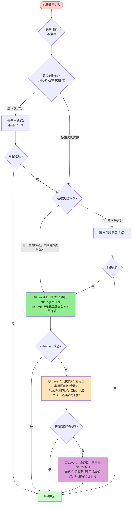
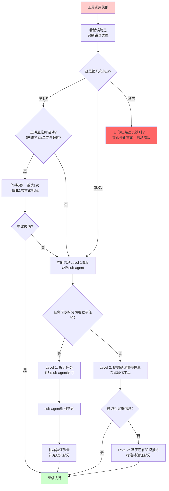

> **来源**：TVM FFI Wiki教程创建复盘（2026-07-05）——在Shell管道耗尽、WebFetch超时、Read超时三重故障同时发生时，通过三级降级策略成功完成17个文档交付
> **二次验证**：火山引擎Viking AI搜索推荐产品学习复盘（2026-07-06）——defuddle返回exit code 126时，立即降级使用WebFetch成功提取网页内容
> **验证次数**：2次成功实战验证（极端恶劣环境下的TVM FFI Wiki任务 + Windows环境defuddle兼容性问题场景）

# 工具故障三级降级策略

## 模式类型
方法论模式（工具自动化/故障处理）

## 成熟度
L2 已验证（2次成功实战验证：极端恶劣环境下的TVM FFI Wiki任务 + Windows环境defuddle兼容性问题场景）

## 适用场景

| 场景 | 是否适用 | 说明 |
|------|---------|------|
| Shell/命令行工具故障 | ✅ 核心场景 | os error 231管道耗尽、命令超时、权限错误 |
| WebFetch/网络工具故障 | ✅ 核心场景 | 网页抓取超时、403/404、连接失败 |
| Read/Write文件工具故障 | ✅ 核心场景 | IDE timeout、文件读取失败、写入超时 |
| MCP工具/浏览器工具故障 | ✅ 核心场景 | MCP服务器无响应、浏览器操作超时 |
| 偶发单次失败 | ⚠️ 部分适用 | 先快速重试1次排除临时波动，不要立即降级 |
| 代码逻辑错误/Bug | ❌ 不适用 | 降级解决不了代码bug，需要修复bug本身 |
| 用户输入错误/参数错误 | ❌ 不适用 | 需要纠正输入，不是降级能解决的 |

## 问题背景

工具故障是AI Agent执行任务时的高频风险：

1. **Shell管道耗尽（os error 231）**：Windows环境下所有管道实例被占用，Shell/MCP命令都无法执行
2. **WebFetch超时**：网络不通、目标网站响应慢、反爬机制导致deadline elapsed
3. **IDE Command timeout**：文件过大、IDE负载高导致Read/Write超时
4. **MCP工具无响应**：MCP服务器崩溃、连接断开
5. **多工具同时故障**：极端情况下多个基础工具同时不可用（如本次TVM FFI任务）

遇到这些问题时，执行者最常犯的错误：
1. **反复重试**：本能地反复调用同一个失败的工具，期待"这次能成功"
2. **无序尝试**：随机换其他工具，没有清晰的降级优先级
3. **任务卡死**：停留在故障状态，不知道下一步该做什么
4. **隐瞒故障**：不承认工具失败，假装在继续执行但没有进展

**根本原因**：缺少预定义的工具故障降级预案，遇到故障时靠本能反应而非结构化决策。

---

## 核心原则：三级降级模型

### 降级优先级总览

### 三级降级详细说明

| 降级级别 | 策略 | 核心机制 | 适用条件 | 信息质量 | 效率 |
|---------|------|---------|---------|---------|------|
| **🟢 Level 1（最优）** | **委托sub-agent执行** | sub-agent运行在独立进程空间，不受主会话管道耗尽/超时影响；每个sub-agent有独立的工具环境 | 任何连续2次工具失败后首选 | ★★★★☆ 高（sub-agent可以自主使用工具） | 高（并行执行更快） |
| **🟡 Level 2（次优）** | **利用工具返回的附带信息** | 工具可能在错误消息、规则注入、返回头中包含有用信息；用替代工具（如Glob失败用LS） | Level 1失败或不适合委托sub-agent时 | ★★★☆☆ 中（信息是碎片化的，需要拼接） | 中（需要主动挖掘） |
| **🔴 Level 3（保底）** | **基于已有知识推进** | 利用前序会话摘要、领域通用知识、已有上下文继续执行，明确标注需要后续验证的部分 | Level 1+2都无法获取新信息时 | ★★☆☆☆ 低（可能有不准确之处，必须标注） | 低（需要后续验证补充） |

> **核心铁则**：同一工具连续失败2次后，**禁止第3次重试**，必须立即启动降级流程。

---

## 各级降级详细操作指南

### 🟢 Level 1：委托sub-agent执行（最优策略）

#### 为什么sub-agent能绕过主会话工具故障
- sub-agent运行在独立的进程空间，有自己的管道实例，不受主会话os error 231影响
- sub-agent的工具调用环境是独立初始化的，主会话的超时/状态不会传递给sub-agent
- 可以同时启动多个sub-agent并行处理，不仅绕过故障还能提升效率

#### 适用场景
- Shell管道耗尽（os error 231），主会话所有Shell/MCP命令无法执行
- WebFetch在主会话超时，但sub-agent网络环境正常
- 需要批量处理多个独立任务（如写多个文件、读多个源码）

#### 操作步骤
1. **判断是否可以拆分任务**：将当前任务拆分为可以独立执行的子任务
2. **为每个子任务创建general_purpose_task sub-agent**
3. **在prompt中提供完整上下文**：sub-agent无法访问主会话完整上下文，必须传递：
   - 任务目标和交付要求
   - 已获取的关键事实
   - 格式规范（YAML frontmatter、代码风格、导航链接格式等）
   - 已知约束和注意事项
4. **并行启动所有sub-agent**：单轮工具调用启动多个sub-agent并行工作
5. **收集结果并验证**：sub-agent完成后抽样验证质量，补充缺失部分

#### 成功案例：TVM FFI Wiki任务
主会话Shell/WebFetch/Read三重故障，将17个文档分为4组，4个并行sub-agent一次性完成全部编写，单轮工具调用解决问题。

#### 反模式
- ❌ 启动sub-agent但不给足够上下文，导致sub-agent输出质量低
- ❌ 串行启动sub-agent（一个完成再启动下一个），失去并行效率优势
- ❌ 什么任务都扔给sub-agent，简单可以直接完成的任务不要过度委托

---

### 🟡 Level 2：利用工具返回的附带信息（次优策略）

#### 常见附带信息来源

| 工具故障场景 | 附带信息挖掘方式 | TVM FFI案例 |
|------------|----------------|------------|
| Read工具超时/失败 | Read工具在匹配规则时可能注入项目文档作为规则内容 | Read tvm_ffi.h失败，但返回了完整的AGENTS.md内容作为项目规则 |
| Glob返回"No files found" | 用LS替代Glob查看目录实际内容；检查路径是否正确 | 初始Glob空结果，用LS确认目录存在后调整Glob模式 |
| Shell命令失败 | 仔细阅读错误消息，错误消息本身可能提示解决方案 | os error 231错误消息明确说明是管道问题，提示需要独立进程空间 |
| WebFetch超时/403 | 查看返回的HTTP头、错误页面内容，有时包含有用线索 | — |
| MCP工具无响应 | 检查是否有工具描述缓存可用；尝试读取MCP工具的JSON描述文件 | 可以通过LS+Read直接读取MCP工具描述JSON，不需要调用MCP本身 |

#### 替代工具映射表

当一个工具失败时，优先尝试这些替代工具：

| 失败工具 | 首选替代 | 次选替代 | 说明 |
|---------|---------|---------|------|
| Shell（os error 231） | general_purpose_task sub-agent | Write直接创建文件（绕过mkdir） | sub-agent独立进程空间；Write自动创建目录 |
| Glob（找不到文件） | LS列目录 | SearchCodebase语义搜索 | LS确认目录存在后调整Glob模式 |
| WebFetch（超时） | sub-agent调用WebFetch | 利用已有文档/知识 | 网络问题可能是主会话环境问题 |
| Read大文件超时 | Read指定limit/offset分段读 | sub-agent读取 | 用limit参数分批读取 |
| Write超时 | 拆分文件内容分多次写入 | sub-agent写入 | 单次写入内容不要过大 |
| defuddle提取失败（exit code 126） | WebFetch直接获取网页内容 | 集成浏览器MCP渲染 | Windows环境下云厂商官网优先考虑WebFetch |

#### 操作步骤
1. **仔细阅读工具返回的所有内容**：不要只看"失败"，完整阅读错误消息、返回的任何内容
2. **检查是否有规则/注入内容**：Read工具可能在规则注入中返回了有用文档
3. **查替代工具映射表**：选择合适的替代工具
4. **拼接碎片化信息**：将多个来源的碎片信息整合为可用的上下文
5. **信息不足时降级到Level 3**

---

### 🔴 Level 3：基于已有知识推进（保底策略）

#### 核心原则
**任务不卡死 > 完美信息**。在无法获取新信息的情况下，基于已有信息继续推进，比停在原地等待故障恢复要好。但必须**透明标注**信息局限性，不能假装信息完整。

#### 可以利用的已有知识来源

1. **前序会话摘要**：会话恢复时提供的summary中包含的关键信息
2. **通用领域知识**：你对该技术领域的通用知识（如FFI是什么、C++常见模式等）
3. **已读取文件的内容**：在故障发生前已经成功读取的内容
4. **项目规范和模式**：从AGENTS.md等已读文档中获取的项目通用规范

#### 强制要求：标注待验证内容

使用Level 3策略时，必须明确标注以下内容：
- 📝 **信息来源标注**：说明哪些部分是基于已有知识/推断
- ⚠️ **待验证标记**：对不确定的内容添加"待验证"标记
- 🔍 **后续验证计划**：说明故障恢复后需要补充验证哪些内容
- ❌ **已知缺口**：明确列出哪些信息因工具故障缺失

#### 绝对禁止
- ❌ 把推测当成确定事实输出
- ❌ 不标注信息局限性，误导读者认为内容是完整准确的
- ❌ 在Level 3状态下做高风险操作（如删除文件、大规模重构、提交代码）
- ❌ 因为信息不全就完全停止任务

---

## 故障诊断快速决策树

遇到工具失败时，花10秒走一遍这个决策树：

---

## 反模式：绝对禁止的行为

| 反模式 | 为什么错误 | 正确做法 |
|--------|----------|---------|
| **反复重试同一失败工具≥3次** | 浪费时间，工具故障不会因为多试几次就好；如果是环境问题，重试只会浪费时间 | 2次失败立即降级，同一工具连续失败不超过2次 |
| **故障发生后慌乱无序尝试** | 没有清晰策略，随机试错效率低，可能引入新问题 | 按三级降级优先级有序尝试 |
| **遇到故障就停止任务等待** | 绝大多数工具故障不需要"等恢复"，降级策略可以绕过故障继续推进 | 立即启动降级，在推进中等待故障恢复（或不需要恢复） |
| **Level 3下不标注信息局限性** | 输出不准确信息且不说明，误导后续工作和用户 | 必须明确标注哪些是推断、哪些待验证、已知缺口是什么 |
| **什么情况都用Level 3跳过** | Level 3是保底不是首选，信息质量低，会积累技术债务 | 优先Level 1，再Level 2，最后才用Level 3 |
| **主会话Shell故障后还在尝试用Shell命令** | 浪费时间，管道耗尽不会自己恢复 | 立即用sub-agent绕过，或用Write等工具直接操作 |

---

## 常见工具故障速查表

| 故障现象 | 可能原因 | 首选降级策略 |
|---------|---------|-------------|
| `os error 231` 所有管道实例都在使用中 | 前序会话/后台进程占用了所有管道 | 🟢 Level 1：sub-agent有独立管道，立即委托sub-agent |
| `deadline elapsed` WebFetch超时 | 网络慢、目标网站响应慢、反爬 | 🟢 Level 1：sub-agent尝试；仍失败→Level 2/3利用本地文档 |
| `IDE Command timeout` Read/Write失败 | 文件过大、IDE负载高 | 🟡 Level 2：用limit分段读，或拆分写入内容 |
| `No files found` Glob空结果 | 路径模式错误、目录不存在 | 🟡 Level 2：用LS先看目录结构，调整Glob模式 |
| MCP工具无响应/超时 | MCP服务器崩溃、连接断开 | 🟡 Level 2：直接LS+Read MCP描述JSON文件，不调用MCP工具本身 |
| `Permission denied` 权限错误 | 文件权限、沙箱限制 | 🟡 Level 2：检查路径是否在可写目录；必要时Level 1委托sub-agent验证 |
| `defuddle exit code 126` / "No content could be extracted" | Windows环境下defuddle兼容性问题，目标网站有JS渲染/反爬 | 🟡 Level 2：立即切换WebFetch作为降级方案（Windows环境下优先考虑WebFetch） |
| 多个工具同时故障（如本次TVM FFI任务） | 环境级问题，不是单个工具问题 | 🟢 Level 1：并行sub-agent批量处理，绕过主会话环境问题 |

---

## 实际应用案例：TVM FFI Wiki教程创建（2026-07-05）

### 故障场景（三重故障同时发生）
1. **Shell管道耗尽**：os error 231，所有Shell命令、defuddle、MCP工具都无法执行
2. **WebFetch超时**：访问tvm.apache.org/ffi/ 返回deadline elapsed
3. **Read超时**：直接读取大的C++头文件出现IDE Command timeout

### 降级路径执行

| 步骤 | 级别 | 具体动作 | 结果 |
|------|------|---------|------|
| 1 | 初始尝试 | 主会话Shell创建目录、WebFetch抓文档、Read头文件 | 全部失败 |
| 2 | 重试1次 | 重试Shell和WebFetch | 仍失败，确认是环境问题不是临时波动 |
| 3 | Level 2 | 仔细Read tvm_ffi.h，发现返回的规则内容中包含完整AGENTS.md | 🎉 获得关键文档，包含80%所需架构信息 |
| 4 | Level 1 | 将17个文档分为4组，启动4个并行general_purpose_task sub-agent | 每个sub-agent在独立进程空间正常使用工具 |
| 5 | Level 3补充 | sub-agent prompt中提供AGENTS.md提取的关键事实作为基础 | sub-agent基于这些事实+自主深入少量源码完成内容 |

### 结果
- 17个文档（约5870行）一次性交付，没有被故障卡死
- 效率反而比"逐文件读源码"更高（AGENTS.md比通读源码高效10倍）
- 三重故障环境下任务顺利完成，验证了降级策略的有效性

---

## 与其他模式的关系

| 关联模式 | 关系类型 | 关系说明 |
|---------|---------|---------|
| [vendor-high-level-doc-first-research.md](../research-knowledge/vendor-high-level-doc-first-research.md) | 互补 | Level 2"利用工具附带信息"的典型成功案例：Read返回AGENTS.md内容 |
| [dry-run-first.md](dry-run-first.md) | 思想同源 | 两者都是"安全优先"模式：dry-run预防修改错误，本模式预防工具故障卡死 |
| [git-local-clone-safety-protocol.md](git-local-clone-safety-protocol.md) | 思想同源 | 遇到git clone本地BUG时，用--no-local参数绕过，也是"遇到故障不重试，换方案"的思路 |
| [defuddle-web-extraction-preferred.md](defuddle-web-extraction-preferred.md) | 替代工具 | WebFetch失败时defuddle是Level 2的替代工具之一 |
| [root-cause-diagnosis.md](../governance-strategy/root-cause-diagnosis.md) | 工具使用 | 诊断故障原因时可使用5-Whys，但要注意时间盒（诊断≤1分钟），不要过度诊断 |

---

## 模式演进方向

当前版本为L1（1次极端环境验证），后续可在以下方向迭代：
1. 增加更多故障场景的实战验证（不同错误类型、不同严重程度）
2. 细化sub-agent任务拆分的最佳实践（什么任务适合委托、如何写prompt）
3. 补充更多替代工具映射（如不同MCP工具故障时的替代方案）
4. 开发自动化故障检测脚本：检测到连续2次失败时自动提示降级选项
5. 整理常见故障的快速恢复脚本（如管道耗尽的手动恢复步骤）
6. 补充协作协议：在什么情况下应该通知用户工具故障（而不是静默降级）
