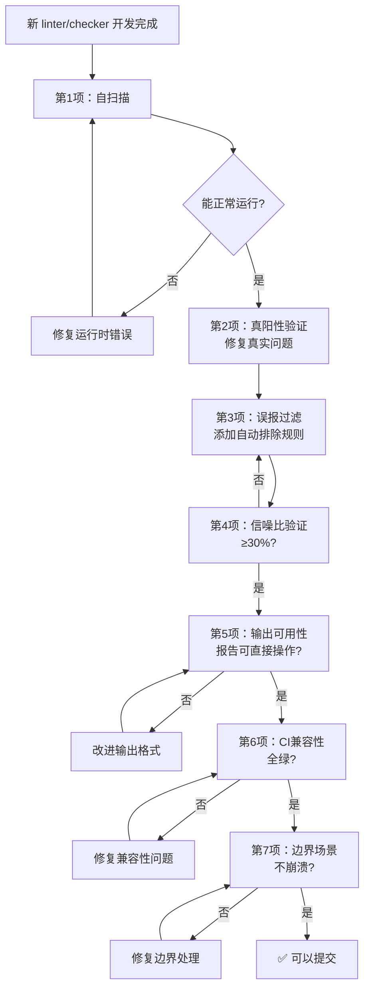

# 工具自生验证模式（tool-self-validation）

## 模式类型
方法论模式（tools-automation）

## 成熟度
L2 已验证（单次完整验证，形成可执行检查清单）

## 适用场景
新开发任何代码质量守护工具（linter、checker、静态分析器、scanner、validator），
或对现有 linter 进行重大功能扩展时。

## 问题背景
新 linter/checker 首次提交时常见三类问题：
1. **工具自身 bug**：算法错误导致误报/漏报，但无真实场景验证
2. **目标问题遗漏**：代码库中存在工具要检测的问题，但开发者未主动发现
3. **可用性缺陷**：输出不清晰、建议不可操作、exit code 不正确，集成到 CI 后才发现

传统做法是"写完即提交"，靠后续使用发现问题——成本高、反馈慢。

## 核心思想
> 新开发的 linter/checker 应在提交前**立即用它扫描自身代码库**。
> 工具的首次运行即是自身的 dry-run 验证——同一把尺子先量自己。

这是 `dry-run-first` 模式在工具开发领域的具体应用：工具扫描自身代码库 = 对工具自身做 dry-run。

## 可执行检查清单

新 linter/checker 提交前，必须依次通过以下 7 项检查：

### ✅ 第 1 项：自扫描——工具必须能扫描自身

```
操作：运行 <新工具> 扫描其所在的目录（通常是 .agents/scripts/ 或目标代码库）
期望：工具能正常运行完成（无崩溃、无异常退出、exit code 合理）
失败：工具自身存在运行时错误（路径问题、编码问题、import 错误等）
```

**验证点**：
- [ ] 无未捕获异常导致 crash
- [ ] 无编码错误（如 GBK/UTF-8 冲突）
- [ ] 路径解析正确（不依赖 cwd）
- [ ] 退出码语义正确（0=通过，1=发现问题，2=工具错误）

### ✅ 第 2 项：真阳性验证——发现的真实问题必须修复

```
操作：审查自扫描输出，区分"真实问题"和"误报"
期望：每个真实问题都被修复，或记录为已知issue待处理
失败：工具报告了真实问题但开发者未修复就提交
```

**验证点**：
- [ ] 逐条审查所有告警/错误输出
- [ ] 确认真实问题 → 立即修复代码库中对应的问题
- [ ] 确认误报 → 进入第 3 项优化过滤规则
- [ ] 无法立即修复的 → 在工具输出中标注（如 `--known-issues` 或注释说明）

### ✅ 第 3 项：误报过滤——结构性样板必须自动排除

```
操作：识别误报类型，为每类误报添加自动过滤规则
期望：过滤后无结构性样板误报，真实问题不被误杀
失败：每次运行都产生大量需要人工忽略的误报（信噪比过低 → 工具将被弃用）
```

**常见误报类型及过滤策略**：

| 误报类型 | 识别方式 | 过滤策略 |
|---------|---------|---------|
| 向后兼容包装器 | docstring 含"向后兼容"标记、仅调用被转发函数 | 标记识别 + 白名单 |
| 语言结构样板（import块、shebang、编码声明） | 行内容模式匹配 | 语法特征过滤 |
| 自动生成的代码 | 文件头含 `@generated` 标记、路径含 `generated/` | 路径/标记排除 |
| 测试夹具/预期错误 | 测试文件中的 fixture 目录 | 路径排除（`tests/fixtures/`） |
| Vendor/第三方代码 | vendor/、node_modules/ 路径 | 默认排除 |
| 注释/文档中的反例说明 | 代码注释或文档中提及被禁止的模式（如说明"禁止使用 \n"时字面上出现了 \n） | 语法感知注释剥离（如 Mermaid 的 %% 整行注释和行内注释） |

**验证点**：
- [ ] 已为每类误报实现自动过滤（而非靠 `--exclude` 参数让用户手动配置）
- [ ] 过滤规则有明确的判断条件（不依赖模糊匹配）
- [ ] 过滤规则不影响真实问题的检测

### ✅ 第 4 项：信噪比验证——真实问题占比 ≥ 30%

```
操作：统计自扫描结果中真实问题 / 总报告数
期望：信噪比 ≥ 30%（每10条报告中至少3条是真实问题）
不达标：回到第3项优化过滤，或考虑调整阈值/算法精度
```

**验证点**：
- [ ] 统计真实问题数 vs 误报数
- [ ] 信噪比 < 30% 时不得提交（说明工具精度不足，需改进后再提交）
- [ ] 记录信噪比值到工具文档（供后续优化参考）

### ✅ 第 5 项：输出可用性——报告必须可直接操作

```
操作：审查每条报告的输出格式
期望：开发者看到报告后无需额外上下文即可定位问题并理解修复方式
失败：报告只说"有问题"不说"在哪、是什么、怎么改"
```

**每条报告必须包含**：
- [ ] **文件路径**（相对项目根，不是绝对路径）
- [ ] **行号**（精确定位）
- [ ] **问题描述**（一句话说清违反了什么规则）
- [ ] **修复建议**（具体到改什么，最好给示例）
- [ ] **严重级别**（error/warn/pass 三级，与 CI 集成一致）

### ✅ 第 6 项：现有工具集兼容性——不破坏已有检查

```
操作：运行 python ci-check.py（或对应 CI 脚本）确认全部检查通过
期望：新工具加入后，CI 全绿（或新工具自身报告的问题已在第2项修复）
失败：新工具的引入导致其他检查失败，或与现有工具输出冲突
```

**验证点**：
- [ ] 新工具遵循 `lib/cli.py` 中 `add_common_args` 的参数约定（`--path`、`--json` 等）
- [ ] 新工具使用 `lib/cli.py` 中 `print_summary()` / `print_section()` 的标准输出格式
- [ ] 新工具加入 `ci-check.ps1` / `ci-check.sh` 后 CI 可正常通过
- [ ] 新工具的 `--json` 输出格式与现有工具一致（便于自动化解析）

### ✅ 第 7 项：边界场景冒烟测试——极端输入不崩溃

```
操作：对空目录、单文件、全空文件、含二进制文件的目录等边界场景运行工具
期望：工具正常处理，给出明确提示而非崩溃
失败：遇到非预期输入就 crash
```

**必测边界场景**：
- [ ] 空目录（无目标文件）→ 输出"未发现 xxx 文件"而非报错
- [ ] 无扩展名的文件 / 非目标扩展名文件 → 正确跳过
- [ ] 含特殊字符（中文、空格、emoji）的路径 → 不报错
- [ ] 二进制文件 / 极短文件（< 5行） → 不 crash
- [ ] 只读文件 / 无权限目录 → 给出明确权限提示

## 执行流程



## 成功案例

| 工具 | 自扫描发现 | 处理方式 | 信噪比 |
|------|----------|---------|-------|
| check-duplication.py | 首次运行发现7处"重复"：2处真实重复（find_markdown_files）、3处薄包装器误报、2处import样板误报 | 提取真实重复到lib/；添加is_compat_wrapper()和_is_import_only_block()过滤 | 29%（添加过滤后提升至100%） |
| check-links.py --fix | 首次运行发现多个断链 | 修复断链后dry-run输出"未发现需要修复的断链" | 100% |
| check-gitignore.py | 首次运行发现.temp/未被忽略 | 添加.gitignore规则 | 100% |
| check-mermaid.py（\\n检测增强） | 创建含%%注释的安全模板时，注释中说明"禁止 \\n"的字面量触发误报 | 新增_strip_inline_comment()函数，检测/修复时跳过Mermaid注释行和行内注释部分 | 新增第8类误报过滤规则 |

## 与其他模式的关系

- **dry-run-first**：本模式是 dry-run-first 在 linter 开发场景的应用——工具扫描自身 = 对工具自身做 dry-run
- **precision-over-recall**：第3/4项的误报过滤和信噪比验证是 precision-over-recall 原则的落地
- **three-tier-check-tool**：第5项输出可用性要求依赖三段式架构（解析→检查→输出分离）
- **refactoring-hidden-bug-discovery**：第2项真阳性验证天然具有"重构发现bug"的效果

## 检查清单速查卡（提交前勾选）

```markdown
## Linter 自生验证检查清单（提交前必过）

- [ ] 1. 自扫描：工具能扫描自身目录并正常退出
- [ ] 2. 真阳性：自扫描发现的真实问题已全部修复
- [ ] 3. 误报过滤：结构性样板误报已自动排除
- [ ] 4. 信噪比：真实问题占比 ≥ 30%
- [ ] 5. 输出可用：每条报告含路径/行号/问题/建议/级别
- [ ] 6. CI兼容：ci-check 全绿，参数/输出格式符合 lib/cli.py 约定
- [ ] 7. 边界场景：空目录/二进制/特殊字符路径不崩溃
```
