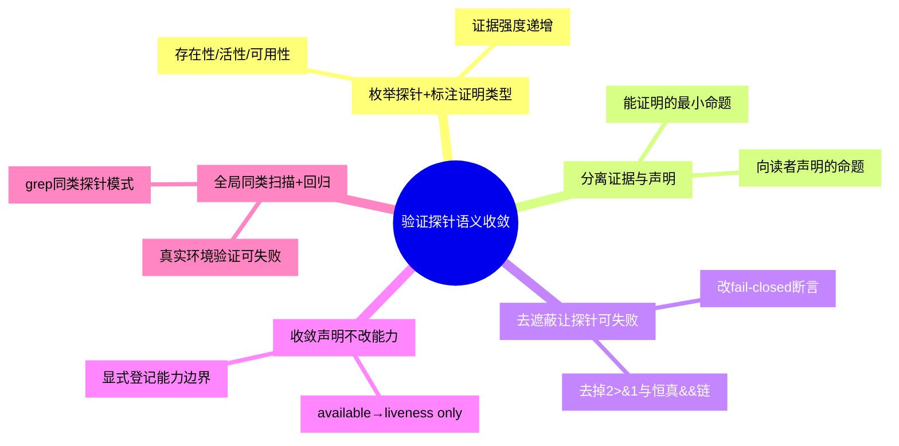

# 验证探针语义收敛

## 模式概述

构建脚本、CI 脚本或健康检查中，几乎每一行"验证"都在向读者传递一个**声明**：`toolbox --help && echo "[OK] toolbox available"` 读起来是"toolbox 可用"。但探针**实际能证明的**往往远小于这个声明——它可能只证明了"二进制文件存在且能被 exec"。

当二者不收敛时会出现两类隐蔽故障：

1. **探针假阳性（恒真探针）**：探针因语言/框架特性或 shell 写法的遮蔽，无论被验证对象是否真正可用都返回成功。典型构造是「短路型 flag + stderr 重定向 + `&&` 链」——三者叠加后，即使命令本身报错，`&&` 左侧退出码仍为 0，`[OK]` 照常打印。
2. **声明过宽（over-claim）**：探针确实通过了，但它证明的只是"存在性"或"活性"，标签与文档却写成"可用"（available / 可直接使用）。声明一旦被下游（人类读者、后续脚本、AGENTS 清单）复制，就变成了事实上的契约。

核心思想：**探针的输出不是"结果"，而是"证据 + 声明"的合体；声明必须收敛到证据的边界之内。** 一条绿色探针的诚实含义应是「我证明了 X，我没有证明 Y」，而不是笼统的"没问题"。验证的价值不在于"打印 [OK]"，而在于"能失败"且"失败时说的话与成功时说的话一样精确"。

该模式由 jupyter-podman-rootless 镜像构建验证案例萃取：镜像内嵌 toolbox 二进制（`/usr/local/bin/toolbox`），并在 Layer 5 与 aux 阶段以 `toolbox --help >/dev/null 2>&1 && echo "[OK] toolbox available"` 断言其可用。实际在普通 `podman run` 会话中裸跑 `toolbox` 输出 `Error: TOOLBOX_PATH not set`（退出码 1）——因为容器创建/进入能力由**宿主侧 Toolbx 启动器**注入 `TOOLBOX_PATH` 后经 `flatpak-spawn --host` 转发提供，容器内并无启动器。而 `--help` 属 cobra 短路型 flag，在 `PersistentPreRunE` 之前即返回、`rootHelp` 转发失败仅写 stderr，被 `2>&1` 吞掉 → 探针恒真。修复方式不是删除工具（那会误伤宿主侧 Toolbx 集成），而是**去遮蔽探针 + 收敛声明**：改用无重定向的 `toolbox --version` 活性探针，标签由 "available" 改为 "binary present (liveness only)"，并同步 5 处文档/规则中的能力声明，显式标明"容器内裸跑需宿主侧启动器"。

## 触发场景

**适用于**：
- 编写/审查构建脚本、CI 脚本、容器 `HEALTHCHECK`、安装器自检中的"验证"步骤
- 验证对象是**能力受外部条件约束**的工具（需要宿主/守护进程/网络/凭据/许可才能发挥完整能力）
- 被验证工具提供"短路型"入口（`--help`、`--version`、`-h`、`--list` 等不进入主流程的 flag）
- 探针行同时使用了输出重定向与 `&&` 连接，且验证结论以 `[OK]`/成功文案对外声明
- 一条"通过"结论会被人类读者或后续自动化当作能力承诺使用

**不适用于**：
- 探针即真实功能调用（端到端集成测试、真实 `curl` 到真实端点），其成功本身已构成可用性证据
- 被验证对象无外部依赖、能力边界单一（如纯计算函数、语法检查器），"存在即可用"
- 一次性排障中的临时手敲命令，无对外声明、无复用价值

## 核心做法（5 步）

1. **枚举探针并标注"证明类型"**：列出所有验证行，逐条写下它属于哪一类证据——**存在性**（文件在、有可执行位）／**活性**（能 exec、能返回版本号）／**可用性**（能完成一次真实业务动作）。三类证据强度递增，标注是后续收敛的基准。

2. **分离"证据"与"声明"**：为每条探针写出两个独立句子——「它能证明的最小命题」与「它向读者声明的命题」。只要两者不等价，就是待收敛项。

3. **去遮蔽（让探针可失败）**：移除探针中的 stderr/stdout 重定向与恒真 `&&` 链；把结论改为 fail-closed 的断言。若探针只该证明存在性，就明确写成存在性断言（如 `test -x /usr/local/bin/toolbox`）；不要用"能返回 `--version`"冒充"可用"。

4. **收敛声明（改文字，不改能力）**：把日志标签、文档、AGENTS 清单中所有"可用 / available / 可直接使用"改写为与证据匹配的措辞（"存在 / 活性 / binary present, liveness only"），并**显式登记能力边界**（"完整能力由宿主侧启动器提供，容器内裸跑按上游设计报错"）。先改声明，再评估是否真的需要改能力——多数情况下缺陷在声明而不在能力。

5. **全局同类扫描 + 回归验证**：用模式匹配（如 `grep -rn '\-\-help >/dev/null 2>&1'`）扫描同一反模式类，登记或修正残余实例；随后在**真实触发环境**（此处为普通 `podman run` 会话）重跑，确认探针在能力缺失时**会失败**、在能力具备时**通过**，双向闭环。

### 核心做法思维导图

## 反模式（4 个）

### 反模式1：用短路型 flag 当"可用性"探针

- **来源**：本案例——`toolbox --help` 在 cobra 中于 `ValidateArgs`/`PersistentPreRunE` **之前**短路返回，主流程的前置校验（`TOOLBOX_PATH` 检查）根本不执行
- **表现**：探针永远退出 0，被验证工具的初始化/前置条件是否满足完全未被触碰
- **正确做法**：短路型 flag 只能声明**二进制活性**；要声明"可用"，必须调用进入主流程的入口，或干脆改为存在性断言

### 反模式2：`>/dev/null 2>&1 && echo "[OK]"` 恒真构造

- **来源**：本案例——`rootHelp` 经 `ForwardToHost()` 转发失败时错误仅写 stderr，被 `2>&1` 吞掉；`&&` 只看左侧退出码（为 0），`[OK]` 照常打印
- **表现**：探针在任何情况下都成功，诊断信息被遮蔽，故障被掩盖到运行期才暴露
- **正确做法**：验证行禁止默认重定向 stderr；失败路径必须让原因可见（shift-left 曝光而非遮蔽）

### 反模式3：声明超出证据范围（over-claim）

- **来源**：本案例——探针标签写 "toolbox available"、文档写 "devuser 可直接使用 toolbox"，而证据仅为"二进制存在"
- **表现**：声明被下游复制为契约；一旦用户在普通 podman 会话中照做即失败，信任受损且排查成本外溢
- **正确做法**：声明措辞严格收敛到证据类型（binary present / liveness only），能力边界就地注明

### 反模式4：以删除/停用代替声明收敛（过度纠正）

- **来源**：对抗审查 V6——曾提出"既然容器内不可用，干脆把 toolbox 从镜像移除"
- **表现**：为消除一个**声明缺陷**而破坏一个**真实集成能力**（宿主侧 Toolbx 需镜像内 marker 与二进制才能识别并进入）
- **正确做法**：先判断缺陷在能力还是在声明；若能力有真实用途，只收敛声明，保留能力

## 检验标准

- [ ] 每条绿色探针都能回答"它证明了什么 / 它没有证明什么"（存在性·活性·可用性三分类）
- [ ] 探针不遮蔽 stderr；人为制造能力缺失时，失败原因可见
- [ ] 不再使用短路型 flag（`--help`/`--version`）断言"可用"；此类探针仅声明活性，或已替换为存在性断言
- [ ] 日志标签、文档、AGENTS 清单、规则文件中的所有能力声明已收敛到证据范围，并显式注明外部条件依赖
- [ ] 已用模式匹配全局扫描同一反模式类，残余实例已登记或修正
- [ ] 在真实触发环境中完成回归：能力缺失时探针失败、能力具备时探针通过

## 跨场景迁移示例

### 迁移示例1：容器 `HEALTHCHECK` 探针

- 场景：镜像 `HEALTHCHECK` 写成 `CMD curl -f localhost:8080 || exit 1`，但服务进程已启动而端口尚未就绪，或探针用 `ps` 判断进程存在
- 迁移应用：标注证据类型——"进程存在"仅为存在性，"端口可连"为活性，"返回业务语义的健康响应"才是可用性；据此选择探针并让失败可见
- 迁移可行性：与案例同构（能力受外部条件约束 + 探针证据弱于声明），是容器域最典型的同族问题

### 迁移示例2：前端能力探测

- 场景：以前端代码用 `if ('geolocation' in navigator)` 或 UA 判断即宣布"定位功能可用"
- 迁移应用：API 存在性 ≠ 功能可用（权限未授予、硬件缺失、HTTPS 上下文不满足均不可用）；探针应升级为真实调用并处理失败分支
- 迁移可行性：跨语言跨领域——"存在性/活性/可用性"三分类对浏览器能力、设备传感器、第三方 SDK 同样成立

### 迁移示例3：数据库依赖自检（非软件运维场景）

- 场景：某数据管道启动脚本用"配置文件存在 + 端口监听"判定数据库就绪
- 迁移应用：端口监听仅为活性；追加一次最小真实查询（`SELECT 1`）作为可用性证据，并在缺失时让脚本显式失败
- 迁移可行性：跨领域验证——"能连上 ≠ 能查询 ≠ 能完成业务事务"的层级收敛，对任何依赖外部系统的启动自检都适用

## 与现有模式的关系

本模式经与库内相邻模式逐一比对后新建，边界如下（避免重复萃取）：

| 相邻模式 | 关注点 | 与本模式的分工 |
|---------|-------|--------------|
| [破坏性探针双向验证门禁 bp-destructive-probe-gate](../destructive-probe-gate.md) | gate 能否**拦截**：破坏性输入下必须非零退出 | 该模式防"形同虚设的 gate"（永远放行）；本模式防"**恒真的正向探针**"（永远打印 OK）。两者是验证自检的两面，互补而非重复 |
| [验证层级语义缺口 validation-semantic-gap](../tools-automation/validation-semantic-gap.md) | 验证**层级**错位的一般规律（技术层通过、应用层失败） | 该模式是上位一般规律（含"工具说通过就是没问题"反模式）；本模式是其一个更窄、更可操作的实例族，聚焦"**探针声明 ≠ 探针证据**"并给出 shell/框架层的具体构造手法（短路 flag、重定向遮蔽、`&&` 链） |
| [工具自生验证 tool-self-validation](../tools-automation/tool-self-validation.md) | 工具自身的 7 项验证清单 | 该模式面向"工具是否可靠"的体系化自检；本模式面向"单条验证语句是否诚实"的最小单元 |
| [事实表述一致性闭环 fact-statement-consistency-loop](../document-architecture/fact-statement-consistency-loop.md) | 修正一处事实表述 → 全局搜索同类 → 统一修正 | 本模式的核心做法第 4/5 步（收敛声明 + 全局同类扫描）复用该模式的收敛手法，用于能力声明的一致性收敛 |

## 案例来源

| 案例 | 来源 | 验证对象 | 证据与声明 | 结果 |
|------|------|---------|-----------|------|
| jupyter-podman-rootless 镜像 toolbox 探针 | 七概念问题解决（sc-20260910-toolbox-path-not-set） | Containerfile:191（aux）、Containerfile:725（Layer 5） | 证据=二进制可 exec；声明="toolbox available" | 探针恒真（`--help` 短路 + `2>&1` 遮蔽）→ 去遮蔽为 `--version` 活性探针 + 声明收敛为 liveness only，同步 5 处文档/规则 |
| Containerfile:716（同族残余，候选第二案例） | 同一会话的同类扫描登记 | `python /usr/local/bin/olot_car.py --help >/dev/null 2>&1 && echo "[OK] olot_car.py CLI functional"` | 证据=可打印帮助；声明="CLI functional" | 未修正，登记为残余；构成同反模式类的第二个实例，修正后可支撑 L2 升级 |

## 配套资产

- 修复落点：[Containerfile](../../../../../apps/containers/jupyter-podman-rootless/Containerfile)（aux 阶段与 Layer 5 两处探针去遮蔽）
- 声明收敛文档：[17-upstream-tools.md](../../../../../apps/containers/jupyter-podman-rootless/docs/17-upstream-tools.md)（toolbox 能力边界注意块）、[04-image-architecture.md](../../../../../apps/containers/jupyter-podman-rootless/docs/04-image-architecture.md)、[AGENTS.md](../../../../../apps/containers/jupyter-podman-rootless/AGENTS.md)
- 规范同步：[containerfile.md](../../../../../apps/containers/jupyter-podman-rootless/.agents/rules/containerfile.md)、[build-test.md](../../../../../apps/containers/jupyter-podman-rootless/.agents/rules/build-test.md)
- 变更记录：[CHANGELOG.md](../../../../../apps/containers/jupyter-podman-rootless/.agents/CHANGELOG.md#2026-09-10)
- 上游依据（只读）：`vendor/toolbox/src/cmd/root.go`（`PersistentPreRunE`/`rootHelp`/`Version`）、`vendor/toolbox/src/pkg/utils/utils.go`（`ForwardToHost`/`IsInsideContainer`）
- 关联模式：[破坏性探针双向验证门禁](../destructive-probe-gate.md)、[验证层级语义缺口](../tools-automation/validation-semantic-gap.md)、[工具自生验证](../tools-automation/tool-self-validation.md)、[事实表述一致性闭环](../document-architecture/fact-statement-consistency-loop.md)

## 对抗审查记录

本模式经七概念问题解决链路 V 阶段 4 视角对抗审查（7 条意见，采纳 5 条 + 部分采纳 1 条），并经历修复后 V′ 回归对抗，模式内容据审查结论修正：

1. **事实/证据视角**：原表述"探针从未真正执行"属源码推断而非运行证据 → 措辞降级为"按上游实现短路，未进入主流程"，并保留可溯源的源码位置
2. **边界/反例视角（关键修正）**：原修复方案提出"改用 `--version` 即为 fail-closed"被推翻——`--version` 同属短路型 flag，仍不能声明可用 → 修正为"探针仅可声明二进制活性，禁止声明可用"，并提炼为反模式1
3. **边界/反例视角**：曾提议"探针直接断言裸跑报错"以实现 fail-closed → 驳回，该做法把已知缺陷固化为期望行为，正确方向是修正**声明**而非固化断言
4. **边界/反例视角**：曾提议删除镜像内 toolbox 以根除问题 → 驳回为过度纠正（宿主侧 Toolbx 集成依赖镜像内二进制与 marker），提炼为反模式4
5. **执行/可验证视角**：Containerfile 变更仅能通过整机构建验证，与文档声明收敛的可独立验证性不同 → 二者拆分，前者登记为残余，后者以链接校验 + grep 零残留独立验证
6. **修复后回归（V′）**：发现文档全称句 "devuser 可直接使用" 仍超范围 → 追加修正，并据此把"收敛声明"列为核心做法独立步骤（第 4 步）
7. **模式重复性审查**：与 `bp-destructive-probe-gate`、`validation-semantic-gap`、`tool-self-validation` 逐一比对 → 认定不重复，新增"与现有模式的关系"章节显式划界
