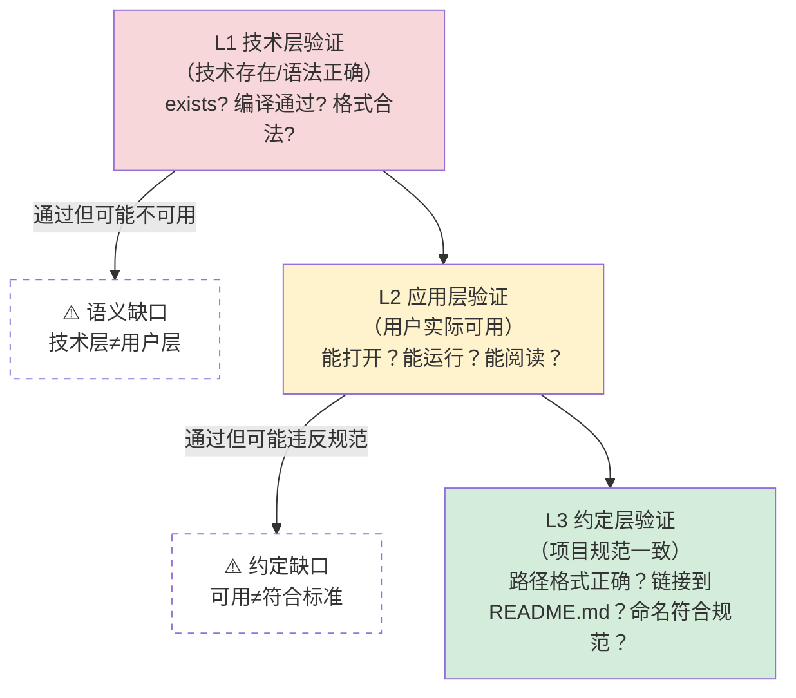

> **提炼自**：[第一性原理驱动文档更新复盘](../../../reports/task-reports/retrospective-first-principles-vibe-coding-docs-update-20260710/insight-extraction.md#洞察3)

# 验证层级语义缺口模式（Validation Semantic Gap）

## 模式类型

工具自动化模式 → 质量保障/验证设计

## 成熟度

L1 实验性（1次验证实例：2026-07-10 check-links.py目录链接检测改进）

## 适用场景

设计、实现或评估任何自动化验证工具时（linter、checker、静态分析器、类型系统、测试框架、CI检查、安全扫描器等）。

| 场景 | 适用度 | 典型缺口 |
|------|--------|---------|
| 链接/引用检查工具 | ✅✅✅ 核心场景 | 路径存在≠链接可打开（目录vs文件） |
| 类型检查/编译验证 | ✅✅✅ 核心场景 | 类型正确≠逻辑正确 |
| 单元测试 | ✅✅✅ 核心场景 | 测试通过≠功能可用 |
| CI/CD流水线门禁 | ✅✅ 强烈推荐 | 流水线绿≠可发布 |
| Lint/代码风格检查 | ✅✅ 强烈推荐 | 无警告≠代码质量好 |
| 安全扫描器 | ✅✅ 推荐 | 无CVE≠无安全漏洞 |
| 数据验证 | ✅✅ 推荐 | 格式合法≠数据正确 |
| 手动审查/Code Review | ⚠️ 间接适用 | 人审也有层级缺口——但对抗式审查更适用于此 |

## 问题背景

自动化验证工具最隐蔽的缺陷不是"漏报"或"误报"，而是**验证层级错位**：工具在技术层（文件系统、语法、类型系统、编译）验证"通过"，但在用户实际体验层（点击能打开、运行能得到预期结果、阅读能理解内容）却失败了。

### 经典实例：目录链接问题

check-links.py最初只在**文件系统层**验证"路径指向的对象存在"——目录确实"存在"，所以工具报告"所有链接有效"。但用户点击后IDE显示"此文件是目录，无法打开"——在**应用层**（IDE/Markdown渲染器）完全不可用。

这不是工具bug，而是**验证标准与使用场景不匹配**：
- 工具验证的问题："路径在文件系统上是否存在？"
- 用户真正需要回答的问题："点击这个链接能否到达我想看的内容？"

二者之间的灰色地带（目录、空文件、权限问题、格式不兼容、编码错误）就是"验证层级语义缺口"。

### 为什么工具容易停留在技术层？

1. **技术层验证容易自动化**：exists()返回bool，编译通过/失败是明确信号，容易实现
2. **应用层验证难自动化**：需要模拟用户行为、理解语义、判断"是否符合预期"
3. **约定层验证最容易被遗漏**：项目规范（如"链接必须指向具体.md文件"）是隐性知识，不会自动成为工具验证标准
4. **"通过"的误导性**：工具报告"0 errors"给人虚假的安全感，比工具报错更危险

## 核心原则：三层验证模型

从用户体验出发，将验证标准从技术层提升到用户层，建立三层验证模型：

| 验证层级 | 验证问题 | 典型工具 | 通过=？ | 遗漏什么 |
|---------|---------|---------|--------|---------|
| **L1 技术层** | 对象在技术上是否存在/合法？ | 文件系统、编译器、JSON Schema、Parser | 文件存在、编译通过、格式合法 | 能打开吗？能用吗？ |
| **L2 应用层** | 用户能否实际使用？ | 浏览器/IDE兼容性测试、集成测试、E2E测试 | 点击能打开、运行有输出、页面可渲染 | 符合项目规范吗？ |
| **L3 约定层** | 是否符合项目/领域规范？ | 自定义Lint规则、Check-links增强、架构测试 | 链接到具体文件、路径层级正确、命名一致 | — |

### 核心规则

**规则1：从用户视角反推验证标准，而非从技术可行性出发**

设计验证工具时，第一个问题不是"我能自动检查什么"，而是"用户做这个操作时，期望什么结果？"——从用户期望反推应该验证什么。

**规则2：L1通过≠L2通过，必须主动填补层级缺口**

当你的验证在L1（技术层）通过时，主动问："这个对象虽然存在/合法，但用户实际使用时会遇到什么问题？"目录存在但无法打开、编译通过但逻辑错误、测试通过但功能缺失——这些都是L1→L2的缺口。

**规则3：L2通过≠L3通过，约定层验证是质量的最后一公里**

即使功能可用，如果不符合项目规范（链接到目录而非README.md、使用绝对路径而非相对路径、命名不一致），长期维护会积累技术债。约定层验证通常需要自定义规则。

**规则4：验证缺口的发现信号——用户反馈=对抗式验证**

当用户报告"工具说没问题但我遇到了问题"时，这不是"用户不会用"，而是发现了一个验证层级缺口。用户反馈是最高效的对抗式审查。

**规则5：发现缺口后，升级工具验证标准而非仅修复单个案例**

发现目录链接问题后，不是手动修复6个链接就结束——而是升级check-links.py的验证标准，让工具今后能自动检测同类问题。修复单个案例是治标，升级验证标准是治本。

## 反模式

| 反模式 | 为什么错误 | 正确做法 |
|--------|----------|---------|
| "工具说通过就是没问题" | 工具只验证它能验证的，验证层级缺口天然存在 | 工具通过后仍需人工/对抗式验证关键路径 |
| 只实现L1验证就认为完成 | L1验证是最容易实现的，但离用户需求最远 | 至少做到L2，理想情况做到L3 |
| 修复用户报告的问题但不升级工具 | 同类问题会反复出现 | 每次修复都问：工具为什么没发现这个？能自动化检测吗？ |
| "类型安全就等于程序正确" | 类型系统是L1验证，逻辑正确性需要L2/L3 | 类型检查+单元测试+集成测试+E2E测试形成多层验证 |
| "测试覆盖率100%就没有bug" | 覆盖率衡量"代码被执行了"，不衡量"执行结果正确" | 测试断言质量>覆盖率，加入变异测试、属性测试 |
| 把约定层问题当作"代码风格"忽略 | 约定不一致导致维护成本指数级上升 | 将约定编码为自动化规则，纳入CI门禁 |

## 实例

### 实例1：check-links.py目录链接（2026-07-10，L1验证）

| 层级 | 旧验证 | 问题 | 新验证 |
|------|--------|------|--------|
| L1 文件系统 | `exists()`返回true | 目录"存在"但不可打开 | 保留exists()检查 |
| L2 应用层 | 无 | IDE无法打开目录 | `is_dir()`检测，输出warning |
| L3 约定层 | 无 | 目录链接应指向README.md | 自动修复：dir/ → dir/README.md |

效果：验证标准升级后立即发现1个之前漏掉的目录链接问题（ecosystem-barrier-evaluation.md链接到目录而非README.md）。

### 待验证的潜在实例（hypothesis）

以下实例尚未在本项目中验证，但符合三层验证模型，供后续实践检验：

| 场景 | L1通过 | L2/L3缺口 |
|------|--------|----------|
| TypeScript类型检查 | 编译通过，类型正确 | 运行时API返回数据结构与类型定义不匹配 |
| 单元测试 | 所有测试通过，覆盖率100% | Mock的数据与真实API响应不一致 |
| CI流水线 | 所有检查绿 | 部署后环境变量缺失导致功能异常 |
| ESLint无警告 | 代码风格统一 | 性能问题（N+1查询、不必要的重渲染） |
| JSON Schema验证 | 数据格式合法 | 业务逻辑错误（结束日期早于开始日期） |

## 与其他模式的关系

| 关联模式 | 关系类型 | 关系说明 |
|---------|---------|---------|
| [link-check-dual-coverage.md](link-check-dual-coverage.md) | 互补 | link-check-dual-coverage讲"检查范围覆盖"（显性+隐性引用），本模式讲"检查层级覆盖"（L1→L2→L3），二者正交 |
| [tool-self-validation.md](tool-self-validation.md) | 前置依赖 | 工具自生验证是确保工具至少在L1层正确工作，但自生验证不能发现L1→L2的语义缺口 |
| [dry-run-first.md](dry-run-first.md) | 方法关联 | dry-run是在真实环境应用前发现L2层问题的手段 |
| [precision-over-recall.md](precision-over-recall.md) | 质量权衡 | L2/L3层验证精度优先于召回——宁可漏报也不要因误报太多导致告警疲劳被忽略 |
| [practice-gap-recursive-practice.md](../governance-strategy/practice-gap-recursive-practice.md) | 元理论 | 践行鸿沟解释了为什么"知道要做L3验证"的人仍然只做L1——因为L1容易自动化，System 1倾向于做容易的事 |
| [adversarial-review-prompt-pattern.md](../ai-collaboration/adversarial-review-prompt-pattern.md) | 防御层 | 对抗式审查是L2/L3验证的最高形式——用攻击者视角发现自审盲区 |

## Changelog

- 2026-07-10 | create | 初始版本，从insight-extraction.md独立归档，L1成熟度，1次验证实例（check-links.py目录链接改进）
