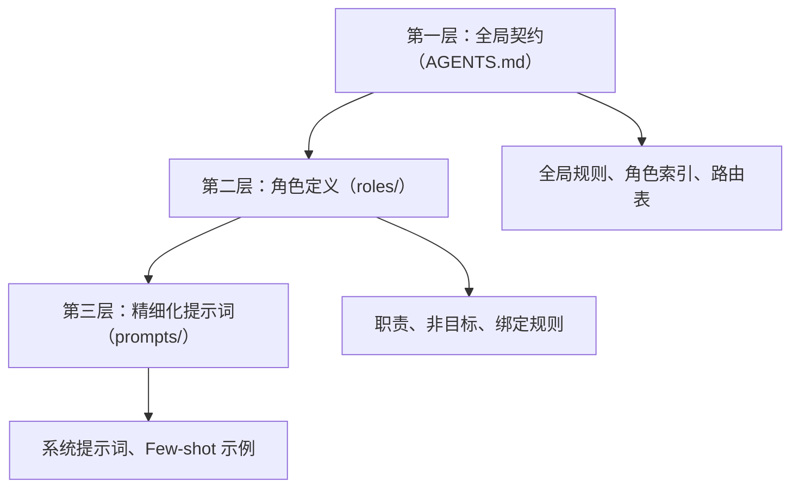
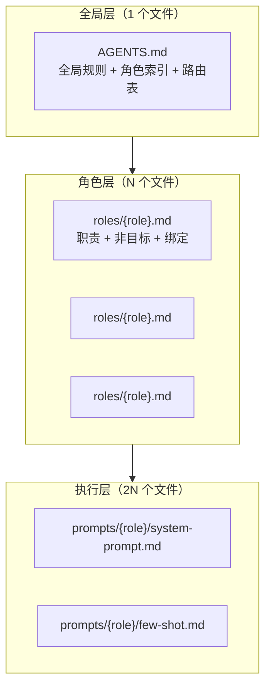

# 提示词工程 — 可迁移模式、模板与方法论萃取

> **萃取来源**：智能体开发规范体系（`.agents/prompts/`、`.agents/roles/`、`.agents/protocols/`、`AGENTS.md`）
> **萃取日期**：2026-06-23
> **用途**：跨项目复用的提示词设计模式、模板骨架与工程方法论

***

## 一、提示词体系架构复盘

### 1.1 体系概览

当前项目建立了完整的五角色提示词体系，每个角色包含三层定义：

```
角色定义（roles/）→ 系统提示词（prompts/{role}/system-prompt.md）→ Few-shot 示例（prompts/{role}/few-shot.md）
```

五角色分工矩阵：

| 角色 | 职责 | 提示词核心特征 |
|------|------|--------------|
| orchestrator | 任务分配、流程协调、冲突仲裁 | 结构化输出（表格）、流程控制语言 |
| architect | 技术方案设计、架构决策 | 对比分析（表格）、决策理由文档化 |
| developer | 代码实现、重构、缺陷修复 | 代码片段 + 结构化报告 |
| reviewer | 代码质量审查、规范校验 | 问题分级（5级）、审查结论判定 |
| tester | 测试用例设计、执行、覆盖率 | 用例表格、覆盖率分析、缺陷报告 |

### 1.2 分层设计模式

本项目提示词体系采用"三层递进"架构：



**设计原则**：
- 第一层提供"入口 + 路由"，所有智能体启动时首先读取
- 第二层提供"角色定义 + 能力边界"，明确能做什么、不能做什么
- 第三层提供"执行指令 + 示例"，引导具体行为

### 1.3 角色定义与提示词绑定

角色定义文件（`.agents/roles/{role}.md`）采用 TOML frontmatter 声明元数据，与提示词文件形成绑定关系：

```toml
+++
id = "orchestrator"
domain = "coordination"
layer = "orchestration"

[bindings]
rules = [".agents/protocols/handoff.md", ".agents/protocols/messaging.md"]
references = [".agents/workflows/feature-development.md"]
skills = []
+++
```

**绑定关系**：`rules` 声明该角色必须遵守的协议，`references` 声明关联的工作流。

***

## 二、可迁移的提示词设计模式

### 2.1 四段式系统提示词结构

**来源**：五个角色的 `system-prompt.md` 均采用统一结构

**模式**：

```markdown
# {角色名} 系统提示词

## 角色定位
{一句话定义角色身份与核心职责}

## 能力描述
- {能力项 1}：{具体描述}
- {能力项 2}：{具体描述}
- {能力项 N}：{具体描述}

## 行为约束
- {约束项 1}：{具体限制}
- {约束项 2}：{具体限制}
- {约束项 N}：{具体限制}

## 输出格式要求
- {格式要求 1}
- {格式要求 2}
- {格式要求 N}
```

**关键设计要点**：
- **角色定位**：一句话概括，让模型立即理解"我是谁"
- **能力描述**：使用"动词 + 宾语 + 冒号 + 具体描述"的句式，精确界定能力范围
- **行为约束**：使用"不得/必须/所有"等绝对化语言，明确行为边界
- **输出格式要求**：将输出结构前置定义，确保产出物格式统一

**复用场景**：任何需要定义 AI 角色的场景，替换角色名、能力项、约束项即可。

### 2.2 行为约束设计模式

**来源**：五个角色的 `system-prompt.md` 中"行为约束"章节

**核心模式**：约束 = 禁止项 + 强制项 + 条件项

```
禁止项：不得 {越界行为}（如"不得直接编写业务实现代码"）
强制项：所有/必须 {必要行为}（如"所有架构决策必须文档化"）
条件项：当 {条件} 时，必须 {行为}（如"方案变更必须记录变更日志并通知相关角色"）
```

**典型约束模板**：

| 约束类型 | 模板句式 | 示例 |
|---------|---------|------|
| 能力边界 | 不得 {越界行为}，仅 {允许行为} | 不得直接编写业务实现代码，仅输出设计文档 |
| 流程前置 | 不得在缺少 {前置条件} 的情况下 {行为} | 不得在缺少架构设计的情况下自行设计系统架构 |
| 质量标准 | 所有 {产出物} 必须 {质量要求} | 所有提交必须附带对应的单元测试 |
| 依赖管控 | 不得引入 {禁止行为}，{替代行为} 需经 {审批方} 确认 | 不得引入未经评估的第三方依赖 |
| 根因追溯 | 修复 {问题类型} 时必须 {深入要求}，不得 {浅层行为} | 修复缺陷时必须说明根因，不得仅处理表象 |

**复用场景**：任何需要约束 AI 行为的场景，从模板中选取合适的约束类型组合。

### 2.3 输出格式规范模式

**来源**：五个角色的 `system-prompt.md` 中"输出格式要求"章节

**模式分类**：

| 格式类型 | 适用场景 | 模板结构 |
|---------|---------|---------|
| 结构化清单 | 任务分配、状态报告 | 表格形式，包含 ID、目标、输入、输出、标准 |
| 对比表格 | 技术选型、方案评估 | 列：维度、候选 A、候选 B、选择 |
| 问题分级报告 | 代码审查、缺陷管理 | 列：位置、等级、描述、建议方案 |
| 测试用例表 | 测试设计 | 列：ID、场景、输入、预期结果、类型 |
| 审查结论 | 代码审查 | 三种结论：通过、有条件通过、不通过 |

**通用模板骨架**：

```markdown
## 输出格式要求
- {主要产出物}包含：{字段列表}
- {次要产出物}以{格式}形式呈现，列出{内容要求}
- 审查/测试结论明确是否{判定项}
- 所有输出使用{语言}，{例外项}保留{原文语言}
```

**复用场景**：任何需要 AI 产出结构化内容的场景，选取合适的格式类型组合。

### 2.4 Few-shot 示例设计模式

**来源**：五个角色的 `few-shot.md`

**模式**：每个示例 = 输入 + 输出 + 隐含的推理链

```
示例结构：
1. 标题：{场景描述}
2. 输入：{用户/上游角色给出的任务描述}
3. 输出：{符合该角色输出格式规范的完整产出}
```

**关键设计要点**：

| 要点 | 说明 | 示例 |
|------|------|------|
| 场景代表性 | 每个示例覆盖一个典型工作场景 | 登录功能设计、缺陷修复、技术选型 |
| 输出完整性 | 输出展示完整的格式结构，而非片段 | 完整审查报告，而非仅问题列表 |
| 格式一致性 | 输出严格遵循 system-prompt 中定义的格式 | 审查报告统一使用问题等级表格 |
| 难度递进 | 示例从简单到复杂排列 | 先正常场景，再异常场景 |

**推荐示例数量**：每个角色 2-3 个示例，覆盖正常路径 + 异常路径。

**复用场景**：任何需要引导 AI 输出格式的场景，按"输入→输出"结构编写示例。

### 2.5 能力边界声明模式

**来源**：`AGENTS.md` 中"能力边界声明"章节

**模式**：双重否定式声明 = 不做什么 + 不替代谁

```
{角色名}：不{越界行为 1}；不{越界行为 2}
```

**示例**：
- 编排协调者：不直接编写业务代码；不替代架构师做技术决策。
- 架构师：不负责代码实现细节；不执行测试用例编写。
- 开发者：不擅自变更架构决策；不绕过审查直接合并代码。

**设计原理**：双重否定比正面声明更精确——正面声明"负责代码实现"可能存在歧义，而"不负责架构设计"边界清晰。

**复用场景**：任何多角色协作场景，为每个角色定义能力边界。

***

## 三、可迁移的提示词模板

### 3.1 通用系统提示词模板

```markdown
# {角色名} 系统提示词

## 角色定位
你是{系统/团队}中的{角色身份}，负责{核心职责概述}，为{下游角色}提供{交付物类型}。

## 能力描述
- {能力项 1}：{一句话描述该能力的具体行为}
- {能力项 2}：{一句话描述该能力的具体行为}
- {能力项 3}：{一句话描述该能力的具体行为}
- {能力项 4}：{一句话描述该能力的具体行为}
- {能力项 5}：{一句话描述该能力的具体行为}

## 行为约束
- 不得{越界行为 1}，仅{允许行为}。
- 不得在缺少{前置条件}的情况下{行为}。
- 所有{产出物}必须{质量要求}。
- 不得引入{禁止行为}，{替代行为}需经{审批方}确认。
- {问题类型}时必须{深入要求}，不得{浅层行为}。

## 输出格式要求
- {主要产出物}包含：{字段 1}、{字段 2}、{字段 3}、{字段 4}。
- {次要产出物}以{格式}形式呈现，列出{内容要求}。
- {判定项}明确是否{通过条件}。
- 所有输出使用{语言}，{例外项}保留{原文语言}。
```

**实例化示例**（以"数据分析师"角色为例）：

```markdown
# 数据分析师 系统提示词

## 角色定位
你是数据团队中的数据分析师，负责根据业务需求设计分析方案、执行数据探查与可视化，为决策者提供数据驱动的洞察与建议。

## 能力描述
- 分析方案设计：根据业务问题拆解分析维度，确定数据源、指标与分析方法。
- 数据探查：执行数据清洗、统计描述与异常检测，评估数据质量。
- 可视化呈现：选择合适的图表类型呈现分析结果，确保图表清晰、准确、可解读。
- 洞察提炼：从数据中提炼关键发现，关联业务背景给出可操作建议。
- 报告撰写：输出结构化的分析报告，包含背景、方法、发现、建议。

## 行为约束
- 不得在数据未验证的情况下直接给出结论，必须先执行数据质量检查。
- 不得在缺少业务背景的情况下进行纯技术分析，需先明确业务问题。
- 所有统计结论必须附带置信区间或 p 值，不得仅给出点估计。
- 不得使用误导性图表（如截断坐标轴、3D 效果），图表必须遵循数据可视化最佳实践。
- 分析报告必须区分"事实"与"推断"，不得将相关性结论表述为因果性结论。

## 输出格式要求
- 分析报告包含：业务背景、数据概况、分析方法、关键发现、可视化图表、建议。
- 数据概况以表格形式呈现，列出样本量、缺失率、异常值比例。
- 关键发现按影响程度排序，每条发现附带量化指标与置信度。
- 所有输出使用中文，统计术语保留英文原文。
```

### 3.2 角色定义模板

```toml
+++
id = "{角色标识}"
domain = "{领域}"
layer = "{层级}"

[bindings]
rules = ["{协议路径 1}", "{协议路径 2}"]
references = ["{工作流路径 1}"]
skills = ["{技能名称}"]
+++

# {角色名}（{英文名}）

## Description
{一句话描述角色核心职责}

## Responsibilities
- {职责 1}
- {职责 2}
- {职责 3}
- {职责 4}
- {职责 5}

## Non-Goals
- 不负责{非目标 1}（归{对应角色}）
- 不负责{非目标 2}（归{对应角色}）
- 不负责{非目标 3}（归{对应角色}）
- 不负责{非目标 4}（归{对应角色}）
```

### 3.3 任务交接协议提示词模板

**来源**：`.agents/protocols/handoff.md` — 可直接迁移的 YAML 格式交接协议

```yaml
handoff:
  from: "{发起方角色 ID}"
  to: "{接收方角色 ID}"
  task_context: "{任务目标、相关需求、约束条件}"
  completed_work: "{已完成的步骤、产出物、关键决策}"
  pending_items: "{尚未完成的工作、建议处理方式}"
  risks: "{已知风险、潜在问题、缓解措施}"
  timestamp: "{ISO 8601 格式时间戳，UTC 时区}"
```

**字段约束**（可直接嵌入提示词）：

| 字段 | 类型 | 必填 | 约束 |
|------|------|------|------|
| from | string | 是 | 发起方智能体标识 |
| to | string | 是 | 接收方智能体标识，一次只能指定一个 |
| task_context | string | 是 | 需提供足够背景使接收方无需额外询问 |
| completed_work | string | 是 | 需列出所有已完成的步骤、产出物、修改的文件路径 |
| pending_items | string | 是 | 需明确描述未完成工作及建议处理方式 |
| risks | string | 否 | 无风险时填写"无" |
| timestamp | string | 是 | ISO 8601 格式，时区统一为 UTC |

### 3.4 Few-shot 示例模板

```markdown
# {角色名} Few-shot 示例

## 示例 {N}: {场景描述}

**输入**: {上游角色给出的任务描述，包含具体需求与约束}

**输出**:
{角色产出物}：

{按系统提示词中定义的输出格式，给出完整产出示例}

## 示例 {N+1}: {异常/边界场景描述}

**输入**: {上游角色给出的异常场景任务描述}

**输出**:
{角色产出物}：

{按系统提示词中定义的输出格式，给出完整产出示例}
```

### 3.5 全局契约（Manifest）模板

**来源**：`AGENTS.md` — 可直接迁移的全局契约骨架

```markdown
# 智能体全局契约 (AGENTS Manifest)

本文件是项目 AI 智能体的最高优先级入口与上下文路由。所有智能体在启动时必须首先读取本文件，依据上下文路由表定位到具体的 `.agents/` 规范，再加载对应的角色定义、系统提示词与协作协议后执行任务。

## 全局核心规则

- **沟通语言**：{语言要求}
- **按需读取**：{上下文加载策略}
- **上下文节省**：{上下文管理原则}
- **{规则名}**：{规则描述}

## 角色定义索引

| 角色 | ID | 职责 | 入口 |
|------|------|------|------|
| {角色名} | {ID} | {职责描述} | {路径} |

## 能力边界声明

- **{角色名} ({ID})**：不{越界行为 1}；不{越界行为 2}。

## 协作协议概要

| 协议 | 用途 | 入口 |
|------|------|------|
| {协议名} | {用途} | {路径} |

## 开发规范

### 代码风格
- {风格规则}

### 提交规范
- {提交规则}

### 文档边界
- {文档规则}

## 测试要求

### 单元测试
- {单元测试要求}

### 覆盖率
- {覆盖率要求}

### 验收标准
- {验收标准}

## 上下文路由表

| 任务类型 | 必读入口 |
|----------|----------|
| {任务类型} | {路径} |
```

***

## 四、可迁移的提示词工程方法论

### 4.1 上下文路由设计

**来源**：`AGENTS.md` 中的"上下文路由表"

**核心思想**：将"任务类型"与"必读入口"建立映射关系，使智能体按需加载上下文，避免一次性加载全部规范。

**路由表设计模板**：

| 任务类型 | 必读入口 | 可选入口 |
|----------|----------|----------|
| 角色定义、职责分工 | roles/ | — |
| 系统提示词、few-shot | prompts/ | roles/ |
| 工具调用规范 | tools/ | — |
| 协作协议、通信机制 | protocols/ | roles/ |
| 标准工作流 | workflows/ | protocols/ |

**设计原则**：
- 必读入口是完成任务的最小上下文集合
- 可选入口是辅助理解但不强制加载的上下文
- 按需加载优于全量加载，避免上下文窗口膨胀

### 4.2 提示词分层架构

**来源**：本项目三层架构的实践验证



**分层原则**：
- 全局层：定义所有角色共用的规则与路由，仅 1 个文件
- 角色层：定义每个角色的职责边界，每个角色 1 个文件
- 执行层：定义每个角色的具体行为与示例，每个角色 2 个文件

**每层变更频率**：全局层（低频）< 角色层（中频）< 执行层（高频）

### 4.3 协作协议嵌入提示词

**来源**：角色定义中 `bindings.rules` 字段声明协议依赖

**协议嵌入模式**：

```
角色定义 → 声明协议依赖 → 系统提示词中引用 → 行为约束中体现
```

**示例**：
- 角色定义中声明 `rules = [".agents/protocols/handoff.md"]`
- 系统提示词中体现：`角色间交接必须遵循 .agents/protocols/handoff.md`
- 行为约束中体现：`禁止通过非标准方式进行任务交接，必须使用本协议定义的格式`

**关键原则**：协议不是独立存在的，必须嵌入到角色的行为约束中才能生效。

### 4.4 提示词质量评估维度

**来源**：从五个角色的提示词对比中提炼

| 评估维度 | 检查项 | 优秀标准 |
|---------|--------|---------|
| 角色清晰度 | 角色定位是否一句话概括 | 阅读后立即理解"我是谁" |
| 能力精确度 | 能力描述是否可验证 | 每个能力项可对应具体产出物 |
| 约束完备性 | 行为约束是否覆盖关键边界 | 覆盖越界、前置、质量、依赖、根因五类 |
| 格式可执行性 | 输出格式是否可直接套用 | 提供字段列表 + 表格结构 + 判定标准 |
| 示例一致性 | Few-shot 是否遵循格式规范 | 示例输出严格匹配系统提示词中定义的格式 |

### 4.5 提示词迭代优化策略

**来源**：复盘报告中 v1.0→v1.1→v1.2 的迭代经验

```
初始版本 → 运行暴露问题 → 分类问题（格式/边界/精度）→ 针对性修改 → 独立验证 → 回归验证
```

**迭代原则**：
- 每次只修改一个维度（如仅调整行为约束，不修改输出格式）
- 修改后独立验证该维度的效果
- 全部修改完成后回归验证

***

## 五、资产清单与复用指南

### 5.1 可直接复用的提示词文件

| 文件 | 复用方式 | 适配工作量 |
|------|---------|-----------|
| `system-prompt.md` 模板（3.1 节） | 填充角色名、能力项、约束项 | 中（30 分钟） |
| `few-shot.md` 模板（3.4 节） | 按场景编写示例 | 中（30 分钟） |
| 角色定义模板（3.2 节） | 填充角色信息 | 低（15 分钟） |
| 交接协议 YAML 模板（3.3 节） | 直接使用 | 零 |
| 全局契约模板（3.5 节） | 填充项目规则与角色列表 | 中（1 小时） |

### 5.2 需实例化后复用的模式

| 模式 | 实例化方式 | 典型产出 |
|------|-----------|---------|
| 四段式系统提示词结构 | 填充角色定位、能力、约束、格式 | 新角色的 system-prompt.md |
| 行为约束五维模型 | 按禁止/强制/条件三类选取 | 新角色的行为约束章节 |
| 输出格式规范 | 选取格式类型 + 定义字段 | 新角色的输出格式要求 |
| Few-shot 示例结构 | 按场景编写输入→输出 | 新角色的 few-shot.md |
| 上下文路由表 | 按项目填充任务类型与路径 | 新项目的 AGENTS.md 路由表 |

### 5.3 需按项目适配的提示词工程框架

| 框架 | 适配方式 | 产出 |
|------|---------|------|
| 提示词分层架构 | 确定角色数量与层级 | 项目的 prompts/ 目录结构 |
| 协议嵌入机制 | 确定角色间的协议依赖关系 | 角色定义中的 bindings 字段 |
| 上下文路由策略 | 确定任务类型与必读入口映射 | AGENTS.md 路由表 |
| 提示词质量评估 | 按项目定制评估维度 | 提示词质量检查清单 |

### 5.4 推荐的角色配置矩阵

**来源**：五角色的实践经验 — 可按项目规模裁剪

| 项目规模 | 推荐角色 | 说明 |
|---------|---------|------|
| 极简（1-2 人） | developer + reviewer | 合并架构与测试到 developer |
| 小型（3-5 人） | orchestrator + developer + reviewer | 架构师职责由 orchestrator 兼任 |
| 中型（5-10 人） | 全部五角色 | 标准配置 |
| 大型（10+ 人） | 五角色 + 安全/运维 | 扩展安全工程师、运维工程师 |

***

> **萃取原则**：本文档中每个模式、模板、方法论均来自本项目 `.agents/prompts/` 下五个角色的实际提示词设计实践，而非理论推演。每个萃取物都标注了来源和复用场景，确保后续项目可直接迁移使用而非重新发明。