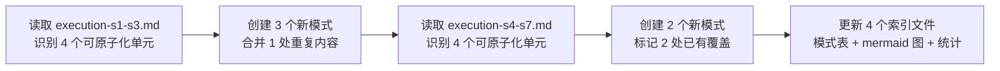

# 二、执行复盘

## 2.1 执行过程回顾

## 2.2 各阶段量化数据

### 阶段一：execution-s1-s3.md 原子化

| 发现 | 原章节 | 处理策略 | 产出 |
|------|--------|---------|------|
| 发现一：auto-generate 张力 | 6.2 | **新建模式** | auto-generate-threshold.md（125 行） |
| 决策 S2-1 + 发现二：脚本化安全边际 | 6.1.2 + 6.2 | **新建模式** | scripted-batch-correction.md（187 行） |
| 发现三：包结构杠杆效应 | 6.2 | **新建模式 + 源文件合并** | package-structure-leverage.md（149 行）；源文件删除 63 行重复内容 |
| 结构阅读先行 | 6.3 | 已有（无需处理） | — |

### 阶段二：execution-s4-s7.md 原子化

| 发现 | 原章节 | 处理策略 | 产出 |
|------|--------|---------|------|
| 发现一：重构中隐藏 bug | 7.2 | **新建模式** | refactoring-hidden-bug-discovery.md（101 行） |
| 发现二：跨任务隐性加速 | 7.2 | **已有模式覆盖** | → retrospective-acceleration-effect.md |
| 发现三：数据-代码分离抽象 | 7.2 | **已有模式覆盖** | → progressive-templating.md |
| 发现四：国际化锚定效应 | 7.2 | **新建模式** | i18n-anchor-page-strategy.md（113 行） |

## 2.3 执行量化小结

| 指标 | 数值 |
|------|------|
| 执行耗时 | ~30 分钟（阶段一 ~15 + 阶段二 ~15） |
| 新建模式文件 | 5 个（合计 675 行） |
| 已有模式覆盖引用 | 2 处 |
| 重复内容合并 | 1 处（删除 63 行，替换为 5 行引用） |
| 源文件溯源链接新增 | 8 处 |
| 索引文件更新 | 4 个 |
| 模式库总量变化 | 方法论 22→27，总计 34→39 |
| 遇到问题数 | 0（全程无 SearchReplace 失误、无导入验证失败） |

---