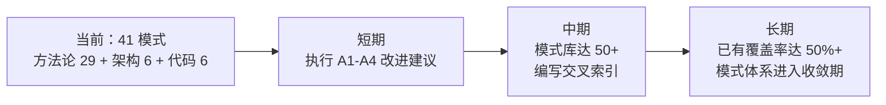

+++
id = "retrospective-atomization-execution-s1-7-20260624-export"
date = "2026-06-24"
type = "export-suggestions"
source = "docs/retrospective/reports/retrospective-atomization-execution-s1-7-20260624.md#五"
+++

# 五、导出

## 5.1 改进建议

| # | 优先级 | 建议 | 依据 |
|---|--------|------|------|
| A1 | 🟡中 | 建立原子化前置检查脚本：在创建新模式前自动搜索已有模式库的关键词/概念映射 | ✅ 已完成：check-atomization-coverage.py |
| A2 | 🟡中 | 建立原子化后内容一致性检查：验证源文件中是否残留已提取的深度分析内容 | ✅ 已完成：check-atomization-duplication.py |
| A3 | 🟢低 | 模式库达到 50+ 后，编写"模式库快速检索指南"：按概念域/适用场景/成熟度的交叉索引 | 发现一：模式体系接近收敛时需要更好的可发现性 |
| A4 | 🟢低 | 将"原子化三级分类策略"和"原子化后内容回源合并"两个新模式原子化至 patterns/ | ✅ 已完成：atomization-three-tier-classification.md + post-atomization-content-merge-back.md |

## 5.2 模式体系当前状态

| 目录 | 模式数 | L1 | L2 | L3 | 本批次新增 |
|------|--------|----|----|----|----------|
| architecture-patterns/ | 6 | 1 | 5 | 0 | 0 |
| code-patterns/ | 6 | 1 | 5 | 0 | 0 |
| methodology-patterns/ | 29 | 12 | 16 | 1 | +7 |
| **合计** | **41** | **14** | **26** | **1** | **+7** |

## 5.3 后续方向

---
> - [review-insight-export-loop.md](../../../patterns/methodology-patterns/review-insight-export-loop.md) — 本报告遵循的复盘结构模板
> - 本次新建的 5 个模式（见 4.3 资产登记表）