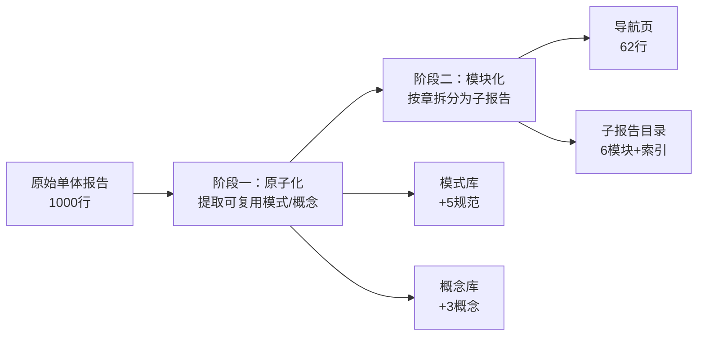

+++
id = "retrospective-atomization-modularization-comprehensive-report-20260623-readme"
date = "2026-06-23"
type = "index"
+++

# AI 智能体开发规范体系 — 原子化·模块化双阶段加工复盘

> **项目名称**：原子化·模块化双阶段加工
> **复盘日期**：2026-06-23
> **项目周期**：阶段一原子化 → 阶段二模块化 → 索引同步 → 复盘闭环
> **报告类型**：执行复盘 + 方法论萃取

## 项目概览

### 1.1 任务输入

| 维度 | 内容 |
|------|------|
| 目标文件 | `retrospective-insight-extraction-comprehensive-20260623.md` |
| 原始规模 | 八章，~15,000 字，约 1000 行 |
| 用户指令 | 依次执行"原子化"和"模块化"，以 3 次"继续"驱动 |
| 前置操作 | 文件已在此前会话中完成原子化评估（5 模式 + 3 概念识别），本次为落地执行 |

### 1.2 两阶段关系

## 子模块导航

| 章节 | 权威来源 | 说明 |
|------|---------|------|
| 执行复盘 | [execution-retrospective.md](execution-retrospective.md) | 阶段一原子化、阶段二模块化、执行问题、量化数据 |
| 洞察萃取 | [insight-extraction.md](insight-extraction.md) | 4 项关键发现、双阶段加工策略、可复用资产 |
| 导出建议 | [export-suggestions.md](export-suggestions.md) | 改进建议、闭环确认、知识资产增量 |

## 关联报告

[retrospective-insight-extraction-comprehensive-20260623.md](../../insight-extraction/retrospective-insight-extraction-comprehensive-20260623/)、[retrospective-comprehensive-20260623/](../../project-governance/comprehensive-reviews/retrospective-comprehensive-20260623/)
