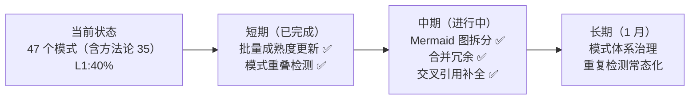

+++
id = "retrospective-entry-detail-migration-20260624-export"
date = "2026-06-24"
type = "export-suggestions"
source = "docs/retrospective/reports/retrospective-entry-detail-migration-20260624.md#四、导出环节"
+++

# 导出建议

## 改进建议

| 问题 | 改进措施 | 优先级 | 预期效果 | 状态 |
|------|---------|--------|---------|------|
| 入口文件受众未分化 | 将"入口-容器分离 + 受众分化"萃取为独立方法论模式 | 高 | 明确两入口文件的精简原则差异 | **已完成** |
| 文档降级策略未模式化 | 将"源文档降级为引用导航"萃取为独立方法论模式 | 高 | 指导大型文档原子化后的处理方式 | **已完成** |
| 模式成熟度偏差 | 批量复核 L1 模式，将已验证 2+ 次的升级至 L2 | 中 | 成熟度分布更准确 | **已完成** |
| 模式重叠未检测 | 基于三维重叠度扫描相似模式对 | 低 | 发现并合并冗余模式 | **已完成** |
| 方法论模式 Mermaid 图过密 | 分领域拆分模式关系图（开发流程/文档治理/知识管理） | 低 | 提高可读性 | **已完成** |

## 行动计划

| 优先级 | 改进项 | 具体措施 | 状态 |
|--------|--------|---------|------|
| 高 | 萃取入口-容器分离模式 | 创建 `entry-container-separation.md`，定义 README/AGENTS/.agents 三层的细节分配原则 | **已完成** |
| 高 | 萃取文档降级模式 | 创建 `source-document-downgrade.md`，定义大型文档原子化后的"降级为引用导航"标准流程 | **已完成** |
| 中 | 批量成熟度更新 | 运行 `scan-maturity-upgrades.py` 统计各模式验证/复用次数，识别应升级的 L1 模式 | **已完成** |
| 低 | 模式重叠扫描 | 基于 `pattern-merge-boundary.md` 的三维重叠度，对全量模式做交叉对比 | **已完成** |
| 低 | Mermaid 图拆分 | 将方法论模式关系图按领域拆分为 3 个子图 | **已完成** |

## 可萃取模式候选

本阶段实践中识别出以下可萃取为独立模式的候选：

| 候选 | 来源 | 核心机制 | 建议名称 | 状态 |
|------|------|---------|---------|------|
| 入口-容器分离 + 受众分化 | README/AGENTS 精简实践 | README（人类）最大精简、AGENTS（AI）路由级保留、.agents/ 全量承载 | `entry-container-separation.md` | **已萃取** |
| 源文档降级 | 综合报告原子化后的处理 | 大型文档被原子化拆分后，源文档降级为引用导航页（不删除），子模块为唯一权威来源 | `source-document-downgrade.md` | **已萃取** |
| 模式成熟度自动升级 | 成熟度偏差发现 | 扫描模式 frontmatter 的 validation_count，≥2 自动升级至 L2 | 合并入已有 `auto-generate-threshold.md` | **已萃取** |

## 附录：模式重叠扫描报告（2026-06-24）

基于 [pattern-merge-boundary.md](../../../patterns/methodology-patterns/pattern-merge-boundary.md) 定义的三维重叠度框架（适用场景 / 核心机制 / 实施建议），对全部 36 个方法论模式执行交叉对比扫描。

### 扫描方法

对每对可能重叠的模式，按以下标准评分：

| 评分 | 含义 |
|------|------|
| ✅ 重叠 | 两个维度的核心内容高度一致 |
| ◐ 部分重叠 | 维度有交集但侧重不同 / 已声明互补关系 |
| ✗ 无重叠 | 维度描述的是不同概念域 |

### 高重叠对（≥ 67%，建议合并）

#### 1. `tool-trigger-mechanism.md` ↔ `tool-entropy-metrics.md`

| 维度 | tool-trigger-mechanism | tool-entropy-metrics | 判断 |
|------|----------------------|---------------------|------|
| 适用场景 | 自动化开发的投资决策：何时应开发工具 | 自动化投资决策：如何度量工具价值 | ✅ 相同——均服务于"自动化开发投资决策"场景 |
| 核心机制 | 3 次手动→触发评估，公式「手动总成本 = 频率 × 单次耗时 × 生命周期」 | ROI 公式「熵减收益 / 开发成本」，底层公式与 trigger 完全一致 | ✅ 相同——共享同一成本公式与 ROI 判定逻辑 |
| 实施建议 | 感知→评估→决策→实施→验证 五步流 | 估算成本→计算ROI→记录→校准 | ◐ 部分重叠——前者侧重流程触发，后者侧重度量体系 |
| **重叠度** | — | — | **67%（2/3）→ 建议合并** |

**合并建议**：两者共享「手动总成本 = 频率 × 单次耗时 × 生命周期」核心公式，tool-entropy 本质上是 tool-trigger "评估"阶段的深化。建议合并为 `tool-automation-decision-model.md`，融合触发条件判断 + ROI 度量 + 熵分类体系三块内容。两文件合计约 99 行，合并在可接受范围内。

---

### 中重叠对（33%，建议保留独立 + 强化互引）

以下模式对在 1/3 维度上重叠，但各自有独立的复用场景，建议保留独立并确保交叉引用清晰：

| # | 模式 A | 模式 B | 重叠维度 | 判断依据 |
|---|--------|--------|---------|---------|
| 2 | `source-document-downgrade.md` | `post-atomization-content-merge-back.md` | 场景 | 均处理原子化后源文档，但 downgrade 是全文档降级，merge-back 是部分内容回源。已声明互为逆向操作，互引清晰 |
| 3 | `content-migration-workflow.md` | `post-atomization-content-merge-back.md` | 场景 | 均涉及源文档内容提取，但 migration 是通用四步 SOP，merge-back 是原子化特异的后置步骤 |
| 4 | `package-structure-leverage.md` | `structure-first-extension.md` | 场景 | 均涉及包结构扩展，但前者量化 WHY，后者指导 HOW。已声明互补关系 |
| 5 | `methodology-critical-mass.md` | `retrospective-acceleration-effect.md` | 场景 | 均描述知识生产加速，但前者跨会话（宏观），后者单会话（微观）。已声明互补关系 |
| 6 | `two-phase-processing.md` | `document-system-refactoring.md` | 场景 | 均涉及文档拆分重构，前者是后者的"单文档深度加工"精化。已声明精化关系 |
| 7 | `diff-driven-refactoring.md` | `refactoring-hidden-bug-discovery.md` | 场景 | 均涉及代码重构，前者是执行方法，后者是价值评估。互引已建立 |
| 8 | `review-insight-export-loop.md` | `retrospective-acceleration-effect.md` | 场景 | 均涉及复盘知识管理，前者是闭环框架，后者是加速效应。互引已建立 |
| 9 | `content-migration-workflow.md` | `two-phase-processing.md` | 场景 | 均涉及大型文档加工，但前者是通用迁移 SOP，后者是横切+纵切的固定顺序策略 |
| 10 | `auto-generate-threshold.md` | `tool-automation-decision-model.md` | 场景 | 均涉及自动化触发条件判断，但前者侧重"何时不运行已有工具"，后者侧重"何时开发新工具" |
| 11 | `spec-driven-development.md` | `convention-driven-creation.md` | 场景 | 均涉及开发方法论，但前者是顶层 L3 方法论，后者是模块创建的约定驱动特化。抽象层级不同 |
| 12 | `atomization-three-tier-classification.md` | `pattern-merge-boundary.md` | 场景 | 均涉及原子化中模式处理决策，后者是前者"新建模式"分支的精化。已声明精化关系 |
| 13 | `reference-as-trigger.md` | `short-command-patterns.md` | 场景 | 均涉及 AI 协作交互模式，但前者是隐式引用触发，后者是显式短指令触发。范式不同 |
| 14 | `suggestion-priority-driven-execution.md` | `report-as-tracking.md` | 场景 | 均服务于复盘建议管理，但前者侧重优先级执行决策，后者侧重状态追踪闭环。互引已补充 |
| 15 | `fact-statement-consistency-loop.md` | `review-insight-export-loop.md` | 场景 | 均涉及复盘闭环，前者是后者在"文档修正"场景的具体应用。已声明父子关系 |
| 16 | `content-migration-workflow.md` | `source-document-downgrade.md` | 场景 | 均涉及源文档处理后形态，但前者产生独立规范文件，后者产生导航页。处理路径不同 |

---

### 无显著重叠（0%）

剩余约 324 对模式组合在三个维度上均无重叠，属于独立概念域，无需合并。

---

### 发现与建议汇总

| 发现 | 建议 | 优先级 | 状态 |
|------|------|--------|------|
| `tool-trigger-mechanism` 与 `tool-entropy-metrics` 共享同一核心公式，重叠度 67% | 合并为 `tool-automation-decision-model.md`，融合触发条件 + ROI 度量 + 熵分类 | 中 | **已完成** |
| `suggestion-priority-driven-execution` 与 `report-as-tracking` 场景高度相关但无互引 | 在两者的"关联模块"中互相添加引用 | 低 | **已完成** |
| 中重叠对（14 对）大多数已建立互引关系，说明既有治理质量较高 | 对缺失互引的 1 对补充交叉引用即可 | 低 | **已完成** |
| 合并后方法论模式总数从 36 降至 35，全量模式从 48 降至 47 | 合并产生的空间可用于后续新模式的精确定位 | — | — |

## 后续优化方向

