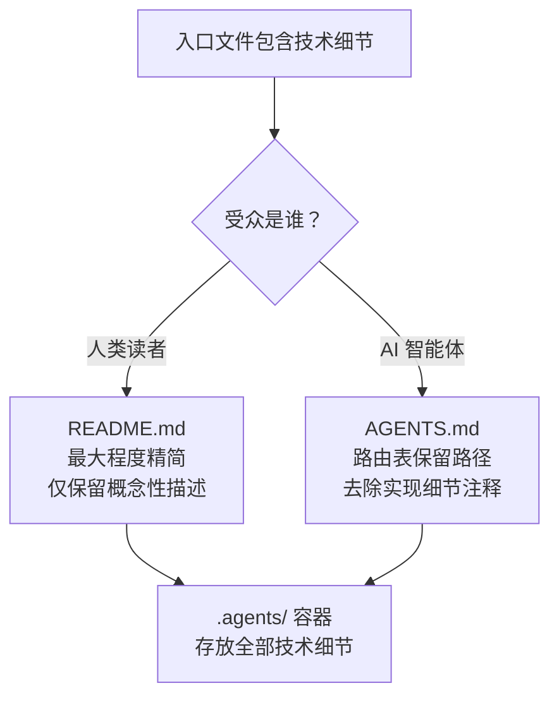

# 洞察萃取

## 关键发现

### 发现一：入口文件存在"受众分化"现象

README.md 和 AGENTS.md 虽然同为入口文件，但受众不同（人类 vs AI 智能体），对技术细节的容忍度也不同。当前的精简策略对两者一视同仁，但实际上 AGENTS.md 中的某些"技术细节"（如具体的脚本名称、工具名）对 AI 智能体的路由功能是必要的——智能体需要知道 `check-gitignore.py` 的路径才能加载它。

**深层含义**：入口-容器分离策略应进一步细化——README.md（人类入口）应最大程度精简技术细节，AGENTS.md（智能体入口）可在路由表中保留必要的路径信息（但不是括号内的实现细节注释）。

**已原子化至**：[entry-container-separation.md](../../../patterns/methodology-patterns/document-architecture/entry-container-separation.md)

### 发现二：方法论模式体系正在进入"临界质量后"阶段

模式数突破 44 个（远超临界质量阈值 6），知识生产已从线性累积进入组合爆炸。表现：
- 模式间开始出现交叉引用（如 `package-structure-leverage` → `structure-first-extension`）
- 模式索引需要多次更新（6 轮更新 / 5 个提交）
- 模式 Mermaid 关系图快速膨胀

**深层含义**：需要引入模式体系治理机制——模式合并边界判断、重复检测自动化、成熟度升级自动化。

**已有模式覆盖**：[methodology-critical-mass.md](../../../patterns/methodology-patterns/retrospective-knowledge/methodology-critical-mass.md)、[pattern-merge-boundary.md](../../../patterns/methodology-patterns/document-architecture/pattern-merge-boundary.md)

### 发现三：原子化工作呈现"加速效应"

从提交节奏看，原子化工作的效率在持续提升：
- 第 1 轮（R1 提示词修复）：3 个文件
- 第 2 轮（R2 Code Wiki）：3 个知识库文件
- 第 3 轮（R3 综合报告）：9 个文件
- 第 4 轮（R4 入口精简）：26 个文件

每轮产出的文件数呈现递增趋势（3→3→9→26），验证了 `retrospective-acceleration-effect` 模式：高频批次复盘实现知识转化率递增。

**已有模式覆盖**：[retrospective-acceleration-effect.md](../../../patterns/methodology-patterns/retrospective-knowledge/retrospective-acceleration-effect.md)

## 规律认知

### 规律一：入口文件精简应区分受众

### 规律二：文档降级比文档删除更优

当大型文档被原子化拆分后，将源文档降级为"引用导航页"（仅保留指向子模块的链接），而非直接删除。优势：
- 已有引用不失效
- 保留历史上下文
- 子模块文件成为单一权威来源

这是 `post-atomization-content-merge-back` 模式的逆向操作——不是将深度分析回并到源文档，而是将源文档降级为索引。

**已原子化至**：[source-document-downgrade.md](../../../patterns/methodology-patterns/document-architecture/source-document-downgrade.md)

## 潜在机会

| 机会 | 说明 | 预期收益 |
|------|------|---------|
| 模式成熟度自动升级 | 基于验证/复用次数自动检测 L1→L2 升级条件 | 减少成熟度统计偏差 |
| 模式重叠检测脚本 | 基于三维重叠度（场景/机制/建议）自动检测相似模式 | 提前发现概念重叠 |
| 批量成熟度更新 | 系统性地复核所有 L1 模式的实际验证次数 | 纠正成熟度分布偏差 |
