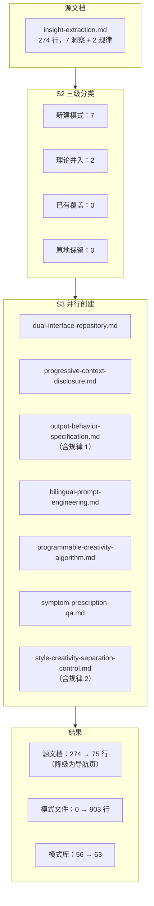

+++
id = "retrospective-meta-atomization-ian-xiaohei-insights-20260625-readme"
date = "2026-06-25"
type = "index"
source = "insight-extraction.md 原子化归档全流程 — 元级复盘"
+++

# insight-extraction.md 原子化归档 — 元级综合报告

> **复盘对象**：`retrospective-ian-xiaohei-source-analysis-20260625/insight-extraction.md` 的原子化归档全流程
> **复盘日期**：2026-06-25
> **复盘类型**：原子化操作的元级复盘（对原子化过程本身的复盘-洞察-萃取-导出）
> **原子化规模**：7 项洞察 → 7 个模式文件（1 架构 + 6 方法论），源文档降级为引用导航页

---

## 核心发现摘要

| 维度 | 核心发现 |
|------|---------|
| 信息增殖 | 原子化使信息总量增长 257%——拆分本身是结构化增补过程 |
| 三级分类 | 「已有覆盖率为 0」需要区分「体系不成熟」还是「领域不重叠」 |
| 规律处置 | 应增加「理论并入」子分类——规律作为理论基础并入已规划模式 |
| 索引维护 | Mermaid 关系图存在边际成本递增问题，需要批量更新阈值规则 |
| 批次效应 | 同日 14 个模式入库，需增加跨批次去重审核步骤 |

## 子模块导航

| 章节 | 说明 | 入口 |
|------|------|------|
| 执行复盘 | 7 步原子化流程回顾、三级分类决策过程、文件规模统计 | [execution-retrospective.md](execution-retrospective.md) |
| 洞察萃取 | 5 项执行洞察 + 2 条规律认知 | [insight-extraction.md](insight-extraction.md) |
| 导出建议 | 5 条改进建议 + 2 个新增可萃取模式 + 4 项行动计划 | [export-suggestions.md](export-suggestions.md) |

## 原子化操作全景

## 关联报告

- [retrospective-ian-xiaohei-source-analysis-20260625/](../../competitive-analysis/retrospective-ian-xiaohei-source-analysis-20260625/) — 被原子化的源洞察所在复盘
- [retrospective-atomization-execution-s1-7-20260624/](../retrospective-atomization-execution-s1-7-20260624/) — 上一次全链原子化执行复盘
- [retrospective-meta-atomization-full-chain-20260624/](../retrospective-meta-atomization-full-chain-20260624/) — 上一次元级原子化复盘
- [atomization-three-tier-classification.md](../../../../retrospective/patterns/methodology-patterns/document-architecture/atomization-three-tier-classification.md) — 三级分类策略

---

> **报告编制**：本文档是对「原子化操作」这一行为本身的元级复盘，遵循「复盘→洞察→萃取→导出」闭环。与源文档（Ian Xiaohei 项目分析）和同日文章学习复盘形成三层递进：项目分析（一层）→ 原子化执行（二层）→ 元级复盘（三层）。
