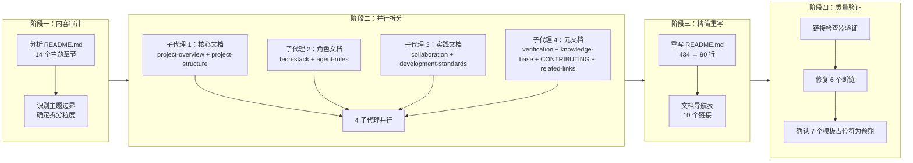

+++
id = "retrospective-report-readme-atomization-execution"
date = "2026-06-23"
type = "execution-retrospective"
source = "docs/retrospective/reports/retrospective-report-readme-atomization.md#二、复盘环节"
+++

# 执行复盘

## 2.1 实施过程回顾

## 2.2 关键节点分析

### 决策 1：拆分粒度 — 10 个文件 vs 更少/更多

**决策依据**：遵循"一文件一主题"原则，每个文件聚焦一个独立可引用的主题。决策矩阵：

| 方案 | 文件数 | 优势 | 劣势 |
|------|--------|------|------|
| 保守（5 个） | 5 | 维护简单 | 部分文件仍混合多主题 |
| **均衡（10 个）** | **10** | **主题独立，每个文件可独立引用** | **需要维护导航表** |
| 激进（15 个） | 15 | 极细粒度 | 文件碎片化，导航复杂 |

选择 10 个文件的均衡方案，核心依据是：每个拆分后的文件都可以被独立引用和独立更新。例如，`CONTRIBUTING.md` 使用标准文件名，可被 GitHub 自动识别；`docs/agent-roles.md` 可被角色相关文档独立引用。

### 决策 2：CONTRIBUTING.md 的位置 — 根目录 vs docs/

**决策依据**：`CONTRIBUTING.md` 是 GitHub 社区标准文件名，放在根目录可被 GitHub 自动识别并在 PR 页面显示"请阅读贡献指南"提示。这是一个平台兼容性决策，而非纯粹的文档组织决策。

### 决策 3：并行执行策略 — 4 个子代理

**决策依据**：10 个文件无依赖关系，可完全并行。按文件内容量均衡分配：

| 子代理 | 文件数 | 内容量 | 执行结果 |
|--------|--------|--------|---------|
| 子代理 1 | 2 | 中 | 成功 |
| 子代理 2 | 2 | 中 | 成功 |
| 子代理 3 | 2 | 中 | 成功 |
| 子代理 4 | 4 | 中 | 成功 |

这是继"智能体开发规范体系"项目后，第二次验证"并行子代理批量创建模式"的有效性。

## 2.3 执行情况与结果数据

| 指标 | 数据 |
|------|------|
| 原始 README.md 行数 | 434 |
| 精简后 README.md 行数 | 90 |
| 精简比例 | 79.3% |
| 新建文件数 | 10 |
| 重写文件数 | 1 |
| 子代理数 | 4 |
| 执行模式 | 全并行 |
| 链接检查断链数 | 13（6 实际 + 7 模板占位符） |
| 修复断链数 | 6 |
| 残留断链数 | 7（均为模板占位符，预期行为） |

## 2.4 成功经验

### 2.4.1 复用既有方法论降低了决策成本

本次拆分严格遵循项目既有的[文档体系原子化重构方法论](../../../patterns/methodology-patterns/document-architecture/document-system-refactoring.md)（六步流程：内容审计 → 原子化拆分 → 模块化归类 → 命名规范 → 引用追溯 → 索引生成），无需重新设计拆分策略。方法论的复用使得决策阶段缩短为一次内容审计，直接进入执行阶段。

### 2.4.2 并行子代理模式再次验证有效

4 个子代理并行创建 10 个文件，每人负责 2-4 个文件。这是继"智能体开发规范体系"项目（4 子代理创建 35 个文件）后，第二次成功应用该模式。两次验证确认了该模式在文档批量创建场景下的稳定性和可复用性。

### 2.4.3 链接检查器作为质量门禁

在拆分完成后立即运行 `check-links.py`，发现 13 个断链。其中 6 个为实际断链（路径层级错误），及时修复；7 个为模板占位符（`{子目录名}` 等），确认为预期行为。链接检查器在此充当了"自动化质量门禁"的角色，防止断链进入最终交付。

### 2.4.4 标准文件名的平台兼容性考量

将贡献指南命名为 `CONTRIBUTING.md`（而非 `docs/contributing.md`），利用了 GitHub 社区标准文件名的自动识别能力。这种"面向平台优化"的命名决策，体现了在文档组织与平台兼容性之间的权衡意识。

## 2.5 存在问题

### 2.5.1 拆分后路径层级变化导致断链

**问题**：原 README.md 中的部分链接基于根目录计算相对路径，拆分到 `docs/` 子目录后路径层级发生变化，导致 6 个断链。

**根因**：拆分过程中，内容从根目录的 README.md 迁移到 `docs/` 子目录，但部分链接的 `../` 层级未同步调整。例如：
- `.agents/roles/architect.md` 中的 `docs/knowledge/decisions/` 需要改为 `../../docs/knowledge/decisions/`
- `docs/retrospective/reports/` 中的 `.trae/specs/` 链接需要增加一层 `../`

**影响**：修复成本低（6 个链接，每个修改 1 处），但暴露了"内容迁移时的路径自动更新"这一缺失能力。

### 2.5.2 模板占位符被链接检查器误报

**问题**：`directory-readme-template.md` 和 `document-system-refactoring.md` 中的 `{子目录名}`、`{文件路径}` 等模板占位符被链接检查器识别为断链，产生 5 个误报。

**根因**：链接检查器无法区分"模板变量"和"实际链接"。模板文件中的 `{placeholder}` 语法在 Markdown 链接中会被解析为路径。

**影响**：误报不影响功能，但增加了人工排查成本。需要为链接检查器添加模板文件排除规则或 `{ }` 占位符识别规则。

### 2.5.3 文档数量增加带来的导航复杂度

**问题**：拆分后 `docs/` 目录下新增 9 个文件，READM.md 中需要维护一个 10 行的文档导航表。

**根因**：原子化拆分的必然代价——文件数量增加，导航需求随之增加。

**影响**：当前 10 个文档的导航表维护成本可控，但若未来继续拆分，可能需要自动化生成导航表。