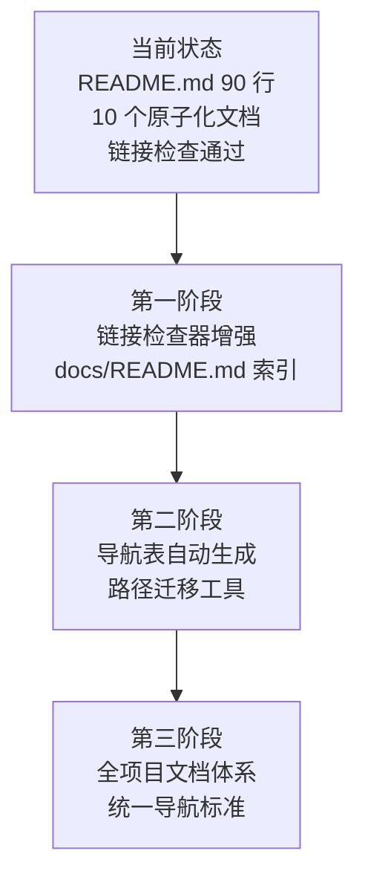

+++
id = "retrospective-report-readme-atomization-export"
date = "2026-06-23"
type = "export-suggestions"
source = "docs/retrospective/reports/retrospective-report-readme-atomization.md#四、导出环节"
+++

# 导出建议

## 4.1 改进建议

| 问题 | 改进措施 | 优先级 | 预期效果 | 状态 |
|------|---------|--------|---------|------|
| 模板占位符误报 | 为链接检查器添加 `{ }` 占位符识别规则 | 中 | 消除 5 个误报 | 已完成 |
| docs/ 目录缺乏索引 | 创建 `docs/README.md` | 中 | 统一管理 docs/ 下所有文档的导航 | 已完成 |
| 路径迁移手动调整 | 开发路径自动更新工具 | 低 | 降低未来拆分时的维护成本 | 已完成 |
| 导航表手动维护 | 开发导航表自动生成脚本 | 低 | 降低文档数量增长时的维护成本 | 已完成 |

## 4.2 行动计划

| 优先级 | 改进项 | 具体措施 | 建议时间 | 状态 |
|--------|--------|---------|---------|------|
| 中 | 链接检查器增强 | 在 `check-links.py` 中添加 `{ }` 占位符识别，跳过模板文件中的变量链接 | 1 周内 | 已完成 |
| 中 | docs/README.md 创建 | 为 `docs/` 目录创建索引文件，统一管理文档导航 | 1 周内 | 已完成 |
| 低 | 导航表自动生成 | 开发脚本，从 `docs/` 目录的文件 frontmatter 中提取标题和描述，自动生成导航表 | 1 个月内 | 已完成 |
| 低 | 路径迁移工具 | 开发"文件移动时自动调整内部链接层级"的工具 | 1 个月内 | 已完成 |

## 4.3 后续优化方向

***

> **报告编制**：本文档基于 README.md 原子化拆分的全过程数据（内容审计、4 子代理并行执行、链接检查结果、6 个断链修复记录）综合编制。报告遵循"事实 → 分析 → 洞察 → 建议"的逻辑结构，适用于小规模文档拆分任务的复盘。
>
> **关联文档**：
> - [README.md](../../README.md)
> - [文档体系原子化重构方法论](../../../patterns/methodology-patterns/document-system-refactoring.md)
> - [复盘→洞察→导出 知识闭环](../../../patterns/methodology-patterns/review-insight-export-loop.md)
> - [多智能体并行执行模式](../../../patterns/architecture-patterns/multi-agent-parallel-execution.md)