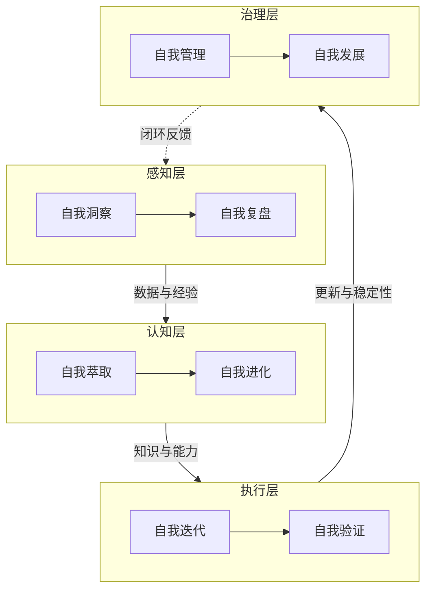

+++
id = "retrospective-report-readme-subagent-extraction-export"
date = "2026-06-23"
type = "export-suggestions"
source = "docs/retrospective/reports/retrospective-report-readme-subagent-extraction.md#七、改进建议"
+++

# 导出建议

## 改进建议

### 🟡 中优先级

**建议 1：将 source 字段约定纳入项目规范** ✅ 已完成
- 问题：当前 source 字段为本次自发新增，未在开发规范中明确
- 建议：在 [docs/development-standards.md](../../../../development-standards.md) 补充"派生产物须携带 source 溯源字段"约定
- 预期收益：使溯源约定制度化，未来派生产物默认可追溯
- 执行结果：已在开发规范新增"派生产物溯源约定"章节，明确字段格式、示例、适用范围与价值

**建议 2：在 .agents/README.md 补充 modules/ 目录说明** ✅ 已完成
- 问题：.agents 容器说明未涵盖新增的 modules/ 子目录
- 建议：更新 [.agents/README.md](../../../../../.agents/) 索引，加入 modules/ 条目
- 预期收益：保持容器说明完整性，便于查阅
- 执行结果：已在目录结构树、职责说明表、开篇说明三处补充 modules/ 条目

### 🟢 低优先级

**建议 3：建立"源变更→受影响产物"自动计算脚本** ✅ 已完成
- 问题：source 字段已具备溯源能力，但尚无工具利用它
- 建议：未来可开发脚本扫描所有含 source 字段的文件，在源文件变更时输出受影响产物清单
- 预期收益：实现溯源字段的自动化价值兑现
- 执行结果：已创建 [check-source-traceability.py](../../../../../.agents/scripts/check-source-traceability.py)，支持审计模式（列出全部溯源关系）与影响分析模式（`--affected <源文件>` 输出受影响产物），验证通过识别 8 个派生产物。脚本数从 5 增至 6，已同步更新 scripts/README.md 与 verification-automation.md

## 附录

### 附录 A：产出文件清单

| 文件路径 | 操作 | 用途 |
|---------|------|------|
| .agents/modules/self-iteration.md | 创建 | 自我迭代模块定义 |
| .agents/modules/self-evolution.md | 创建 | 自我进化模块定义 |
| .agents/modules/self-verification.md | 创建 | 自我验证模块定义 |
| .agents/modules/self-insight.md | 创建 | 自我洞察模块定义 |
| .agents/modules/self-retrospective.md | 创建 | 自我复盘模块定义 |
| .agents/modules/self-extraction.md | 创建 | 自我萃取模块定义 |
| .agents/modules/self-management.md | 创建 | 自我管理模块定义 |
| .agents/modules/self-development.md | 创建 | 自我发展模块定义 |
| .agents/modules/README.md | 创建 | 模块索引（含架构图/清单/数据流） |

### 附录 B：四层闭环架构图

### 附录 C：方法论库更新

本次新增 3 个可复用方法论：
1. 提取任务三段式（存量盘点 → 缺口计算 → 富化归档）
2. 溯源字段约定（source 字段）
3. 抽象层级隔离归档原则