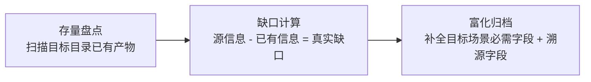

# 洞察萃取

## 关键发现

### 发现一：提取任务的最高杠杆是"判断何时不提取"

**事实**：README 描述了 13 个子智能体/角色，其中 5 个已存在完整定义。若机械执行"提取全部"，会产生 5 个劣化副本。

**分析**：提取任务的本质不是"信息搬运"，而是"知识缺口识别"。机械提取会制造信息双源（README 简述 vs role 文件详述），引发一致性维护负担。

**洞察**：
> 提取类任务的第一步应是"存量盘点"而非"全量提取"。判断"已存在"比"创建新文件"更有价值——前者避免债务，后者增加资产。**"不做什么"的决策质量决定提取任务的上限。**

**通用化**：适用于一切"从源文档生成结构化产物"的场景——先扫描目标目录存量，再计算"源信息 - 已有信息 = 真实缺口"。

### 发现二：溯源字段是提取物的"脐带"

**事实**：在 frontmatter 增加 `source` 字段标注 README 章节，零成本建立反向索引。

**分析**：提取物的最大风险是"源头变更后失同步"。无溯源字段时，需人工回忆来源；有溯源字段时，可程序化定位受影响项。

**洞察**：
> 任何从源材料派生的产物，都应携带"来源坐标"。溯源字段是提取物的脐带——它不增加产物功能，但使产物可被源头变更驱动地更新。**可追溯性是提取物从"快照"升级为"活资产"的必要条件。**

**通用化**：`source` 字段可推广至一切派生产物（如从 spec 生成的代码、从设计稿生成的前端组件），形成"源头变更→受影响产物清单"的自动计算能力。

### 发现三：信息富化是"搬运"与"加工"的分水岭

**事实**：README 对演进模块仅描述技术架构与指标，提取时主动补充交互方式、能力范围、约束条件，使模块文件与 role 文件同等完整。

**分析**：若仅做信息搬运，模块文件是 README 的副本，价值为零（读者不如直接看 README）。信息富化使模块文件成为"独立可用的知识单元"，脱离 README 上下文亦可理解。

**洞察**：
> 提取的价值不在于复制，而在于"补全源材料缺失但目标场景必需的维度"。**搬运是零和（信息守恒），加工是正和（信息增量）。判断提取质量的标准是：产物是否比源材料多了"目标场景必需的信息"。**

**通用化**：一切"从叙述性文档生成结构化定义"的任务，都应回答："目标使用场景（如程序化解析、智能体加载）需要哪些字段？源材料缺哪些？缺的必须补全。"

### 发现四：抽象层级隔离优于物理混放

**事实**：将演进模块放入新建的 `.agents/modules/` 而非现有 `.agents/roles/`。

**分析**：核心角色与演进模块虽都是"子智能体"，但抽象层级不同——前者是"协作开发任务的具体执行者"，后者是"规范体系自身演进的闭环单元"。混放会模糊职责边界，使目录语义降级为"所有子智能体大杂烩"。

**洞察**：
> 目录是知识的物理分区，分区依据应是"抽象层级"而非"表层相似性"。**同类不同层应分目录，同层不同类可共目录。** 层级隔离使每个目录具有单一、清晰的语义，提升可发现性与可维护性。

**通用化**：归档决策时，先问"新项与现有项是否同一抽象层级"，而非"是否同类"。层级不同则新建子目录，避免语义污染。

## 可复用方法论

### 方法论 1：提取任务三段式（存量盘点 → 缺口计算 → 富化归档）

**适用场景**：一切从源文档生成结构化产物的任务。

**关键要点**：
- 存量盘点先于全量提取，避免重复造物
- 缺口 = 源信息 − 已有信息，只处理缺口
- 富化须基于目标场景的字段需求，而非主观添加

### 方法论 2：溯源字段约定（source 字段）

**约定**：派生产物的 frontmatter 增加 `source = "<文件>#<章节>"` 字段。

**价值**：
- 建立提取物→源头反向索引
- 源头变更时可程序化计算受影响产物清单
- 零额外维护成本

**推广方向**：可纳入项目规范，要求一切从其他文档派生的结构化文件均携带 source 字段。

### 方法论 3：抽象层级隔离归档原则

**原则**：归档时按抽象层级分目录，而非按表层相似性混放。

**判定流程**：
1. 新项与现有项是否同一抽象层级？
2. 是 → 共目录；否 → 新建子目录
3. 每个目录保持单一、清晰的语义