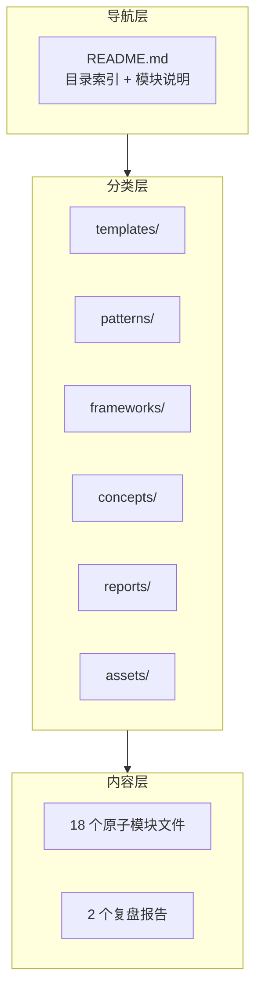

# 洞察萃取

## 3.1 关键发现

### 发现一：文档重构的本质是"信息架构设计"

**支撑事实**：本次重构的核心工作不是"写新内容"，而是"重新组织已有内容"。6 个子目录的划分、18 个文件的命名、每个文件的引用标注——这些决策本质上是在设计一个信息架构。

**深层含义**：文档重构不应被视为简单的"剪切粘贴"操作，而应视为一次信息架构设计实践。架构的好坏决定了后续查阅和维护的效率。

### 发现二：kebab-case 命名规范在中文项目中有额外收益

**支撑事实**：原文件 `knowledge-extraction.md` 虽然是英文命名，但之前的文档命名风格不统一（如 `retrospective-report-agents-spec-system.md` 混合了英文和连字符）。统一采用 kebab-case 后，所有文件名风格一致，且由于不含中文，在任何操作系统和终端中均无障碍访问。

**深层含义**：命名规范不只是"看起来整齐"，它直接影响跨平台兼容性、命令行操作效率和自动化工具的处理能力。

### 发现三：子代理并行模式在文档创建场景中效率极高

**支撑事实**：7 个任务并行执行，每个子代理独立创建 2-5 个文件，互不干扰。如果串行执行，至少需要 7 轮交互；并行执行仅需 1 轮。

**深层含义**：文档创建是"无状态、无副作用、无依赖"的典型场景，天然适合并行化。识别并利用这种场景特征，可以大幅提升批量文档操作的效率。

### 发现四：来源标注 + 关联模块标注形成了"软引用网络"

**支撑事实**：18 个文件通过 `> **来源**：` 和 `> **关联模块**：` 形成了一个可追溯的引用网络。任一文件的修改都可以通过关联模块标注定位到可能受影响的文件。

**深层含义**：在纯文档系统中，通过 Markdown 引用块模拟"外键关系"，可以实现类似数据库的引用完整性。这比目录结构更灵活，比 Wiki 链接更轻量。

## 3.2 规律认知

### 规律一：文档体系的三层架构模型

**导航层**：提供全局视图，帮助快速定位目标内容。
**分类层**：按功能类型划分子目录，建立清晰的模块边界。
**内容层**：每个文件聚焦单一主题，内容独立自包含。

### 规律二：文档拆分的"原子性"判断标准

一个文件是否达到"原子化"标准，可以通过以下三个问题判断：

1. **主题单一性**：该文件是否只讨论一个主题？（是 = 原子化）
2. **独立可读性**：脱离其他文件，该文件是否仍然可理解？（是 = 原子化）
3. **修改独立性**：修改该文件是否不会影响其他文件？（是 = 原子化）

本次拆分的 18 个文件均满足以上三个标准。

### 规律三：目录结构的"3-5 原则"

每个目录下的文件数应控制在 3-5 个——少于 3 个时目录存在的必要性存疑，多于 5 个时应对目录进行二级细分。本次重构中，`patterns/` 目录因预计包含 10 个文件，被拆分为 3 个子目录（5 + 3 + 2），符合"3-5 原则"。

## 3.3 潜在机会

| # | 机会 | 说明 |
|---|------|------|
| 1 | README.md 自动生成脚本 | 基于目录结构自动生成 README.md，解决手动维护问题 |
| 2 | 反向引用增强 | 在引用方文件中也标注"被以下模块引用"，形成双向引用网络 |
| 3 | 文档体系模板化 | 将本次重构的目录结构 + 命名规范 + README 模板提炼为可复用的"文档体系模板"，用于其他项目的文档目录初始化 |
| 4 | 跨文档一致性检查 | 开发一个检查工具，验证所有关联模块引用路径是否有效，类似 check-spec-consistency.py 但用于文档引用 |