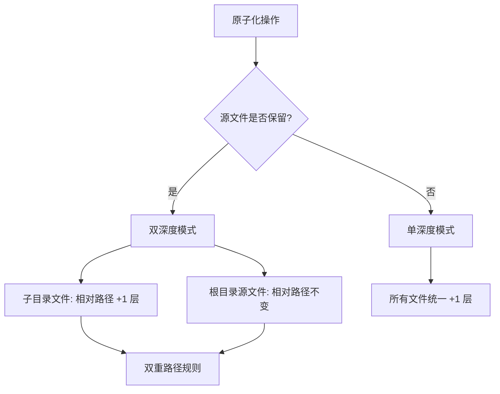
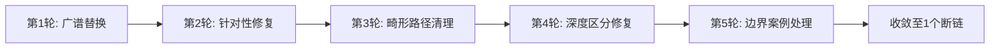

+++
id = "retrospective-report-reports-atomization-comprehensive-20260624-insight-extraction"
date = "2026-06-24"
type = "insight-extraction"
source = "docs/retrospective/reports/retrospective-report-reports-atomization-comprehensive-20260624/README.md#三"
+++

# 三、洞察萃取

> 本节从执行过程数据中提炼关键发现、规律认知与潜在机会。

## 3.1 关键发现

### KF1：批量原子化场景下路径修复存在"深度悖论"

**事实**：从 `reports/xxx.md`（深度 3）原子化为 `reports/xxx/subfile.md`（深度 4）后，所有内部相对路径需要增加一个 `../` 层级。但 reports/ 根目录的残留 `.md` 文件仍处于深度 3，需要的路径前缀不同。

**深层含义**：原子化操作的"源文件是否保留"是路径策略的分水岭。如果原子化后删除源文件，所有路径只需统一调整；如果保留源文件（如本次任务），则需要维护两套路径规则。这揭示了**原子化不是纯增量操作，其路径影响具有非线性特征**。

### KF2："验证驱动修复"比"预防性修复"更高效

**事实**：我们没有在原子化前（Session A）预判路径问题并预防性修复，而是在 Session B 通过 `check-links.py` 发现 81 个断链后，采用"修复→验证→分析→再修复"的闭环进行 5 轮迭代修复。最终 80 个断链被修复，效率远高于逐文件手工检查。

**深层含义**：在批量处理 32 个文件的场景下，**事后验证比事前预防更具操作性**。原因有二：(1) 路径失效模式在原子化过程中难以完全预判；(2) 自动化验证工具（`check-links.py`）可以精确枚举所有断链，避免了手工检查的遗漏。

### KF3：多智能体并行原子化后存在"隐形不一致"风险

**事实**：Session A 中使用并行子代理处理大量文件，Session B 验证时发现：(1) 路径深度不一致（部分使用了正确的相对路径，部分使用了错误的）；(2) 部分旧文件名引用未更新（如 `01-project-retrospective.md` 而非 `project-overview.md`）；(3) TOML frontmatter 的 `source` 字段格式不完全一致。

**深层含义**：并行子代理各自按照自己对规范的理解执行，缺少一个"集中验证"步骤。这揭示了一个通用规律：**并行处理的效率优势需要用"集中式验证"来对冲一致性风险**。

### KF4：既存原子化范例的"模板效应"显著减少了设计决策成本

**事实**：本次任务直接复用了 `retrospective-comprehensive-20260623/` 的原子化结构（README + 4 子模块），未进行任何模板层面的讨论或设计。所有 33 个目录 100% 遵循了该结构。

**深层含义**：这验证了"范例即模板"方法论（已在 [convention-driven-creation.md](../../../patterns/methodology-patterns/convention-driven-creation.md) 中萃取）的有效性。在有足够范例的场景下，**不需要显式编写模板文档——范例本身就是最好的模板**。

## 3.2 规律认知

### RC1：原子化路径深度规则

**规律描述**：原子化后若保留源文件，路径修复必须区分两种文件类型：(1) 新创建的子目录文件，需要增加路径深度；(2) 根目录残留的源文件，路径深度不变。使用统一的全局替换将导致至少一半文件的路径错误。

**复用场景**：任何"保留源文件的原子化/重构"场景均适用。

### RC2：链接修复的五轮收敛模式

**规律描述**：在批量路径修复场景中，修复效果的收敛遵循"快速下降→震荡→再下降→趋于平稳"的模式。前 2 轮修复效果显著（81→39），中间 2 轮可能出现震荡（39→35→32），最后 1-2 轮处理边界案例。

**关键经验**：第 4 轮"深度区分修复"是最关键的转折点——在意识到需要区分根目录和子目录文件后，断链从 32 骤降至 8。

### RC3：原子化验证的三层质量模型

| 层级 | 检查内容 | 工具/方法 | 本次是否执行 |
|------|---------|----------|------------|
| L1 结构层 | 目录是否存在、子模块是否齐全 | 文件系统遍历 | 是 |
| L2 链接层 | 所有内部链接是否有效 | `check-links.py` | 是（10 次迭代） |
| L3 内容层 | 内容是否正确拆分、无遗漏无冗余 | 人工抽查 | 未系统执行 |

**规律描述**：L1 和 L2 可以自动化，L3 需要人工判断。本次任务中 L1 和 L2 得到充分验证，但 L3 仅通过模块文件的行数做粗略判断，未执行系统性的内容完整性检查。

## 3.3 潜在机会

### O1：自动化原子化脚本

- **当前状态**：原子化操作通过 AI 智能体手动执行
- **机会**：基于本次积累的路径规则和模板模式，可开发一个自动化脚本，接收单体 `.md` 文件路径，自动拆分为标准子模块并修正所有相对路径
- **可行性**：高——原子化规则已明确（TOML frontmatter 模板、四段式分拆边界、路径深度规则）

### O2：内容完整性自动验证

- **当前状态**：L3 内容层验证依赖人工
- **机会**：开发一个内容完整性检查工具，比较源文件与原子化后的子模块集合，验证：(1) 总字数差异在阈值内；(2) 章节标题一一对应；(3) 关键数据引用未丢失
- **可行性**：中——需要 Markdown 解析与章节匹配逻辑

### O3：源文件清理策略

- **当前状态**：32 个原始 `.md` 文件仍保留在 reports/ 根目录，导致"双深度模式"路径维护负担
- **机会**：评估是否可以将原始文件迁移至 `.temp/` 或添加废弃标记（如 `_archived_` 前缀），简化路径维护
- **可行性**：高——已在 [source-document-downgrade.md](../../../patterns/methodology-patterns/source-document-downgrade.md) 中有相关模式参考

### O4：原子化覆盖率度量

- **当前状态**：无自动化度量 reports/ 的原子化覆盖率
- **机会**：扩展 `check-atomization-coverage.py` 工具，增加 reports/ 目录的原子化覆盖统计
- **可行性**：中——需要定义"原子化完成"的判定标准（如：是否存在 README.md + 至少 4 个子模块）

---
