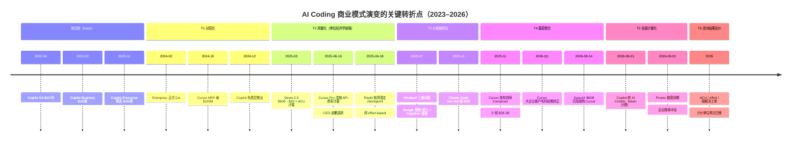

# AI Coding 行业的商业模式演变（2023–2026.9）

> **口径说明**：本报告覆盖「面向软件开发者的 AI 编码产品」及其相邻形态（prompt-to-app / vibe coding），时间跨度 2023 年 1 月至 2026 年 9 月。ARR / run-rate 数据多为厂商披露或第三方估算的**年化运行率**，非 GAAP 审计值，不同时点的数字不可直接加总比较。
>
> **证据分级**：P0 = 厂商官方文档 / SEC 备案 / 公司公告；P1 = 权威媒体与持牌机构；P2 = 行业研究、分析机构估算与二次汇总。凡单一来源且无交叉验证的数据，标注 `[single-source]`；多源互相冲突的数据，在[第九章](#九数据冲突与不确定性清单)显式列出。

---

## 摘要

**一句话结论**：AI Coding 行业在 2023–2026 年经历的，不是"价格涨了几次"，而是**计价单位的三次迁移**——从**卖席位**（2023）→ **卖额度/请求**（2024–2025.5）→ **卖 token/用量**（2025.6–2026.5）→ 正在走向**卖任务与结果**（2026 起）。每一次迁移都不是主动的产品策略选择，而是被同一件事逼出来的：**同一个用户动作背后的推理成本，从"一条窄分布"变成了"一条长尾"**，扁平费率无法在事前区分重度用户与轻度用户，于是"平均定价"必然亏损。

在此主线之上，另有两条并行演化的暗线：

- **价值链再分配**：模型厂商垂直下场做第一方编码工具（Anthropic 的 Claude Code、OpenAI 的 Codex），把应用层的毛利压到负值；应用层唯一的自救路径是垂直一体化——自己训模型（Cursor Composer）或直接并入算力方（SpaceX/xAI）。
- **归属主体的迁移**：付费决策从开发者的个人信用卡（PLG，$20/月）转到 IT 采购，再转到 FinOps 计量预算。这一步完成后，AI 编码支出在财务上就不再是 SaaS 固定项，而是一张**波动的云账单**。

**六个转折点**（详见[第三章](#三六个转折点)）：

| # | 时点 | 事件 | 转折性质 |
|---|---|---|---|
| T1 | 2024-02 / 2024-12 | Copilot Enterprise $39 落地 + 免费层推出 | 从单一价格到**分层 + 漏斗**：把不同成本结构暴露给不同支付意愿 |
| T2 | 2025-03 → 2025-06 | Devin 2.0 降 96%、Cursor 计量化翻车、Replit 放弃固定 checkpoint | **单位经济学崩塌公开化**：扁平包月证伪，全行业转向用量计费 |
| T3 | 2025-07 | Claude Code 起飞 + Windsurf 三重分裂 | **模型厂商垂直挤压**：应用层"中间商"位置失守，断供风险实例化 |
| T4 | 2025-11 → 2026-08 | Cursor 自研 Composer → 大企业客户毛利转正 → SpaceX $60B 全股收购 | **垂直整合成唯一解**：算力与模型权属决定谁吃毛利 |
| T5 | 2026-06-01 | GitHub Copilot 从 PRU 转 AI Credits（token 计费） | **最后一个固守者也转向**：全行业计量化完成，AI 编码支出 = 变量云账单 |
| T6 | 2026 全年 | 计价单位向"任务/结果"迁移（ACU、effort、按解决计） | **下一阶段的开端**：从"卖计算量"到"卖可验证成果" |

**最反直觉的一条发现**：GitHub Copilot 在 2026 年 6 月的计量化改造中，**代码补全与 Next Edit Suggestions 完全不计 credits**，只对 Chat、Agent 模式、代码审查、CLI、云端 Agent 计量。这意味着 GitHub 在主动补贴"便宜的 Copilot"（当年让它成为全民工具的那层能力），只对"贵的 Copilot"（Agent）收费——**同一个品牌下，两个成本结构完全不同的产品被区别定价**。

---

## 一、研究方法

本报告采用追溯性行业分析，三条取证路径相互校验：

1. **产品定价考古**：以厂商官方定价页、changelog、官方文档的**历史快照与第三方跟踪**（DevAI Reviews、aiwiki 等）还原每次定价结构变更的确切时点与条款细节，而非依赖媒体转述。
2. **财务与资本事件追踪**：以 ARR / run-rate 里程碑、融资轮次、并购备案（SEC filings）为骨架，确定商业模式变更的**真实动因**（通常是毛利压力，而非产品策略）。
3. **单位经济学反推**：公开的一方与二手数据相互对照，配合成本模型，检验"某次定价变更是否是必要的"这一反事实命题。

---

## 二、起点：2023 年的行业共识是什么

2023 年，AI Coding 的商业模式有一个几乎没有被质疑过的前提：**这是 SaaS，卖席位。**

| 时点 | 事件 | 定价 | 来源分级 |
|---|---|---|---|
| 2022-06-21 | GitHub Copilot GA | $10/月 或 $100/年 | P0 |
| 2023-02 | Copilot for Business | $19/user/月 | P0 |
| 2023-03 | Copilot X 发布（GPT-4、聊天、PR 辅助、CLI、文档） | — | P1 |
| 2023 年中 | Copilot ARR 突破 $1 亿 | — | P1 [single-source] |
| 2023-07 / 2023-09 | 百度文心快码 / 阿里通义灵码上线 | 见[第八章](#八中国市场的分叉) | P2 |
| 2023-11 预览 / 2024-02 GA | Copilot Enterprise | $39/user/月（另须 GitHub Enterprise Cloud $21） | P1 |

这个模式在 2023 年是自洽的，因为**当时的成本分布确实是窄的**：

- 一次 Copilot 交互 ≈ 一次补全推理，token 消耗量级在数百到数千；
- 一个重度用户一天 50 次补全 × 约 300 token，按 GPT-4 费率推算的边际成本约 $0.9/天，即 $18–27/月[P2]——**$10 的定价从一开始就是增长补贴，不是可持续价格**[P2]；
- 但绝大多数用户远低于重度线，平均值被拉低，$10 在总体上勉强成立。

同一时期，Cognition 于 2024-03 发布 Devin 演示、以 **$500/月** 的席位价入市——这个数字本身就是"当时人们按人类工程师工资的天花板去锚定 AI 定价"的证据，而非按推理成本锚定。三年后 Devin 的入门价会跌到 $20/月，跌幅 96%。

### 埋下的引信

2023 年定下的价格结构里藏着一个未被定价的风险：**这个商业模式把"固定收入"押在了一个"随能力增长而放大的边际成本"上。**只要模型能力不变，$10 就能一直收下去；一旦模型从"补全一行"进化到"自主完成一个任务"，同一个 $10 席位背后的成本就不再是同一个量级。这条引信在 2025 年引爆。

---

## 三、六个转折点

### T1｜2024：分层化与免费层——把不同的成本结构拆给不同的人看

**事件**：Copilot Enterprise 于 2024-02 正式 GA（$39/user/月），形成 $10 / $19 / $39 三层结构；2024-12 推出 Copilot Free（每月 2,000 次补全 + 50 次聊天）。同期 Cursor 完成从 $1M ARR（2024-01）到 $100M ARR（2024-10）的跃迁，并完成 $60M A 轮（估值约 $370M）。

**为什么是转折点**：表面看这只是标准的 SaaS 分层，实质是**行业第一次承认成本不是均质的**：

- Enterprise 层对应的是"代码块索引 + 组织知识库 + 合规审计"这类**明显更贵**的能力，而不是单纯的"功能多一点"；
- 免费层则是**防御性**动作——应对 Cursor 与 Windsurf 的免费策略，同时也是把一个原先需要付费的获客渠道改造成漏斗入口。

**这一阶段的商业逻辑仍然是"按人收费"，但已经开始在高/低两端分别加过载/卸压。**这为下一步彻底放弃"人头"做了认知铺垫。

### T2｜2025-03 → 2025-06：单位经济学崩塌公开化

这是整个报告最重要的一段。**三个月内，三家公司在互不沟通的情况下做了同一件事，且都指向同一个根因。**

| 时点 | 公司 | 变更前 | 变更后 | 结果 |
|---|---|---|---|---|
| 2025-03 | Cognition / Devin 2.0 | 席位制 $500/月 | 入门 $20/月 + **ACU 计量**（$2.25/ACU，1 ACU ≈ 15 分钟 agent 工作） | 入门价降 96%，重度使用与重度付费对齐 |
| 2025-06-16 | Cursor Pro | 每月 500 次 premium 快速请求 + 降速无限 | $20 用量额度，**按底层 API 费率计费** | 重度用户数小时耗尽；三周后 CEO 公开道歉并对 6/16–7/4 期间超额收费者退款 |
| 2025-06-18 → 07-01/02 | Replit Agent | 固定 $0.25 / checkpoint | **effort-based pricing**：简单请求可低于 $0.25，复杂请求数美元 | The Information 披露：**Agent v2 单次 20 分钟的运行成本可达 $10 以上** |

**共同根因（这是本报告的核心论点）**：

> **一次用户动作背后的真实成本，从"窄分布"变成了"长尾分布"。**

在 Cursor 自己的解释里，原因说得非常直白：*"新模型在处理长期任务时，每个请求会消耗更多 token"*[P0/P1]。而在 2024 年的旧结构下，这笔钱是 Cursor 自己吸收的。

最有说服力的一个具体案例：某团队**$7,000 的年度 Cursor 计划在一天内被耗尽**，而他们的工作方式没有任何改变——改变的是计价方式[P2]。以及广为流传的单用户数据：一个人在顶配套餐上消耗了约 **$15,000 的 API 用量，而只付了约 $800**[P2]。

**这一阶段的结构性变化**：定价单位从**人（seat）**迁移到了**量（token / credit / effort / ACU）**。这是三年半演变中最本质的一次迁移，后续所有变化都是它的延伸。

**同时产生了第一次信任危机**：三家公司都用"对更友好"的话术包装了一次实质上的**成本转嫁**，但只有 Cursor 因为沟通问题付出了公关代价。教训被整个行业吸收：此后的定价变更（包括 GitHub 2026 年那次）都大幅提前公示、提供过渡期与促销额度。

### T3｜2025-07：模型厂商垂直下场，应用层"中间商"位置失守

**事件 A — Claude Code 起飞**：Anthropic 的命令行编码 Agent 于 2025-05 GA，随后：

- 2025-09 run-rate 约 $500M → 2025-11 约 $1B → **2026-02 约 $2.5B**，其中**企业使用占一半以上**[P1]
- 到 2026 年初，**贡献了全球约 4% 的公开 GitHub 提交**[P2]，另有分析师预计年底达 20%；
- JetBrains 2026-01 对超 10,000 名开发者的调查：Claude Code 工作场景使用率 18%（2025 年中约 3%，约 6 倍），CSAT 91、NPS 54，为所有被测工具最高[P2]

**事件 B — Windsurf 三重分裂（2025 年 7 月）**，这是价值链重组的教科书案例：

1. OpenAI 原计划以约 $3B 收购 Windsurf（母公司 Codeium），**因 IP/排他条款问题谈崩**；
2. 数日后 **Google 以 $2.4B 进行"非排他技术授权 + 挖走 CEO Varun Mohan 等约 40 名研发"**——刻意规避反垄断审查的结构（授权 + acquihire，而非收购股权）；
3. 三天后 **Cognition 买下剩余部分**（产品、品牌、IP、约 210 名员工，当时 ARR 约 $82M），金额未披露，媒体估算约 $250M [single-source]。公司剩余员工是通过新闻得知创始人离职的，期权归零。

> ⚠️ **数据修正**：部分中文财经汇编称"OpenAI 以约 $30 亿收购 Windsurf"[P2]，与多方一致的上述叙事冲突。**本报告采信 Google 授权 + Cognition 收购版本**（四家独立来源交叉一致，且含 SEC/TechCrunch 时间线）。

**事件 C — 断供风险实例化**：Windsurf 在收购谈判期间**被 Anthropic 直接切断 Claude API 访问**，客户随之流失[P2]。这一条把"依赖第三方模型"从一个财务问题升级为**生存问题**。

**这一转折点的判定**：

> **当卖你 token 的公司，同时在你的品类里卖一个打磨精良的产品，且它的成本结构你无法匹敌时——拥有自己的模型就不再是毛利优化动作，而是战略必需。**

数据支持：据企业支出数据，Cursor 在 AI 编码品类中的份额 **从 2025-06 的约 41% 降至 2026-05 的约 26%**，而同期它的绝对收入仍在从 $1B 涨向 $2–4B[P1]。**绝对增长与相对失守同时发生**——这是品类被上下游夹击的典型信号。

### T4｜2025-11 → 2026-08：垂直整合成唯一解

**第一步：自研模型（毛利层面）**

Cursor 于 2025-11 发布自研编码模型 **Composer**（同期完成 $2.3B D 轮，估值 $29.3B）。经济学意义极其直接：

| 模型 | 输入 / 每百万 token | 输出 / 每百万 token |
|---|---|---|
| Cursor Composer | $0.50 | $2.50 |
| Claude Sonnet（同期档位） | $2.00 | $10.00 |
| Claude Opus 4.x | $5.00 | $25.00 |
| GPT-5.x Powerful | $5.00 | $30.00 |

来源：厂商定价页 / 二手汇总，2026 年[P1/P2]。

**把高成本第三方模型的流量路由到自研模型，省下的差额直接变成毛利。**在此之前，据投资人披露，Cursor 曾把**接近 100% 的收入花在 Anthropic 和 OpenAI 的 API 上，毛利接近零**[P2, single-source]；Composer 上线后的目标是把 COGS 压到收入的 30–40%，并在 **2026 年 Q1 于大型企业客户上实现"轻微毛利转正"**，而个人订阅仍是亏损的[P1/P2]。

到 2026-05 的 Composer 2.5，Cursor 在方法论上更进一步：以 Moonshot 的 **Kimi K2.5 开源权重**为底座（约 1T 总参 / ~32B 激活），但 **85% 的计算预算投入 Cursor 自己的后训练与强化学习**[P1]。其结果是 **$0.07/任务 vs Opus 4.7 的 $4.10/任务——约 60 倍成本差**[P2]。

**第二步：并入算力方（战略层面）**

2026 年这场为期 115 天的交易，是 AI Coding 商业史上最大的单点事件：

| 日期 | 事件 | 来源分级 |
|---|---|---|
| 2026-02 | SpaceX 全股收购 xAI，成立 "SpaceXAI" 部门 | P1 |
| 2026-04-21 | SpaceX 与 Anysphere 签期权：**年内以 $60B 收购，或付约 $10B 分手费/服务费退出** | P0/P1 |
| 2026-06-12 | SpaceX 纳斯达克 IPO，募资约 $75B（史上最大） | P1 |
| 2026-06-16 | 行使选择权 → 通过全资子公司 X67 Inc. 与 Anysphere 签署合并协议，全股支付 | P0（SEC） |
| 2026-08-14 | **交割完成**，Cursor 成为 SpaceX 全资子公司 | P0 |

交易结构细节（具商业可持续性参考价值）：

- 对价形式**全股票**，Anysphere 股东获得按交割前 7 个交易日成交量加权均价定价的 SpaceX A 类股 → **用极高市值完成低成本收购**；
- 若交易失败：SpaceX 须支付 $15 亿终止费 + $85 亿算力；若因反垄断告吹，另设 $40 亿监管终止费——这两个数字本身就是双方对监管风险的定价[P1]；
- CNBC 报道：**微软也曾评估收购 Cursor，最终放弃正式出价**[P1]；
- 合并的战略动机在 SpaceX 招股书中写明：**Cursor 开发者的使用数据（编程请求与设计决策）可用于改进 Grok**[P1]。

**一个新的交易范式同时成型**：「**授权牌照 + 挖走团队**」正在取代完整收购，以规避反垄断审查。序列包括 Google/Windsurf（$2.4B 授权 + 挖 40 人）、Meta/Scale、以及 **2026-08 英伟达向 Poolside 支付 $60 亿授权费，同时雇走其约 115 名工程/研究人员中的 109 名**[P2]。这一范式的经济含义是：**被买走的不是公司，是能力与团队；留下的壳失去了定价权。**

**市场如何给不同形态定价**

一张 2026 年中期的估值倍数对照表，能看清资本已经识别了这个分野[P2，均含估算成分]：

| 公司 | 估值 | ARR（约） | 隐含倍数 | 形态 |
|---|---|---|---|---|
| Cognition / Devin | $26B（2026-05） | ~$492M | **~53x** | 自主 Agent + IDE（对工作替代程度最高） |
| Lovable | $13.2–13.3B（2026-08） | ~$500–600M | ~26x | Vibe coding（对开发者抽象最彻底） |
| Anysphere / Cursor | $29.3B 定价 → $60B 收购 | $2B → ~$4B 估 | **~15x** | AI 辅助 IDE（收入最大但辅助性最强） |

> **关键解读**：**收入最大的那家，倍数最低。**市场在为**自治程度**定价，而不是为收入规模定价——因为它预期自主 Agent 能切走的劳动力预算，远大于辅助工具能切走的工具预算。同一判断在高盛（Goldman Sachs）的预测中也有印证：至 2030 年 token 消耗将增长 24 倍[P2]。

### T5｜2026-06-01：最后一个坚守者也转向，行业的最后一层皮被剥掉

**事件**：GitHub 于 2026-04-27 宣布、**2026-06-01 生效**，把 Copilot 的 premium request units（PRU，**2025-06 才刚刚引入，寿命不到一年**）整体替换为 **GitHub AI Credits**——按实际 **input / output / cached token** 消耗，以各模型公开 API 费率计量，**1 credit = $0.01**[P0]。

**为什么这是转折点而非"又一次调价"**：这是**行业中最后一个、也是装机量最大的扁平包月产品**完成计量化。至此 seat-based 定价在 AI Coding 主战场退居"入场券/外壳"，token 计量成为默认形态。

**五个值得注意的设计细节**（这些细节暴露了厂商真实的经济账）：

1. **代码补全与 Next Edit Suggestions 完全不计 credits**（所有付费计划无限使用）[P0]。也就是说 GitHub 主动保留了"便宜的 Copilot"作为补贴对象，只对 Agent/Chat/Review/CLI/云端 Agent 计量。**同一个品牌下，两个成本结构完全不同的产品被区别对待。**
2. **个人套餐被补贴，企业套餐不被补贴**：Pro $10 含 **$15** credits（1.5x）、Pro+ $39 含 **$70**（1.8x）、Max $100 含 **$200**（2x，新增最高档）；而 Business $19 / Enterprise $39 是 **1:1 无补贴**，但额度在组织内**池化**[P0]。这是一次明确的"用企业级收入补贴个人市场心智"的操作。
3. **取消降级兜底**：旧制度下额度耗尽会降级到更便宜的模型；新制度下耗尽就是**停止**，除非加钱或管理员放行[P0/P1]。这一条在过去两年引发了最大的用户摩擦。
4. **年付用户反被套牢**：年付 Pro/Pro+ 用户不迁移到 credits，继续用 PRU 定价到期满；但 2026-06-01 起 PRU 的模型倍率大幅上调——Opus 类 **7.5x → 27x**、GPT-5 类 **1x → 6x**[P1]。预付一年没有锁定费率，反而锁进了一个正在变贵的系统。
5. **Promo 额度到期**：Business 客户 6–8 月每月 $30 credits、Enterprise $70，**2026-09-01 回落**到 base $19 / $39[P1]——这意味着 2026 年 Q4 会有一波集中的账单冲击。

**被触发的连锁反应**：AI 编码支出正式从 SaaS 固定项变成**变量成本**。代表性的数据：

- **Uber**（约 5,000 名工程师）：2026 年**全年 AI 预算在 4 个月内烧完**，人均月支出 $500–$2,000；目前约 **70% 的提交代码由 AI 生成**，约 **11% 的生产后端变更由 Agent 在无人审查下直接部署**[P1]；
- Anthropic/OpenAI 对重度用户的大幅补贴：$200/月订阅实际提供价值约 **$8,000–14,000** 的算力[P2, single-source]；
- **FinOps 基金会已把 "FinOps for AI" 列为独立领域**，业界开始用 "每名开发者成本 / 席位利用率 / 高端模型占比 / 预算预测" 四个指标管理 AI 编码支出[P1]；
- 有估算称 **58% 的企业对 token 消耗毫无观测能力**[P2, single-source]。

### T6｜2026：计价单位再次迁移——从 token 到"任务/结果"

Token 是当下的事实标准，但**不是终局**。理由很简单：token 计量要求买方承担全部执行风险——Agent 多绕了三个弯、重复加载了两次上下文，用户照样付钱。而重复开销恰恰是大头：**上下文重复发送最高可占 agent 模式 token 消耗的 62%**[P2]。

已经在小规模落地的"结果/任务"形态：

| 产品 | 计价单位 | 价格 |
|---|---|---|
| Cognition Devin | **ACU**（1 ACU ≈ 15 分钟 agent 工作） | $2.25/ACU（约 $9/小时 agent 劳动） |
| Replit Agent | **checkpoint**（合并过的结果单元，effort-based 定价） | ~$0.06 至数美元/次 |
| Intercom Fin | **解决的工单** | $0.99/单 |
| Salesforce Agentforce | **对话** | $2/次 |
| Sierra（Bret Taylor） | **解决的呼叫**（对标人工处理 $10–20） | 未公开 |

契约的关键转变在于风险分配：在 "按任务一口价" 模式下，**评估、重试、验证的成本由平台吸收，客户风险为零，而平台的激励变成效率**。而学术界已验证其优化空间巨大：UC Berkeley 的 RouteLLM 显示**仅靠路由**即可降本 >85%，同时保留 GPT-4 质量的 95%；Stanford 的 FrugalGPT 测得级联策略可省至多 98%[P2]。

Monetizely 的判断可以代表当前行业共识：**effort-based 是中途站，不是终点；下一次重置应把"一个经过验证的完成任务"设为主计量单位，而订阅和 credits 退化为预算与准入机制**[P2]。

---

## 四、商业模式类型的演化谱系

把三年半的变化抽象成一条计价单位的迁移链：

```
   人的数量  →  请求次数  →  token 用量  →  工作量 / 任务  →  可验证结果
   (seat)      (request)     (credit)       (ACU/effort)      (outcome)
   2023        2024–25.5     2025.6–2026     2025.3 起        2026 起扩散
   
   风险承担方：厂商 ←────────────────────────────────────────────→ 厂商
   买方确定性：高   ←────────────────────────────────────────────→ 高
   卖方确定性：低   ────────────────────────────────────────────→ 低
```

注意这条曲线的**形状是 U 形的**：两端都把风险给了卖方，中间的 token 阶段把最大不确定性留给了买方。这解释了为什么 token 阶段必然是过渡态——它对卖方最安全，但对买方最不友好，会被更强的卖方竞争强行推过。

各模式并存而非替代：**同一家公司内部也常常同时跑三四种形态**。GitHub 在 2026-09 的形态就是：席位费（$10/$19/$39/$100）+ token credits + 促销额度 + 可选加购——**席位是入场券，token 是实际计费，加购是超额兜底**。

---

## 五、单位经济学：为什么"扁平订阅"必然死

这一章回答最本质的问题：**为什么仅仅过了三年，$10 的包月就做不下去了？**

### 5.1 一条被两条曲线夹住的收入线

```
         ┌── token 单价：每年约下降 10x（a16z "LLMflation"）[P2]
         └── 单任务 token 消耗：agentic 使消耗上升 5–30x[P2]
                            ↘
              Goldman Sachs 预测至 2030 年 token 消耗增长 24 倍[P2]
                            ↘
         **净效果：单价下降被消耗量上涨完全抵消并反超 → 总支出上行**
```

这就是 Gartner 那个反直觉结论的来源：**即使推理成本下降 90%，企业 AI 也不会自动变便宜，因为 agentic 系统的单任务 token 消耗远高于单轮补全**；Gartner 甚至预警**到 2028 年，部分组织的 AI 编码 token 成本将超过开发者工资**[P2]。

### 5.2 Cursor $1B ARR 时期的一美元拆解

这是最直观的一个切面[P2，估算值，来自投资人披露]：

| 科目 | 占 1 美元收入的比例 |
|---|---|
| 收入 | 1.00 |
| 模型 API 成本 | **≈ 1.00**（曾接近 100% 收入） |
| 人力（约 300 人） | ≈ 0.075 |
| 基础设施及其他 | ≈ 0.075 |
| **结果** | **约 –$150M/年经营亏损** |

**增长最猛的阶段，恰恰是亏得最狠的阶段。**这不是 Cursor 一家的问题，是整个应用层的共同处境：**给模型厂打工，直到你有自己的模型。**

作为对照，Anthropic 的 Claude Code 之所以能吃下这块利润，得益于结构性的差异：

| 成本构成 | Cursor（应用层） | Claude Code（模型厂商自营） |
|---|---|---|
| 推理成本 | 向第三方按零售 API 价支付 | **自家模型，成本 = 边际电费+折旧** |
| 毛利结构 | 一度接近 0 / 负 | 天然拥有"零售 API 价 − 自成本"的全部差价 |
| 断供风险 | 存在（Windsurf 案例） | 无 |

### 5.3 单位经济的三道阀门

从上述拆解可以得出，应用层公司的单位经济学只有三个可调旋钮：

1. **转化率**（获取成本端）：典型 PLG 漏斗，零销售团队。Cursor 用零市场预算做到了 $100M ARR[P2]。
2. **ARPU 结构**（收入端）：用超额计费把重度用户的曲线拉平到成本之上。这正是 T2 阶段所有调价在做的事。
3. **自研模型**（成本端）：把 COGS 从"零售价"压到"自产成本"。这是唯一能**结构性**改变曲线的阀门。

**三者中只有第三条是真正的护城河**——前两条竞争对手可以复制，第三条不可以。这解释了 T4 阶段为什么全行业的终局都指向"必须有自己的模型，或必须有自己的算力"。

---

## 六、驱动因素：五层归因

### D1｜技术驱动（最底层）：能力的形态决定了计价单位

这是所有变化的**第一因**。当产品只能做补全时，交互粒度 = 一次 input/output 对，用席位就能覆盖成本；当产品能自主完成一个多文件重构时，一次用户指令背后是**几十次到几百次模型调用**（规划→编辑→执行命令→读输出→迭代），雪崩式的消耗量让"人均摊平"失效。

**这条规律的可推广版本**：**计价单位必须跟随"用户实际消费的资源的最小不可分割单位"迁移。**当这个单位难以被直接度量时（用户感知不到 token），行业就会退而求其次——先做 effort（Replit）、ACU（Devin），再走向 outcome（Sierra/Fin），每一步都是向"买方更容易理解、更容易预测"移动。

### D2｜成本驱动：负毛利不可持续

见[第五章](#五单位经济学为什么扁平订阅必然死)。压缩表述：**AI Coding 是唯一一个"收入随用户数线性增长、而成本随用户数乘以模型能力超线性增长"的 SaaS 品类。**这个错配必须在某个时点修正，2025 年年中就是那个时点。

### D3｜价值链表驱动：谁控制推理，谁收租

2025-07 之后的格局变化，本质是**上下游的价值重新划分**：

- **上游（模型/算力）**向下垂直整合：Anthropic 做 Claude Code、OpenAI 做 Codex、SpaceX 买 Cursor——每一家都在向应用层延伸；
- **下游（应用层）**向上垂直整合：Cursor 自研 Composer；最后发现自己还是缺算力，于是整体并入了 SpaceX；
- **结果**：**留在中间的位置消失了。**这解释了为什么 2025–2026 年是 AI Coding 的整合年——Windsurf 三次易主、Cursor 被收购、Base44 被 Wix 以 $80M 收购。

### D4｜需求驱动 I：支付主体的迁移（开发者的卡 → CFO 的预算）

这条线常被忽略，但它决定了产品的**形态**，进而决定了定价：

| 阶段 | 支付主体 | 决策逻辑 | 典型单价 | 产品重点 |
|---|---|---|---|---|
| 2023–2024 | 开发者个人信用卡 | "这东西对我有用吗" | $10–20/月 | 个人效率、体感流畅 |
| 2025 | 团队 Leader | "团队能提效吗" | $19–40/seat | 协作、共享额度、管理台 |
| 2026 | 企业 IT / 采购 + **FinOps** | "ROI 可证明吗、预算可预测吗" | $19–200/seat + 计量 | 合规、审计、预算控制、成本归集 |

证据：Cursor 的企业收入占比**从 2024 年初的几乎可忽略，上升到 2026 年的约 60%**[P2, single-source]；GitHub 为企业管理员提供了企业级/成本中心/用户三级预算控制[P0]； SOC 2 Type II 已经成为所有主流工具的采购入场券[P2]。

**这一步完成后，"席位"不再是定价主体，而退化为合规与准入单位**——这是非常微妙但重要的一次性质变化。

### D5｜需求驱动 II：客群从开发者扩到非开发者

这是未来三年最可能产生新增量的一条线：

- **Lovable 8M 用户中约 63% 自认非开发者**[P2]；40% 以上的 Codex 用户非开发者[P2]；
- Vibe coding 市场规模估算 **$4.7B（2026）→ $12.3B（2027）**，约 38% 年增速[P2]；
- 用 AI 工具做一个可用 MVP 的成本，从传统外包约 **$200,000 降到约 $5,000**[P2]；
- Y Combinator 2025 冬季批次中 **25% 的公司提交了 95% 以上由 AI 生成的代码库**[P2]。

这条线的商业含义在于：**当客户不是开发者时，产品交付物的定义从"代码"变成"一个能跑的应用"。**这直接推着计价单位从 token 走向 outcome——因为非技术客户**根本无法理解、也不该承担 token 波动的风险**。这条路径几乎是必然走到 outcome 定价的。

---

## 七、转型的另一面：由此产生的三类新成本与风险

商业模式转型不是免费的，它同时产生了三类此前不存在的成本与风险。这一章提供反面视角，避免结论过于乐观。

### 7.1 质量与安全的负外部性

- 对 1,400+ 个 vibe-coded 生产应用的扫描发现：**65% 存在安全问题，58% 含至少一个严重漏洞，其中有 400+ 个暴露的密钥**[P2]；
- Georgia Tech 的 Vibe Security Radar 追踪到：**归因于 AI 代码的 CVE 从 2026 年 1 月的 6 个上升到 3 月的 35 个**[P2]；
- 一个 40 人 SaaS 团队的实测：无治理地全面铺开 Cursor 后，首月吞吐量 +31%，但**变更失败率从 8% 跳到 19%**，其中两次客户可见事故直接追溯到未经实质审查而合入的 AI 代码；经过 8 周治理，第 10 周失败率回落到 6%（低于 AI 前基线），而吞吐量保持在 +29%[P2]。

### 7.2 ROI 的折损

- **30–45% 的毛生产力增益在实际落地后通常压缩到 8–15% 的净增益**（重做、治理、失败循环）[P2]；
- **token 成本是非线性的**：复杂度 3x 可能导致 token 消耗最高 27x[P2]。一个 20 步的遗留代码库任务可能消耗单次补全的 **80–150 倍**，而不是直觉中的 20 倍[P2]；
- **实践含义**：ROI 模型一旦假设线性扩展就是错的。

### 7.3 新出现的采购摩擦和监管

- **EU AI Act**：通用开发工具属"有限风险"，义务自 2026-08-02 起适用；但**风险向下游转移**——若 AI 写的代码进入 Annex III 的高风险系统（招聘、信贷、教育、关键基础设施），部署者继承第 6–15 条的高风险义务[P2]。Digital Omnibus 包（理事会 2026-06-29 放行）将独立高风险义务的适用日期推迟到 **2027-12-02**，嵌入受监管产品的 AI 推迟到 **2028-08-02**[P2]；
- 中国公安部**正在研究制定人工智能代码生成等领域的安全标准**[P2]。

---

## 八、中国市场的分叉：同一个技术，完全不同的商业模式

这是本报告中与海外偏离最大的一部分，**不能套用前述任何一个模型**。

### 8.1 最显著的差异：个人版全部免费

| 产品 | 个人版 | 付费形态 |
|---|---|---|
| 字节 Trae | **完全免费**（2026-05 起宣布无限制），注册用户突破 800 万 | 企业版约 ¥49–199/席/月 |
| 阿里 通义灵码 / Qoder | **免费** | 团队版约 ¥99/人/月；另有企业版报价（一说年费 ¥9.9 万） |
| 腾讯 CodeBuddy | **免费** | 企业版定制化报价，支持私有化部署 |
| 百度 文心快码 (Comate) | **免费** | 专业版约 ¥199/月 |

### 8.2 为什么免费——这不是"看不见钱"

常见的误读是"中国厂商不懂商业化"。更准确的解读是：**这些工具在产品定位上就不是利润中心，而是云与生态的入口。**

- 字节：AI 推理成本由公司承担，按 API 计费口径推算，支撑 800 万免费用户的月度算力成本在**数千万美元量级**[P2, single-source]——这是一家公司在为自己的云/模型业务买流量与数据；
- 阿里：防线在企业级市场的云生态绑定——私有化部署、多模型配置、DevOps 集成，已签约超 1 万家企业客户[P2]；
- 百度：C++ 生成质量是其差异化点，主攻金融/政企/央国企，核心卖点是**合规与私有化部署**。

**这与 SpaceX 收购 Cursor 在逻辑上是同构的**：都是把 AI 编码工具作为更上游业务（火箭 → GPU/云 → 模型）的分销与数据入口，而非独立的 P&L。**差别只在于：SpaceX 通过 $60B 的股权交易完成了这个绑定，中国厂商从一开始就内置了这个结构。**

### 8.3 由此产生的结构性后果

> **中国 AI 编程赛道没有一家叫得出名字的创业公司。**

这是 2026 年的实证观察[P2]：字节、阿里、腾讯、百度、华为五大巨头占满了每个生态位。**没有创业公司能跟进"完全免费 + 无限用量"的打法**——这个结论的商业推理是：当竞争对手的边际获客成本为零且由外部业务线承担时，任何依赖产品收入覆盖推理成本的第三方都无法在个人市场立足。

对比鲜明的是：同期美国市场仍有 Cursor、Lovable、Cognition、Factory（2026-06 完成 $150M C 轮，估值 $15 亿）等独立公司在巨头夹击下快跑[P2]。

### 8.4 中国唯一切实可行的收费锚点

由于个人端无法收费，商业化只剩三条实际可行的路径：**私有化部署、合规认证、工具链集成**；以及一个次级路径——**国际化**：腾讯走的是"自研服务国内 + 参投 Lovable 获取海外入口"的双线策略[P2]。

另一个需要留意的方向：**开源模型正在把成本曲线拉平**。智谱 AI 编程助手月费低至 **¥20**（约为海外竞品的七分之一），GLM-5.2 在 Code Arena 全球第二，**Cognition 已在其编程 Agent 中使用智谱模型 Z.ai**；微软曾在考虑将 DeepSeek V4 引入 Copilot 作为低成本替代品[P2]。这条线可能会在 2027 年反过来影响海外定价。

---

## 九、数据冲突与不确定性清单

诚实披露本报告无法消除的不一致之处。这是使用本报告的**必读部分**。

| # | 项目 | 冲突情况 | 本报告处理 |
|---|---|---|---|
| 1 | **Cursor ARR（2026 年中）** | $2B（Bloomberg, 2026-02）/ $3B（Sacra, 2026-05）/ $4B（Sacra, 2026-05–06） | 采用 **$2B（2026-02）为硬锚点**，其余标注为估算区间 |
| 2 | **Claude Code run-rate（2026-05）** | $2.5B（2026-02，多源一致）/ ~$8B（2026-05，Sacra 口径） | 两相差 3 倍以上，$8B 标注 `[single-source]`；主体论述只用 $2.5B |
| 3 | **Anthropic 总 ARR** | $30B（2026-04）/ $47B（2026-05）/ $74.1B（2026-07）/ $100B+（2026-09） | **不构成冲突**，是随时间推移的增长序列；但须注意 Anthropic 的 **2025 全年 GAAP 确认收入约 $45 亿**，与 run-rate 差距来自口径差异 |
| 4 | **Windsurf 归属** | "OpenAI 以约 $30 亿收购"（某财经汇编）vs "Google $2.4B 授权 + Cognition 收购剩余" | **采信后者**（四源交叉一致，含 SEC/TechCrunch 时间线），前者视为错误 |
| 5 | **中国 AI IDE 市场份额** | 三套互斥数据：(a) CodeBuddy 28%/灵码 26%/Trae 24%/文心 22%；(b) Trae 41.2%/灵码 18.5%/文心 12.3%；(c) 阿里 47.6%/智谱 11.5%/商汤 10.5%/腾讯 6.9%/百度 6.0% | **三套均不可信**（互相无法调和，且来源均为二次汇编/自媒体）→ **本报告不引用任何一套作为结论依据**，仅作为"格局分散"的定性证据 |
| 6 | **SpaceX 收购是否完成** | 部分来源称"expected to close in Q3 2026"（6–7 月发布） | SEC 备案显示 **2026-08-14 已生效**[P0]，已完成；报告写作时 Cursor 为 SpaceX 全资子公司 |
| 7 | **重度用户补贴幅度** | "$200/月订阅实际提供 $8,000–14,000 价值的算力" | `[single-source]`，数量级参考，不作为精确论据 |
| 8 | **多数 ARR / 毛利 / 员工数** | 未审计，来自投资人披露或第三方估算 | 全部标注估算口径，避免与 GAAP 数字混用 |

---

## 十、2027 展望与可证伪判断

前瞻部分应当能被验证或证伪，因此以下给出明确的可观测指标。

**判断 1｜Token 计量是过渡态，2027–2028 会有一家主流厂商推出"按完成任务"的公开定价。**
理由：token 把全部执行风险放在买方，而"重试 + 验证"成本由平台吸收在技术上已成立（见 T6 的 RouteLLM/FrugalGPT 数据）。非开发者客群扩张（D5）会加速这一点——他们不会接受也不能管理 token 波动。
**证伪信号**：若 2027 年底仍无任何主流编码产品提供"按完成任务一口价"选项，则此判断失效。

**判断 2｜应用层的独立生存窗口正在关闭，剩余的独立公司必须在 2027 年前完成"自研模型或并入算力方"的二选一。**
理由：负毛利 + 上游垂直下场的双重挤压下，中间态不可持续。Cognition 是目前唯一走"纯自主 Agent"路线且拿到 53x 估值倍数的例外，其能否维持溢价是对这一判断的检验。
**证伪信号**：若出现一家不拥有模型、不使用自有算力，且实现了持续正毛利的应用层公司。

**判断 3｜AI 编码支出将正式进入 FinOps 预算管理体系，并催生对应的专职角色。**
理由：58% 的企业目前对 token 消耗毫无观测；而 Gartner 预测 2028 年部分组织 token 成本超过开发者工资——现实中没有 CFO 会长期容忍这种规模的不可观测支出。
**可观测指标**：企业是否会普遍设立 "AI 成本工程师" 或以 "$/merged PR" 作为团队 KPI。

**判断 4｜开源模型会成为压低海外定价的实际力量。**
理由：Cognition 已在用智谱 Z.ai、微软在考虑 DeepSeek V4 作为 Copilot 的低成本替代；而 Cursor 的 Composer 本身就建立在 Moonshot 的开源底座上。
**可观测指标**：若 2027 年主流工具的自研/低成本模型路由占比显著超过 50%，则 token 均价下行会先于 outcome 定价出现，从而推迟判断 1 的实现时点（两者存在竞争关系，需要一起观察）。

---

## 十一、给实践者的六条结论

面向需要在当下做采购/选型/预算决策的读者，把前述分析压缩成可操作建议：

1. **不要再按席位规划 AI 编码预算。**2026-06 后 Copilot 已全面计量化，2026-09-01 促销额度到期。**席位只决定准入，用量决定账单。**预算模型必须是 `$ base + f(用量)` 而非 `$ × 人数`。
2. **关注"哪些能力不计量"的边界，那里正是厂商在补贴的地方。**GitHub 的补全不计 credits、Windsurf/Devin Desktop 的 Tab 全档无限、Cursor 学生计划——**把近乎免费的能力用在高重复工作上，把昂贵的 Agent 留给真正需要它的任务**。同一类作业在不同模型间的成本差异可达 9 倍（Cursor Developer Habits Report, 2026-05）。
3. **先建立观测，再谈优化。**58% 的企业目前对 token 消耗毫无观测能力。最小可行动作：配一套 API key 与订阅并行（Claude Code 原生支持这种混跑），用 key 跑批作业，按项目归集成本。
4. **模型间的单位成本差 >> 订阅档位的绝对价格差。**同一任务路由到不同模型的成本差达 9–60 倍（Composer 2.5 $0.07/任务 vs Opus 4.7 $4.10/任务）。分层分配席位：普通工程师 $30–40 档，Staff/平台团队 $200 档。
5. **把治理成本计入 ROI。**30–45% 的毛增益会压缩到 8–15% 净增益。一个 40 人团队的 8 周治理实证显示，治理能恢复稳定性且**不会显著回吐吞吐量增益**（+31% → +29%，失败率 19% → 6%）。
6. **警惕 Vibe coding 的安全债务。**65% 的 vibe-coded 生产应用有安全问题，58% 含至少一个严重漏洞。若用 Lovable/Replit 类工具做出原型，**上线前必须做独立安全审计**——AI 生成的代码不能跳过既有审查流程。

---

## 参考来源

**P0（厂商官方 / SEC 备案 / 公司公告）**

- GitHub Copilot 官方定价与账单文档、AI Credits 计费说明（2026-04-27 公告 / 2026-06-01 生效）
- SpaceX / X67 Inc. 与 Anysphere 合并协议及 SEC 备案文件（2026-06-16 签署，2026-08-14 生效）
- Anthropic 官方披露（Claude Code run-rate、企业客户结构、八家 Fortune 10、营收结构）
- Replit、Lovable、Cognition（Devin/Windsurf）、Cursor 官方定价页与产品变更日志
- NVIDIA 官方表态：全部 40,000 名工程师使用 Cursor

**P1（权威媒体与持牌机构）**

- TechCrunch：Cursor/SpaceX 收购、Windsurf 交易时间线、Cursor 毛利状况（2026-04）
- Bloomberg：OpenAI–Windsurf 收购破裂、Cursor ARR（2026-02）
- CNBC：SpaceX–Cursor 交易的战略动机与金额、微软曾评估收购
- The Information：Replit effort-based 定价原因、Uber AI 预算超支实录
- JetBrains 开发者调查（2026-01，n>10,000）、Sacra、Menlo Ventures 企业 AI 调查（2025/2026）
- 湖北日报《信息参考》Anthropic 专题（引述 Anthropic 披露与企业结构）

**P2（行业研究、分析机构估算与二次汇总）**

- Gartner：2028 年部分组织 token 成本超过开发者工资预警；40% 企业应用嵌入任务型 Agent 预测
- Goldman Sachs Research：至 2030 年 token 消耗增长 24 倍预测
- a16z "LLMflation"：token 单价年降约 10x
- Mordor Intelligence：全球 AI 代码工具市场约 $9.35B（2026）
- Vibe coding 市场规模估算：$4.7B（2026）→ $12.3B（2027）
- UC Berkeley RouteLLM、Stanford FrugalGPT：路由与级联的成本优化证据
- Escape.tech：1,400+ vibe-coded 应用安全扫描；Georgia Tech Vibe Security Radar
- FinOps Foundation：FinOps for AI 领域设立
- DevAI Reviews / aiwiki / 中文科技媒体：定价变更历史的时间锚定

---


