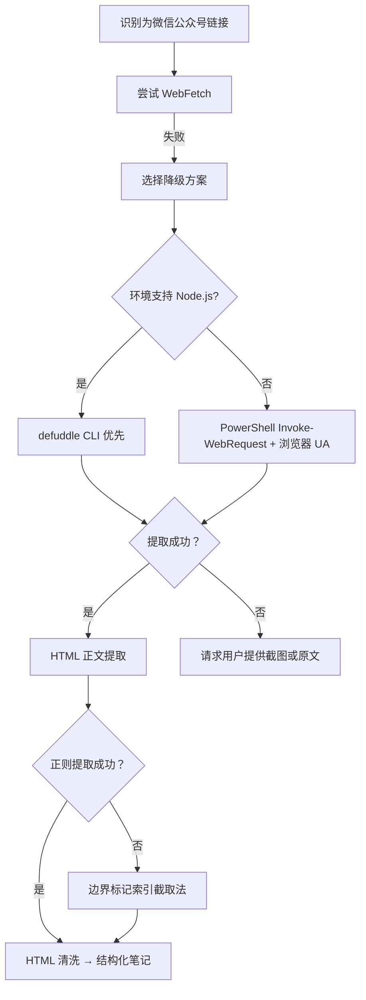

# 洞察萃取

## 洞察概览

从 Claude Tag 文章学习中萃取了 **5 项核心洞察** 和 **2 条规律认知**。核心洞察聚焦于 Claude Tag 区别于传统 AI 助手的根本范式转变——团队共享上下文、主动介入、异步执行、企业统一入口、权限隔离。规律认知则提炼出卡帕西的 LLM 三次变革论断与本次任务中验证的外部内容获取工具链决策模型。

## 核心洞察

| 洞察 ID | 洞察名称 | 核心概念 | 成熟度 |
|---------|---------|---------|--------|
| INS-001 | 团队共享 AI 同事模式 | 从个人独占聊天窗口到频道共享同一 Claude，张三布置李四接力 | L1 |
| INS-002 | Ambient Mode 主动介入范式 | AI 从被动响应到主动冒出，提醒被忽视讨论/跟进未解决问题/标记决策事项 | L1 |
| INS-003 | 异步执行 Agent 化 | 用户离开后 Claude 自行安排计划并主动汇报，类似真 Agent | L1 |
| INS-004 | 企业统一入口战略 | 人找 Claude，Claude 调度 GitHub/Jira/Linear/CRM，争夺难以显式记录的组织知识 | L2 |
| INS-005 | 权限隔离的多 Claude 身份 | 销售/工程团队 Claude 互不可见，记忆与权限隔离 | L2 |

### 洞察详情

#### INS-001：团队共享 AI 同事模式

**核心概念**：传统 AI 助手服务个人，每个人各自维护聊天窗口与上下文；Claude Tag 让整个频道共享同一个 Claude，所有成员围绕同一上下文协作。张三布置任务后，李四进入频道可直接看到进展并接力推进，王五再加入时也能理解来龙去脉。

**支撑事实**：文章原文——"传统 AI 助手主要服务个人，每个人各自维护一个聊天窗口与上下文；Claude Tag 则是整个频道共享同一个 Claude，所有成员围绕同一个 Claude 协作"。

**与 SpecWeave 的关联**：SpecWeave 的 orchestrator / architect / developer / reviewer / tester 多角色协作体系与 Claude Tag 团队共享 AI 同事的理念相通。Claude Tag 在 Slack 频道中"张三布置李四接力"的模式，可作为 SpecWeave 多角色交接协议（handoff）与协作场景（collaboration-scenarios）的外部参照案例，验证"共享上下文 + 角色分工"在企业级 AI 协作中的可行性。

**成熟度评估**：L1（Claude Tag 已被 Anthropic 自身实践验证 65% 代码参与，但作为可复用模式尚为概念映射，SpecWeave 内未独立实践验证）。

#### INS-002：Ambient Mode 主动介入范式

**核心概念**：开启 Ambient Mode 后，Claude 不再被动等待提问，而是主动冒出来——提醒被忽视的重要讨论、跟进长时间未解决的问题、标记需要决策的事项、发现相关信息后主动通知团队。

**支撑事实**：文章原文——"Ambient Mode（主动介入模式）：开启后 Claude 不再被动等待提问，而是主动提醒重要讨论、跟进未解决问题、标记决策事项、主动通知相关信息"。

**与 SpecWeave 的关联**：与 SpecWeave 的阶段守卫（stage-guardrails）、自我洞察（self-insight）模块在设计哲学上呼应。Claude Tag "主动提醒被忽视的讨论、跟进未解决问题、标记需决策事项"的能力，可作为 SpecWeave 阶段守卫日志（SG-LOG）异常检测与自我洞察模块的产品化参照——从被动响应（用户提问）升级为主动介入（系统主动暴露异常与遗漏）。

**成熟度评估**：L1（Claude Tag 已商用，但 SpecWeave 阶段守卫已有部分实践基础，作为 SpecWeave 可借鉴的产品化形态尚需本地化适配与验证）。

#### INS-003：异步执行 Agent 化

**核心概念**：用户布置任务后可离开 Slack，Claude 自行安排执行计划、持续推进项目，完成后主动回来 @ 用户汇报结果，类似一个真正的 Agent。这是从"工具"到"协作者"的本质跃迁。

**支撑事实**：文章原文——"用户布置任务后可离开 Slack，Claude 自行安排执行计划、持续推进项目，完成后主动回来 @ 用户汇报结果，类似一个真正的 Agent"。

**与 SpecWeave 的关联**：与 SpecWeave 自我演进模块（self-evolution / self-iteration / self-verification）的设计哲学相互呼应，均探索让 AI 系统独立、持续地参与工作。SpecWeave 的自我迭代（self-iteration）与自我验证（self-verification）模块可借鉴 Claude Tag 的"布置后离开、完成后主动汇报"交互模式，将 Agent 工作流的执行从同步阻塞改为异步推送。

**成熟度评估**：L1（Claude Tag 已商用，SpecWeave 自我演进模块已规划但尚未完全实践，作为本地化模式尚需验证）。

#### INS-004：企业统一入口战略

**核心概念**：Claude Tag 已不再是聊天机器人，而是企业内部统一入口——人找 Claude，Claude 再去调度 GitHub、Jira、Linear、数据库、CRM 等系统。未来员工可能只需记住一个名字 `@Claude`，不再需要记住几十个企业软件入口。

**支撑事实**：文章原文——"Claude Tag 已不只是聊天机器人，而是企业内部统一入口：人找 Claude，Claude 再去调度 GitHub、Jira、Linear、数据库、CRM 等系统"；并指出本质是"争夺企业内部那些难以显式记录却真实存在的组织知识"，与微软 Graph/Copilot、Snowflake/Databricks、Glean 竞争方向一致。

**与 SpecWeave 的关联**：属产业级判断，非直接技术映射。该洞察揭示出"组织知识统一入口"是当前企业 AI 竞争的新焦点，可为 SpecWeave 在产品定位与扩展方向上提供外部参照——SpecWeave 当前聚焦开发协作场景，未来可思考是否扩展为更广泛的"团队知识底座"角色。

**成熟度评估**：L2（多家厂商共同验证的产业级判断，已成行业共识方向）。

#### INS-005：权限隔离的多 Claude 身份

**核心概念**：不同团队使用不同 Claude 身份，销售团队的 Claude 不会记住工程团队信息，工程团队也无法访问销售数据与工具，记忆与权限严格隔离。管理员可设置组织级和频道级 Token 预算，查看 Claude 全部操作记录及每项任务发起人。

**支撑事实**：文章原文——"通过不同 Claude 身份实现权限隔离，销售团队与工程团队的 Claude 互不可见"；"管理员可设置组织级和频道级 Token 预算，查看 Claude 全部操作记录与每项任务发起人"。

**与 SpecWeave 的关联**：与 SpecWeave 角色权限边界（capability-boundaries）与团队管理（team-admin）机制直接呼应。SpecWeave 已实践"开发者不擅自变更架构决策""测试工程师不负责生产环境部署""团队管理员不越权管理其他团队"等边界规则，Claude Tag 的"Claude 身份权限隔离"提供了产业级产品化参照，可强化 SpecWeave 角色权限体系的边界严格性。

**成熟度评估**：L2（Claude Tag 已商用，SpecWeave 角色权限边界已实践，产业级与本地化双重验证）。

## 规律认知

| 规律 ID | 规律名称 | 核心概念 | 成熟度 |
|---------|---------|---------|--------|
| LAW-001 | LLM 用户界面三次变革论断 | 卡帕西：网页聊天 → 桌面应用 → 独立持续运行系统 | L2 |
| LAW-002 | 外部内容获取工具链决策模型 | WebFetch 盲区 → Invoke-WebRequest+UA / defuddle CLI 二选一 → 正则兜底索引截取 | L2 |

### 规律详情

#### LAW-001：LLM 用户界面三次变革论断

**核心概念**：卡帕西在 Claude Tag 发布后提出的论断——LLM 用户界面经历了三次重大变革：(1) 网页版聊天；(2) 桌面应用；(3) LLM 变成一个独立、持续运行的系统，拥有组织内的工具和上下文，能与人类团队协同工作。Claude Tag 被视为第三次变革的代表产物。

**支撑事实**：文章原文引用卡帕西观点——"第一次是网页版聊天，第二次是桌面应用，第三次是 LLM 变成独立、持续运行的系统，拥有组织内的工具和上下文，能与人类团队协同工作"。

**与 SpecWeave 的关联**：属通用规律，揭示 AI 系统演进的长期方向。SpecWeave 的多智能体协作体系、自我演进模块、阶段守卫机制均处于"第三次变革"——独立、持续运行的 AI 协作系统——这一方向上，可作为 SpecWeave 长期演进路径的外部理论支撑。

**成熟度评估**：L2（卡帕西提出，已成行业共识性论断，多个产品方向印证）。

#### LAW-002：外部内容获取工具链决策模型

**核心概念**：微信公众号等反爬机制严格的页面，WebFetch 通常失效。应对策略形成稳定的决策模型：

**支撑事实**：本次任务（claude-tag-article）采用 `Invoke-WebRequest + 浏览器 UA + 索引截取法`成功；ian-xiaohei 先例采用 `defuddle CLI` 成功。两条路径互为兜底，覆盖不同环境约束。

**与 SpecWeave 的关联**：方法论规律，可直接指导后续同类任务。该模型已在两轮独立实践中得到验证，可作为 SpecWeave 处理外部内容获取任务的稳定决策依据。

**成熟度评估**：L2（两轮独立实践验证——ian-xiaohei defuddle 路径与 claude-tag Invoke-WebRequest 路径，互为印证与互补）。

## 洞察落地情况（2026-07-03 更新）

> ✅ **5 项核心洞察中 2 项已萃取为可复用模式入库**，1 项规律认知已沉淀为操作指南。

### 洞察 → 模式落地映射

| 洞察 ID | 洞察名称 | 落地模式 | 成熟度 | 产出物 |
|---------|---------|---------|--------|--------|
| INS-001 | 团队共享 AI 同事模式 | team-shared-ai-colleague | L1 | [team-shared-ai-colleague.md](../../../patterns/methodology-patterns/ai-collaboration/team-shared-ai-colleague.md) ✅ 已入库 |
| INS-002 | Ambient Mode 主动介入范式 | ambient-proactive-agent | L1 | [ambient-proactive-agent.md](../../../patterns/methodology-patterns/ai-collaboration/ambient-proactive-agent.md) ✅ 已入库 |
| INS-003 | 异步执行 Agent 化 | — | — | 暂未独立萃取，理念已融入 ambient-proactive-agent 模式的"异步推进"规则 |
| INS-004 | 企业统一入口战略 | — | L2 | 产业级判断，作为 SpecWeave 长期演进方向参考，暂未独立萃取 |
| INS-005 | 权限隔离的多 Claude 身份 | — | L2 | SpecWeave 已有 capability-boundaries 实践，暂无需重复萃取 |

### 规律认知落地情况

| 规律 ID | 规律名称 | 落地形式 | 产出物 |
|---------|---------|---------|--------|
| LAW-001 | LLM 用户界面三次变革论断 | 理论参考 | 作为 SpecWeave 长期演进路径的外部理论支撑，未独立入库 |
| LAW-002 | 外部内容获取工具链决策模型 | 操作指南 | [wechat-mp-content-extraction.md](../../../../knowledge/operations/wechat-mp-content-extraction.md)（IMP-001 增强）+ [html-body-extraction.md](../../../../knowledge/operations/html-body-extraction.md)（IMP-002 新增）✅ 已入库 |

### 未落地洞察的后续方向

- **INS-003 异步执行 Agent 化**：待 SpecWeave 自我演进模块完整实践后，可结合实践经验独立萃取
- **INS-004 企业统一入口战略**：待 SpecWeave 扩展为更广泛的"团队知识底座"角色时再评估
- **INS-005 权限隔离**：SpecWeave 已有成熟的 capability-boundaries 实践，无需重复萃取

## 关联资源

- [学习笔记](../../../../knowledge/learning/claude-tag-article.md) — 源知识条目
- [执行复盘](execution-retrospective.md) — 任务执行过程与时间线
- [导出建议](export-suggestions.md) — 改进项与可萃取模式
- [方法论模式库](../../../patterns/methodology-patterns/README.md) — 可复用模式总索引
- [review-insight-export-loop.md](../../../patterns/methodology-patterns/retrospective-knowledge/review-insight-export-loop.md) — 复盘-洞察-导出闭环模式
- [team-shared-ai-colleague.md](../../../patterns/methodology-patterns/ai-collaboration/team-shared-ai-colleague.md) — INS-001 落地模式（L1）
- [ambient-proactive-agent.md](../../../patterns/methodology-patterns/ai-collaboration/ambient-proactive-agent.md) — INS-002 落地模式（L1）
- [wechat-mp-content-extraction.md](../../../../knowledge/operations/wechat-mp-content-extraction.md) — LAW-002 落地操作指南（IMP-001 增强）
- [html-body-extraction.md](../../../../knowledge/operations/html-body-extraction.md) — LAW-002 落地操作指南（IMP-002 新增）

## Changelog

<!-- changelog -->
- 2026-07-03 | update | 添加洞察落地情况章节反映 5 项洞察的落地映射；补充关联资源中新模式链接；版本升至 1.1
- 2026-06-29 | create | 初始创建洞察萃取（v1.0）
