# 执行过程复盘

## 一、实施过程回顾

### 1.1 任务时间线

```mermaid
flowchart LR
    A["用户请求/spec"] --> B["WebFetch失败<br/>反爬拦截"]
    B --> C["切换defuddle<br/>成功提取内容"]
    C --> D["阅读理解内容<br/>提取关键信息"]
    D --> E["创建Spec规划<br/>spec/tasks/checklist"]
    E --> F["原子化Wiki<br/>11章节+TOML"]
    F --> G["x-toml-ref<br/>路径错误"]
    G --> H["参照同层文件<br/>修正路径"]
    H --> I["更新README索引"]
    I --> J["验证质量"]
    J --> K["git提交首次失败<br/>暂存区不一致"]
    K --> L["手动git add<br/>提交成功a0091c65"]
    L --> M["任务完成"]
```

| 阶段 | 关键活动 | 结果 |
|------|---------|------|
| 内容获取 | WebFetch尝试→失败→defuddle提取 | 成功获取完整文章内容 |
| 内容理解 | 通读全文，提取Headroom核心概念、CCR机制、6种算法、4种接入方式 | 建立完整知识框架 |
| Spec规划 | 编写spec.md（PRD）、tasks.md（任务分解）、checklist.md（验证清单） | 15个任务分解，20个检查点 |
| 文档生产 | 创建索引页+11个原子章节+12个TOML元数据 | 28个文件，1691行 |
| 质量验证 | 文件名规范检查、内容抽查、路径验证 | 发现x-toml-ref路径错误并修正 |
| 提交归档 | git add→commit→验证 | a0091c65提交成功 |

### 1.2 关键节点分析

#### 节点1：WebFetch反爬拦截

- **决策依据**：WebFetch直接请求微信公众号URL返回失败
- **技术挑战**：微信公众号有较强的反爬虫机制，直接HTTP请求无法获取内容
- **解决方案**：立即切换到defuddle技能，使用`defuddle parse "URL" --md`命令成功提取干净的Markdown内容
- **经验**：微信公众号URL必须用defuddle，这是已知约束，本次再次验证

#### 节点2：x-toml-ref相对路径错误

- **决策依据**：初始计算路径层级错误，使用了`../.meta/...`
- **问题表现**：路径层级少算了两级
- **解决方案**：参照同目录下其他Wiki（如mopmonk-security-agent-wiki、longcat-agent-learning-wiki）的路径写法，修正为`../../../../.meta/...`
- **根因分析**：手动数相对路径层级容易出错，尤其是多级嵌套目录

#### 节点3：git-commit-utf8.py首次提交失败

- **决策依据**：直接传递文件列表给git-commit-utf8.py时，脚本检查暂存区一致性失败
- **问题表现**：`[FAIL] git add后暂存区文件与指定列表不一致`
- **解决方案**：先手动执行`git add <所有文件/目录>`，再不带文件参数调用git-commit-utf8.py提交
- **根因分析**：脚本在递归add目录时的暂存区检查逻辑与实际add行为存在不一致

## 二、成功经验

| 经验 | 支撑事实 |
|------|---------|
| **Spec Mode流程有效** | 先规划后执行，任务分解清晰（15个任务），20个检查点验证，无遗漏需求 |
| **复用现有结构** | 参照已有Wiki的原子化结构和TOML元数据格式，确保文档风格一致 |
| **快速工具切换** | WebFetch失败后立即切换defuddle，没有在失败工具上浪费时间 |
| **深度洞察萃取** | 不止于知识整理，萃取3个可复用设计模式，关联Harness Engineering体系 |
| **严格原子提交** | 显式指定文件列表，28个文件单一职责提交，提交信息说明"为什么" |

## 三、存在问题

| 问题 | 根因分析 | 影响评估 |
|------|---------|---------|
| x-toml-ref路径初始错误 | 手动计算相对路径层级容易出错 | 低：及时发现并修正，未导致提交失败 |
| git-commit-utf8.py递归add失败 | Windows平台下目录递归add与脚本暂存区检查逻辑不一致 | 低：通过手动add绕过，未影响最终提交 |
| 文件名检查报告已有文件违规 | 历史遗留文件（myst.yml.template扩展名不规范），非本次引入 | 无：识别为已有问题，不阻塞本次提交 |

## 四、产出物清单

### 4.1 知识文档（Markdown）

| 文件 | 行数 | 说明 |
|------|------|------|
| headroom-context-compression-wiki.md | 43 | 索引页，含导航表和学习路径建议 |
| 00-overview.md | 61 | 概述与学习目标、Token成本痛点 |
| 01-core-architecture.md | 79 | 核心架构与设计理念、中间层定位 |
| 02-compression-algorithms.md | 108 | 6种压缩算法详解、内容路由机制 |
| 03-ccr-mechanism.md | 98 | CCR可逆机制深度解析、冷热分层思想 |
| 04-integration-methods.md | 158 | 4种接入方式详解（Library/Proxy/Agent Wrap/MCP） |
| 05-performance-data.md | 85 | 性能数据：10144→1260 Token，87.6%压缩率 |
| 06-advanced-features.md | 105 | 跨Agent共享记忆、headroom learn自动学习 |
| 07-quick-start.md | 150 | 快速上手指南、环境要求、三步上手 |
| 08-insights-patterns.md | 126 | 深度洞察：3个设计模式、3大趋势、5条启示 |
| 09-faq-resources.md | 111 | FAQ、GitHub仓库、原文链接 |
| 10-summary.md | 107 | 总结、核心Takeaways、下一步建议 |
| **小计** | **1183** | 12个Markdown文件 |

### 4.2 元数据（TOML）

- 1个索引页TOML + 11个原子章节TOML = 12个TOML文件
- 每个TOML 7行，共84行元数据

### 4.3 Spec规划文档

| 文件 | 行数 | 说明 |
|------|------|------|
| spec.md | 118 | PRD产品需求文档 |
| tasks.md | 236 | 任务分解与优先级 |
| checklist.md | 20 | 验证检查清单 |
| **小计** | **374** | 3个Spec文件 |

### 4.4 知识库索引更新

- docs/knowledge/README.md：在learning分类表中新增Headroom Wiki条目

### 4.5 复盘报告（本次产出）

- README.md：复盘主入口
- execution-retrospective.md：执行过程复盘（本文件）
- insight-extraction.md：洞察萃取
- export-suggestions.md：导出建议

## 五、量化统计

| 指标 | 数值 |
|------|------|
| 总文件数 | 28（首次提交）+ 4（复盘报告）= 32 |
| 新增代码/文档行数 | 1691（首次提交）+ 复盘报告行数 |
| 原子章节数 | 11 |
| 可复用设计模式萃取 | 3个 |
| 行业趋势洞察 | 3个 |
| 开发者启示 | 5条 |
| 遇到并解决的问题 | 3个（反爬、路径错误、提交失败） |
| 工具切换次数 | 1次（WebFetch→defuddle） |
