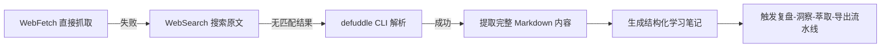
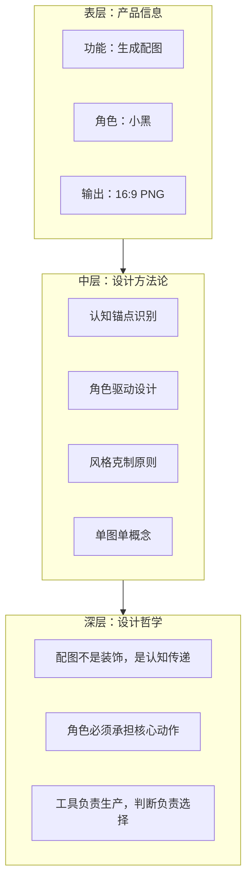

# 执行过程复盘

## 一、任务背景

用户提供了一篇微信公众号文章链接（`https://mp.weixin.qq.com/s/5Hwn3et9k-XtEATC-SDR6A`），要求学习该文章内容。文章介绍了一个名为 Ian Xiaohei Illustrations 的开源 AI Skill 项目，核心功能是为中文文章生成正文配图。

## 二、内容获取路径分析

### 2.1 获取策略演进

此次内容获取经历了一个"试错-切换-成功"的路径：

| 方法 | 结果 | 原因分析 |
|------|------|---------|
| WebFetch | 失败 | 微信公众号页面有反爬机制，WebFetch 无法解析 |
| WebSearch（文章 ID 搜索） | 无匹配 | 文章 ID 未被搜索引擎索引 |
| WebSearch（关键词搜索） | 无匹配 | 文章标题未知，无法构造有效搜索词 |
| defuddle CLI | 成功 | defuddle 对微信公众号页面有更好的解析能力 |

**关键经验**：微信公众号文章属于 WebFetch 的已知盲区。后续遇到同类链接，应**优先尝试 defuddle CLI**，避免 WebFetch 的无谓重试。

### 2.2 内容质量评估

| 维度 | 评分 | 说明 |
|------|------|------|
| 内容完整性 | ⭐⭐⭐⭐⭐ | 完整提取了标题、正文、图片 URL、项目链接 |
| 结构清晰度 | ⭐⭐⭐⭐⭐ | 文章天然分为项目介绍、角色设计、使用方式、原理、局限、结语六个部分 |
| 信息密度 | ⭐⭐⭐⭐ | 项目核心设计理念密集，技术实现细节较少（符合介绍文定位） |
| 可萃取价值 | ⭐⭐⭐⭐⭐ | 设计方法论、角色系统、产品思维均可萃取为通用模式 |

## 三、文章结构分析

### 3.1 章节概要

文章共包含以下核心内容模块：

| 章节 | 核心内容 | 设计价值 |
|------|---------|---------|
| 项目引入 | 23 天 5300+ Star，为中文文章生成正文配图 | 问题定义清晰：传统配图方式存在缺陷 |
| 核心理念 | 识别认知锚点，AI 把认知动作画出来 | 将"配图"从装饰升级为认知传递 |
| 角色系统 | 小黑（Xiaohei）五条设计原则 | 角色不是装饰，是系统运转的参与者 |
| 视觉风格 | 纯白背景、黑色手绘线稿、少量彩色批注 | 极度克制的视觉语言 |
| 使用模式 | 三种模式：规划/直接生成/单图生成 | 分层的用户路径设计 |
| 工作原理 | 分析文章→生成 shot list→每个锚点一张图 | 一张图只讲一个意思 |
| 使用方法 | clone + cp 到 Codex skills 目录 | 零配置开箱即用 |
| 局限性 | 仅中文文章、不适配商业插画、文字可能出错 | 诚实的边界声明 |
| 核心启发 | 工具负责生产，判断负责选择 | 文章中最有价值的哲学洞察 |

### 3.2 信息分层

## 四、执行流程回顾

| 步骤 | 操作 | 关键产出 |
|------|------|---------|
| T0 | 接收任务，识别为微信公众号文章学习 | 任务类型确认：外部内容学习 |
| T0+30s | WebFetch 尝试失败，切换 defuddle | 内容获取策略调整 |
| T0+2min | defuddle 成功提取完整文章内容 | 2200+ 字 Markdown 原文 |
| T0+5min | 按规范读取知识库与复盘体系索引 | 确定归档路径与报告结构 |
| T0+8min | 生成结构化学习笔记并保存 | `docs/knowledge/learning/05-ai-multimodal-content/ian-xiaohei-illustrations.md` |
| T0+10min | 用户触发复盘-洞察-萃取-导出流水线 | 四阶段报告生成 |
| T0+12min | 读取 retrospective.md / insight.md / export-report.md 规范 | 执行流程对齐 |
| T0+15min | 读取 DeerFlow 学习报告作为结构参考 | 四文件标准结构确认 |
| T0+25min | 生成 README + execution + insight + export 四文件 | 完整复盘报告 |

## 五、完成情况评估

| 评估项 | 结果 |
|--------|------|
| 文章完整阅读 | ✅ 全部 9 个章节覆盖 |
| 结构化笔记生成 | ✅ 九大章节 + 标签索引 |
| 四阶段报告生成 | ✅ README + 执行复盘 + 洞察萃取 + 导出建议 |
| 可复用模式萃取 | ✅ 5 个候选模式 |
| 知识库归档 | ✅ 学习笔记 + 复盘报告双归档 |
