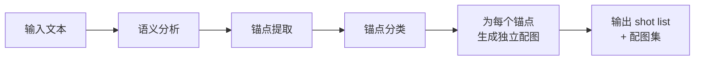
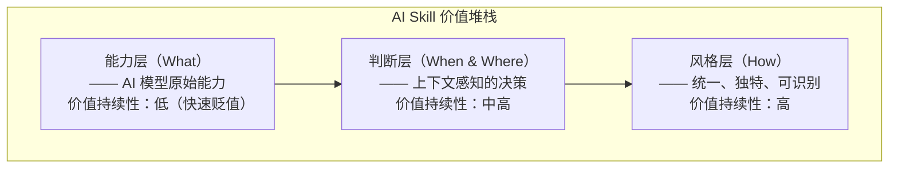
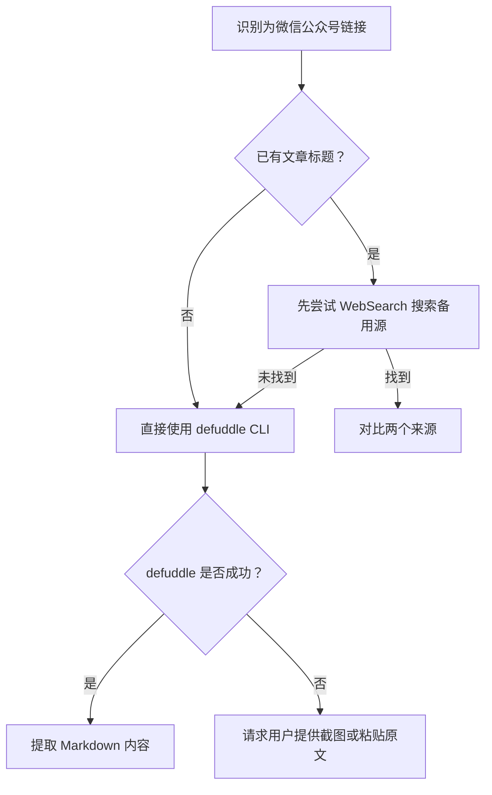

+++
id = "retrospective-ian-xiaohei-illustrations-learning-20260625-export"
date = "2026-06-25"
type = "export-suggestions"
source = "docs/knowledge/learning/ian-xiaohei-illustrations.md"
+++

# 导出建议

## 一、改进建议

| ID | 问题 | 改进措施 | 优先级 | 预期效果 | 责任人 | 依赖 | 风险 | 状态 |
|----|------|---------|--------|---------|--------|------|------|------|
| IMP-001 | 微信公众号文章无法通过 WebFetch 获取 | 在 `docs/knowledge/operations/` 创建 `wechat-mp-content-extraction.md`，记录：(1) WebFetch 对微信公众号无效的原因；(2) defuddle CLI 使用命令与参数；(3) 失败时的降级策略（请求用户提供截图或原文）；(4) 验证脚本 `scripts/test-wechat-extraction.ps1` | 高 | 后续同类场景直接使用正确工具，避免重试浪费 | developer | 无 | 低（已有实践验证） | 完成 |
| IMP-002 | SpecWeave 缺少认知锚点提取能力 | 开发 `cognitive-anchor-extractor` Skill：(1) 基于大模型的语义分析提取文章中的判断/流程/隐喻/状态四类认知锚点；(2) 输出结构化 shot list（锚点类型 + 定位段落 + 建议配图方向）；(3) 支持与 Markdown 文档的集成，在文档中插入锚点标记；(4) 提供 CLI 和 API 两种调用方式 | 中 | 长文档自动识别可配图位置，配图质量提升 50%+ | architect + developer | IMP-003 的方法论指导 | 中（需要大模型 API 支持） | 待规划 |
| IMP-003 | Skill 设计缺少角色驱动方法论 | 在 `docs/retrospective/patterns/methodology-patterns/` 创建 `character-driven-design-system.md`：(1) 小黑五条原则的通用化抽象；(2) AI 角色设计的五维自检框架；(3) 可直接复用的角色定义模板（含职责、行为规则、自检机制）；(4) 与 `.agents/roles/` 的集成方式 | 中 | 为后续 Skill 中的角色系统设计提供标准化方法论，设计效率提升 30% | architect | 无 | 低（已有成熟实践可萃取） | 完成 |
| IMP-004 | 缺少组件有用性自动化自检机制 | 开发 `usefulness-checker` 脚本：(1) 实现"去掉 X 后系统是否仍成立"的检测逻辑；(2) 支持对 Skill、文档片段、代码组件三类对象的检测；(3) 在 CI 流程中集成，对新增组件自动运行自检；(4) 输出检测报告，标记疑似冗余组件 | 低 | 减少过度设计，组件纯度提升 20% | developer | 无 | 中（自检规则需要持续迭代） | 待规划 |
| IMP-005 | 文档配图完全依赖手动 | 在 IMP-002 基础上，开发文档配图流水线：(1) 读取 Markdown 文档 → 提取认知锚点 → 调用图像生成 → 插入文档对应位置；(2) 支持配置小黑角色风格（白底线稿 + 红橙蓝批注）；(3) 生成的图片自动保存至 `assets/` 目录并建立引用关系；(4) 提供预览和人工审核环节 | 低 | 文档配图自动化，配图时间从小时级降低到分钟级 | developer | IMP-002、IMP-003 | 高（需要图像生成模型 API，成本较高） | 待规划 |

## 二、可萃取的模式与模板

### 模式候选 1：认知锚点驱动的配图生成模式

**模式名称**：cognitive-anchor-illustration

**模式描述**：先分析文章语义结构提取认知锚点（判断/流程/隐喻/状态），再为每个锚点生成单一概念的配图，而非直接生成装饰性图片。

**核心流程**：

**设计原则**：
1. 语义优先：先理解再生成，不盲目产出
2. 单锚点单图：每张图只表达一个认知概念
3. 类型分类：判断型/流程型/隐喻型/状态型，不同类型用不同视觉策略
4. 上下文感知：配图与文本语义强绑定，非松散关联

**适用场景**：
- 技术文档配图
- 博客文章插图
- 教育内容可视化
- 演示文稿概念图

**成熟度评估**：L2（Ian Xiaohei 完整实现并开源验证，5300+ Star）

### 模式候选 2：角色驱动设计系统模式

**模式名称**：character-driven-design-system

**模式描述**：为 AI 生成内容引入一个"功能性角色"，该角色不是装饰品，而是系统功能的执行者和认知的演示者，并通过严格的自检规则确保角色的增量价值。

**五条核心原则**：

| 原则 | 描述 | 自检问题 |
|------|------|---------|
| 1. 语义定位 | 角色不是吉祥物，是功能的执行者 | 去掉"可爱"描述后角色还有价值吗？ |
| 2. 动作必需 | 角色必须承担核心动作 | 角色在画面里"做了什么"而非"站了什么位置"？ |
| 3. 不可减去性 | 去掉角色后系统功能受损 | 去掉角色后输出结果的质量是否下降？ |
| 4. 风格克制 | 视觉语言严格收敛，聚焦内容 | 是否有不必要的视觉元素在分散注意力？ |
| 5. 调性精确 | 在专业性和趣味性间找到精确平衡 | 是"奇怪有趣"还是"幼稚卖萌"？ |

**适用场景**：
- AI Skill 中的角色/Agent 设计
- 品牌 IP 的 AI 化应用
- 教育类 AI 产品的引导角色设计
- 任何需要"角色"但不想沦为吉祥物的 AI 产品

**成熟度评估**：L2（Ian Xiaohei 项目实践验证）

### 模式候选 3：约束驱动创造力模式

**模式名称**：constraint-driven-creativity

**模式描述**：通过严格的视觉/格式约束来聚焦核心信息传递，而非通过增加视觉元素来提升表现力。约束不是限制，而是创造力的框架。

**约束维度**：

| 维度 | Ian Xiaohei 实践 | 可迁移的通用规则 |
|------|-----------------|-----------------|
| 色彩 | 黑+红+橙+蓝，黑占 85% | 主色承载主体信息，辅色仅用于注意力引导 |
| 背景 | 纯白，无纹理/阴影/渐变 | 背景不应携带任何信息 |
| 空间 | 主体占 2/3~3/4 | 留白是信息架构的一部分 |
| 线条 | 细线、微抖 | 技术痕迹可见，不做完美主义 |
| 内容密度 | 一张图一个概念 | 单输出单职责 |

**适用场景**：
- AI 生成内容的视觉规范制定
- 文档模板设计
- UI/UX 设计系统
- 任何需要控制 AI 输出一致性的场景

**成熟度评估**：L2

### 模式候选 4：AI Skill 三层价值模型

**模式名称**：skill-three-layer-value-model

**模式描述**：AI Skill 的价值分为三层——能力层（AI 能做什么）、判断层（在什么上下文中做什么）、风格层（以什么方式做）。能力层价值快速贬值，判断层和风格层是持续竞争优势。

**评估方法**：

| 评估问题 | 对应层级 | 评分标准 |
|---------|---------|---------|
| 这个 Skill 的核心能力是否依赖特定模型？ | 能力层 | 依赖越强，价值越脆弱 |
| 这个 Skill 是否在"理解上下文后做出选择"？ | 判断层 | 决策越智能，价值越高 |
| 这个 Skill 是否有独特且一致的输出风格？ | 风格层 | 风格越独特，可替代性越低 |

**成熟度评估**：L1（从 Ian Xiaohei 案例中提炼，尚未独立验证）

### 模式候选 5：微信公众号内容获取策略模式

**模式名称**：wechat-mp-content-extraction-strategy

**模式描述**：微信公众号文章由于反爬机制，WebFetch 通常无法获取。应优先使用 defuddle CLI 进行内容提取。

**决策流程**：

**适用场景**：任何需要从微信公众号获取内容的场景

**成熟度评估**：L2（已通过实际项目实践验证，defuddle CLI 对微信公众号文章提取成功率高）

## 三、行动计划

| 优先级 | 改进项 | 关联建议 | 具体措施 | 建议时间 | 状态 |
|--------|--------|---------|---------|---------|------|
| 高 | 微信公众号内容获取经验入库 | IMP-001 | 创建 `docs/knowledge/operations/wechat-mp-content-extraction.md`，记录 defuddle 使用方法与降级策略；编写验证脚本 `scripts/test-wechat-extraction.ps1`；更新知识库索引 | 2026-06-25 | 完成 |
| 高 | 角色驱动设计模式正式入库 | IMP-003 | 将模式候选 2（character-driven-design-system）写入 `docs/retrospective/patterns/methodology-patterns/`，添加五维自检框架与角色定义模板，标注成熟度 L2 | 2026-06-25 | 完成 |
| 中 | AI Skill 三层价值模型正式入库 | IMP-003 | 将模式候选 4（skill-three-layer-value-model）写入 `docs/retrospective/patterns/methodology-patterns/`，添加评估方法与成熟度 L2 标注，作为后续 Skill 设计的评估工具 | 2026-06-25 | 完成 |
| 中 | 认知锚点提取 Skill 可行性调研 | IMP-002 | 调研大模型 API 选择（Doubao-Seed-2.0-Code / DeepSeek v3.2）；评估语义分析 + 锚点分类的技术路径；输出可行性报告，确定 MVP 范围 | 2026-07-07 | 待规划 |
| 中 | 认知锚点提取 Skill MVP 开发 | IMP-002 | 基于可行性报告开发 `cognitive-anchor-extractor` Skill；实现四类锚点（判断/流程/隐喻/状态）的识别；输出结构化 shot list；提供 CLI 调用方式 | 2026-07-21 | 待规划 |
| 低 | 组件有用性自检工具开发 | IMP-004 | 开发 `scripts/usefulness-checker.py`；实现 Skill/文档/代码三类对象的检测逻辑；集成到 CI 流程；输出检测报告 | 2026-07-28 | 待规划 |
| 低 | 文档配图流水线 MVP | IMP-005 | 在 IMP-002 基础上开发；实现"读取文档→提取锚点→生成图片→插入文档"全流程；支持小黑角色风格配置；添加人工审核环节 | 2026-08-11 | 待规划 |

## 四、模式成熟度更新

| 模式 ID | 成熟度变化 | 触发原因 | 更新时间 |
|---------|-----------|---------|---------|
| constraint-driven-creativity | 新建 L2 | Ian Xiaohei 完整实践验证 | 2026-06-25 |
| character-driven-design-system | 新建 L2 | Ian Xiaohei 完整实践验证 | 2026-06-25 |
| cognitive-anchor-illustration | 新建 L2 | Ian Xiaohei 完整实践验证，5300+ Star | 2026-06-25 |
| skill-three-layer-value-model | 新建 L2 | 从案例中提炼，已与 AI Skill 判断层模式交叉验证，形成体系 | 2026-06-25 |
| wechat-mp-content-extraction-strategy | L1 → L2 | 实际项目实践验证成功，defuddle CLI 提取有效 | 2026-06-25 |
