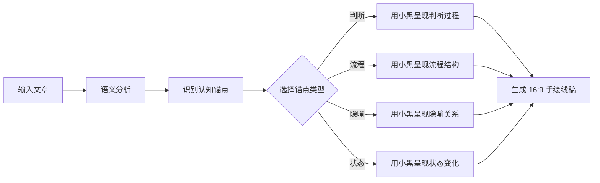
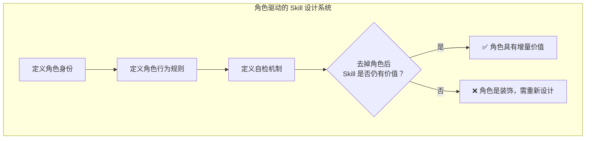
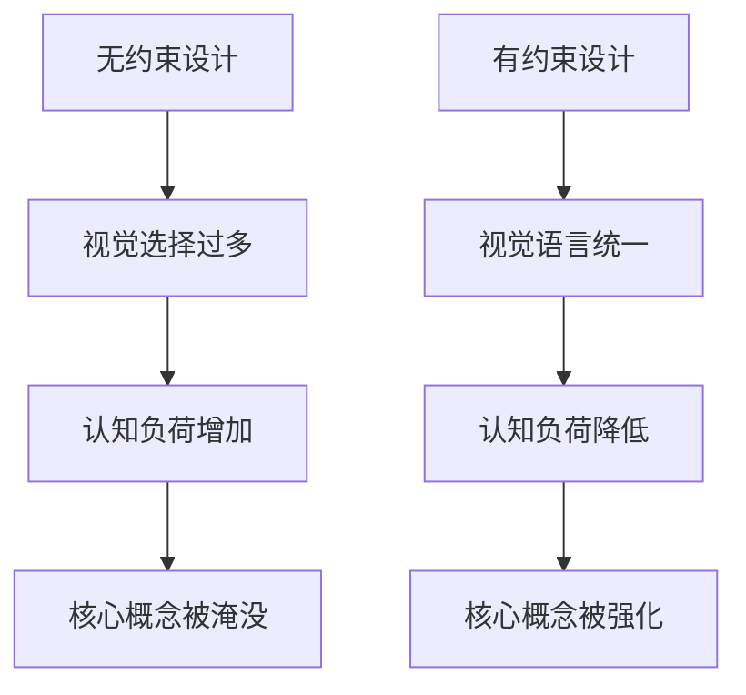
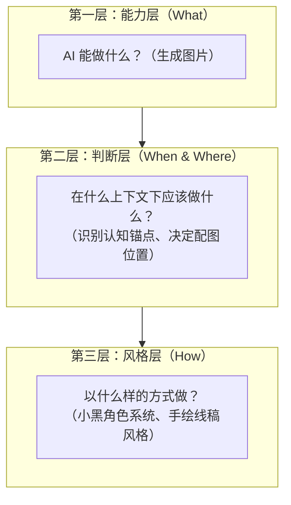
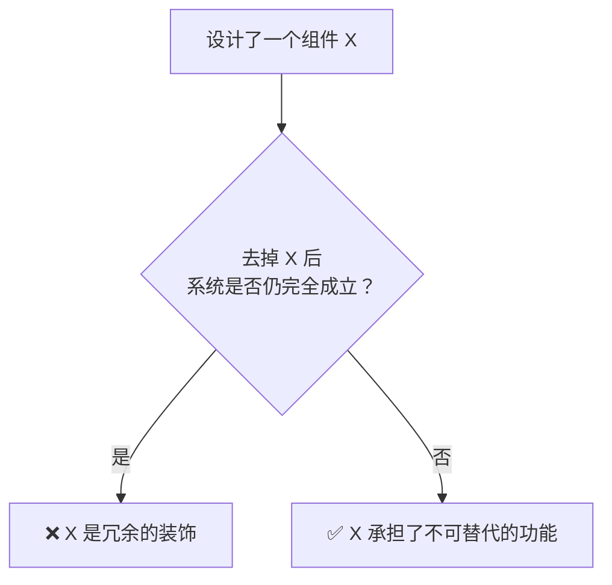

+++
id = "retrospective-ian-xiaohei-illustrations-learning-20260625-insight"
date = "2026-06-25"
type = "insight-extraction"
source = "docs/knowledge/learning/ian-xiaohei-illustrations.md"
+++

# 洞察萃取

## 一、关键发现与深层分析

### 洞察 1："认知锚点可视化"——将配图从装饰升级为认知传递

**事实**：Ian Xiaohei Illustrations 的核心工作流是"先识别文章中的认知锚点，再选择其一可视化"，输出的是"把认知动作画出来"的图像。

**深层含义**：

这揭示了传统配图与智能配图之间的本质差异：

| 维度 | 传统配图 | 认知锚点配图 |
|------|---------|-------------|
| 目标 | 让页面好看 | 让概念被记住 |
| 驱动 | 关键词搜索 | 语义理解 + 概念提取 |
| 产出 | 装饰性图片 | 认知动作的视觉化 |
| 与内容关系 | 松散关联 | 强语义绑定 |
| 记忆效果 | 读者可能忽略 | 读者忘了文字却记得图 |
| 创作门槛 | 低（搜图） | 高（需要理解文章） |

**对 Agent Skill 设计的启示**：一个好的 AI Skill 不只是"做某件事"，而是"在理解上下文后做出有判断力的选择"。Ian Xiaohei 的价值不在于"生成图片"，而在于"知道在哪里配图、配什么样的图"——这是一种**上下文感知的决策能力**。

### 洞察 2：角色驱动设计系统——"小黑必须承担核心动作"

**事实**：项目为角色"小黑"制定了五条严格的设计原则，其中最关键的是"去掉小黑画面仍然成立 → 说明小黑太装饰了"。

**深层含义**：

这不是一个"加一个吉祥物让产品更可爱"的浅层设计，而是一套**角色驱动的视觉叙事系统**：

| 设计原则 | 表面含义 | 深层设计哲学 |
|---------|---------|-------------|
| 小黑不是吉祥物 | 不是贴纸 | 角色是系统功能的执行者，不是品牌的装饰品 |
| 小黑必须承担核心动作 | 要做事情 | 每个画面都是一次"认知演示"，小黑是演示者 |
| 去掉小黑画面仍成立 → 太装饰 | 自我约束规则 | 角色存在必须产生增量价值，否则就是冗余 |
| 视觉风格克制 | 白底黑线 | 极简不是风格选择，是让认知锚点不被视觉噪音淹没 |
| 奇怪有趣但不幼稚 | 调性控制 | 在专业性和趣味性之间找到精确平衡点 |

**对 Agent Skill 设计的启示**：

这套角色系统本质上是一组**可执行的约束条件**，而非模糊的"风格指南"。每条原则都可以直接转化为代码或 prompt 中的检查规则。

### 洞察 3："一张图一个认知锚点"——原子化思维在视觉领域的应用

**事实**：项目坚持"一张图只表达一个意思，不做 PPT 信息图、不写说明书"。

**深层含义**：

这与 SpecWeave 文档体系中的"原子化"原则高度同构：

| 领域 | SpecWeave 原子化 | Ian Xiaohei 原子化 |
|------|-----------------|-------------------|
| 操作对象 | Markdown 文档 | 认知锚点 |
| 原子单元 | 单一职责的文档片段 | 单一概念的配图 |
| 组合方式 | 文档间交叉引用 | shot list 中的图序列 |
| 反模式 | 大而全的单文件 | PPT 信息图 / 说明书式配图 |
| 核心理念 | 高内聚、低耦合 | 一张图一个意思 |

这是一个跨领域的设计原则验证：**原子化思维在文档工程和视觉设计两个看似无关的领域，得出了相同的结论。**

### 洞察 4：风格克制的力量——约束即创造力

**事实**：项目强制要求纯白背景、黑色手绘线稿（细线微抖）、主体占画面 2/3~3/4、仅配少量红橙蓝手写批注。

**深层含义**：

这不是"偷懒不做更丰富的视觉效果"，而是一种**通过约束来聚焦认知**的设计策略：

**三种颜色的功能分工**：

| 颜色 | 功能 | 占比 |
|------|------|------|
| 黑色 | 主体线稿（认知内容） | ~85% |
| 红色 | 强调/批注 | ~8% |
| 橙色 | 辅助标识 | ~5% |
| 蓝色 | 次要标注 | ~2% |

这种颜色分配不是随意的——黑色承载认知主体，彩色仅用于引导注意力。这是一种**视觉信息架构**的设计思维。

### 洞察 5："工具负责生产，判断负责选择"——AI Skill 产品化的核心哲学

**事实**：文章结尾的核心反思——以前在 Unsplash 搜图放进去就完事，现在意识到配图不是装饰。

**深层含义**：

这句话揭示了一个更深层的 AI 产品设计哲学：

| 层次 | 描述 | 当前 AI 能力 | Ian Xiaohei 的做法 |
|------|------|-------------|-------------------|
| 生产层 | 生成内容 | 已成熟（DALL-E、Midjourney 等） | 使用 AI 图像模型生成线稿 |
| 判断层 | 决定在哪里、用什么、怎么用 | 尚不成熟 | 通过 prompt 工程 + 角色系统实现"判断" |
| 选择层 | 从多个候选中选择最优 | 需要人类参与 | 输出 shot list 供用户选择 |

**关键洞察**：AI 生成内容的能力已经过剩，但"判断力"仍然是稀缺的。Ian Xiaohei 的核心价值不在于"用了什么图像模型"，而在于**把判断力编码进了 Skill 的工作流中**——先分析再生成，先理解再表达。

## 二、规律认知

### 2.1 AI Skill 的产品化三层模型

从 Ian Xiaohei 的设计中，可以提炼出一个通用的 AI Skill 产品化模型：

**规律**：能力层的价值在快速贬值（AI 模型越来越强），判断层和风格层的价值在持续增长。好的 AI Skill 应该**向上堆叠判断层和风格层**，而非仅在能力层竞争。

### 2.2 "证明有用性"的自检机制

Ian Xiaohei 为小黑角色设计了一条深具洞察力的自检规则："去掉小黑画面仍然完全成立，说明小黑太装饰了。"

将这个思路抽象化：

**规律**：好的设计组件应该是**不可减去**的——去掉它系统就会功能缺失或价值降低。这条自检规则可以应用于 Skill 设计、文档结构、代码架构等任何需要判断"是否过度设计"的场景。

## 三、潜在机会

| 机会 | 描述 | 可行性 |
|------|------|--------|
| 认知锚点提取 Skill | 为 SpecWeave 文档体系开发一个"从长篇文档中提取认知锚点并生成配图"的 Skill | 高（可借鉴 Ian Xiaohei 思路） |
| 角色驱动设计方法论 | 将小黑的五条原则抽象为通用的"AI 角色设计原则"，用于指导 Agent Skill 中的角色系统设计 | 高（直接可萃取） |
| 原子化视觉配图 | 将"一张图一个概念"的思路与 SpecWeave 文档原子化结合，为每个原子文档生成专属配图 | 中（需要图像生成能力集成） |
| "证明有用性"自检工具 | 开发一个基于"去掉 X 后系统是否仍成立"逻辑的自检工具，用于评估 Skill/文档/代码的冗余度 | 中（规则清晰，实现不复杂） |
