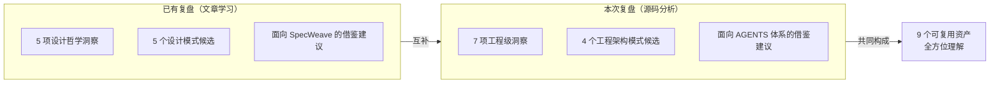

# Ian Xiaohei Illustrations 仓库源码深度分析 — 综合报告

> **分析对象**：`d:\AI\.temp\skills` —— Ian Xiaohei Illustrations 开源仓库完整源码（35 个文件）
> **复盘日期**：2026-06-25
> **分析类型**：仓库源码级结构化复盘（区别于此前基于微信公众号文章的概念性学习复盘）
> **报告类型**：复盘-洞察-萃取-导出 四阶段综合报告

---

## 分析背景

此前已于 2026-06-25 完成一次基于微信公众号文章的项目学习复盘（`retrospective-ian-xiaohei-illustrations-learning-20260625/`），聚焦于设计哲学与产品理念层面。此次用户将仓库完整源码克隆至 `d:\AI\.temp\skills`，要求执行**源码级**的四阶段分析。

## 核心发现摘要

| 维度 | 核心发现 |
|------|---------|
| 仓库架构 | 采用「双层仓库」模式：根目录面向 GitHub 人类读者，Skill 子目录面向 AI Agent 运行时 |
| 信息架构 | 5 个 references 按职责原子化拆分，Agent 按任务阶段按需加载，避免上下文浪费 |
| 创意生成 | 可编程的「隐喻转换三步骤」将创意生成变成结构化算法 |
| Agent 约束 | 四维约束模型：任务 → 流程 → 产出 → **行为（输出口径）** |
| 质量保证 | 症状-处方式 QA 系统，Agent 可自主完成故障诊断闭环 |
| 语言策略 | 中英双语分层：中文给 Agent 理解，英文给图像模型执行 |
| 反熵机制 | 反复刻规则分离控制风格一致性（正向约束）与创意多样性（负向约束） |

## 子模块导航

| 章节 | 说明 | 入口 |
|------|------|------|
| 执行复盘 | 仓库结构全景分析、6 个核心文件逐一剖析、工程实践评估、与已有复盘的差异对比 | [execution-retrospective.md](execution-retrospective.md) |
| 洞察萃取 | 7 项工程级核心洞察、4 个新增可萃取模式、2 条规律认知 | [insight-extraction.md](insight-extraction.md) |
| 导出建议 | 面向该仓库的 4 条改进建议、面向 AGENTS 体系的 5 条借鉴建议、4 个候选模式入库与行动规划 | [export-suggestions.md](export-suggestions.md) |

## 与已有复盘的互补关系

## 关联报告

- [retrospective-ian-xiaohei-illustrations-learning-20260625/](../retrospective-ian-xiaohei-illustrations-learning-20260625/) — 基于微信公众号文章的项目学习复盘（设计哲学层）
- [review-insight-export-loop.md](../../../../retrospective/patterns/methodology-patterns/retrospective-knowledge/review-insight-export-loop.md) — 复盘-洞察-导出闭环模式
- [prompt-extraction.md](../../../../retrospective/prompt-extraction.md) — 提示词工程可迁移模式
- [character-driven-design-system.md](../../../../retrospective/patterns/methodology-patterns/creative-design/character-driven-design-system.md) — 角色驱动设计系统模式

---

> **报告编制**：本报告基于 `d:\AI\.temp\skills` 仓库全部 35 个文件的逐文件分析生成，覆盖 Skill 定义、参考文档、Agent 配置、样例资源、开源合规、工程实践六个维度。报告遵循「事实 → 分析 → 洞察 → 建议」的四层逻辑结构。
