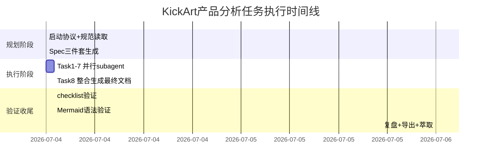

# KickArt产品分析执行过程复盘

## 1. 任务基本信息

| 项 | 内容 |
|---|---|
| 任务来源 | 用户 /spec 指令 |
| 任务目标 | 火山引擎KickArt产品网页系统性学习与深度洞察分析 |
| 执行模式 | Spec模式（规划→分解→subagent执行→整合→验证） |
| Spec目录 | `.trae/specs/retrospectives-insights/volcengine-kickart-product-analysis/` |
| 最终产出 | `docs/knowledge/learning/volcengine-kickart-marketing-creation-analysis.md` |
| 产出大小 | 约650行，11章节，3张Mermaid图，63个术语 |

## 2. 执行时间线

## 3. 量化统计

### 3.1 任务分解统计

| 维度 | 数值 |
|---|---|
| 总子任务数 | 8个 |
| 高优先级任务 | 5个（Task1-4, Task8） |
| 中优先级任务 | 3个（Task5-7） |
| Subagent任务数 | 7个（Task1-7） |
| 主agent整合任务 | 1个（Task8） |
| 任务依赖链 | Task1-7并行 → Task8串行整合 |

### 3.2 产出物统计

| 产出物 | 数量 | 说明 |
|---|---|---|
| Spec规划文档 | 3个 | spec.md / tasks.md / checklist.md |
| Subagent临时片段 | 7个 | 各子任务分析结果 |
| 最终学习笔记 | 1个 | 整合后的完整wiki文档 |
| Mermaid图表 | 3张 | 能力架构图/场景适配图/信息架构图 |
| 章节数 | 11个 | 产品概述/能力/场景/架构/UX/洞察/术语等 |
| 表格数 | 8个 | 能力矩阵/场景映射/术语表/链接表等 |
| 术语条目 | 63个 | 三大类专业术语 |
| 外部资源链接 | 23个 | 产品入口/文档/控制台等 |

## 4. 成功因素分析

### 4.1 Spec模式前置规划的有效性

本次任务严格遵循Spec模式工作流，在执行前完成了完整的spec.md（需求定义）、tasks.md（8个原子任务分解）、checklist.md（26项验收标准）。前置规划的价值体现在：

- **任务边界清晰**：每个subagent有明确的"完成定义"，避免了分析范围的无限扩张
- **依赖关系合理**：Task1-7设计为可并行执行，Task8作为整合任务依赖所有前置任务，最大化了并行效率
- **验收标准可量化**：checklist中每项都有明确的判断标准，避免了"感觉差不多"的模糊验收

### 4.2 分而治之+最终整合的策略

将复杂的网页分析任务拆分为7个独立分析维度（产品定位、6大能力、4大场景、UX架构、UX评估、亮点提炼、术语整理），由subagent并行执行，最后由主agent统一整合。这种策略的优势：

- **分析深度**：每个维度可以深入挖掘，不会因为信息过载而浅尝辄止
- **视角全面**：避免单一视角的盲区，覆盖产品功能、技术架构、UX设计、行业洞察多个层面
- **整合增值**：最终整合阶段不是简单拼接，而是补充了跨维度的关联分析（如场景-能力映射矩阵、能力协同工作流）

### 4.3 Web内容提取的问题自纠正

Task2执行中发现WebFetch首次提取的能力名称存在偏差（与官方术语不一致），subagent主动通过查阅官方文档进行了纠正，确保了信息准确性。这体现了subagent的验证意识。

### 4.4 参考既有wiki格式保持一致性

在生成最终文档前，参考了项目中已有的`audiox-turbo`学习wiki格式，确保了新文档与现有知识库风格一致，包括frontmatter格式、章节结构、术语表组织方式等。

## 5. 问题与改进空间

### 5.1 临时文件未规范管理

**问题**：7个subagent生成的临时分析片段散落在多个位置（部分在`.trae/specs/`目录下，部分在`.temp/`目录），任务完成后未及时清理，造成文件系统杂乱。

**根因**：Spec模式下对subagent临时产出的存放位置没有统一约定，主agent整合完成后也缺少清理步骤。

**改进建议**：在tasks.md中明确subagent临时文件的存放规范（统一放在spec目录下的`temp/`子目录），并在Task8整合完成后增加清理临时文件的test requirement。

### 5.2 Mermaid图表验证未自动化

**问题**：3张Mermaid图表的语法正确性是通过人工检查确认的，没有运行mermaid-cmd进行自动化验证。

**根因**：checklist中只写了"Mermaid图表语法正确可正常渲染"，但没有明确指定使用mermaid-cmd进行自动化检查，导致人工验证不够严谨。

**改进建议**：后续涉及Mermaid的任务，在checklist中明确要求"运行mermaid-cmd安全检查脚本验证所有图表语法"。

### 5.3 网页内容重复未提前识别

**问题**：WebFetch提取的网页内容存在大量重复模块（同一内容展示了3次），在分析过程中才发现并做了去重处理，增加了subagent的处理成本。

**根因**：现代营销网页采用单页滚动设计，同一能力模块可能在页面不同位置以不同形式重复出现（首屏预览、详情区、底部CTA前回顾），WebFetch线性提取会导致内容重复。

**改进建议**：网页提取类任务在spec中增加"内容去重"提示，建议subagent先对提取内容做模块识别和去重再进行分析。

### 5.4 链接验证环节缺失

**问题**：学习笔记中包含23个外部资源链接，但未运行link-check-cmd进行链接有效性验证。

**根因**：专注于内容分析和整合，收尾阶段遗漏了链接验证步骤。

**改进建议**：在Task8的test requirements中明确增加"运行link-check-cmd验证所有链接可达性"。

### 5.5 未进行实际产品体验验证

**问题**：所有分析基于网页宣传内容，未实际注册/登录产品体验真实功能，无法验证网页宣传与实际产品的一致性。

**根因**：任务范围限定为"网页内容分析"，未要求实际产品体验；且火山引擎产品可能需要企业认证才能使用。

**说明**：这属于任务范围界定问题，不是执行缺陷，但作为深度洞察分析，纯网页分析存在信息局限性。后续若有产品访问权限，可补充实际体验验证。

## 6. 经验教训

### 6.1 Spec模式八任务分解粒度是合适的

本次将网页分析任务拆分为8个子任务（7个并行分析+1个整合）的粒度是合适的，既保证了每个维度的分析深度，又没有因为过度拆分导致整合成本过高。7个并行任务的执行效率显著高于串行执行。

### 6.2 外部信息源需要三源验证

本次Task2发现WebFetch提取的信息有偏差，通过交叉查阅官方文档得到了纠正。这验证了"三源验证法"在外部信息分析中的重要性——单一信息源（尤其是营销页面）可能存在表述模糊或不精确的问题，需要交叉验证。

### 6.3 视觉化图表显著提升理解效率

3张Mermaid图（产品能力分层架构、场景-能力适配矩阵、网页信息架构）将复杂的关系网络可视化，比纯文字描述的信息密度和可读性高很多。在产品分析类任务中，架构图和矩阵图是值得坚持的标准产出。

### 6.4 术语表是高价值附加产出

63个术语的分类术语表（营销创作/AI视频/电商运营）看似是"附加项"，但实际上为后续跨领域知识复用提供了基础——非电商背景的读者可以通过术语表快速理解行业黑话，降低了知识获取门槛。

## 7. 可复用经验

| 经验 | 适用场景 |
|---|---|
| N个并行分析维度+1个最终整合的任务拆分模式 | 所有需要多角度深度分析的调研类任务 |
| frontmatter+结构化章节+图表+术语表的wiki格式 | 外部产品/技术学习类文档 |
| 场景-能力映射矩阵分析方法 | SaaS产品功能架构分析 |
| AIDA漏斗模型分析营销网页转化设计 | 产品着陆页UX分析 |
| 四层架构（输入→处理→风控→输出）分析闭环产品 | 全链路型平台产品分析 |
