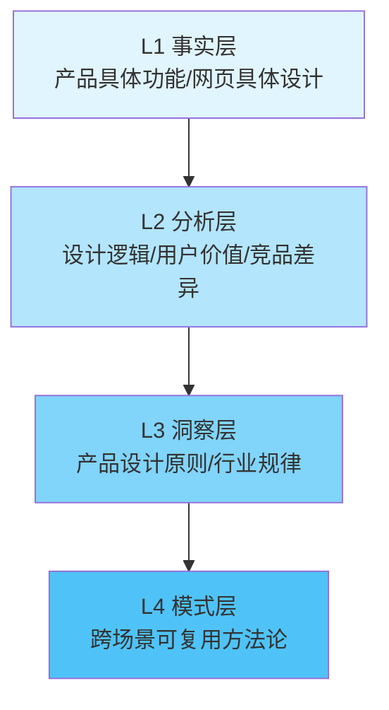

# KickArt产品分析洞察萃取

## 洞察萃取方法论：四层漏斗模型

本次洞察萃取严格遵循"萃取四层漏斗"方法论，从具体事实逐层抽象到可复用模式：

---

## 一、产品设计洞察（7条核心洞察）

### 洞察1：垂直场景深耕 > 通用能力竞赛

**L1事实**：KickArt不与即梦、可灵等通用视频生成工具比拼生成质量和风格多样性，而是聚焦电商营销场景，将"爆款裂变""投前预审""商品卡挂载""多平台一键分发"等电商专属能力作为核心卖点。链接输入一键成片不仅提取商品卖点，还自动提取目标受众信息；故事线生成自动匹配好物分享、剧情带货等营销类型——这些都是通用视频生成工具不会做的垂直领域know-how。

**L2分析**：通用AI视频生成赛道已进入红海，参数规模、生成时长、分辨率等通用指标的边际效益快速递减。而垂直场景的know-how（什么内容能过审、什么结构容易爆、各平台规格差异、目标受众是谁、什么营销类型适合什么商品）是通用模型无法通过堆参数获得的，构成真正的竞争壁垒。

**L3洞察**：AI应用层产品的竞争已从"模型能力竞赛"进入"场景解决方案竞赛"阶段。垂直场景的深度价值密度远高于通用能力的广度覆盖。判断一个AI产品是否有真正壁垒，不是看它用了什么模型，而是看它在特定场景中沉淀了多少行业know-how——从卖点提炼到受众定位，从内容类型匹配到平台规则适配，每一个垂直细节都是壁垒。

**L4模式**：**垂直场景AI产品三要素** = 行业专属功能 + 场景化工作流 + 领域合规风控

**验证度**：高（已被火山引擎、WPS Comate、多个SaaS产品验证）
**复用场景**：所有AI应用层产品设计，尤其是面向B端的垂直SaaS

---

### 洞察2：全链路闭环 > 单点工具 brilliance

**L1事实**：KickArt覆盖"创意策划→视频生成→智能剪辑→合规预审→多平台分发"完整链路，每个环节都有对应功能模块，而不是只做视频生成这一个环节。

**L2分析**：电商商家的痛点不是"生成不出视频"，而是"生成的视频不能直接用"——需要自己剪、自己审、自己改尺寸、自己一个个平台发。单点工具虽然在单个环节做到极致，但用户需要在多个工具间切换，数据和工作流断裂，整体效率反而更低。全链路闭环虽然单个环节可能不是最强，但端到端的整体效率和体验远优于拼凑的工具栈。

**L3洞察**：B端SaaS产品的核心竞争力往往不是单点功能的极致，而是端到端工作流的顺畅。"闭环"的价值在于消除环节间的摩擦成本，让用户"做完一件事"而不是"使用多个功能"。判断产品成熟度的一个标志是：用户是否需要跳出产品去完成最后一公里。

**L4模式**：**闭环产品设计原则** = 工作流起点到终点的完整覆盖 + 环节间数据自动流转 + 消除用户手动拼接成本

**验证度**：高（符合SaaS产品设计经典原则）
**复用场景**：B端SaaS产品设计、企业级工具、生产力平台

---

### 洞察3：风控前置 = 从成本中心到价值中心

**L1事实**：KickArt将"投前预审"作为六大核心能力之一，在生成阶段就嵌入各平台审核规则预检，而不是等视频生成完、投出去被拒了再修改。同样体现"前置"思维的还有素材理解阶段——AI不仅自动提炼卖点、识别主体，还会**评估图片质量并给出优化建议**，同时支持手动补充调整，在创作入口就把好质量关。

**L2分析**：传统认知中"合规审核"是成本中心——它不创造价值，只是避免损失。但在营销创作场景中，"视频能发出去"是前置条件——生成得再好，过不了审等于零。将审核能力前置到创作过程中，实时提示违规风险并自动修正，实际上是把"事后返工成本"变成了"事前预防价值"，从成本中心变成了价值中心。这一"前置反馈"思路同样适用于质量控制：与其生成完发现素材质量差导致视频效果不好，不如在素材入口就给出质量评估和优化建议。

**L3洞察**：在高监管/高合规要求的场景中，风控不应该是流程末端的"守门员"，而应该是嵌入创作全过程的"副驾驶"。最好的合规是让用户感觉不到合规的存在——系统自动帮你规避了风险，而不是生成完了告诉你不行。这一"副驾驶"模式可以从合规延伸到质量、效果等多个维度——在创作的每个环节提供实时反馈和建议，而不是等最终产出后才发现问题。人机协同的关键是"AI建议+人工调整"的平衡，而非完全替代。

**L4模式**：**风控前置设计模式** = 规则引擎内嵌创作流程 + 实时风险提示 + 一键自动修正 + 平台规则同步更新

**模式延伸**：前置反馈模式可扩展为**创作全链路副驾驶** = 素材入口质量评估 + 创作过程实时建议 + 合规预审前置 + 效果预判提示 + 人工调整兜底

**验证度**：中高（营销/金融/医疗等高合规场景适用；前置反馈模式在创意工具中普遍适用）
**复用场景**：内容平台、营销工具、金融科技、医疗AI、各类创意生产工具

---

### 洞察4：爆款工业化 = 从灵感驱动到数据驱动

**L1事实**："爆款裂变"功能允许用户上传一条爆款视频，系统自动拆解其可复制元素（脚本结构、镜头节奏、BGM风格、文案钩子、商品展示时机），然后批量生成数十条变体视频。

**L2分析**：传统内容创作是"灵感驱动"——依赖创作者的个人经验和创意直觉，质量不稳定、无法规模化。爆款裂变功能的本质是把"爆款"这个黑箱拆解成可量化、可复制的结构化元素，实现爆款内容的工业化批量生产。这对中小商家尤其有价值——他们不需要专业的内容团队，只要有一条跑通的爆款，就能规模化复制。

**L3洞察**：AI对内容创作的真正革命不是"替代创作者"，而是"把创作中的可复制部分工业化"——创意灵感仍然需要人提供（至少目前如此），但从1条爆款到100条变体的规模化生产可以交给AI。这极大降低了优质内容的生产门槛和边际成本。

**L4模式**：**爆款数字化复刻方法** = 爆款样本输入 → 多维度元素拆解（结构/节奏/文案/视觉）→ 元素级变体生成 → 批量输出 → 数据反馈迭代

**验证度**：高（字节跳动在内容工业化领域的核心方法论）
**复用场景**：内容创作工具、营销科技、短视频生产、广告创意

---

### 洞察5：用户分层双模式 = 入门极简+专业强大

**L1事实**：KickArt同时提供两种创作模式："对话一键成片"（输入商品链接/描述，一句话生成视频，零门槛）和"自由创作"（提供完整时间线编辑、素材库、特效、字幕等专业工具）。

**L2分析**：SaaS产品常见的两难是——做简单了满足不了专业用户，做复杂了吓跑新手用户。KickArt的双模式设计解决了这个矛盾：极简模式降低获客门槛，让小白用户也能快速产出可用内容；专业模式提升留存和ARPU，让专业投手愿意付费使用高级功能。两种模式共享同一套底层引擎，只是上层暴露的控制力不同。

**L3洞察**：成功的SaaS产品应该同时服务"小白用户"和"专家用户"，而不是试图用一个界面满足所有人。分层设计的关键不是做两个独立产品，而是"同一内核、不同外壳"——底层能力复用，上层根据用户技能水平渐进式暴露复杂度。用户可以随着技能提升从简单模式平滑过渡到专业模式，而不需要切换工具。

**L4模式**：**双模式用户分层架构** = 共享底层能力引擎 + 极简模式（零门槛，90%场景一键完成）+ 专业模式（全控制，10%复杂场景精细化调节）+ 平滑升级路径

**验证度**：高（剪映/CapCut、Figma、Canva、GitHub Copilot等产品均验证此模式，横跨创意软件与开发者工具领域）
**复用场景**：所有有广泛用户谱系的生产力工具、创意软件

---

### 洞察6：多触点CTA的转化漏斗设计

**L1事实**：KickArt产品页在首屏、每个能力模块后、场景介绍后、FAQ前、页面底部共设置了6-8个"立即使用"/"免费试用"/"联系我们"CTA按钮，且不同位置的CTA文案和指向略有差异（首屏是核心转化点，详情区是兴趣深化后转化，底部是最终决策转化）。

**L2分析**：这是经典的AIDA（Attention→Interest→Desire→Action）转化漏斗设计在网页上的应用。用户在页面不同位置处于漏斗的不同阶段——刚进来时需要抓注意力，看能力时建立兴趣，看场景时激发欲望，看完后促成行动。在每个阶段匹配对应的CTA，而不是只在底部放一个按钮，显著提升转化率。

**L3洞察**：营销页面的转化设计不是"一个CTA打天下"，而是根据用户在页面中的决策旅程，在每个心理转折点设置对应的行动召唤。好的CTA是"顺势而为"——当用户刚看完一个打动他的功能时，立刻给他一个行动的出口。

**L4模式**：**多触点AIDA转化设计** = 首屏主CTA（抓注意力）+ 模块间隔CTA（兴趣转化）+ 场景后CTA（欲望转化）+ 底部最终CTA（决策收口）+ 不同位置CTA文案差异化

**验证度**：高（营销页面设计经典方法论）
**复用场景**：产品着陆页、营销落地页、SaaS官网、电商详情页

---

### 洞察7：Agent化是营销工具的明确演进方向

**L1事实**：KickArt的"对话一键成片"已显露出Agent特征——用户不需要一步步操作（选素材、写脚本、剪片段、加字幕、选BGM），只需要说"帮我做一个保温杯的带货视频"，系统自主完成整个工作流。Agent调度的模型不仅包括大语言模型、生图模型、生视频模型、语音模型，还包括音乐模型——营销视频中BGM对情绪引导和转化效果至关重要。在创意选择环节，故事线生成一次性给出4条差异化方案，支持"换一换"刷新而非让用户从零开始构思，降低决策焦虑。

**L2分析**：传统工具是"你说一步我做一步"，用户需要知道每一步该做什么、用什么功能；Agent是"你说目标我来规划执行"，用户只需要描述想要什么结果，系统自主拆解任务、选择工具、执行步骤、遇到问题自主调整、最终交付结果。营销创作是高度适合Agent化的场景——目标明确（做出能带货的视频）、流程标准化、结果可验证（过审、能发、有数据反馈）。"换一换"交互本质是"AI生成多选方案+用户低门槛选择"，比"让用户填写复杂参数"更符合自然交互逻辑。

**L3洞察**：下一代生产力工具不是"功能更强大的工具"，而是"能自主完成任务的Agent"。判断一个产品是否在向Agent演进，看它是在"增加更多功能按钮"还是在"提升目标理解和自主执行能力"。工具的进化方向是：用户操作越来越少，系统理解越来越多。多模态模型协同调度（文本/图像/视频/语音/音乐）是Agent能力成熟的重要标志——营销内容本身就是多模态的，Agent需要能调度各模态模型协同完成任务。

**L4模式**：**营销Agent演进路径** = L1工具（用户操作每一步）→ L2Copilot（AI辅助建议）→ L3Agent（用户说目标，系统自主执行）→ L4Autopilot（系统主动发现机会并执行）

**交互补充模式**：**低决策成本选择交互** = 一次性生成N个差异化方案（N=3-4）+ "换一换"快速刷新 + 可视化预览 + 选中后可编辑（而非让用户从零配置参数）

**验证度**：中（演进方向明确，但L4仍在探索中；多模态协同调度已在KickArt中验证）
**复用场景**：AI Agent产品设计、营销自动化、生产力工具演进、创意类工具交互设计

---

## 二、UX设计洞察（5条UX洞察）

### 洞察8：价值可视化比功能罗列更有说服力

KickArt网页不是上来就列功能清单，而是首屏直接用动态/视频化方式展示"输入什么→输出什么"的效果对比，让用户10秒内看懂产品能干嘛。视觉化的"before/after"比任何文字描述都有说服力。

### 洞察9：场景共鸣 > 功能说明

讲完能力后立刻讲"谁能用、用来干嘛、能得到什么结果"，用四大场景覆盖不同类型用户，让每个访客都能找到"这就是我需要的"的共鸣点。用户买的不是"视频生成功能"，而是"我的带货视频有人帮我做了"。

### 洞察10：信任建立需要多层次证据

网页依次通过"客户案例logo墙→具体数据指标（效率提升/成本降低）→详细功能演示→常见问题解答"层层建立信任，而不是靠空喊"领先""第一"的口号。

### 洞察11：定价信息缺失增加决策摩擦

**反模式洞察**：整个页面没有任何定价信息，也没有明确的"免费试用"额度说明（虽然有"免费试用"按钮），用户点击后才知道要注册、可能要付费，增加了转化摩擦。B端SaaS产品应该在页面上给出清晰的定价区间或免费方案说明，降低决策门槛。

### 洞察12：内容重复稀释信息密度

营销页面为了转化会在多个位置重复展示核心卖点，但作为学习资料来看，同一内容重复三次（首屏/详情区/底部回顾）稀释了信息密度，增加了信息提取成本。这是营销目标和信息效率之间的固有矛盾。

---

## 三、行业趋势洞察（5条趋势判断）

### 趋势1：AI视频生成从"技术秀场"转向"生产工具"

2023-2024年是AI视频生成的"技术秀场期"——大家比的是谁生成的视频更酷、更逼真、时长更长。2025-2026年正在转向"生产工具期"——谁能真正融入生产工作流、帮用户省钱赚钱，谁就能赢得市场。KickArt是这一转变的典型代表。

### 趋势2：营销科技栈正在被AI重构

传统营销科技栈（素材制作→投放→数据分析→优化）是多个割裂工具组成的链条。AI原生营销平台正在把这些环节整合成一个闭环，从"人机协作"到"AI自主执行"，营销人的角色从"操作者"转向"决策者"和"策略制定者"。

### 趋势3：分发环节将成为视频生成工具的新战场

当生成能力趋同后，"生成完直接发"将成为新的竞争焦点。理解各平台的内容偏好、审核规则、流量机制、格式规格，一键分发到抖音/快手/视频号/小红书，并且能回收数据反馈优化下一轮生成，这将形成新的数据飞轮。

### 趋势4：中小商家是AI营销工具的最大增量市场

大品牌有专业的内容和投放团队，对AI工具的敏感度相对较低；而数千万中小商家没有专业团队、预算有限、对"简单易用、直接见效"的工具有极强需求。KickArt这类零门槛、全链路、按效果付费（推测）的工具，最大的用户群体将是中小商家。

### 趋势5："模型即服务"让位于"解决方案即服务"

火山引擎作为云厂商，本来是卖模型API的（模型即服务），现在推出KickArt这种直接面向终端用户的解决方案产品，标志着云厂商的竞争正在从底层模型向上层解决方案延伸。未来MaaS和SaaS的边界会越来越模糊。

---

## 四、可复用模式清单（7个产品模式）

| 模式ID | 模式名称 | 成熟度 | 适用场景 | 已验证产品 |
|---|---|---|---|---|
| P-KICK-001 | 垂直场景AI产品三要素模型 | L3 | 所有垂直AI应用 | KickArt、WPS Comate、ViitorVoice |
| P-KICK-002 | 全链路闭环设计原则 | L3 | B端SaaS、生产力工具 | KickArt、Figma、Canva |
| P-KICK-003 | 风控前置副驾驶模式 | L2 | 高合规要求内容平台 | KickArt、各类内容审核系统 |
| P-KICK-004 | 爆款数字化复刻方法 | L3 | 内容创作、营销科技 |  KickArt、剪映、各类矩阵工具 |
| P-KICK-005 | 双模式用户分层架构 | L4 | 全谱系用户生产力工具 | 剪映、CapCut、Canva、Figma、GitHub Copilot |
| P-KICK-006 | 多触点AIDA转化设计 | L4 | 营销页面、SaaS官网 | 所有成熟SaaS官网 |
| P-KICK-007 | 营销Agent四阶段演进路径 | L2 | AI Agent产品规划 | KickArt（L3阶段）、GitHub Copilot |

**成熟度说明**：
- L1：初步观察，尚未充分验证
- L2：单个案例验证，有参考价值
- L3：多个案例验证，较高可信度
- L4：行业通用最佳实践，可直接复用

---

## 五、对不同角色的启示

### 对产品经理
1. 做AI产品不要陷入"模型参数竞赛"的陷阱，去找到一个具体场景沉下去做深做透
2. 思考你的产品是在"卖功能"还是在"帮用户完成一件事"，后者才有真正的壁垒
3. 不要只做"生成"，要思考生成之前的输入和生成之后的去向，把链路做完整
4. 双模式设计是覆盖广泛用户群体的有效策略，但要确保底层能力是复用的

### 对UX设计师
1. 着陆页设计遵循AIDA漏斗，在用户决策旅程的每个节点设置CTA
2. 价值可视化优先——show, don't tell，让用户直接看到结果比解释功能更有效
3. 场景化表达优先于功能罗列，用户先关心"这对我有什么用"才关心"你有什么功能"
4. 减少转化摩擦：定价、试用规则、使用门槛应该尽可能早地透明展示

### 对技术决策者/架构师
1. 垂直领域模型不是"大模型的小裁剪"，而是要注入领域know-how到工作流的各个环节
2. 闭环系统需要考虑各环节的数据流转和反馈机制，分发后的数据回流是数据飞轮的关键
3. 风控/合规模块应该设计成可插拔的规则引擎，方便快速迭代和适配不同平台
4. 双模式架构的关键是底层能力原子化，上层可以灵活组装成不同复杂度的界面
