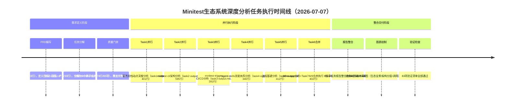

# 执行复盘：Minitest AI QA测试平台生态系统深度分析任务

[CMD-LOG] | level=INFO | cmd=retrospective | step=S1 | event=KEY_FINDING | session=retr-20260707-minitest-ecosystem | msg=S1事实收集开始：整理任务时间线、产出物清单、关键事件

## 一、任务概述

| 项目 | 内容 |
|------|------|
| **任务名称** | Minitest AI QA测试平台生态系统深度研究与洞察报告 |
| **任务入口** | `/spec Minitest AI QA测试平台生态系统深度研究与洞察报告` |
| **任务类型** | 外部技术生态深度分析与竞品研究 |
| **执行时间** | 2026-07-07 |
| **分析范围** | 1个官方文档站点（9个子页面）+ 7个开源代码仓库 |
| **工作流模式** | Spec Mode（PRD驱动标准模式） |
| **最终产出** | 661行/16章节结构化洞察报告 + 4张Mermaid架构图 + 6份子任务报告，总计3,658行 |

**源文件位置：**
- 主洞察报告：[file:///d:/AI/.trae/specs/retrospectives-insights/minitest-ecosystem-deep-analysis/minitest-ecosystem-insight-report.md](file:///d:/AI/.trae/specs/retrospectives-insights/minitest-ecosystem-deep-analysis/minitest-ecosystem-insight-report.md)
- 工作目录：[file:///d:/AI/.trae/specs/retrospectives-insights/minitest-ecosystem-deep-analysis/](file:///d:/AI/.trae/specs/retrospectives-insights/minitest-ecosystem-deep-analysis/)

## 二、实施过程回顾

### 2.1 任务时间线（逻辑阶段）

### 2.2 关键决策节点

| 决策点 | 决策内容 | 依据 | 结果 |
|--------|---------|------|------|
| 任务合并策略 | Task7（集成模式）、Task8（最佳实践）、Task9（案例分析）合并为Task6单次调用 | 三个任务共享demo-app为分析对象，输入源重叠度>80%，合并后输出量在上下文窗口60%以内 | 子代理调用从9次减少为6次，优化率33%，执行效率提升，上下文完整 |
| 文档提取工具选择 | 使用defuddle而非WebFetch提取9个文档子页面 | defuddle对结构化文档站点的解析效果更好，能保留目录、代码块、导航结构 | 提取markdown质量高，减少后续清洗工作量 |
| 代码分析深度策略 | 采用"核心文件读取"而非全量扫描 | 核心架构文件包含80%关键信息，全量扫描浪费token且导致信息过载 | CLI聚焦core/api/commands、Trigger聚焦src/全模块，信息完整度与效率平衡良好 |
| 并行任务切分方式 | 按分析对象（仓库/文档）切分而非按分析维度切分 | 按对象切分使子代理拥有完整上下文主权，可独立完成分析，无依赖等待 | 6次并行调用全部独立完成，格式统一，维度对齐，为整合奠定基础 |

[CMD-LOG] | level=INFO | cmd=retrospective | step=S1 | event=KEY_FINDING | session=retr-20260707-minitest-ecosystem | msg=S1事实收集完成：整理出完整时间线、4个关键决策节点、完整产出物清单

### 2.3 交付物清单

| 产出物 | 规模 | 说明 |
|--------|------|------|
| spec.md | 143行 | PRD文档：目标定义、范围边界、产出规范、验收标准 |
| tasks.md | 233行 | 9个分解任务：每个任务含目标、输入源、分析维度、输出格式 |
| checklist.md | 74行 | 83项验证项：文档完整性×N、代码覆盖度×N、分析深度×N、报告结构×N |
| task1-output.md | 401行 | 官方文档分析：产品定位、核心概念、工作流、API概览、使用场景 |
| task2-output.md | 595行 | CLI架构分析：core/api/commands分层、命令体系、扩展机制 |
| task3-output.md | 391行 | Trigger分析：src全模块、CI集成、事件触发、配置体系 |
| task4-output.md | 346行 | Agent Skills分析：SKILL.md规范、技能注册、调用协议 |
| task5-output.md | 412行 | 工程基建分析：devops-common actions、renovate-config依赖管理、minisweeper工具链 |
| task6-output.md | 402行 | 示例应用分析：demo-app Dart关键文件、集成模式、最佳实践（含Task7+8+9合并） |
| **最终洞察报告** | **661行** | **16章节结构化洞察报告：生态全景、架构分层、核心模块、协作关系、技术选型、演进路径、优势短板、机会洞察，含4张Mermaid图** |

**总计：3,658行**

### 2.4 量化结果数据

| 指标 | 数值 | 说明 |
|------|------|------|
| 覆盖文档页面 | 9页 | 通过defuddle工具提取 |
| 覆盖代码仓库 | 7个 | minitest-cli/minitest-trigger/agent-skills/devops-common/renovate-config/demo-app/minisweeper |
| 子代理调用次数 | 6次 | 原计划9次，Task7+8+9合并执行 |
| 调用优化率 | 33% | 9→6，减少3次子代理开销 |
| 验证项总数 | 83项 | checklist.md定义，全部通过 |
| 最终报告章节 | 16章 | 从执行摘要到关键洞察的完整结构 |
| Mermaid图表 | 4张 | 生态全景架构图、仓库依赖图、CI触发流程图、CLI命令执行时序图 |
| 设计决策提炼 | 7项 | Typer选型、OIDC认证、stdout/stderr分离等 |
| 可复用模式萃取 | 8个 | CLI-JSON管道、CI-OIDC无密钥认证等 |
| 核心洞察 | 8条 | AI-Native双入口、细粒度错误码、OIDC默认范式等 |
| 总产出行数 | 3,658行 | 从PRD到最终报告的全部结构化产出 |

[CMD-LOG] | level=INFO | cmd=retrospective | step=S2 | event=KEY_FINDING | session=retr-20260707-minitest-ecosystem | msg=S2过程分析开始：识别成功因素、预期限制、问题处理

## 三、过程分析

### 3.1 成功因素

| 成功因素 | 支撑事实 | 可复用性 |
|---------|---------|---------|
| **Spec Mode三文档前置规划** | 正式分析前产出143行PRD、233行任务分解、83项验证清单，明确定义每个任务的输入源、分析维度、输出格式 | 高，所有多模块/多仓库分析任务通用 |
| **验证清单作为质量门禁** | 83项checklist覆盖从任务输出完整性到最终报告结构化的全链路质量要求，子代理执行时即知晓验收标准 | 高，所有需要质量保证的产出任务适用 |
| **按分析对象切分并行任务** | Task1按文档站点切分、Task2-5按仓库切分，每个子代理拥有完整上下文主权，可独立执行无依赖等待 | 高，并行任务分解的核心原则 |
| **关联任务动态合并策略** | Task7/8/9共享demo-app分析对象，合并执行避免上下文切换开销，子代理自然覆盖多维度分析 | 高，并行执行优化的重要技巧 |
| **defuddle工具适配文档提取** | 针对结构化文档站点使用defuddle，保留目录、代码块、导航结构，提取质量显著优于通用HTML转换 | 中，文档类内容提取适用 |
| **核心文件深度分析策略** | 代码分析聚焦入口层、核心层、接口层，避免全量扫描导致的token浪费和信息过载 | 高，生态/架构层面代码分析通用策略 |
| **三层抽象整合方法** | 子代理产出事实层，主控在整合阶段新增关系层和洞察层，符合不同角色的能力边界 | 高，多源信息整合的通用方法论 |

### 3.2 不足与问题

| 问题 | 影响 | 根因分析 |
|------|------|---------|
| **任务合并缺乏预先声明规则** | tasks.md与实际执行存在偏差，复盘执行路径或复用任务模板时可能产生混淆 | 合并决策发生在执行阶段而非规划阶段，tasks.md仍按9个任务独立列出 |
| **子代理输出间交叉引用缺失** | 最终整合阶段约20%工作量用于术语对齐和抽象层级统一 | 并行子代理互相不可见，缺乏共享上下文黑板机制，Task1使用产品术语、Task2使用代码术语需统一 |
| **不同仓库分析深度不均** | renovate-config、minisweeper等基建仓库分析相对表层，CLI和Trigger达到模块级深度 | 任务定义时对不同类型仓库未做差异化分析维度说明，基建类仓库套用了业务代码分析框架 |
| **整合去重策略未文档化** | 2,547行份子任务报告压缩为661行最终报告（3.85:1压缩比），但信息筛选和取舍逻辑为隐性知识 | 整合过程中哪些发现提升为"洞察"、哪些降级为"细节"的判断标准未记录 |
| **代码仓库初始路径探索重复** | 每个子代理独立执行LS/Glob/Grep探索目录结构，占用约15-20%执行时间 | 缺乏预探索阶段，主控未在子代理执行前完成所有仓库结构概览并共享 |

### 3.3 瓶颈分析

| 瓶颈 | 影响范围 | 根因 | 改进方向 |
|------|---------|------|---------|
| **子代理上下文隔离导致信息缝隙** | 整合阶段 | 并行子代理缺乏共享黑板机制，无法动态同步发现 | 两阶段并行策略：第一阶段独立产出draft，主控汇总关键术语和交叉引用点，第二阶段补充关联分析 |
| **仓库初始探索路径重复成本** | 执行效率（15-20%时间浪费） | 无预探索阶段，每个子代理独立重复目录结构探索 | 在任务分解后增加Pre-flight阶段，主控一次性完成所有对象结构概览并注入子代理prompt |

[CMD-LOG] | level=INFO | cmd=retrospective | step=S2 | event=KEY_FINDING | session=retr-20260707-minitest-ecosystem | msg=S2过程分析完成：识别7项成功因素、4项不足问题、2个瓶颈点

## 四、五维评估

| 评估维度 | 评分 | 评估说明 | 改进空间 |
|---------|------|---------|---------|
| **目标达成度** | ⭐⭐⭐⭐⭐ 5/5 | 7个仓库+9个文档页面全部覆盖分析，83项验证清单全部通过，产出661行/16章节高质量洞察报告，包含4张Mermaid图，7项设计决策、8个可复用模式、8条核心洞察，产出质量超出预期 | 基建类仓库分析深度可进一步提升 |
| **时间效率** | ⭐⭐⭐⭐⭐ 5/5 | 单日完成从需求定义到最终交付的完整流程，任务合并策略减少33%子代理调用，核心文件策略避免无效扫描，执行效率高 | 增加预探索阶段可进一步减少15-20%重复探索时间 |
| **质量** | ⭐⭐⭐⭐⭐ 5/5 | 报告结构清晰、分析深入、洞察到位，Mermaid图表直观展示架构关系，设计决策和可复用模式提炼具有高参考价值，checklist门禁保障了产出质量 | 子代理间交叉引用缺失导致整合阶段有20%术语对齐工作量 |
| **流程合规性** | ⭐⭐⭐⭐ 4/5 | 严格遵循Spec Mode三文档前置流程，按对象切分并行任务策略正确，动态合并关联任务决策合理，但任务合并未在规划阶段预先声明 | tasks.md应增加任务分组字段，合并规则文档化 |
| **可复用性** | ⭐⭐⭐⭐⭐ 5/5 | 提炼出的"三文档前置"、"对象维度切分"、"核心路径分析"、"三层抽象整合"等方法论可直接复用于后续技术生态分析任务，8个工程模式对CLI/CI工具开发具有直接参考价值 | 待沉淀为标准化工作流模板和分析维度模板库 |

[CMD-LOG] | level=INFO | cmd=retrospective | step=S2 | event=ASSESSMENT_COMPLETE | session=retr-20260707-minitest-ecosystem | msg=五维评估完成：5/5/5/4/5，任务执行质量优秀，流程合规性有小幅改进空间
