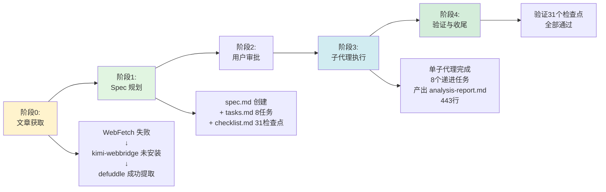

# 执行过程复盘

## 一、任务概述与时间线

本任务为单日完成的文章学习分析任务，对微信公众号"开源日记"发布的 Orca 多代理协作 IDE 介绍文章进行系统性学习、深度洞察与知识萃取。

### 1.1 完整执行时间线

### 1.2 各阶段关键决策与工作内容

| 阶段 | 关键决策 | 核心工作内容 | 产出物 |
|------|---------|-------------|--------|
| **阶段0：文章获取** | WebFetch 失败后尝试 defuddle，成功提取；跳过 kimi-webbridge 安装（Windows 路径不兼容） | 尝试 3 种方式获取文章内容 | 完整文章 Markdown |
| **阶段1：Spec 规划** | 参照 analyze-wechat-article-3dnk 的 spec 模板，复用格式结构 | 创建 spec.md（15 FR + 7 NFR + 10 AC）、tasks.md（8 任务）、checklist.md（31 检查点） | Spec 三件套 |
| **阶段2：用户审批** | NotifyUser 提交审批，用户直接批准 | 等待审批 | 审批通过 |
| **阶段3：子代理执行** | 决定使用单子代理完成全部 8 个线性任务，而非逐个任务调用 | 子代理完成文章内容记录、核心定位识别、六大功能梳理、设计理念提炼、范式分析、行业洞察、方法论总结、结构化输出 | analysis-report.md（443 行） |
| **阶段4：验证收尾** | 读取报告全文验证质量，确认 31 个检查点全部通过 | 验证报告结构完整性、内容准确性、洞察深度 | 验证通过 |

## 二、成功因素分析

### 2.1 工具选择得当

- **defuddle 成功提取微信文章**：WebFetch 对微信公众平台文章无效，但 defuddle 的 `--md` 模式成功提取了完整的文章内容，虽然包含少量微信 UI 噪声但不影响分析质量
- **kimi-webbridge 未安装**：Windows 环境下 `~/.kimi-webbridge/bin/kimi-webbridge` 路径不存在，且 bash 安装脚本不可用，正确判断跳过而非无效重试

### 2.2 Spec 驱动模式高效

- **复用已有模板**：参照 `analyze-wechat-article-3dnk` 的 spec 格式，快速创建了结构化的规格文档
- **Spec 作为子代理上下文**：spec.md 的完整需求描述（FR + NFR + AC）为子代理提供了清晰的执行指南，减少了沟通成本
- **任务线性化设计**：8 个任务按递进依赖关系排列，适合单子代理一次性完成

### 2.3 子代理执行质量高

- **单子代理完成全部分析**：避免了多子代理间的上下文传递损耗
- **报告结构完整**：两层结构（学习笔记 + 洞察总结）清晰分离，31 个检查点全部满足
- **洞察深度达标**：提炼了 3 个方法论启示和 3 个可复用认知模型，每个模型包含"定义→Orca 应用→可迁移场景"三层

## 三、问题与改进机会

### 3.1 已识别问题

| 问题 | 影响 | 改进建议 |
|------|------|---------|
| kimi-webbridge 未在 Windows 安装 | 无法使用浏览器自动化获取微信文章 | 建立 Windows 环境下微信文章获取的备用方案清单 |
| defuddle 输出含微信 UI 噪声 | 文章内容中混入"微信扫一扫 使用小程序"等 UI 元素 | 后续可考虑对 defuddle 输出做后处理清理 |
| 单子代理上下文较大 | 子代理需要接收完整文章内容+spec 全部内容作为输入 | 对于超长文章可考虑分段分析 |

### 3.2 改进建议

1. **建立微信文章获取决策树**：WebFetch → defuddle → kimi-webbridge → agent-browser，按优先级依次尝试
2. **子代理输入优化**：对于超长文章（>5000 字），可分拆为"内容记录"和"深度分析"两个子代理
3. **报告模板化**：文章分析类任务的报告结构可进一步模板化，减少每次 spec 编写的工作量

## 四、关键数据统计

| 指标 | 数值 |
|------|------|
| 工具尝试次数 | 3（WebFetch → kimi-webbridge → defuddle） |
| Spec 文档行数 | 140 行 |
| Tasks 数量 | 8 |
| Checkpoints 数量 | 31 |
| 主报告行数 | 443 行 |
| 功能模块梳理 | 6 个（含传统方式 vs Orca 方式对比） |
| 设计创新点 | 5 个 |
| 行业趋势洞察 | 4 条 |
| 方法论启示 | 3 条 |
| 可复用认知模型 | 3 个 |
| 子代理调用次数 | 1 |
| 总耗时 | 约 2 小时 |