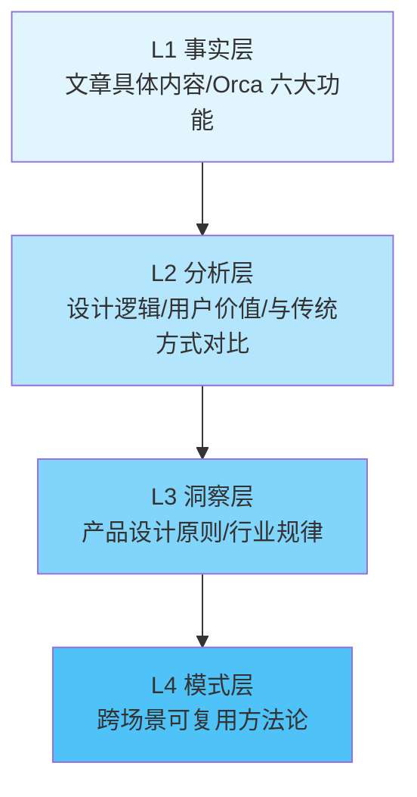

# Orca IDE 文章分析洞察萃取

## 洞察萃取方法论：四层漏斗模型

本次洞察萃取遵循"萃取四层漏斗"方法论，从具体事实逐层抽象到可复用模式：

---

## 一、产品设计洞察（3条核心洞察）

### 洞察1：一等公民抽象——将底层概念提升为产品核心交互对象

**L1事实**：Orca 将 Git Worktree 从命令行专家的工具提升为 IDE 中可视化、一键式管理的一等公民，每个代理运行在独立 Worktree 中实现文件级隔离。

**L2分析**：Git Worktree 是 Git 2.5 引入的底层功能，多年来仅被少数高级开发者使用。Orca 的创新不在于发明了 Worktree，而在于将其从命令行概念封装为 IDE 核心交互对象，让普通开发者也能享受并行开发的便利。这类似于 Git 将版本控制从手动备份文件夹变为自动化操作。

**L3洞察**：技术创新不一定需要发明新东西——将已有的底层能力以更友好的方式呈现给用户，同样具有巨大的工程价值。关键在于识别"哪些底层能力被低估了"——那些功能强大但因使用门槛高而未被广泛采用的技术概念，是产品创新的富矿。

**L4模式**：**一等公民抽象模式** = 识别被低估的底层能力 + 封装为产品核心交互对象 + 自动化管理 + 可视化展示 + 一键式操作

**验证度**：中等（Orca 一个案例，但 Docker 对容器技术、Kubernetes 对容器编排的封装遵循同一模式）

### 洞察2：隔离优于共享——多代理协作的基础设施原则

**L1事实**：Orca 的每个 AI 代理在独立的 Git Worktree 中运行，文件系统完全隔离，互不干扰。开发者比较各代理输出后选择最优方案合并。

**L2分析**：传统的多代理协作方案尝试设计复杂的共享状态管理机制，但 Orca 选择了一条更简单的路径——让每个代理拥有独立的工作空间，由人类做最终的决策和合并。这种"隔离式并行"比"共享式协作"更可靠，因为它避免了文件覆盖、状态冲突、锁竞争等问题。

**L3洞察**：在 AI 代理协作场景中，"隔离"比"共享"更具工程可行性。与其投入大量精力设计代理间的协调机制，不如将协作问题转化为"并行执行+人类择优合并"的简单模式。这符合"简单优于复杂"的工程原则。

**L4模式**：**隔离式并行模式** = 独立工作空间 + 并行执行 + 结果比较 + 择优合并

**验证度**：高（Orca 的 Worktree 隔离、Git 的分支模型、微服务的独立部署，均遵循此模式）

### 洞察3：一个界面完成全流程——工具整合取代工具链拼凑

**L1事实**：Orca 将 PR 浏览、Issue 查看、Worktree 创建、代理启动、代码编写、差异比较、合并决策到代码提交，全流程在 IDE 中完成，无需切换到浏览器或其他工具。

**L2分析**：传统开发流程中，开发者在浏览器（PR/Issue）和 IDE（代码）之间频繁切换，认知负荷高、效率低。Orca 通过将 GitHub/Linear 原生集成到 IDE 中，配合拖拽文件、设计模式等交互优化，将分散的工具链整合为端到端工作流。

**L3洞察**：工具整合的价值不仅在于减少切换次数，更在于保持了开发者的"心流状态"。每次工具切换都是一次认知中断，而全流程整合让开发者可以持续专注于核心任务。

**L4模式**：**全流程整合模式** = 识别工作流中的高频切换点 + 将外部工具原生集成 + 构建端到端闭环

**验证度**：高（Orca 的 GitHub/Linear 集成、VS Code 的扩展生态、Figma 的插件体系，均遵循此模式）

---

## 二、执行过程洞察（2条元洞察）

### 元洞察1：Spec 驱动→子代理执行是文章分析任务的高效模式

**事实**：本次任务中，spec.md 作为子代理的完整输入上下文，子代理一次性完成了全部 8 个递进任务，产出 443 行分析报告，31 个检查点全部通过。

**分析**：Spec 文档为子代理提供了清晰的边界（FR/NFR/AC），避免了子代理的"自由发挥"偏离预期。线性递进的任务依赖关系适合单子代理完成，避免了多子代理间的上下文传递损耗。

**可复用启示**：对于结构清晰、依赖关系线性的分析任务，使用"Spec 驱动 + 单子代理执行"模式比"多子代理并行"更高效。

### 元洞察2：defuddle 是微信文章获取的有效工具

**事实**：WebFetch 对 `mp.weixin.qq.com` 域名无效，kimi-webbridge 在 Windows 环境未安装，defuddle 的 `--md` 模式成功提取了完整文章内容。

**分析**：微信公众平台文章有反爬机制，但 defuddle 的浏览器级渲染+内容提取模式能够绕过限制。输出虽含少量 UI 噪声，但核心内容完整，适合分析任务。

**可复用启示**：微信文章获取的决策树应为：defuddle → 手动复制（备选）→ kimi-webbridge/agent-browser（需预装）。WebFetch 对微信域名无效，不应作为首选。

---

## 三、洞察归档建议

| 洞察 | 是否沉淀为模式 | 模式领域 | 建议模式名称 |
|------|:---:|------|------|
| 一等公民抽象 | 是 | 产品设计/工程方法 | first-class-citizen-abstraction.md |
| 隔离优于共享 | 是 | 架构设计/代理协作 | isolation-over-sharing.md |
| 全流程整合 | 是 | 工具设计/UX | full-workflow-integration.md |
| Spec驱动子代理执行 | 是 | 方法论/工作流 | spec-driven-subagent-execution.md |
| defuddle微信文章获取 | 否（工具选择知识） | — | 记录到知识库即可 |