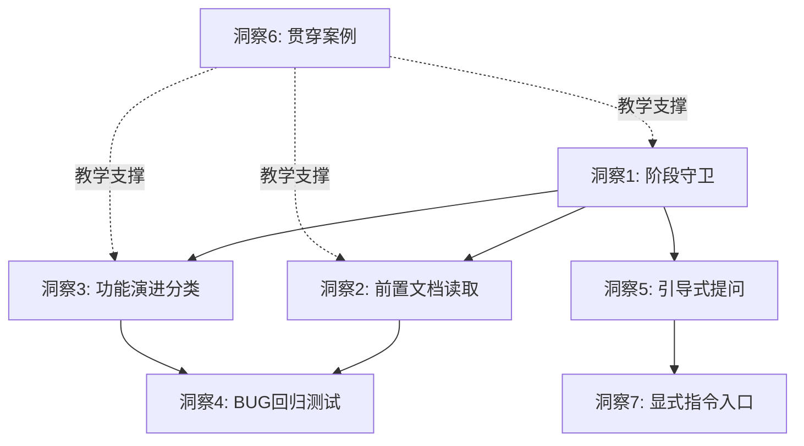

# 洞察萃取：SpecWeave可借鉴的7个设计

## 定位差异：明确"不学什么"

在提取可借鉴点之前，必须先明确两个体系的定位差异，避免错误借鉴：

| 维度 | SpecForge | SpecWeave |
|------|-----------|-----------|
| 目标用户 | 零基础个人开发者（16岁初中生可用） | 5-20人AI开发团队 |
| 交付形态 | 13个TRAE斜杠命令Skill | AGENTS.md + .agents/ 规范体系 |
| 哲学核心 | 文档驱动+阶段分离 | 角色边界+协作协议+自进化 |
| 层级 | 个人工作流（一个人做项目） | 团队工程体系（多人+多角色协作） |
| 约束方式 | Skill显式调用+边界守卫 | AGENTS.md自动加载+角色Non-Goals |
| 质量保障 | 文档先行+阶段检查 | 23个CI自动化脚本+多层审查 |
| 知识沉淀 | specs/目录文档 | 复盘报告+方法论模式库+自演进闭环 |

**明确不学的设计**：
1. **保姆级ABC选项引导**：团队成员有技术背景，不需要"给选项让人选"的引导方式
2. **13步刚性流水线**：团队协作需要灵活性，不能像个人工作流那样固定线性
3. **零技术术语约束**：团队场景默认技术沟通，需求阶段也可以讨论技术可行性

---

## 洞察1：阶段守卫机制（GUARDRAILS）——从"描述性约束"到"机制性拦截"

**来源**：SpecForge核心机制一——"边界守卫"

**SpecForge做法**：不是告诉AI"你不应该越界"，而是在每个Skill执行时强制加载守卫规则。AI想在需求阶段讨论代码实现时，直接拦住并告知"当前是需求阶段，我们先把需求想清楚"。

> 原文："AI的本能反应是直接给你写代码。但这时候需求还没想清楚呢，代码写了也是白写，甚至会把你带偏。边界守卫强制AI在正确的时间做正确的事。"

**SpecWeave现状**：角色定义中有Non-Goals（如[developer.md](../../../../../.agents/roles/developer.md)中"不擅自变更架构决策"），但这是**描述性约束**——AI"知道"自己不该越界，但缺少一个执行时的**强制拦截机制**。当用户在需求讨论中随口说"这个用Redis吧"，developer角色的AI可能直接跳到实现方案，而不是先完成需求澄清。

**可借鉴点**：在AGENTS.md启动协议中增加"阶段守卫"规则，定义开发流程的标准阶段序列，每个阶段有明确的"允许操作"和"禁止操作"。AI检测到跨阶段操作时，必须显式拦截并提醒。这不是新增角色，而是给现有协作协议加一把硬锁。

**优先级**：🔴 高

**落地位置**：AGENTS.md上下文路由表 + [feature-development.md](../../../../../.agents/workflows/feature-development.md) 各步骤增加守卫检查点

---

## 洞察2：前置文档强制读取——"不读完不许动手"

**来源**：SpecForge核心机制二——"项目上下文协议（PROJECT-CONTEXT）"

**SpecForge做法**：每个Skill执行前，AI必须先读取specs/目录下的所有前置文档，建立对项目的完整认知，不读完不许开始干活。

> 原文："不管开多少个新窗口，AI每次都会被强制重新读取项目文档。文档在，记忆就在。"

**SpecWeave现状**：AGENTS.md启动协议要求AI启动时加载规范文件（路由表→角色定义→协议），但在开发过程中每个新阶段开始时，没有强制要求读取前置输出文档。例如：developer开始编码时，是否强制要求先读完architect的技术方案文档？目前依赖handoff协议的交接模板，但交接是"人"（智能体）之间的动作，缺少"AI操作前自动校验前置文档已读取"的机制性检查点。

**可借鉴点**：在[feature-development.md](../../../../../.agents/workflows/feature-development.md)的每个步骤中加入"前置文档强制读取"检查点：

```
步骤4（代码实现）开始前，developer必须确认已读取：
① 技术方案文档（architect输出）
② 任务分解清单（orchestrator输出）
③ 项目开发规范
未读取时不得开始编码。
```

这与SpecWeave已有的"上下文感知"（context-awareness）概念一致，但需要从"建议"升级为"强制"。

**优先级**：🔴 高

**落地位置**：feature-development.md 各步骤执行要点

---

## 洞察3：功能演进分类——区分"新功能""扩展""重构"

**来源**：SpecForge的feature-evolution Skill

**SpecForge做法**：把已有功能的变更明确分为两类：
- **扩展（Extension）**：加新东西（如"给评论加点赞"），新增验收标准和接口，不破坏现有结构，回归风险低
- **重构（Refactor）**：动核心结构（如改存储模型），需重新评估全量影响，回归风险高

> 原文："如果你直接对AI说'给评论加个点赞'，它大概率会把已有代码搅得一团乱——因为它不知道之前的需求文档、技术方案里写了什么。"

**SpecWeave现状**：[feature-development.md](../../../../../.agents/workflows/feature-development.md)只覆盖了"新功能从0到1"的完整开发流程，**没有覆盖"已有功能变更"场景**。实际开发中（如竹简悟道项目），"加新特性"的频率远高于"从零做新功能"，而变更分类缺失导致：
- 小改也要走完整流程，效率低
- 大改跳过必要审查，风险高

**可借鉴点**：在feature-development工作流中增加"功能演进"分支，形成三类路径：

| 变更类型 | 定义 | 流程 | 审查级别 |
|---------|------|------|---------|
| 新功能 | 从0到1构建 | 完整流程（需求→设计→规划→编码→测试→审查） | reviewer全量审查 |
| 功能扩展 | 新增能力，不破坏已有结构 | 轻量流程（影响分析→增量方案→增量实现→回归测试） | reviewer增量审查 |
| 功能重构 | 改动核心结构/数据模型 | 重量流程（完整方案重审→影响全量评估→全量回归） | reviewer+architect双重审查 |

**优先级**：🔴 高

**落地位置**：feature-development.md 增加功能演进分支 + 新增feature-evolution协议或模式

---

## 洞察4：BUG修复→自动回归测试闭环

**来源**：SpecForge的bugfix-workflow Skill

**SpecForge做法**：修复BUG后，AI必须完成三件事：
1. 给出逐步手动验证步骤（具体到"打开哪个页面、点哪个按钮、输入什么、看到什么结果"）
2. **自动写一个针对该BUG的单元测试**，防止同样问题再出现
3. 生成修复报告存档到docs/BUG修复文档/

**SpecWeave现状**：tester角色定义了测试职责，但没有"BUG修复后必须生成回归测试"的强制闭环。当前流程是：developer修BUG→tester验证→结束，缺少"防复发"环节。在竹简悟道开发中，确实出现过"修了一个BUG，后来类似问题又出现"的情况。

**可借鉴点**：在testing工作流和developer角色中增加"BUG修复强制回归测试"规则：
- 每修复一个BUG，必须同时提交包含该BUG复现场景的测试用例
- 修复报告中标注根因分类和预防措施
- 回归测试加入CI验证流水线，确保后续改动不会重新引入

**优先级**：🟡 中

**落地位置**：[workflows/testing.md](../../../../../.agents/workflows/testing.md) + [roles/developer.md](../../../../../.agents/roles/developer.md) + [roles/tester.md](../../../../../.agents/roles/tester.md)

---

## 洞察5：苏格拉底引导式提问模式

**来源**：SpecForge所有Skill中的交互设计

**SpecForge做法**：需求收集不用"填表式"开放问题，而用引导式追问+选项式回答：
- 不是："你的目标用户是谁？"（开放式，新手答不上来）
- 而是："你的博客主要给谁看？A：给自己记录 B：吸引读者打造品牌 C：纯粹练手"

每个问题：一次只问一个维度、给选项附带解释、给出推荐选项说明理由、支持反复迭代。

**SpecWeave现状**：orchestrator/architect的角色定义了"需求分析"职责，但没有定义"如何向用户/产品方提问"的具体方法论。目前AI倾向于直接问开放式大问题（"请描述你的需求"），导致：
- 用户不知从何说起，来回沟通成本高
- AI拿到模糊需求后靠猜，偏离用户意图

**可借鉴点**：萃取一个"引导式提问"方法论模式，核心原则：
1. **选项优先**：能给选项就不问开放问题
2. **单维度聚焦**：一次只问一个维度的问题
3. **解释附带**：每个选项说明适用场景和利弊
4. **推荐引导**：给出推荐选项并说明理由（不是替用户决策，而是降低决策成本）
5. **迭代允许**：不要求一次答完，可以反复调用逐步深挖

这与SpecWeave已有的"好奇的合伙人"理念（SpecForge语）一脉相承，但可以被形式化为可复用模式。

**优先级**：🟡 中

**落地位置**：新增methodology pattern至 [patterns/methodology-patterns/ai-collaboration/](file:///d:/spaces/SpecWeave/docs/retrospective/patterns/methodology-patterns/ai-collaboration/)

---

## 洞察6：贯穿式教学案例

**来源**：SpecForge全文用"评论功能"作为贯穿示例

**SpecForge做法**：全文用一个具体的"评论功能"作为贯穿案例——需求澄清用评论功能举例、技术设计用评论功能举例、任务规划用评论功能举例、BUG修复还是用评论功能举例。读者跟着一个例子走完所有Skill，理解成本极低。

**SpecWeave现状**：文档以规范描述为主，各角色/协议/工作流的说明是独立的，缺少一个贯穿式端到端案例来说明"从用户提出一个需求，到orchestrator分配、architect设计、developer实现、tester测试、reviewer审查，整个过程具体是什么样的"。新用户阅读规范时，需要在脑中自行拼装各模块的协作关系，认知负担重。

**可借鉴点**：在docs/中增加一个端到端教学案例（比如用"用户登录功能"作为贯穿案例），串联所有角色、协议和工作流步骤。每个角色的章节引用同一案例的对应阶段，读者可以从头到尾跟完一个完整的协作流程。

**优先级**：🟢 低（文档完善项，不影响核心机制）

**落地位置**：docs/ 下新增tutorial或guides目录

---

## 洞察7：显式指令入口

**来源**：SpecForge的斜杠命令调用方式

**SpecForge做法**：13个Skill都通过`/project-requirements-clarification`、`/feature-implementation`等斜杠命令显式调用。用户有明确控制权——"我现在想做什么，就调什么Skill"。

**SpecWeave现状**：AGENTS.md是自动加载的，角色是AI根据上下文自动判断的。这在团队协作中是优点（AI自动协调），但在用户主动想触发特定流程时（如"我要启动一次复盘"、"我要做代码审查"、"我要原子化这个文档"），缺少显式入口。用户需要用自然语言描述意图，AI再去判断该走什么流程，有时会误判。

SpecWeave已有[.agents/commands/](../../../../../.agents/commands/)目录定义了5个指令集（retrospective/insight/export-report/atomization/atomic-commit），但在AGENTS.md路由表中没有突出这些显式入口，AI和用户都不容易发现。

**可借鉴点**：
- 在AGENTS.md路由表中增加"常用指令快捷入口"区域，列出高频指令的触发关键词
- 用户说"复盘"→触发retrospective指令集，用户说"洞察"→触发insight指令集
- 减少AI的意图猜测成本，提升交互确定性

**优先级**：🟢 低（体验优化项）

**落地位置**：AGENTS.md上下文路由表增强

---

## 借鉴优先级矩阵

| # | 借鉴点 | 类型 | SpecWeave增强位置 | 紧迫度 | 预计工作量 |
|---|--------|------|------------------|--------|-----------|
| 1 | 阶段守卫GUARDRAILS | 机制 | AGENTS.md + feature-development.md | 🔴高 | 中（新增一个协议段落） |
| 2 | 前置文档强制读取 | 协议 | feature-development.md 各步骤检查点 | 🔴高 | 小（现有步骤增加检查项） |
| 3 | 功能演进分类处理 | 工作流 | feature-development.md 增加演进分支 | 🔴高 | 中（新增分类流程） |
| 4 | BUG修复回归测试 | 规则 | testing.md + developer.md + tester.md | 🟡中 | 小（现有流程增加闭环） |
| 5 | 苏格拉底引导提问 | 模式 | 新增ai-collaboration方法论模式 | 🟡中 | 中（新增一个模式文件） |
| 6 | 贯穿式教学案例 | 文档 | docs/ 增加端到端案例 | 🟢低 | 大（编写完整案例文档） |
| 7 | 显式指令入口 | 可用性 | AGENTS.md路由表增强 | 🟢低 | 小（路由表增加指令索引） |

## 跨洞察关联分析

7个可借鉴点之间存在内在关联：



- **洞察1+2+3**构成"流程硬约束"三角：阶段守卫定义什么阶段做什么事，前置文档读取确保每个阶段有足够信息，功能演进分类确保不同类型变更走合适流程
- **洞察4**是质量闭环的补强：在现有测试流程基础上增加防复发机制
- **洞察5+7**是交互体验优化：引导式提问提升需求收集效率，显式指令提升操作确定性
- **洞察6**是教学支撑：贯穿案例帮助新用户理解以上所有机制如何协同工作
