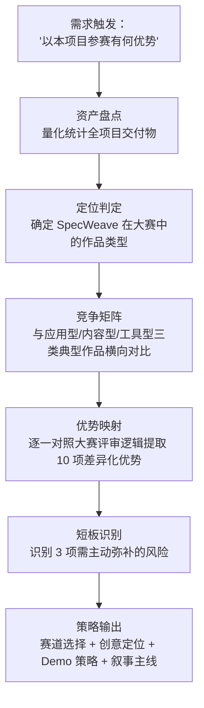
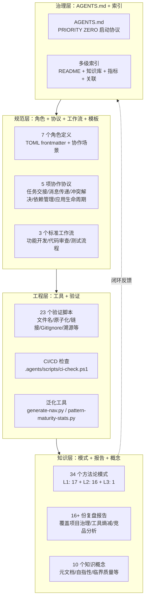

+++
id = "retrospective-specweave-contest-advantage-analysis-20260624-execution"
date = "2026-06-24"
type = "execution-retrospective"
source = "SpecWeave 项目全部资产"
+++

# 二、执行复盘：分析流程与方法论

## 2.1 分析流程

## 2.2 作品类型判定：四类参赛作品对比矩阵

AI 编程大赛的常见参赛作品可分为四类，SpecWeave 属于第四类——系统型：

| 维度 | 应用型 | 内容型 | 工具型 | **系统型（SpecWeave）** |
|------|--------|--------|--------|-------------------------|
| 解决的问题 | 单点需求（一个 App/网站） | 内容生成需求（图文/视频） | 单点效率需求（一个工具） | **系统性需求（AI 开发团队如何有序协作）** |
| 技术深度 | 单层代码实现 | 提示词技巧驱动 | 单模块实现 | **四层闭环（感知→认知→执行→治理）** |
| 持续性 | 赛完功能完整即终结 | 赛完内容时效即终结 | 赛完工具可能继续维护 | **开源社区 + 标准演进，赛后持续增长** |
| 用户价值 | C 端用户 | 内容消费者 | 开发者 | **AI 开发团队 + AI 工具厂商（双重用户）** |
| 叙事模式 | "我用 AI 做了一个 X" | "我用 AI 生成了 Y" | "我用 AI 写了一个 Z" | **"我在 AI 协作中发现了一套方法论，它让所有人用得更好"** |
| 与 TRAE 的关系 | TRAE 是工具 | TRAE 是工具 | TRAE 是工具 | **TRAE 是诞生环境：142 次提交全程在 TRAE 中完成** |

### 2.2.1 为什么系统型作品具有结构优势

- **叙事完整性**：应用型作品的叙事是单向的——「需求 → 实现」。系统型作品的叙事有一个额外的反身性维度——「用 TRAE 协作 → 从协作中萃取方法论 → 方法论反过来指导更好的 TRAE 协作」
- **评审记忆点**：在大量「我用 AI 做了个网站」的作品中，一个「我做的是一套让 AI 开发更有序的方法论」的作品具有极强的认知差异
- **工具价值证明**：系统型作品天然证明了 TRAE 的能力上限——不只是「一句话生成一个页面」，而是「持续 142 次对话完成一个完整知识体系」

## 2.3 项目资产全景盘点

### 2.3.1 数量维度

| 资产类型 | 数量 | 在大赛中的信号 |
|----------|------|-------------|
| Git 提交 | 142 次 | 持续迭代的证据链，非一次性产出 |
| Markdown 文档 | 279 个 | 知识密度远超"一个 Demo"的预期 |
| 验证脚本 | 23 个 | 工程完整度的硬指标，非视觉系作品可比 |
| 复盘报告 | 16+ 份 | 每次复盘都是一次认知迭代的结晶，AI 协作深度的量化证据 |
| 方法论模式 | 34 个 | 从实践中萃取的原创知识，非搬运已有理论 |
| .agents/ 配置 | 118 个文件 | 规范体系的物质载体，证明"不是纸上谈兵" |

### 2.3.2 结构维度

## 2.4 与 TRAE 大赛评审逻辑的对齐分析

基于 FAQ 文档中披露的报名审核三维度（内容完整性、表达清晰性、原创合规）和暗示的初赛评审关注点（创新性、完成度、用户体验、技术实现），逐项对齐：

| 评审维度 | SpecWeave 的对应 | 强度 |
|----------|-----------------|------|
| 内容完整性 | 70+ 交付物覆盖四层架构，279 个文档互为引证 | ⭐⭐⭐⭐⭐ |
| 表达清晰性 | 每份报告有 Mermaid 流程图，README 有完整导航索引 | ⭐⭐⭐⭐ |
| 原创合规 | 全部使用 TRAE 生成，Apache 2.0 开源，无第三方工具依赖 | ⭐⭐⭐⭐⭐ |
| 创新性 | 34 个原创方法论模式 + 10 个自创知识概念 | ⭐⭐⭐⭐⭐ |
| 完成度 | 142 次迭代 → 可运行的四层闭环体系 → 已有落地案例 | ⭐⭐⭐⭐ |
| 用户体验 | 文档即产品，阅读即体验；（短板：缺少交互式导航） | ⭐⭐⭐ |
| 技术实现 | 23 个验证脚本 + 自动化 CI 检查 + TOML frontmatter 绑定 | ⭐⭐⭐⭐ |

---

*数据来源：SpecWeave 项目全量资产*
