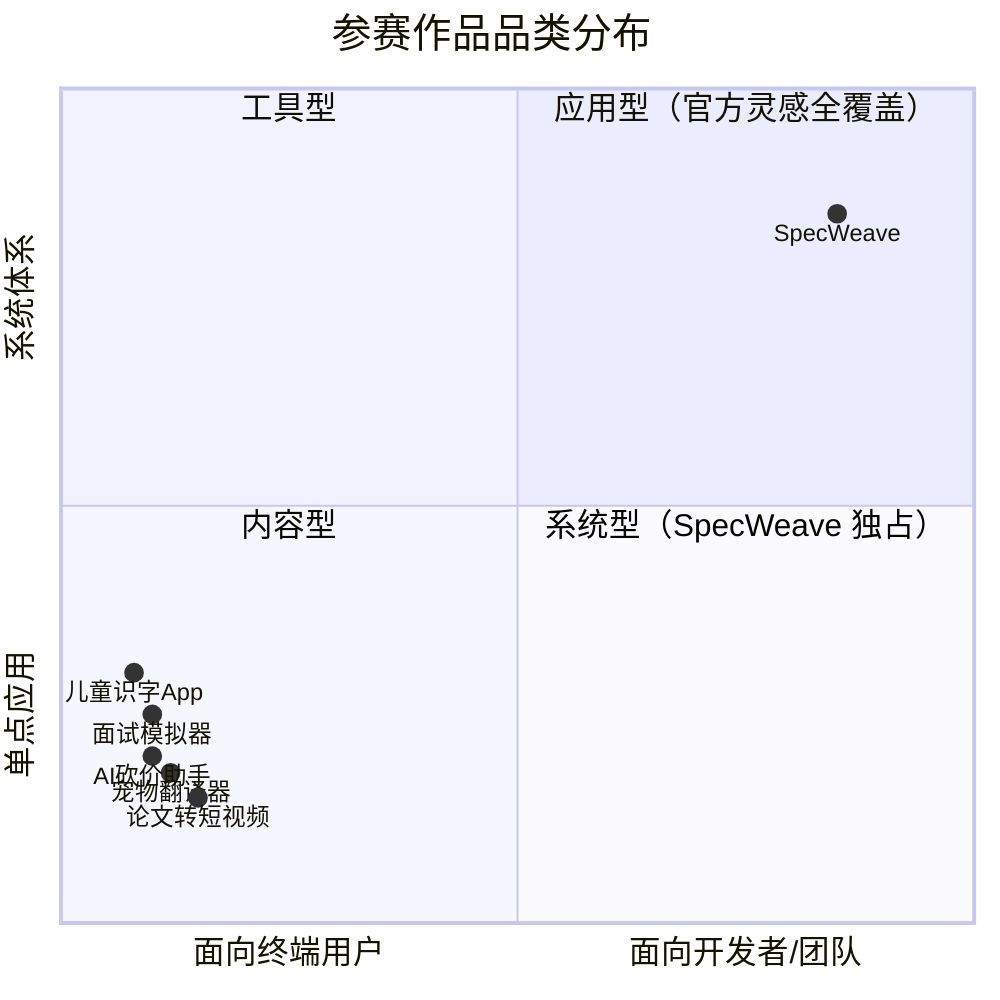

+++
id = "retrospective-specweave-contest-advantage-analysis-20260624-execution"
date = "2026-06-24"
type = "execution-retrospective"
source = "SpecWeave 项目全部资产 + TRAE 大赛官网 + 报名指南 + 抖音流量扶持表单 + 赛事细则 + FAQ 分析"
+++

# 二、执行复盘：分析流程与方法论

## 2.1 信息来源与可信度分层

本轮分析综合了五个信息来源，按权威层级排列：

| 来源 | 类型 | 信息密度 | 可信度 | 关键增量 |
|------|------|---------|--------|---------|
| [赛事细则](https://bytedance.larkoffice.com/wiki/DScwwZPzsikvNzk5slJc2kgpnie) | 赛事章程 | 赛道设置、赛程详解、晋级机制、奖金池(113万)、评审体系、知识产权、运营支持 | 最高（官方章程级） | **单作品限制**（同账号只取最高分1个作品）、**全人工评审**、**独立晋级不重复占位**、奖金池 113 万、仅支持个人参赛、知识产权永久授权 |
| [大赛报名指南](https://forum.trae.cn/t/topic/22548) | 操作手册 | 报名帖模板、标签格式、审核标准、奖励细则、重要链接集 | 最高（官方操作指南） | 报名帖逐段格式要求、HTML 上传限制(20MB)、标签四选一规则 |
| [抖音流量扶持入口](https://bytedance.larkoffice.com/share/base/form/shrcnzp18Sdf6XQxm8wGPPXDt4b) | 操作表单 | 话题格式、提及要求、提交流程、审核周期 | 最高（官方收集表） | 精确话题格式、@提及要求、5 万曝光/条 |
| [大赛官网](https://www.trae.cn/ai-creativity) | 品牌页面 | 赛道定义、评委阵容、奖项结构、创意灵感示例、Vibe Coding 关联 | 高 | 赛道哲学定义、品牌叙事、30+ 官方灵感 |
| [FAQ 文档](https://bytedance.larkoffice.com/wiki/Mv7CwCVNNiK2v6k28K8cP5NrnSe) | 规则文档 | ~30 个问答，覆盖全流程 | 最高（细则级规则） | 评审维度、晋级机制、奖励领取细节 |

### 2.1.1 报名指南关键增量（此前两轮分析未覆盖）

| 信息 | 此前了解 | 报名指南新增 | 策略影响 |
|------|---------|-------------|---------|
| 报名帖具体格式 | "≥100 字" | 精确 4 部分模板：创意名称+介绍 / 目标用户及痛点 / 价值与意义 / HTML 产物 | 策略化撰写每部分内容 |
| 标签格式 | 未明确 | **四选一**：生活娱乐/学习工作/社会服务/硬件交互；可附加社会公益 | 确认标签用法 |
| HTML 上传 | "上传 HTML" | 直接上传到社区，**20MB 以内** | 控制 HTML 文件大小 |
| 奖励发放时间 | "实时发放" | "当天完成报名的，奖励将于次日发放"；已持同类权益者改发等值奖励(¥99、100次、31天) | 了解时间线 |
| 审核机制 | "每个工作日" | **审核只看前一天新发的帖**，修改旧帖不重新审核 | 确认"重发不修改"策略 |
| 重要链接集 | 未汇总 | 6 个链接：保姆级教程 / FAQ / 抖音入口 / 赛事细则(含评审规则) / 速通领奖 / 晋级公示 | 获取所有参考材料 |
| 报名流程总图 | 未明确 | 5 步：TRAE Work 生成 HTML → 发帖 → 审核 → 通过 → 领奖 | 简化用户理解 |

### 2.1.2 🆕 抖音流量扶持机制详解

抖音流量扶持并非自动发放，而是一个**主动申请 + 人工审核**的流程。关键机制如下：

| 机制要素 | 详细说明 | 策略影响 |
|---------|---------|---------|
| 前置条件 | 必须**已通过报名审核**，且已在初赛区**发布 Demo 帖** | 时间线：先通过报名审核 → 提交 Demo → 再申请抖音流量 |
| 话题格式 | `#vibecoding 大赏` `#TRAEAI 创造力大赛`（**精确无空格**） | 此前认知的话题格式有误（写成了 `#vibe coding 大赏` `#TRAE AI 创造力大赛`），必须修正 |
| 提及要求 | 发布抖音视频时必须 **@TRAE @抖音科技** | 两个 @ 均为硬性要求，缺一不可 |
| 提交流程 | 在抖音发布视频后，**填写飞书表单**提交申请：抖音用户名、Demo 帖链接、抖音帖链接、社区个人主页截图 | 发布抖音 ≠ 获得流量；填写表单后进入人工审核 |
| 审核周期 | 表单提交后**2 个工作日内**人工审核 | 需预留至少 2 天的审核等待时间 |
| 流量额度 | **每条符合条件的帖子获得 50,000 曝光扶持** | 非流量池模式，而是按条定额分配——多发多扶持 |
| 持续时间 | 表单中明确标注"活动期间" | 需确认活动结束日期，在此之前持续产出抖音内容 |

**此前策略与官方机制的关键差异**：

| 要素 | 此前策略（错误） | 官方要求（正确） | 修正成本 |
|------|---------------|---------------|---------|
| 话题格式 | `#TRAE AI 创造力大赛` `#vibe coding 大赏` | `#TRAEAI 创造力大赛` `#vibecoding 大赏` | 极低（修正文字即可） |
| 提及 | 未涉及 | @TRAE @抖音科技 | 极低（发布时补上） |
| 流量获取 | 以为话题加持自动获得 | 需填写飞书表单申请 | 新增步骤（约 5 分钟） |

### 2.1.3 🆕 赛事细则关键增量（此前所有轮次分析未覆盖）

赛事细则文档是本次迭代的核心数据来源，揭示了此前所有轮次均未覆盖的关键机制：

| 信息 | 此前了解 | 赛事细则新增 | 策略影响 |
|------|---------|-------------|---------|
| 晋级限制 | 未明确 | **同一账号下只取得分/人气分最高的 1 个作品晋级**（专业评审通道和抖音人气通道均适用） | 100% 聚焦一个作品，不做"多作品分散投稿" |
| 通道占位 | 未明确 | **同一作品同时通过两条通道，仅占用 1 个晋级名额、不重复晋级也不顺延补位** | 无需反复权衡通道选择，一个作品同时冲击两通道即可 |
| 参赛形式 | 未明确 | **仅支持个人参赛** | 无需考虑团队组织形式 |
| 奖金池总额 | 未明确 | **113 万元**（此前分析引用了官网但未确认总额） | 确认赛道大奖 ¥50,000 在总池中的占比 |
| 评审方式 | 未明确 | **初赛、复赛和决赛全部采用人工评审**（非 AI 评审） | 对"人"的叙事说服力比技术参数更重要 |
| 每周直播 | 未明确 | **大赛期间每周举办一场线上直播**（赛制规则讲解 + 开发拆解） | 可参与直播了解评审倾向、展示作品思路 |
| 知识产权 | 未明确 | 用户**永久、不可撤销地授权**主办方非独家信息网络传播权 | Apache 2.0 开源项目无冲突——开源许可证已授予更广泛权利 |
| 初赛详细评审 | 未知 | 初赛详细评审维度与标准在**另一个独立文档**中（《TRAE AI 创造力大赛 · 报名与初赛详细说明》） | 该文档尚未获取，下一轮迭代优先目标 |

> ⚠️ **重要发现**：赛事细则文档自身**不含**初赛评审的维度拆解与权重——它引用了一个独立文档（`GiunwGMFjiPhpekTWwYcLokQnVe`）。这意味着我们目前的分析在"评审维度权重"层面仍存在信息缺口。复赛和决赛的评审标准将随赛程阶段开启后另行公布。

### 2.1.4 🆕 仍需获取的文档

| 文档 | 链接/Token | 状态 | 对分析的潜在价值 |
|------|-----------|------|---------------|
| **报名与初赛详细说明** | wiki `GiunwGMFjiPhpekTWwYcLokQnVe` | 未获取 | 包含初赛专业评审和抖音人气榜的具体维度与评分标准——直接影响策略聚焦点 |
| **初赛参赛指南** | 社区帖子 | 未获取 | 可能包含初赛 Demo 的具体提交要求和评估标准 |

## 2.2 赛道精准匹配（确认版）

### 2.2.1 主赛道：学习工作 / 造个新解法

| 赛道关键词 | SpecWeave 的对应 | 匹配度 |
|-----------|-----------------|--------|
| 「新一代」 | 面向 AI 智能体协作的全新工作范式 | ⭐⭐⭐⭐⭐ |
| 「学习与工作方式」 | 规范 AI 智能体的角色、协议与工作流 | ⭐⭐⭐⭐⭐ |
| 「更高效」 | 142 次协作实践 → 34 个方法论模式的效率提升证据 | ⭐⭐⭐⭐ |
| 「协同」 | 7 角色 + 5 协议 + 3 工作流的多智能体协作体系 | ⭐⭐⭐⭐⭐ |
| 「智能」 | 感知→认知→执行→治理四层闭环的自我演进机制 | ⭐⭐⭐⭐⭐ |
| 「职业成长体验」 | 开源可迁移 → 任何 AI 开发团队可直接采用的成长工具 | ⭐⭐⭐⭐ |

### 2.2.2 标签选择（报名指南确认版）

报名指南明确「必须四选一」标签。SpecWeave 的标签方案：

| 标签层级 | 标签名称 | 说明 |
|----------|---------|------|
| 主标签（必选） | `学习工作` | 对应"学习工作 / 造个新解法"赛道 |
| 附加标签（可选） | `社会公益` | Apache 2.0 开源 = 数字包容性公益 |

## 2.3 竞争定位：与 30+ 官方灵感示例的对角线差异

30+ 官方灵感示例全部为 C 端应用（AI 砍价助手、儿童识字 App、宠物翻译器等）。SpecWeave 在象限中处于对角位置——**品类独占**。



## 2.4 晋级机制详解（赛事细则确认版）

赛事细则明确了初赛的两条独立晋级通道及其核心约束：

### 2.4.1 通道容量与规则

| 通道 | 席数 | 取作品规则 | 关键约束 |
|------|------|-----------|---------|
| 专业评审通道 | **300 席** | 同一账号下综合得分最高的 1 个作品 | 多作品投稿仅取最优，不累加 |
| 抖音人气通道 | **50 席** | 同一账号下人气分最高的 1 个作品 | 同上 |

### 2.4.2 通道交叉规则

```
同一作品同时通过两通道 → 仅占用 1 个晋级名额
                        → 不重复晋级
                        → 不顺延补位
```

**策略含义**：实际进入复赛的作品总数可能少于 350 个。对 SpecWeave 而言，这意味着：
- **无需在多通道间做取舍**——一个作品可以同时冲击两个通道
- **专业评审是主战场**——300 席 vs 50 席，专业评审通道的容量是抖音的 6 倍
- **抖音作为补充杠杆**——如能同时通过两通道，不影响晋级名额分配

### 2.4.3 参赛形式约束

赛事细则明确**仅支持个人参赛**。这对 SpecWeave 无影响（本就是个人项目），但确认了不存在"团队协作加分"机制。

## 2.5 评审机制详解（赛事细则确认版）

### 2.5.1 评审方式：全部人工

赛事细则 §5.3 明确：**初赛、复赛和决赛全部采用人工评审**。

这与许多 AI 大赛的"AI+人工混合评审"模式有本质区别。人工评审意味着：

| 维度 | 对 SpecWeave 的影响 |
|------|-------------------|
| 叙事清晰度 | 评审是人，需要"一眼看懂"你的作品是什么——不能用技术术语堆砌 |
| 差异化冲击 | 评审连续看几十个作品后会产生疲劳——品类独特性在人工评审中的记忆效应更强 |
| 情感共鸣 | 人是情感动物——"我在 TRAE 中发现了 Vibe Coding 的方法论"比"我开发了一个工具"有更强的情感说服力 |
| 证据可信度 | 人能判断证据链的完整性——142 次对话记录比单一 Demo 更能说服人 |
| Session ID 验证 | 评审期主办方将要求候选作品提供 Session ID 等创作过程证明——这是**原创性验证信号** |

### 2.5.2 初赛详细评审标准（未获取）

赛事细则将初赛的评审维度与标准引向了另一个独立文档：《TRAE AI 创造力大赛 · 报名与初赛详细说明》。该文档包含：
- 报名创意评审的具体维度与标准
- 初赛专业评审的具体维度与标准
- 抖音人气榜的计分规则

> ⚠️ **信息缺口**：在获取该文档之前，我们对初赛评审维度的分析仍基于推测。目前已知的"创新性/完成度/用户体验/技术实现"四维度为 FAQ 中提及，但权重和细分标准可能不同。

### 2.5.3 复赛与决赛评审

赛事细则 §5.2 明确指出：**复赛、决赛的评审维度与标准将随相应赛程阶段开启后另行公布**。这意味着当前阶段（报名/初赛期），所有人对复赛和决赛评审的了解程度是一致的——不存在信息差。

## 2.6 知识产权与合规说明

| 条款 | 内容 | 对 SpecWeave 的影响 |
|------|------|-------------------|
| 知识产权授权 | 用户永久、不可撤销地授权主办方非独家信息网络传播权，以及为宣传推广所需的转载、复制、改编、汇编权 | Apache 2.0 开源许可证已授予更广泛权利——无新增约束 |
| 原创性要求 | 作品不得在其他赛事中获奖，不得在公开平台以参赛成品形态公开展示 | SpecWeave 为首次参赛作品，无冲突 |
| 创作工具限制 | 作品须全部使用 TRAE Work 或 TRAE IDE 创作，需提供创作过程证明 | SpecWeave 的 142 次提交全部在 TRAE 中完成——材料天然充足 |
| 提交后不可修改 | 提交截止后不得擅自补交、替换、撤回或修改——否则视为放弃资格 | 提交前务必完成质量审查 |

---

*数据来源：[赛事细则](https://bytedance.larkoffice.com/wiki/DScwwZPzsikvNzk5slJc2kgpnie) + [报名指南](https://forum.trae.cn/t/topic/22548) + [抖音流量扶持入口](https://bytedance.larkoffice.com/share/base/form/shrcnzp18Sdf6XQxm8wGPPXDt4b) + [官网](https://www.trae.cn/ai-creativity) + [FAQ](https://bytedance.larkoffice.com/wiki/Mv7CwCVNNiK2v6k28K8cP5NrnSe) + SpecWeave 项目资产*
