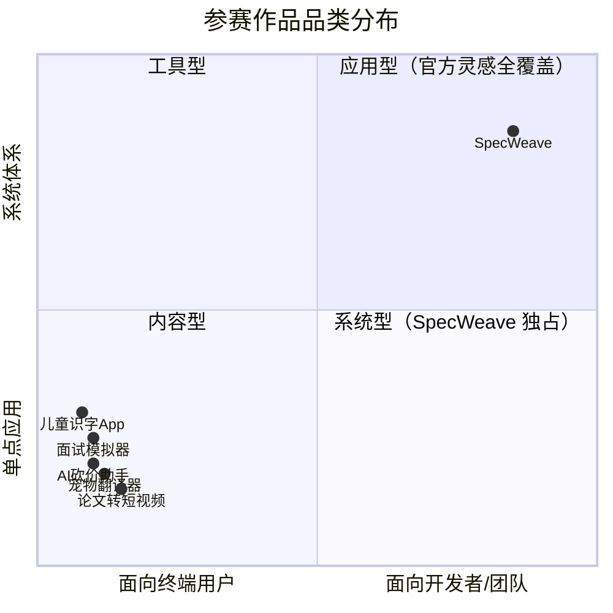

+++
id = "retrospective-specweave-contest-advantage-analysis-20260624-execution"
date = "2026-06-24"
type = "execution-retrospective"
source = "SpecWeave 项目全部资产 + TRAE 大赛官网 + 报名指南 + FAQ 分析"
+++

# 二、执行复盘：分析流程与方法论

## 2.1 信息来源与可信度分层

本轮分析综合了四个信息来源，按权威层级排列：

| 来源 | 类型 | 信息密度 | 可信度 | 关键增量 |
|------|------|---------|--------|---------|
| [大赛报名指南](https://forum.trae.cn/t/topic/22548) | 操作手册 | 报名帖模板、标签格式、审核标准、奖励细则、重要链接集 | 最高（官方操作指南） | 报名帖逐段格式要求、HTML 上传限制(20MB)、标签四选一规则 |
| [抖音流量扶持入口](https://bytedance.larkoffice.com/share/base/form/shrcnzp18Sdf6XQxm8wGPPXDt4b) | 操作表单 | 话题格式、提及要求、提交流程、审核周期 | 最高（官方收集表） | **精确话题格式**(#vibecoding 大赏 #TRAEAI 创造力大赛)、@提及要求、5 万曝光/条 |
| [大赛官网](https://www.trae.cn/ai-creativity) | 品牌页面 | 赛道定义、评委阵容、奖项结构、创意灵感示例、Vibe Coding 关联 | 高 | 赛道哲学定义、品牌叙事、30+ 官方灵感 |
| [FAQ 文档](https://bytedance.larkoffice.com/wiki/Mv7CwCVNNiK2v6k28K8cP5NrnSe) | 规则文档 | ~30 个问答，覆盖全流程 | 最高（细则级规则） | 评审维度、晋级机制、奖励领取细节 |

### 2.1.1 报名指南关键增量（此前两轮分析未覆盖）

| 信息 | 此前了解 | 报名指南新增 | 策略影响 |
|------|---------|-------------|---------|
| 报名帖具体格式 | "≥100 字" | 精确 4 部分模板：创意名称+介绍 / 目标用户及痛点 / 价值与意义 / HTML 产物 | 策略化撰写每部分内容 |
| 标签格式 | 未明确 | **四选一**：生活娱乐/学习工作/社会服务/硬件交互；可附加社会公益 | 确认标签用法 |
| HTML 上传 | "上传 HTML" | 直接上传到社区，**20MB 以内** | 控制 HTML 文件大小 |
| 奖励发放时间 | "实时发放" | "当天完成报名的，奖励将于次日发放"；已持同类权益者改发等值奖励(¥99、100次、31天) | 了解时间线 |
| 审核机制 | "每个工作日" | **审核只看前一天新发的帖**，修改旧帖不重新审核 | 确认"重发不修改"策略 |
| 重要链接集 | 未汇总 | 6 个链接：保姆级教程 / FAQ / 抖音入口 / 赛事细则(含评审规则) / 速通领奖 / 晋级公示 | 获取所有参考材料 |
| 报名流程总图 | 未明确 | 5 步：TRAE Work 生成 HTML → 发帖 → 审核 → 通过 → 领奖 | 简化用户理解 |

### 2.1.2 🆕 抖音流量扶持机制详解

抖音流量扶持并非自动发放，而是一个**主动申请 + 人工审核**的流程。关键机制如下：

| 机制要素 | 详细说明 | 策略影响 |
|---------|---------|---------|
| 前置条件 | 必须**已通过报名审核**，且已在初赛区**发布 Demo 帖** | 时间线：先通过报名审核 → 提交 Demo → 再申请抖音流量 |
| 话题格式 | `#vibecoding 大赏` `#TRAEAI 创造力大赛`（**精确无空格**） | 此前认知的话题格式有误（写成了 `#vibe coding 大赏` `#TRAE AI 创造力大赛`），必须修正 |
| 提及要求 | 发布抖音视频时必须 **@TRAE @抖音科技** | 两个 @ 均为硬性要求，缺一不可 |
| 提交流程 | 在抖音发布视频后，**填写飞书表单**提交申请：抖音用户名、Demo 帖链接、抖音帖链接、社区个人主页截图 | 发布抖音 ≠ 获得流量；填写表单后进入人工审核 |
| 审核周期 | 表单提交后**2 个工作日内**人工审核 | 需预留至少 2 天的审核等待时间 |
| 流量额度 | **每条符合条件的帖子获得 50,000 曝光扶持** | 非流量池模式，而是按条定额分配——多发多扶持 |
| 持续时间 | 表单中明确标注"活动期间" | 需确认活动结束日期，在此之前持续产出抖音内容 |

**此前策略与官方机制的关键差异**：

| 要素 | 此前策略（错误） | 官方要求（正确） | 修正成本 |
|------|---------------|---------------|---------|
| 话题格式 | `#TRAE AI 创造力大赛` `#vibe coding 大赏` | `#TRAEAI 创造力大赛` `#vibecoding 大赏` | 极低（修正文字即可） |
| 提及 | 未涉及 | @TRAE @抖音科技 | 极低（发布时补上） |
| 流量获取 | 以为话题加持自动获得 | 需填写飞书表单申请 | 新增步骤（约 5 分钟） |

### 2.1.3 🆕 重要待获取文档

报名指南提供了两个关键文档链接，但尚未获取内容：

| 文档 | 链接 | 对分析的潜在价值 |
|------|------|---------------|
| **赛事细则（含评审规则）** | 飞书文档 | 可能包含初赛/复赛/决赛的详细评审维度和权重——影响策略聚焦点 |
| **初赛参赛指南** | 社区帖子 | 可能包含初赛 Demo 的具体要求、评估标准和通过率数据 |

> **建议**：下一轮迭代时优先获取赛事细则文档，评审维度的具体权重将直接影响 SpecWeave 在 4 个评审维度上的策略分配。

## 2.2 赛道精准匹配（确认版）

### 2.2.1 主赛道：学习工作 / 造个新解法

| 赛道关键词 | SpecWeave 的对应 | 匹配度 |
|-----------|-----------------|--------|
| 「新一代」 | 面向 AI 智能体协作的全新工作范式 | ⭐⭐⭐⭐⭐ |
| 「学习与工作方式」 | 规范 AI 智能体的角色、协议与工作流 | ⭐⭐⭐⭐⭐ |
| 「更高效」 | 142 次协作实践 → 34 个方法论模式的效率提升证据 | ⭐⭐⭐⭐ |
| 「协同」 | 7 角色 + 5 协议 + 3 工作流的多智能体协作体系 | ⭐⭐⭐⭐⭐ |
| 「智能」 | 感知→认知→执行→治理四层闭环的自我演进机制 | ⭐⭐⭐⭐⭐ |
| 「职业成长体验」 | 开源可迁移 → 任何 AI 开发团队可直接采用的成长工具 | ⭐⭐⭐⭐ |

### 2.2.2 标签选择（报名指南确认版）

报名指南明确「必须四选一」标签。SpecWeave 的标签方案：

| 标签层级 | 标签名称 | 说明 |
|----------|---------|------|
| 主标签（必选） | `学习工作` | 对应"学习工作 / 造个新解法"赛道 |
| 附加标签（可选） | `社会公益` | Apache 2.0 开源 = 数字包容性公益 |

## 2.3 竞争定位：与 30+ 官方灵感示例的对角线差异

30+ 官方灵感示例全部为 C 端应用（AI 砍价助手、儿童识字 App、宠物翻译器等）。SpecWeave 在象限中处于对角位置——**品类独占**。

## 2.4 评审维度与评委画像分析

### 2.4.1 已知评审维度

| 维度 | SpecWeave 得分预估 | 论据 |
|------|-------------------|------|
| 创新性 | 极强 | 34 个原创方法论模式 + 品类独占 |
| 完成度 | 强 | 四层闭环 + 142 次迭代 + 已有落地案例 |
| 用户体验 | 中上 | 文档即产品；需交互式导航页增强 |
| 技术实现 | 强 | 23 个验证脚本 + TOML frontmatter + CI 检查 |

> **待确认**：赛事细则文档可能包含精确的评审维度和权重，获取后可进一步细化。

### 2.4.2 三阶段评审差异

| 阶段 | 评审要求 | SpecWeave 应对 |
|------|---------|---------------|
| 初赛 | Demo 能运行、能体验 | GitCode 仓库 + 交互式 HTML 导航页 |
| 复赛 | 具备完整用户路径和核心能力的正式产品 | CLI 工具 + 产品站（见导出建议） |
| 决赛 | 作品展示 + 项目讲解 + 现场答辩 | 叙事脚本（见导出建议） |

## 2.5 报名审核机制详解

报名指南清楚说明了审核的三个机制关键点：

1. **审核只看"前一天新发的帖"**：修改旧帖不会重新进入审核 → 审核不通过直接重发新帖
2. **审核只看"合规"，不评创意好坏**：三个维度（内容完整性/表达清晰性/原创合规）
3. **审核周期**：每个工作日，一般提交后次日（节假日周末顺延）

**对 SpecWeave 的影响**：报名帖在"合规"之外的发挥空间完全属于参赛者——只要内容完整、表达清晰、原创合规即通过，但帖子本身是评审了解你创意的第一窗口。在合规前提下**策略化撰写报名帖**是获得初赛评审注意力的第一个杠杆点。

---

*数据来源：[报名指南](https://forum.trae.cn/t/topic/22548) + [抖音流量扶持入口](https://bytedance.larkoffice.com/share/base/form/shrcnzp18Sdf6XQxm8wGPPXDt4b) + [官网](https://www.trae.cn/ai-creativity) + [FAQ](https://bytedance.larkoffice.com/wiki/Mv7CwCVNNiK2v6k28K8cP5NrnSe) + SpecWeave 项目资产*
