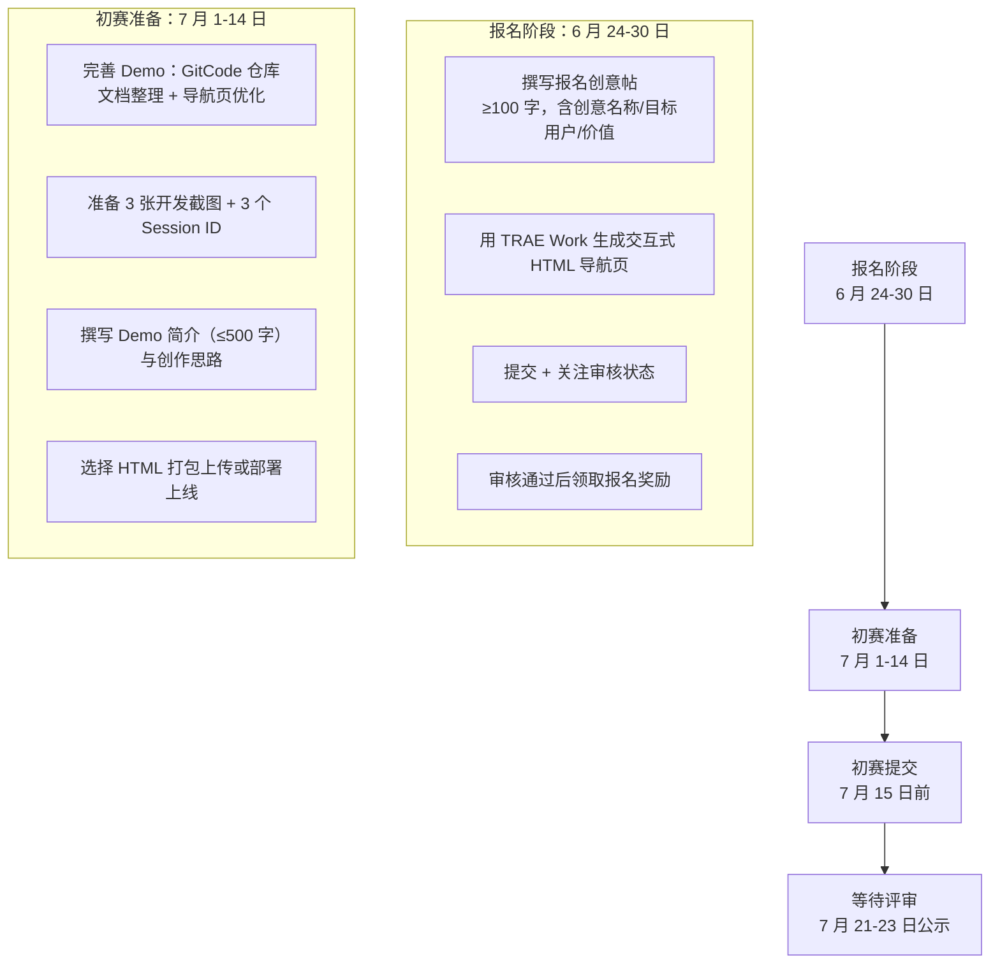

+++
id = "retrospective-specweave-contest-advantage-analysis-20260624-export"
date = "2026-06-24"
type = "export-suggestions"
source = "SpecWeave 项目全部资产 + TRAE 大赛 FAQ 分析"
+++

# 四、参赛策略与行动建议

## 4.1 参赛策略总纲

### 4.1.1 赛道选择

**推荐：应用赛道**（有创意 + 有 Demo）

不推荐工具赛道的原因是：SpecWeave 本质上是"一套规范体系 + 一套方法论"，虽然在工程上有 23 个验证脚本，但其核心价值不在「工具效率提升」而在「协作方法论创新」。应用赛道对创新的包容度更高，且「创意不评判好坏」——评审更关注完整性而非审美。

### 4.1.2 创意定位（一句话）

**「让 AI 协作不再是随机对话，而是有序工程」**

—— 我是怎么用 TRAE 做出一套方法来指导所有 AI 协作的

### 4.1.3 目标用户

| 用户层级 | 具体画像 | 痛点 | SpecWeave 的解决方案 |
|----------|---------|------|--------------------|
| 主要用户 | AI 开发团队（5-20 人，需规范 AI 协作流程） | AI 智能体之间沟通混乱、上下文丢失、产出质量不稳定 | AGENTS.md 单一入口路由 + 7 角色分工 + 5 项协作协议 |
| 次要用户 | 个人开发者（希望提升与 AI 协作的效率与一致性） | 每次对话从零开始，经验无法沉淀 | .agents/ 规范模板可直接克隆使用 |

### 4.1.4 Demo 策略

| 方案 | 优先级 | 说明 |
|------|--------|------|
| 核心 Demo | P0 | GitCode 开源仓库本身（279 个 MD 文件 + 完整导航索引） |
| 补充 Demo 1 | P0 | TRAE Work 生成的交互式 HTML 导航页（可视化浏览规范体系） |
| 补充 Demo 2 | P1 | 场景录屏：展示一次完整的「策划→实现→复盘」协作流程 |
| 补充 Demo 3 | P1 | 对比演示：有 AGENTS.md 规范 vs 无规范 的 AI 协作效率差异 |

### 4.1.5 差异化叙事主线

```
"别人用 TRAE 做了一个东西，我用 TRAE 做了一套方法论。
 这套方法论让所有用 TRAE 的人都能做得更好。"
```

## 4.2 短板识别与应对策略

| 序号 | 短板 | 风险等级 | 具体风险 | 应对策略 |
|------|------|---------|---------|---------|
| 1 | Demo 是文档仓库而非可交互应用 | 中 | 评审可能觉得"不够直观"，无法快速理解价值 | 赛前用 TRAE Work 生成交互式 HTML 导航页；报名帖开头用类比降低理解门槛（"SpecWeave 之于 AI 开发团队，如同 Scrum 之于敏捷团队"） |
| 2 | 专业性过强，受众窄 | 中 | 评审可能不熟悉「智能体协作规范体系」这个概念 | 报名帖正文用 3 段话讲清楚：① 问题（AI 开发团队遇到的沟通混乱）→ ② 方案（SpecWeave 怎么做）→ ③ 证明（142 次 TRAE 协作的量化成果） |
| 3 | 抖音传播难度大 | 低 | 技术内容在抖音上不易获得高互动（需≥500 点赞才计分） | 首选专业评审通道（300 席）；如需走抖音通道，用「对比实验」形式：展示有规范 vs 无规范的 AI 协作效率差异，视觉化呈现 |

## 4.3 参赛全流程行动清单



### 4.3.1 报名阶段（6 月 24-30 日）

| 优先级 | 行动项 | 具体内容 | 预计时间 |
|--------|--------|---------|---------|
| P0 | 撰写报名帖 | 创意名称：「SpecWeave — AI 智能体开发规范体系」；正文：三段式（问题→方案→证明）；附带 TRAE Work 生成的 HTML 产物 | 2 小时 |
| P0 | 生成 HTML 产物 | 用 TRAE Work 生成一个交互式导航页面，可视化展示 .agents/ 体系结构和量化成果 | 1 小时 |
| P1 | 发帖提交 | 在 TRAE 社区大赛报名专区发帖 | 15 分钟 |
| P1 | 关注审核 | 每日检查审核状态，不通过立即重新发帖 | 持续 |

### 4.3.2 初赛准备（7 月 1-14 日）

| 优先级 | 行动项 | 具体内容 | 预计时间 |
|--------|--------|---------|---------|
| P0 | 完善 Demo | 确保 GitCode 仓库文档完整、导航清晰；HTML 导航页功能完整 | 4 小时 |
| P0 | 准备截图 | 选取最能体现协作深度和量化成果的 3 张截图（如 Mermaid 架构图、Git 提交历史、验证脚本运行结果） | 30 分钟 |
| P0 | 准备 Session ID | 从 TRAE 对话历史中选取 3 个最有代表性的 Session ID（如产生重大模式萃取的对话、工具链重构的对话、架构决策的对话） | 15 分钟 |
| P0 | 撰写 Demo 简介 | 500 字以内，突出「用什么做」「怎么做」「做出了什么」「有什么价值」 | 1 小时 |
| P1 | 部署/打包 | 选择 HTML 打包上传（建议不部署，直接提供 GitCode 链接） | 15 分钟 |

### 4.3.3 可选的抖音传播策略

如果决定走抖音人气通道（作为专业评审的辅助）：

| 内容方向 | 具体形式 | 目标互动方式 |
|----------|---------|------------|
| 对比实验 | 同一任务——有 AGENTS.md 规范 5 分钟完成，无规范 20 分钟反复沟通 | 引发开发者共鸣（评论讨论"我也遇到过"） |
| 知识可视化 | 用 Mermaid 动画展示 SpecWeave 的四层闭环架构 | 评论提问"这个架构怎么迁移到我的项目" |
| 成果展示 | 34 个方法论的思维导图 + 10 个原创概念的卡片式展示 | 收藏（作为参考资料） |

> ⚠️ 抖音作品发布后不得删除或设私密，内容不得含二维码或站外链接。

## 4.4 赛后延续规划

| 阶段 | 行动 |
|------|------|
| 赛后 1 个月 | 根据大赛评审反馈优化项目文档和导航页 |
| 赛后 3 个月 | 提交 AGENTS.md 标准社区的 best-practice 案例 |
| 赛后 6 个月 | 发布 SpecWeave CLI 工具，降低规范体系的采用门槛 |
| 长期 | 将复盘方法论应用于更多 AI 工具（Cursor、Copilot 等），输出兼容性矩阵 |

---

*数据来源：SpecWeave 项目全量资产 + [TRAE 大赛 FAQ 分析](../retrospective-trae-contest-faq-analysis-20260624/)*
