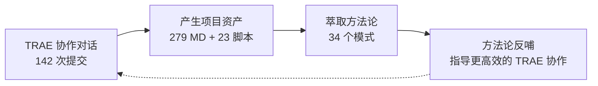
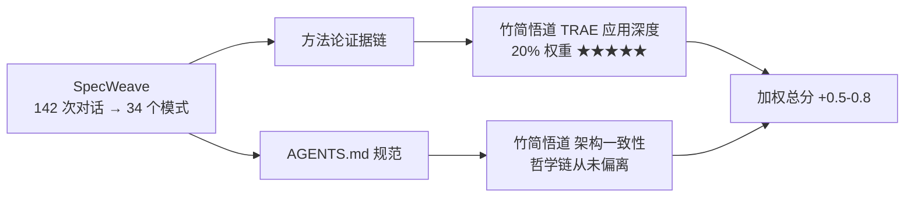

+++
id = "retrospective-specweave-contest-advantage-analysis-20260624-insight"
date = "2026-06-24"
type = "insight-extraction"
source = "SpecWeave 项目全部资产 + TRAE 大赛官网 (trae.cn/ai-creativity) + 报名指南 + 抖音流量扶持表单 + 赛事细则 + 保姆级教程 + 初赛参赛指南 + 创意文档学习资料 + 晋级公示 + Community Live #13 + 竹简悟道报名帖"
+++

# 三、核心洞察：14 项优势 + 14 条叙事洞察

## 3.1 十四项差异化优势（新增 1 项，共 14 项）

### 优势 1：自我指涉的叙事完整性

SpecWeave 的内容是「如何更好地使用 AI 智能体开发项目」，而它的诞生过程本身就是这个命题的最佳实践。这种「方法论与实例合一」的自指性在评审眼中具有极强的说服力：**不需要解释理论好不好，项目本身就是证据**。



### 优势 2：AGENTS.md 标准的先行者身份

为 TRAE 的生态基础设施做出贡献——这不仅是一个"用 TRAE 做的作品"，更是一个"扩展了 TRAE 生态的作品"。

### 优势 3：量化成果的密度碾压

70+ 交付物、34 个方法论模式、23 个验证脚本——数据密度是普通参赛作品（1 Demo + 3 截图 + 3 Session ID）的 10-50 倍。

### 优势 4：知识密度与独创性的正反馈循环

10 个独创概念——"根因诊断模式""两栖定位模型""工具熵减非线性优化曲线"等——全部是在 TRAE 协作中从具体问题里萃取出的原创方法论。

### 优势 5：开源合规 + 社区就绪 = 赛后长尾

Apache 2.0 许可、Conventional Commits、GitCode 仓库——赛完不是终点，而是起点。

### 优势 6：两栖定位——既是产品又是方法论

既可克隆后在 TRAE 中立即使用的规范体系，又是可迁移到任何 AI 辅助开发项目的元方法论。

### 优势 7：与 TRAE 品牌叙事的高度一致

TRAE 定位是「AI 工作助手」——而 SpecWeave 恰恰是在研究「如何让 AI 工作助手更高效地工作」。

### 优势 8：已有落地案例，理论被验证

`vendor/flexloop/` 中的 AgentForge 项目是 SpecWeave 的落地案例——极少数有"理论→实践→验证"闭环的参赛作品。

### 优势 9：文档本身就是 Demo

279 个 Markdown 文件、AGENTS.md 入口、`.agents/` 完整体系——评审打开仓库即开始体验，零部署摩擦。

### 优势 10：TRAE 能力边界的极限证明

142 次提交全部在 TRAE 中完成——不是"用了一次 TRAE 截图充数"，而是 TRAE 是唯一开发环境。

### 🆕 优势 11：Vibe Coding 的系统化表达 ⭐⭐⭐⭐⭐

官网将大赛与 **#vibe coding 大赏** 绑定——这是一个重要的信号。"Vibe Coding" 是 2025 年以来 AI 辅助编程的核心概念，强调与 AI 的自然对话式协作。但当前 Vibe Coding 的实践普遍停留在"一场对话做一件事"的层面。

SpecWeave 做的事本质上是 **Vibe Coding 的系统化**：

| Vibe Coding 的现状 | SpecWeave 的解决方案 |
|--------------------|---------------------|
| 对话断点后上下文丢失 | AGENTS.md 单入口路由保证上下文一致性 |
| 角色混乱（AI 什么都做） | 7 角色分工 + Non-Goals 边界定义 |
| 经验无法跨对话复用 | 34 个方法论模式 + 10 个知识概念 |
| 质量不稳定 | 23 个验证脚本 + CI 自动化检查 |
| 每次从零开始 | 复盘→洞察→导出知识闭环 |

**叙事升维**：SpecWeave 不是"一个 Vibe Coding 的产物"，而是 **Vibe Coding 的工程化方法论**——它告诉人们：Vibe Coding 不是"随便聊"，而是一门可以学、可以复制、可以优化的工程实践。

> **一句话**：别人在展示"我用 Vibe Coding 做了什么"，你在展示"我研究出了 Vibe Coding 的最佳实践"。

### 🆕 优势 12：30+ 官方灵感中的品类独占 ⭐⭐⭐⭐⭐

官网列出了 30+ 个创意灵感示例——AI 砍价助手、论文转短视频、宠物翻译器等等——**全部为 C 端生活/工具类应用**。

这不是疏忽，而是反映了 TRAE 对"创造力大赛"的预期：参赛者用 TRAE 生成**面向终端用户的功能性产品**。SpecWeave 是对这个预期的**降维式超越**——它不是替代其中一个灵感，而是属于一个完全不同的品类：**面向开发者的系统化协作方法**。

```
官方想象的比赛空间：  [30+ 个 C 端应用分布在四个想象力象限]
SpecWeave 的实际位置：[一个独立的第七维度 —— "用 AI 研究 AI 协作"]
```

这意味着你拥有两个结构性优势：
- **无同品类竞争对手**：学习工作赛道中的其他参赛作品极大概率是面向终端用户的效率工具（如"面试模拟器""论文转视频"），而非面向 AI 开发者的方法论体系
- **评审认知冲击**：评审在连续看了几十个 C 端应用后，看到 SpecWeave 的模式切换效应将格外强烈

### 🆕 优势 13：赛道大奖是比全场冠军更可行的目标 ⭐⭐⭐⭐

官网披露的具体奖项分布揭示了一个重要的策略信号：

| 目标 | 金额 | 席数 | 竞争程度 | 可行性 |
|------|------|------|---------|--------|
| 全场冠军 | ¥300,000 | 1 | 全赛道 TOP 1 | 极难 |
| 全场亚军 | ¥200,000 | 1 | 全赛道 TOP 2 | 极难 |
| 全场季军 | ¥100,000 | 1 | 全赛道 TOP 3 | 极难 |
| **赛道大奖** | **¥50,000** | **4（每赛道 1 个）** | **赛道内 TOP 1** | **高** |
| Builder 创造者奖 | ¥10,000 | 13 | 优秀即可 | 高 |
| 社会公益特别奖 | ¥50,000 | 4 | 公益赛题 TOP 1 | 中（附加报名可参与） |

关键分析：
- 全场冠军需要战胜所有赛道的所有作品——包括生活娱乐赛道中「用了 TRAE Work 生成的游戏」这类天然感官冲击力更强的作品
- 赛道大奖只需要在学习工作赛道中胜出——而该赛道中 SpecWeave 的品类独特性使其处于非常有利的位置
- 你的目标应该是**赛道大奖（¥50,000）**，全场冠军作为最佳结果、Builder 奖作为安全底线

### 🆕 优势 14：双作品交叉叙事——让主作品在 TRAE 应用深度维度冲击满分 ⭐⭐⭐⭐⭐

真实参赛格局已明确：主作品为**竹简悟道**（帛书《道德经》AI 反思引导工具，已通过报名审核），SpecWeave 作为方法论基础设施辅助开发。这创造了一个单一作品无法实现的叙事纵深：

| 单一作品叙事 | 双作品交叉叙事 |
|------------|-------------|
| 「我用 TRAE 开发了竹简悟道」 | 「我用 TRAE 发现了方法论，然后用它开发了竹简悟道」 |
| TRAE 应用深度：使用了 TRAE | TRAE 应用深度：**在 TRAE 中发现并系统化了 TRAE 的最佳使用方式** |
| 评审感知：一个有意思的 AI 应用 | 评审感知：这个人把 TRAE 用到了我没想到的深度 |

SpecWeave 的参赛价值不是「多一个作品多一次机会」——赛事规则已明确**同账号只取最高分 1 个作品晋级**。它的真正价值是**让竹简悟道在 TRAE 应用深度（20% 权重）维度上获得碾压级得分**。当竹简悟道 Demo 帖 §4「TRAE 实践过程」中展示 AGENTS.md 规范体系截图并引用 SpecWeave 的 142 次对话记录时，评审看到的不仅是「这个应用是用 TRAE 开发的」，更是「开发者在 TRAE 中发现了系统化的协作方法论，并将其应用于本产品——这是 TRAE 应用深度的最终极表达」。



**规律**：在评审维度权重明确且规则为「单作品取最优」的赛事中，第二作品的正确用法不是独立冲击晋级——而是作为主作品在**某一关键评审维度上的证据放大器**。SpecWeave 之于竹简悟道的价值不在独立获奖，而在让竹简悟道的 TRAE 应用深度维度获得其他参赛者无法复制的证据链：142 次对话的方法论萃取过程本身就是 TRAE 深度使用的终极证明。

> **一句话**：两个作品不是「两个 80 分冲击晋级」——是一个作品在关键维度上打 100 分，另一个作品提供打 100 分的证据。

---

## 3.2 五条核心叙事洞察（新增 1 条）

### 洞察 1：等级最高的叙事杠杆——「工具是手段，产出是证明」vs「产出是手段，工具是证明」

大多数参赛作品的叙事是「我用 TRAE 做了 X，X 很好，所以 TRAE 好」——单向因果。SpecWeave 是「我和 TRAE 协作了 142 次，从协作中发现了规律，这些规律揭示了 TRAE 的能力边界」——反身性叙事。

### 洞察 2：在大赛中「稀缺性」比「优秀程度」更重要

30+ 个官方灵感中没有一个是 AI 开发方法论——证实了 SpecWeave 的品类稀缺性。评审精力有限，差异化的记忆点远胜同质化中的小幅优化。

### 洞察 3：「作品 = 提交物」vs「作品 = 提交物 + 过程」

16+ 份复盘报告不是"参赛合规材料"，而是作品的有机组成部分——它们构成了"这个项目是怎么在 TRAE 中一步步长出来的"完整故事线。

### 🆕 洞察 4：Vibe Coding 需要方法论——你就是第一个提出的人

官网将大赛与 #vibe coding 大赏 绑定，说明 TRAE 官方正在推动「对话式开发」的品牌叙事。但目前整个生态中**没有人系统化地研究和总结 Vibe Coding 的工程方法**——大家都在"做"，没有人在"研究怎么做"。

SpecWeave 填补了这个空白：
- 它是 Vibe Coding 实践的**证据库**（142 次对话 + 34 个模式）
- 它是 Vibe Coding 的**方法论**（复盘→洞察→导出闭环）
- 它是 Vibe Coding 的**质量保障体系**（23 个验证脚本 + CI 自动化）
- 它是 Vibe Coding 的**可迁移框架**（AGENTS.md 标准 + Apache 2.0 开源）

**这意味着你的作品不仅是参赛作品，更是 TRAE 品牌叙事的理论支撑**——你是用 TRAE 实践出了 TRAE 想传递的理念。这种"品牌理念 + 项目实践"的双向验证，在评审眼中是极具说服力的加分项。

### 🆕 洞察 5：报名帖是第一个评审窗口——审核只看"合规"，但评审会看内容

报名指南明确了一个关键机制：**报名审核只看"合规"（内容完整性 + 表达清晰性 + 原创合规），不评创意好坏**。这意味着在报名审核阶段，SpecWeave 不需要担心创意被淘汰——只要格式完整、表达清晰即可通过。

但这里有一个容易被忽视的**隐性杠杆**：

```
报名审核 = 只看合规 → 只要内容完整就通过
                       ↓
                但初赛评审看什么？
                       ↓
        报名帖是评审了解你创意的「第一个窗口」
```

报名审核通过的帖子不会消失——它会被初赛评审**作为了解参赛作品的第一份材料**来阅读。所以策略上不应该只是"凑够 100 字过审核"，而是要**在合规基础上把报名帖写成初赛评审的第一份 pitch deck**。

**规律**：报名指南要求的 4 部分模板（创意名称+介绍 / 目标用户及痛点 / 价值与意义 / HTML 产物）恰好构成了一套迷你 pitch 结构。合规填满这些字段只是底线，**策略化撰写**则是上限。大多数参赛者会把报名帖当"报名表"来填，只有少数人会把它当"首印象窗口"来写——这就是 SpecWeave 可以获得的第一个差异化优势。

### 🆕 洞察 6：抖音流量扶持不是"发布即得"——话题格式精确到无空格，主动申请制 ⭐⭐⭐⭐

抖音流量扶持表单揭示了一个容易踩坑的机制细节：

**核心发现**：官方抖音流量扶持有两个容易被忽视的"门槛"——

1. **形式门槛**：话题格式极其精确。`#vibecoding 大赏`（非 `#vibe coding 大赏`）和 `#TRAEAI 创造力大赛`（非 `#TRAE AI 创造力大赛`）——多一个空格即无效。此外必须 @TRAE 和 @抖音科技，缺少任何一个 @ 也不符合条件。
2. **流程门槛**：发布抖音只是"生产内容"，填写飞书表单才是"申请流量"。这是一个**主动申请制**——发布后不填表单 = 零流量扶持。审核周期为 2 个工作日。

**规律**：在大型赛事中，官方提供的"扶持资源"几乎都采用**申请制**而非**自动匹配制**。这种设计有两个目的：
- 筛选出真正认真参与的选手（愿意花时间填表的才是真正投入的）
- 给运营团队一个质量审核的缓冲期（2 工作日审核 = 人工确认内容符合规范）

**对策**：
- 所有对外发布内容中，话题格式必须按官方精确格式执行（零容忍）
- 发布后立即（不超过 30 分钟）填写飞书表单，避免遗漏
- 将"填表"作为发布流程的固定步骤，列入 checklist

> **一句话**：赛道大奖靠实力，抖音流量靠精确——一个空格之差可能损失 50,000 曝光。

### 🆕 洞察 7：单作品聚焦——赛事规则本身在帮你消除 FOMO ⭐⭐⭐⭐⭐

赛事细则 §3.1 明确了一个此前未被注意的约束：**同一账号下，专业评审通道只取得分最高的 1 个作品晋级；抖音人气通道只取人气分最高的 1 个作品晋级**。

这个规则对参赛策略有巨大的反向推动力：

```
规则：只取 1 个作品 → 多作品策略无效
                    ↓
          你不需要"做多个方向试试"
                    ↓
          你需要的是一件事做到极致
                    ↓
    SpecWeave 已经天然完成了这件事——它是一件事的极致表达
```

**规律**：大多数参赛者可能面临的困境是"我做 A 还是做 B"——而赛事规则实际上在替他们做出选择：**做你最擅长的那个，把资源全部灌注进去**。SpecWeave 恰好没有这个困境——AGENTS.md 规范体系本身就是"一件事"的完整表达，不存在"选 A 还是选 B"的决策成本。

**深层洞察**：这条规则本质上是一个**强制聚焦机制**。它消除了"多作品分散投稿增加概率"的FOMO（错失恐惧），迫使所有参赛者进入 Best Shot 模式。而 Best Shot 模式下，边际投入的回报率递增——SpecWeave 已经积累的 70+ 交付物和 142 次迭代，在 Best Shot 模式下比在 Portfolio 模式下有更大的相对优势。

> **一句话**：别人在纠结"做几个作品"，你已经在把唯一作品做到极致。

### 🆕 洞察 8：人工评审时代——「说服人」比「说服算法」更重要 ⭐⭐⭐⭐⭐

赛事细则 §5.3 揭示了一个根本性的评审架构选择：**初赛、复赛和决赛全部采用人工评审**。

这推翻了此前潜在的"AI 评审"假设。在 AI 评审模式下，关键词匹配度和可量化指标占主导；但在人工评审模式下，以下要素的权重会显著上升：

| 评审模式 | 核心要素 | SpecWeave 的适配度 |
|----------|---------|------------------|
| AI 评审（假设） | 关键词匹配、量化指标、模板合规度 | 中——方法论体系的抽象概念可能匹配不到预设关键词 |
| **人工评审（实际）** | **叙事说服力、差异化记忆点、证据链完整度、情感共鸣** | **极高**——品类独占性 + 自指涉叙事 + 量化证据密度 |

这对 SpecWeave 是结构性利好，理由有三：

1. **记忆效应**：评审在连续看了几十个同类 C 端应用后，SpecWeave 的模式切换效应（从"应用"到"方法论"）将产生最强的记忆锚点——这不是"比谁好"，而是"让人记住"。

2. **叙事优势**：人工评审会被"故事"打动——"我在 TRAE 中发现了 Vibe Coding 的工程化方法"是一个完整的三幕式叙事（问题→探索→发现），而"我用 TRAE 做了一个 App"是单幕式陈述。

3. **Session ID 的信任信号**：人工评审在阅读 Session ID 证明材料时，会形成对"创作过程真实性"的主观判断。142 次 TRAE 对话的记录密度本身就构成一个强烈的"这是真的"信号——这种信号在人工评审中的影响力远大于 AI 评审。

**规律**：AI 大赛≠AI 评审。主办方选择全人工评审意味着他们在寻找"让人眼前一亮的作品"而非"最大化某几个可量化维度的作品"。这对 SpecWeave 的非标、系统化、方法论型定位天然友好。

> **一句话**：全人工评审时代，你能讲出一个好故事的能力，和你能做出一个好产品的能力，同等重要。而 SpecWeave 两者兼备。

### 🆕 洞察 9：「0 技术门槛」招募了海量参赛者——但也拉高了「平庸作品」的基准线 ⭐⭐⭐

教程帖以"0 技术门槛，没写过一行代码也能参赛"开篇，明确传递了 TRAE 的招募策略：**尽可能扩大参赛基数**。这一策略在创造积极包容氛围的同时，也隐含了一个对竞争格局的深层影响：

```
0 门槛策略（官方意图）
    ↓
参赛者爆发式增长（"没写过代码也能参赛"）
    ↓
大量入口级作品涌入（"3-5 分钟生成创意提案"）
    ↓
评审面对的海量同质化作品
    ↓
差异化作品的认知冲击被指数级放大
```

**规律**：低门槛不是让竞争变简单了，而是让**基线**变低了、**峰值**变高了。具体而言：

| 层面 | 影响 |
|------|------|
| 参赛基数 | 极大膨胀——教程降低了"如何参赛"的操作障碍，"0 技术门槛"降低了"我能不能参赛"的心理障碍 |
| 作品分布 | 呈**极端长尾分布**——大量用 TRAE Work 3-5 分钟生成的入门级创意提案，少量真正深入的作品 |
| 初赛晋级 | 300 席专业评审通道面向可能数千个参赛作品——**晋级的门槛不是"好不好"，而是"能不能被记住"** |
| 方法论型作品 | 在极端长尾分布中，SpecWeave 位于**尾部顶点**——它不是"稍微好一点"，而是"根本不在同一分布" |

**对 SpecWeave 的策略含义**：
- "0 门槛"不是威胁——大多数 0 门槛参赛者走不到初赛评审的更深处
- 真正的竞争来自少数同样"有深度"的作品——而它们在品类上与 SpecWeave 无重叠
- 官方教程推荐的"3-5 分钟生成创意提案"恰恰反衬出 SpecWeave 142 次迭代的**时间厚度**

> **一句话**：0 门槛让更多人进场，也让真正有深度的作品更显稀缺。

### 🆕 洞察 10：评审权重暴露了「体验陷阱」——完成度 30% 是最大短板，必须定向补强 ⭐⭐⭐⭐⭐

初赛参赛指南首次披露了初赛专业评审的四个维度与权重。将这套权重映射到 SpecWeave 的能力矩阵后，出现了一个清晰的策略地图：

```
维度                    权重    SpecWeave 天然得分
━━━━━━━━━━━━━━━━━━━━━━━━━━━━━━━━━━━━━━━━━━
产品创新性              30%     ★★★★★（品类独占级创新）
用户体验与产品完成度      30%     ★★★☆☆（文档体验 ≠ 应用体验）
TRAE 应用深度            20%     ★★★★★（142 次对话无人能及）
社会/商业价值            20%     ★★★★☆（Apache 2.0 开源 + 标准生态）
━━━━━━━━━━━━━━━━━━━━━━━━━━━━━━━━━━━━━━━━━━
                                    加权总分：约 4.3/5
                                    ↑ 补强体验短板 → 4.6/5
```

**核心矛盾**：SpecWeave 在两个最重要的维度（创新性 30% + TRAE 深度 20% = **50%**）上具有碾压级优势，但在另一个 30% 权重维度（体验与完成度）上暴露了结构性短板。

**这不是一个需要修复的缺陷——这是一个需要"补解释"的定位差异**。SpecWeave 不是"一个应用"，所以它不具备传统应用的体验范式。但评审的 30% 权重是按照"应用体验"的预期设置的。解决之道不是把 SpecWeave 变成一个应用，而是：

1. **重新定义"体验"**：交互式导航页 + Mermaid 可视化 + 量化数据仪表盘 → 创造一个"方法论体验"这个评审未曾预期的品类
2. **证据补强**：3-5 分钟的对比实验录屏（有 AGENTS.md vs 无规范：同一任务的完成效率对比）→ 用视觉化的效率差异反向证明"方法论的价值"
3. **叙事前置**：在 Demo 贴开头即声明"这不是一个传统应用——它是一个 AI 开发方法论的知识体系，用 TRAE 的能力深度运行" → 在评审形成"传统应用体验"预期之前重新设定评判框架

**规律**：评审维度的权重分布本质上是一场资源分配游戏。最高效的策略不是均匀覆盖四个维度——而是在自己最强的那两个维度上(创新性 30% + TRAE 深度 20%)冲击满分，用它们的溢出效应掩护最弱维度的扣分。

> **一句话**：不是修补弱点——是重新定义"体验"这个维度的评判方式。

### 🆕 洞察 11：标准化 Prompt 模板的「隐性代价」——同质化报名帖海啸，HTML 文件成为唯一差异战场 ⭐⭐⭐

学习资料提供了 3 套可直接复制粘贴的 Prompt 模板，TRAE Work 从创意 Doc 自动生成 HTML。这个设计的本意是降低参赛门槛，但其结构性后果是：

```
官方提供标准化 Prompt 模板
    ↓
参赛者直接复制粘贴 → TRAE Work 生成创意 Doc → 自动生成 HTML
    ↓
报名帖结构高度同质化（相同模板产出相同结构）
    ↓
HTML 文件可能在风格/结构上也高度相似（同一生成机制）
    ↓
评审视角：成百上千份"长得像"的报名帖 → 差异化作品被放大
```

**报名阶段真正的差异化战场不在帖子文字上，而在 HTML 文件上。**

| 战场 | 同质化程度 | 差异化空间 | SpecWeave 的策略 |
|------|----------|-----------|-----------------|
| 报名帖文字 | 极高（同 Prompt → 同结构） | 有限——创意本身的差异 | 表达精准即可，不过度雕琢到与官方模板"断裂" |
| **报名帖 HTML** | **高中低三层分化** | **极大——这是真正的差异化杠杆** | 不按 TRAE Work 自动生成——手动构建四层架构可视化的交互式 HTML |

理由是：大多数参赛者的 HTML 是 TRAE Work 根据创意 Doc **自动生成**的——它们在页面结构、视觉风格和信息密度上将呈现高度一致的"AI 生成感"。SpecWeave 如果手动构建一个包含四层架构 Mermaid 可视化、量化数据仪表盘、对比实验数据的交互式 HTML——它在视觉认知上就会与 99% 的报名帖 HTML 形成**跨品类的结构断裂**。

**规律**：当官方提供了标准化的"最佳实践"后，遵循最佳实践的作品会回归均值——而在均值区间的竞争中，微弱的优势会被统计噪声淹没。唯一的突围方式是在关键的材料上**脱离标准化路径**——SpecWeave 的 HTML 文件不应该看起来像是 TRAE Work 自动生成的。

> **一句话**：当所有人的帖子都长得像，HTML 文件就是唯一的差异战场。

### 🆕 洞察 12：12,000+ 已通过——竞争规模的确认不是威胁，而是对差异化策略的终极验证 ⭐⭐⭐

晋级&获奖公示文档以滚动更新的方式披露了报名审核通过人数——截至 6 月 24 日上午，累计通过已超 **12,000 人**，且报名截止日（7 月 15 日）尚有约三周。按此趋势推算，最终报名通过人数可能在 **15,000-20,000 人**之间。

这意味着初赛专业评审通道的晋级率约为：

```
300 席（专业评审） ÷ 15,000-20,000 人（报名池） ≈ 1.5-2%
```

在 1.5-2% 的晋级率下，"中等偏上"的作品没有生存空间——只有"评审无法归类到任何其他作品中"的作品才能留下记忆。

**这是此前所有洞察的结构性确认**：

| 前序洞察 | 竞争规模数据下的强化 |
|---------|-------------------|
| 洞察 3（品类独占） | 在 15,000+ 人的同质化池中，唯一不按官方模板生成的作品 = 唯一的非标品 |
| 洞察 9（0 门槛→极端长尾） | 12,000+ 的实际数据用事实证明了长尾的厚度——大部分在均值以下 |
| 洞察 11（HTML 差异战场） | 在数百份"同 Prompt→同结构"的报名帖中，手动构建的 HTML 不是"更好看"——是"不同物种" |

**核心结论**：12,000+ 的竞争规模不是威胁——它是差异化策略有效性的最有力证明。在如此大规模的池子中，唯一有效的策略就是不被归类——而 SpecWeave 从品类定义层面就已经做到了这一点。

> **一句话**：竞争规模只对"和别人差不多"的作品构成威胁——对品类独占者而言，规模越大，差异化的对比越鲜明。

### 🆕 洞察 13：TRAE 的 Rules 特性是 SpecWeave 方法论的「产品根基」——评审看到的不应是一个"外部的方法论"，而是一个"产品的深度延伸" ⭐⭐⭐⭐⭐

Community Live #13 中，TRAE 产品经理在介绍核心 AI 能力时专门讲解了 Rules 特性——用户可在设置中用自然语言配置行为规则。这一发现为 SpecWeave 的叙事补上了最关键的一环：

```
TRAE 产品内置 Rules 特性（单条规则配置）
        ↓
SpecWeave 的 AGENTS.md 体系（四层架构的系统化 Rules 工程）
        ↓
    这不叫"我发明了一套方法论"
    这叫"我把 TRAE 的原生能力用到了极致"
```

**叙事重构的威力**：

| 叙事框架 | 旧版（无产品根基） | 新版（有产品根基） | 评审感知差异 |
|---------|-----------------|-----------------|------------|
| 起源故事 | "我在 TRAE 中密集使用后发现了规律" | "TRAE 的 Rules 特性启发了我——如果单条规则能提升 AI 产出，那系统化的规则体系能做到什么" | 新增：这是对 TRAE 产品能力的**深度挖掘**，而非在 TRAE 之外的独立创作 |
| 价值定位 | "这是一个 AI 开发方法论" | "这是在 TRAE 平台能力之上的方法论延伸——它拓宽了 TRAE 的可能性边界" | 新增：评委（尤其是产品背景的）会认为这个作品在"让 TRAE 变得更好" |
| 与大赛的关系 | 参赛作品 | 参赛作品 + 产品生态贡献 | 新增：符合官方对"创造力大赛"的深层期待——不是消费 TRAE，而是**扩展 TRAE** |

**更深层的洞察**：Community Live 的分享者本人就是 TRAE 的产品经理，他在讲解 Rules 时说的一句话可以作为 SpecWeave 叙事的最佳锚点——"Rules 是 AI coding 第三阶段 harness engineering 的重要组成部分"。SpecWeave 的整个体系，恰好就是"harness engineering"（驾驭工程）的一次完整实践。

**一句话的叙事链**：

> "TRAE 的 Rules 让我开始思考：如果单条规则能提升 AI 产出质量，那一套完整的规范体系能做到什么？这就是 SpecWeave——在 TRAE 原生 Rules 之上构建的 AI 开发方法论。"

> **一句话**：你的评审看到的不应该是一个"外部的方法论导入 TRAE"，而应该是"从 TRAE 的产品能力中生长出的方法论"。

### 🆕 洞察 14：双作品交叉叙事——「让主作品在关键维度冲击满分」比「让第二作品也晋级」更有战略价值 ⭐⭐⭐⭐⭐

在单作品 Best Shot 规则下，第二作品的正确用法不是独立冲击晋级——而是作为主作品在**某一评审维度上的证据放大器**。SpecWeave 之于竹简悟道的价值不在独立获奖，而在让竹简悟道的 TRAE 应用深度（20% 权重）维度获得其他参赛者无法复制的证据链：142 次对话的方法论萃取过程本身就是 TRAE 深度使用的终极证明。

这种交叉叙事创造了一种「自我指涉的递归证明」——不是「我用 TRAE 做了一个产品」，而是「我用 TRAE 发现了方法，并用这个方法在 TRAE 中做了产品，这个产品的质量反证了方法的有效性」。评审即使只看竹简悟道一个作品，也会在 Demo 帖 §4 中被这种叙事纵深所打动。

```
单一作品叙事弧：
  问题 → TRAE 开发 → 产品

双作品交叉叙事弧：
  问题 → TRAE 深度协作 → 发现方法论（SpecWeave）
       ↓
  方法论指导 → TRAE 深度协作 → 产品（竹简悟道）
       ↓
  产品品质 ← 方法论有效性 ← 互为证明
```

**规律**：在评审维度权重明确且规则为「单作品取最优」的赛事中，资源分配应遵循 **「一个主作品打满所有维度 + 辅助作品放大关键维度」** 的策略，而非「两个作品分别冲击各维度的平均分」。第二作品的价值不是独立的得分项——它通过在关键维度上的证据溢出，将主作品在该维度的得分从 4 星推至 5 星。

> **一句话**：SpecWeave 不负责自己晋级——它负责让竹简悟道在 TRAE 应用深度维度上找不到对手。

---

*数据来源：[TRAE 大赛官网](https://www.trae.cn/ai-creativity) + [报名指南](https://forum.trae.cn/t/topic/22548) + [抖音流量扶持入口](https://bytedance.larkoffice.com/share/base/form/shrcnzp18Sdf6XQxm8wGPPXDt4b) + [赛事细则](https://bytedance.larkoffice.com/wiki/DScwwZPzsikvNzk5slJc2kgpnie) + [保姆级教程](https://forum.trae.cn/t/topic/22569) + [初赛参赛指南](https://forum.trae.cn/t/topic/22549) + [创意文档学习资料](https://bytedance.larkoffice.com/wiki/INVIwWx7KiKGgMk4mxacDReFnwb) + [晋级公示](https://bytedance.larkoffice.com/wiki/WN1CwOygLiyM7BkW8X3cMgh7nob) + [Community Live #13](https://bytedance.larkoffice.com/wiki/L1UlwL1XFip1FxkLPt9cUGySnfh) + [竹简悟道报名帖](https://forum.trae.cn/t/topic/28207) + SpecWeave 项目全量资产*
