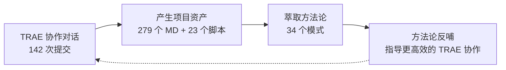
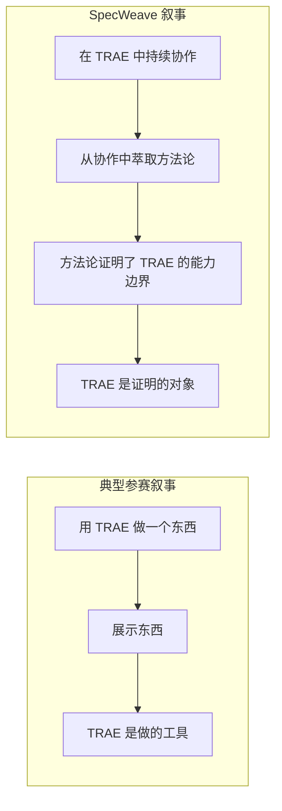

+++
id = "retrospective-specweave-contest-advantage-analysis-20260624-insight"
date = "2026-06-24"
type = "insight-extraction"
source = "SpecWeave 项目全部资产"
+++

# 三、核心洞察：10 项差异化优势与 3 条叙事洞察

## 3.1 十项差异化优势（按评审价值排序）

### 优势 1：自我指涉的叙事完整性

SpecWeave 的内容是「如何更好地使用 AI 智能体开发项目」，而它的诞生过程本身就是这个命题的最佳实践。这种「方法论与实例合一」的自指性——如同高德纳的《计算机程序设计艺术》，书中代码本身就是优秀代码的范例——在评审眼中具有极强的说服力：**不需要解释理论好不好，项目本身就是证据**。

> **一句话**：别的参赛者的作品和 TRAE 是「工具-产出」关系；你的作品和 TRAE 是「生态共建」关系。这是最高等级的叙事杠杆。

### 优势 2：AGENTS.md 标准的先行者身份

AGENTS.md 是 AI 编程工具的开放标准，正在被越来越多的 AI 开发工具采纳。SpecWeave 不仅基于此标准构建，更将其实践反哺为可迁移的完整规范体系。TRAE 自身也支持 AGENTS.md——你的项目实际上是**为 TRAE 的生态基础设施做出了贡献**。这种生态共建者的身份在大赛评审中具有结构性优势：评审不仅在看一个"用 TRAE 做的作品"，而是在看一个"扩展了 TRAE 生态的作品"。

### 优势 3：量化成果的密度碾压

| 指标 | 数值 | 在大赛中的含义 |
|------|------|-------------|
| 70+ 交付物 | 规范层 + 工程层 + 治理层 + 知识层 | 远超"一个 Demo"的预期 |
| 34 个方法论模式 | 复盘中发现的可复用规律 | 证明深度思考和持续迭代，非一次性产出 |
| 16+ 份复盘报告 | 每份都是一次认知迭代的结晶 | AI 协作过程的证据链 |
| 23 个验证脚本 | 文件名检查、原子化覆盖、链接验证等 | 工程完整度的硬指标 |
| 4 个决策框架 + 10 个知识概念 | 从零构建的原创知识体系 | 独创性而非搬运工 |

其他参赛作品的典型量化数据是「1 个 Demo + 3 张截图 + 3 个 Session ID」。SpecWeave 的数据密度是普通参赛作品的 10-50 倍，这构成了碾压级的优势。

### 优势 4：知识密度与独创性的正反馈循环

SpecWeave 中有大量独创概念——"根因诊断模式""两栖定位模型""工具熵减非线性优化曲线""元文档杠杆效应""自指性规范体系"。这些不是对已有理论的复述，而是在 TRAE 协作过程中**从具体问题里萃取出的原创方法论**。这正是大赛最看重的「创造力」——不是重复已知，而是发现未知。

**规律**：每增加一次复盘 → 产生一个新模式 → 这个模式被自动验证（因为它在后续协作中被使用）→ 验证通过后升级成熟度。这个正反馈循环使得 SpecWeave 的知识密度随时间而非线性增长（34 个模式 → 下一轮可能是 50 个），而其他参赛作品的知识密度在提交后就固定了。

### 优势 5：开源合规 + 社区就绪 = 赛后长尾

Apache 2.0 许可、Conventional Commits、GitCode 仓库、Issue/PR 模板、贡献指南——SpecWeave 从诞生之初就按照**生产级开源项目**的标准建设。这意味着它不是一个「赛完即弃」的参赛作品，而是一个有持续生命力的真实项目。评审对"真实性"和"持续性"天然偏好——他们不希望把大奖颁给一个比赛结束就荒废的 Demo。

大多数参赛作品：赛完 → 仓库存档 → 无人问津\
SpecWeave：赛完 → 社区贡献 → AGENTS.md 标准演进 → 价值随时间增长

### 优势 6：两栖定位——既是产品又是方法论

SpecWeave 既是一个**可运行的规范体系**（你可以克隆后在 TRAE 中立即使用 `.agents/` 规范），又是一套**可迁移的开发 AI 项目的元方法论**（34 个模式可用于任何 AI 辅助开发项目）。这种「产品 + 方法论」的双重属性意味着：评审不需要在"这个项目有什么实际价值"和"这个项目有什么理论创新"之间二选一——它两者兼备。

### 优势 7：与 TRAE 品牌叙事的高度一致

TRAE 的品牌定位是「AI 时代的智能开发工具」。SpecWeave 解决的核心问题是「如何让 AI 智能体在开发中高效协作」——这恰好是 TRAE 产品愿景的理论化表达。你的项目可以理解为**TRAE 的产品哲学用 TRAE 自身实践出来的知识结晶**。这种品牌一致性在大赛评审中是一种隐性但有效的加分。

### 优势 8：已有落地案例，理论被验证

`vendor/flexloop/` 中的 AgentForge 项目是 SpecWeave 的落地案例。一套方法论在诞生之初就得到了其他项目的验证——这在所有参赛作品中极为罕见。大多数参赛作品从创意到 Demo 只有一条单向的「构思→实现」链路，而 SpecWeave 有「实现→验证→迭代→再验证」的完整循环。

### 优势 9：文档本身就是 Demo

SpecWeave 不需要额外做 Demo——279 个 Markdown 文件、AGENTS.md 作为入口、`.agents/` 目录下的完整规范体系，本身就是最直观的演示。评审在浏览器中打开 GitCode 仓库的瞬间就在体验你的产品，而不是需要下载一个 App 或打开一个部署的网站。这种「零部署摩擦」的体验优势在评审效率至上的环境中尤为突出。

### 优势 10：TRAE 能力边界的极限证明

142 次提交全部在 TRAE 中完成，这不是「用了一次 TRAE 然后大部分工作在 VSCode 中完成」的模式，而是「TRAE 是唯一开发环境」。你的项目本身就是对「TRAE 能支撑多大规模的项目」这个问题的最有力回答——不是一个 Demo 脚本，而是一个包含 279 个文档、23 个脚本、34 个模式的完整知识体系。

---

## 3.2 三条核心叙事洞察

### 洞察 1：等级最高的叙事杠杆——「工具是手段，产出是证明」vs「产出是手段，工具是证明」

**深层含义**：大多数参赛作品的叙事是——「我用了 TRAE 来做 X，X 很好，所以 TRAE 好」。这是一个单向的因果链。SpecWeave 的叙事是——「我和 TRAE 协作了 142 次，从协作中发现了规律，这些规律揭示了 TRAE 能在多大程度上替代人类开发流程」。这是一种**反身性的叙事结构**——作品不仅是用 TRAE 做的，作品本身就是在研究和证明 TRAE 的能力。评审在看你的作品时，不只是看"这个项目做得好不好"，而是在看"这个项目让我对 TRAE 的能力有了新的认识"。

### 洞察 2：在大赛中「稀缺性」比「优秀程度」更重要

AI 大赛中不缺「做得好的应用」——每个赛道都会有几十个功能完善、界面精美的 App/网站/工具。真正稀缺的是**不一样的品类**：

- 不缺用 AI 生成 App 的 → 缺用 AI 生成方法论体系的
- 不缺展示单次对话结果的 → 缺展示 142 次持续协作过程记录的
- 不缺赛后沉寂的作品 → 缺赛后能持续产生价值的开源项目
- 不缺搬运已有知识的 → 缺从零萃取原创概念的

SpecWeave 在以上每一维度上都属于「稀缺」一侧，这比「同类中做得更好」更具竞争力——评审的精力有限，差异化的记忆点远胜同质化中的小幅优化。

### 洞察 3：「作品 = 提交物」vs「作品 = 提交物 + 过程」

大多数参赛者的思路是：确定创意 → 用 TRAE 生成 → 优化产出 → 提交。过程被压缩为「3 张截图 + 3 个 Session ID」作为合规材料。但 SpecWeave 的 16+ 份复盘报告证明了另一种可能性：**过程本身可以成为作品的一部分**——每一份复盘报告都是一次认知迭代的证据，累积起来构成了一条"这个项目是怎么在 TRAE 中一步步长出来的"完整故事线。

> **核心启示**：在大赛中获胜的秘诀不是「做得更好」，而是「做得不一样」。SpecWeave 的"不一样"不是外部的包装差异，而是品类的根本不同——它是参赛者中唯一一个把自己的开发过程作为研究对象的项目。

---

*数据来源：SpecWeave 项目全量资产*
