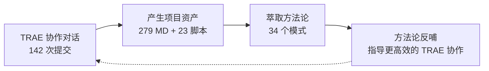

+++
id = "retrospective-specweave-contest-advantage-analysis-20260624-insight"
date = "2026-06-24"
type = "insight-extraction"
source = "SpecWeave 项目全部资产 + TRAE 大赛官网 (trae.cn/ai-creativity) + 报名指南 + 抖音流量扶持表单"
+++

# 三、核心洞察：13 项优势 + 6 条叙事洞察

## 3.1 十三项差异化优势（新增 3 项，共 13 项）

### 优势 1：自我指涉的叙事完整性

SpecWeave 的内容是「如何更好地使用 AI 智能体开发项目」，而它的诞生过程本身就是这个命题的最佳实践。这种「方法论与实例合一」的自指性在评审眼中具有极强的说服力：**不需要解释理论好不好，项目本身就是证据**。



### 优势 2：AGENTS.md 标准的先行者身份

为 TRAE 的生态基础设施做出贡献——这不仅是一个"用 TRAE 做的作品"，更是一个"扩展了 TRAE 生态的作品"。

### 优势 3：量化成果的密度碾压

70+ 交付物、34 个方法论模式、23 个验证脚本——数据密度是普通参赛作品（1 Demo + 3 截图 + 3 Session ID）的 10-50 倍。

### 优势 4：知识密度与独创性的正反馈循环

10 个独创概念——"根因诊断模式""两栖定位模型""工具熵减非线性优化曲线"等——全部是在 TRAE 协作中从具体问题里萃取出的原创方法论。

### 优势 5：开源合规 + 社区就绪 = 赛后长尾

Apache 2.0 许可、Conventional Commits、GitCode 仓库——赛完不是终点，而是起点。

### 优势 6：两栖定位——既是产品又是方法论

既可克隆后在 TRAE 中立即使用的规范体系，又是可迁移到任何 AI 辅助开发项目的元方法论。

### 优势 7：与 TRAE 品牌叙事的高度一致

TRAE 定位是「AI 工作助手」——而 SpecWeave 恰恰是在研究「如何让 AI 工作助手更高效地工作」。

### 优势 8：已有落地案例，理论被验证

`vendor/flexloop/` 中的 AgentForge 项目是 SpecWeave 的落地案例——极少数有"理论→实践→验证"闭环的参赛作品。

### 优势 9：文档本身就是 Demo

279 个 Markdown 文件、AGENTS.md 入口、`.agents/` 完整体系——评审打开仓库即开始体验，零部署摩擦。

### 优势 10：TRAE 能力边界的极限证明

142 次提交全部在 TRAE 中完成——不是"用了一次 TRAE 截图充数"，而是 TRAE 是唯一开发环境。

### 🆕 优势 11：Vibe Coding 的系统化表达 ⭐⭐⭐⭐⭐

官网将大赛与 **#vibe coding 大赏** 绑定——这是一个重要的信号。"Vibe Coding" 是 2025 年以来 AI 辅助编程的核心概念，强调与 AI 的自然对话式协作。但当前 Vibe Coding 的实践普遍停留在"一场对话做一件事"的层面。

SpecWeave 做的事本质上是 **Vibe Coding 的系统化**：

| Vibe Coding 的现状 | SpecWeave 的解决方案 |
|--------------------|---------------------|
| 对话断点后上下文丢失 | AGENTS.md 单入口路由保证上下文一致性 |
| 角色混乱（AI 什么都做） | 7 角色分工 + Non-Goals 边界定义 |
| 经验无法跨对话复用 | 34 个方法论模式 + 10 个知识概念 |
| 质量不稳定 | 23 个验证脚本 + CI 自动化检查 |
| 每次从零开始 | 复盘→洞察→导出知识闭环 |

**叙事升维**：SpecWeave 不是"一个 Vibe Coding 的产物"，而是 **Vibe Coding 的工程化方法论**——它告诉人们：Vibe Coding 不是"随便聊"，而是一门可以学、可以复制、可以优化的工程实践。

> **一句话**：别人在展示"我用 Vibe Coding 做了什么"，你在展示"我研究出了 Vibe Coding 的最佳实践"。

### 🆕 优势 12：30+ 官方灵感中的品类独占 ⭐⭐⭐⭐⭐

官网列出了 30+ 个创意灵感示例——AI 砍价助手、论文转短视频、宠物翻译器等等——**全部为 C 端生活/工具类应用**。

这不是疏忽，而是反映了 TRAE 对"创造力大赛"的预期：参赛者用 TRAE 生成**面向终端用户的功能性产品**。SpecWeave 是对这个预期的**降维式超越**——它不是替代其中一个灵感，而是属于一个完全不同的品类：**面向开发者的系统化协作方法**。

```
官方想象的比赛空间：  [30+ 个 C 端应用分布在四个想象力象限]
SpecWeave 的实际位置：[一个独立的第七维度 —— "用 AI 研究 AI 协作"]
```

这意味着你拥有两个结构性优势：
- **无同品类竞争对手**：学习工作赛道中的其他参赛作品极大概率是面向终端用户的效率工具（如"面试模拟器""论文转视频"），而非面向 AI 开发者的方法论体系
- **评审认知冲击**：评审在连续看了几十个 C 端应用后，看到 SpecWeave 的模式切换效应将格外强烈

### 🆕 优势 13：赛道大奖是比全场冠军更可行的目标 ⭐⭐⭐⭐

官网披露的具体奖项分布揭示了一个重要的策略信号：

| 目标 | 金额 | 席数 | 竞争程度 | 可行性 |
|------|------|------|---------|--------|
| 全场冠军 | ¥300,000 | 1 | 全赛道 TOP 1 | 极难 |
| 全场亚军 | ¥200,000 | 1 | 全赛道 TOP 2 | 极难 |
| 全场季军 | ¥100,000 | 1 | 全赛道 TOP 3 | 极难 |
| **赛道大奖** | **¥50,000** | **4（每赛道 1 个）** | **赛道内 TOP 1** | **高** |
| Builder 创造者奖 | ¥10,000 | 13 | 优秀即可 | 高 |
| 社会公益特别奖 | ¥50,000 | 4 | 公益赛题 TOP 1 | 中（附加报名可参与） |

关键分析：
- 全场冠军需要战胜所有赛道的所有作品——包括生活娱乐赛道中「用了 TRAE Work 生成的游戏」这类天然感官冲击力更强的作品
- 赛道大奖只需要在学习工作赛道中胜出——而该赛道中 SpecWeave 的品类独特性使其处于非常有利的位置
- 你的目标应该是**赛道大奖（¥50,000）**，全场冠军作为最佳结果、Builder 奖作为安全底线

---

## 3.2 四条核心叙事洞察（新增 1 条）

### 洞察 1：等级最高的叙事杠杆——「工具是手段，产出是证明」vs「产出是手段，工具是证明」

大多数参赛作品的叙事是「我用 TRAE 做了 X，X 很好，所以 TRAE 好」——单向因果。SpecWeave 是「我和 TRAE 协作了 142 次，从协作中发现了规律，这些规律揭示了 TRAE 的能力边界」——反身性叙事。

### 洞察 2：在大赛中「稀缺性」比「优秀程度」更重要

30+ 个官方灵感中没有一个是 AI 开发方法论——证实了 SpecWeave 的品类稀缺性。评审精力有限，差异化的记忆点远胜同质化中的小幅优化。

### 洞察 3：「作品 = 提交物」vs「作品 = 提交物 + 过程」

16+ 份复盘报告不是"参赛合规材料"，而是作品的有机组成部分——它们构成了"这个项目是怎么在 TRAE 中一步步长出来的"完整故事线。

### 🆕 洞察 4：Vibe Coding 需要方法论——你就是第一个提出的人

官网将大赛与 #vibe coding 大赏 绑定，说明 TRAE 官方正在推动「对话式开发」的品牌叙事。但目前整个生态中**没有人系统化地研究和总结 Vibe Coding 的工程方法**——大家都在"做"，没有人在"研究怎么做"。

SpecWeave 填补了这个空白：
- 它是 Vibe Coding 实践的**证据库**（142 次对话 + 34 个模式）
- 它是 Vibe Coding 的**方法论**（复盘→洞察→导出闭环）
- 它是 Vibe Coding 的**质量保障体系**（23 个验证脚本 + CI 自动化）
- 它是 Vibe Coding 的**可迁移框架**（AGENTS.md 标准 + Apache 2.0 开源）

**这意味着你的作品不仅是参赛作品，更是 TRAE 品牌叙事的理论支撑**——你是用 TRAE 实践出了 TRAE 想传递的理念。这种"品牌理念 + 项目实践"的双向验证，在评审眼中是极具说服力的加分项。

### 🆕 洞察 5：报名帖是第一个评审窗口——审核只看"合规"，但评审会看内容

报名指南明确了一个关键机制：**报名审核只看"合规"（内容完整性 + 表达清晰性 + 原创合规），不评创意好坏**。这意味着在报名审核阶段，SpecWeave 不需要担心创意被淘汰——只要格式完整、表达清晰即可通过。

但这里有一个容易被忽视的**隐性杠杆**：

```
报名审核 = 只看合规 → 只要内容完整就通过
                       ↓
                但初赛评审看什么？
                       ↓
        报名帖是评审了解你创意的「第一个窗口」
```

报名审核通过的帖子不会消失——它会被初赛评审**作为了解参赛作品的第一份材料**来阅读。所以策略上不应该只是"凑够 100 字过审核"，而是要**在合规基础上把报名帖写成初赛评审的第一份 pitch deck**。

**规律**：报名指南要求的 4 部分模板（创意名称+介绍 / 目标用户及痛点 / 价值与意义 / HTML 产物）恰好构成了一套迷你 pitch 结构。合规填满这些字段只是底线，**策略化撰写**则是上限。大多数参赛者会把报名帖当"报名表"来填，只有少数人会把它当"首印象窗口"来写——这就是 SpecWeave 可以获得的第一个差异化优势。

### 🆕 洞察 6：抖音流量扶持不是"发布即得"——话题格式精确到无空格，主动申请制 ⭐⭐⭐⭐

抖音流量扶持表单揭示了一个容易踩坑的机制细节：

**核心发现**：官方抖音流量扶持有两个容易被忽视的"门槛"——

1. **形式门槛**：话题格式极其精确。`#vibecoding 大赏`（非 `#vibe coding 大赏`）和 `#TRAEAI 创造力大赛`（非 `#TRAE AI 创造力大赛`）——多一个空格即无效。此外必须 @TRAE 和 @抖音科技，缺少任何一个 @ 也不符合条件。
2. **流程门槛**：发布抖音只是"生产内容"，填写飞书表单才是"申请流量"。这是一个**主动申请制**——发布后不填表单 = 零流量扶持。审核周期为 2 个工作日。

**规律**：在大型赛事中，官方提供的"扶持资源"几乎都采用**申请制**而非**自动匹配制**。这种设计有两个目的：
- 筛选出真正认真参与的选手（愿意花时间填表的才是真正投入的）
- 给运营团队一个质量审核的缓冲期（2 工作日审核 = 人工确认内容符合规范）

**对策**：
- 所有对外发布内容中，话题格式必须按官方精确格式执行（零容忍）
- 发布后立即（不超过 30 分钟）填写飞书表单，避免遗漏
- 将"填表"作为发布流程的固定步骤，列入 checklist

> **一句话**：赛道大奖靠实力，抖音流量靠精确——一个空格之差可能损失 50,000 曝光。

---

*数据来源：[TRAE 大赛官网](https://www.trae.cn/ai-creativity) + [报名指南](https://forum.trae.cn/t/topic/22548) + [抖音流量扶持入口](https://bytedance.larkoffice.com/share/base/form/shrcnzp18Sdf6XQxm8wGPPXDt4b) + SpecWeave 项目全量资产*
