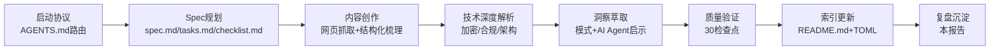

# 执行过程复盘

## 一、执行时间线

| 阶段 | 关键活动 | 产出 |
|------|---------|------|
| 启动协议 | 读取AGENTS.md、上下文路由、确定任务类型 | 路由决策确认 |
| Spec规划 | 创建spec.md（PRD）、tasks.md（11个任务）、checklist.md（30检查点） | Spec三文件 |
| 内容创作 | 抓取网页内容、梳理信息架构、组织10章结构 | Wiki主体框架 |
| 技术解析 | 加密算法、合规认证、安全架构深度分析 | 技术章节完成 |
| 洞察萃取 | 可复用模式、AI Agent安全启示、优化建议 | 洞察章节完成 |
| 质量验证 | checklist逐项验证、文件名规范检查、链接验证 | 所有[x]通过 |
| 索引更新 | README.md更新计数、TOML元数据创建 | 知识库索引完成 |
| 复盘沉淀 | 四步复盘流程、模式入库建议 | 本复盘报告 |

## 二、量化统计

| 指标 | 数值 | 说明 |
|------|------|------|
| **Wiki文档行数** | 2249行 | 主教程文档 |
| **章节数** | 10章36子节 | 覆盖产品全维度 |
| **Mermaid图表** | 2个 | 防护架构流程图+双重验证时序图 |
| **对比表格** | 6个 | 三大场景对比、算法对比、认证对比等 |
| **FAQ问题** | 15个 | 个人用户10个+企业用户5个 |
| **可复用模式** | 5个 | 场景化安全矩阵、用户主权默认等 |
| **AI Agent启示** | 6点 | 安全设计原则映射 |
| **优化建议** | 7项 | 建设性产品改进方向 |
| **任务总数** | 11个 | 全部[x]完成 |
| **检查点总数** | 30个 | 全部[x]通过 |
| **新增文件** | 2个 | Wiki文档+TOML元数据 |
| **修改文件** | 1个 | docs/knowledge/README.md |
| **总文件变更** | 3个 | 不含复盘报告本身 |

## 三、产出物清单

### 3.1 核心产出

| 文件 | 路径 | 行数 | 说明 |
|------|------|------|------|
| 主Wiki教程 | [sunlogin-security-wiki.md](file:///d:/AI/docs/knowledge/learning/sunlogin-security-wiki.md) | 2249 | 10章完整教程 |
| TOML元数据 | [sunlogin-security-wiki.toml](file:///d:/AI/.meta/toml/docs/knowledge/learning/sunlogin-security-wiki.toml) | 7 | MDI规范配套元数据 |
| 知识库索引 | [README.md](file:///d:/AI/docs/knowledge/README.md) | 更新 | 条目230→231，learning 128→129 |

### 3.2 Spec文档

| 文件 | 路径 | 说明 |
|------|------|------|
| PRD文档 | [spec.md](file:///d:/AI/.trae/specs/retrospectives-insights/sunlogin-security-product-learning/spec.md) | 产品需求文档 |
| 任务分解 | [tasks.md](file:///d:/AI/.trae/specs/retrospectives-insights/sunlogin-security-product-learning/tasks.md) | 11个任务，全部完成 |
| 验证清单 | [checklist.md](file:///d:/AI/.trae/specs/retrospectives-insights/sunlogin-security-product-learning/checklist.md) | 30检查点，全部通过 |

### 3.3 复盘产出（本次）

| 文件 | 说明 |
|------|------|
| README.md | 复盘总览 |
| execution-retrospective.md | 本文件：执行过程复盘 |
| insight-extraction.md | 洞察萃取报告 |
| export-suggestions.md | 导出建议与行动项 |

## 四、成功因素分析

### 4.1 流程层面

1. **严格遵循启动协议**：任务开始时正确读取AGENTS.md、上下文路由表，选择正确的Spec路径，避免了路由错误导致的返工
2. **Spec先行**：在执行前完成完整的PRD、任务分解、检查清单，确保执行过程有明确的验收标准
3. **单任务串行执行**：按照Spec Mode要求一次只执行一个任务，确保每个任务验证通过后再进入下一个
4. **质量门禁前置**：每个任务完成后立即验证，而不是最后统一验证，降低了问题累积风险

### 4.2 内容层面

1. **结构化信息架构**：采用"产品概述→核心概念→场景特性→防护体系→技术实现→合规认证→专业洞察→优化方向→FAQ→资源"的10章逻辑递进结构，符合从入门到深入的认知规律
2. **技术深度与通俗表达平衡**：对加密算法、合规认证等专业内容，既保证技术准确性，又提供通俗易懂的解释和类比（如"筛子模型"）
3. **跨领域视角**：不仅分析产品本身，还提炼出可复用的设计模式，并映射到AI Agent系统安全设计，提升了内容的长期价值
4. **可视化辅助**：使用Mermaid流程图直观展示复杂的安全架构和验证流程，降低理解门槛

### 4.3 工具使用层面

1. **正确使用Skill工具**：对于元文档操作（创建Wiki、更新索引等），遵循项目规范使用正确的流程
2. **文件名规范验证**：使用项目提供的check-filename-convention.py脚本验证，确认新文件符合kebab-case命名规范
3. **并行工具调用**：在读取多个参考文件时使用并行调用提高效率，但在编辑操作时保持串行以避免冲突

## 五、同类任务对比（向日葵系列学习）

| 任务 | 文档行数 | Mermaid图表 | 可复用模式 | AI Agent启示 | 特色 |
|------|---------|-------------|-----------|-------------|------|
| 向日葵五款无网远控硬件 | ~1500 | 有 | 有 | 有 | 硬件矩阵对比 |
| 向日葵智能PDU | 1001 | - | 2个 | 5点 | 两代产品深度对比 |
| 向日葵开机盒子/插排 | ~800 | - | - | - | 入门级硬件解析 |
| **向日葵安全产品（本次）** | **2249** | **2个** | **5个** | **6点** | **安全体系深度+AI安全映射** |

本次任务的内容规模、洞察深度、可复用模式数量均为向日葵系列学习任务中最高，特别是安全领域的跨领域映射（远控安全→AI Agent安全）具有较高的方法论价值。

## 六、问题与改进点

### 6.1 执行中发现的问题

1. **TOML元数据文件遗漏**：上下文恢复后最初忘记创建配套的TOML元数据文件，在最终质量检查时发现并补充。这是上下文压缩导致的认知视野收窄问题。
2. **文件名检查误报**：check-filename-convention.py脚本报告了一个不相关的历史文件问题（myst.yml.template），但不影响本次新增文件。

### 6.2 改进建议

1. **上下文恢复检查清单**：在会话恢复时增加一个"配套文件检查"步骤，确认MDI规范要求的所有配套文件（TOML元数据、索引更新等）都已完成
2. **跨领域洞察模板化**：将"产品经验→AI Agent设计启示"的映射过程固化为模板，在后续产品学习任务中标准化应用
