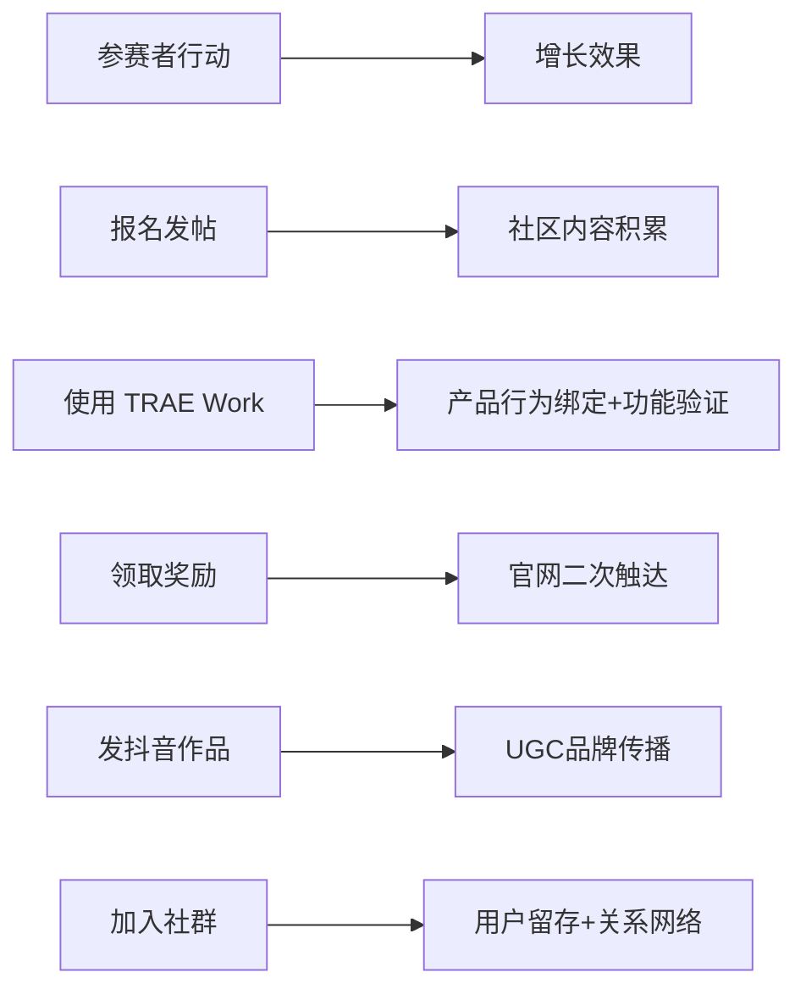

# 洞察 1：赛事设计本质是增长设计——FAQ 即增长策略说明书

浏览整份 FAQ 文档可以发现，每一个问答条目的背后，不仅是用户疑问的回应，更是对产品增长飞轮中关键节点的精心调校：

```
报名帖 → 社区内容池积累
Session ID → 产品使用行为绑定
创意 HTML → TRAE Work 能力验证
奖励领取 → 大赛官网二次触达
抖音作品发布 → UGC 裂变传播
社群答疑 → 用户留存与关系沉淀
```

**规律**：赛事并非独立于产品之外的市场活动，而是深度嵌入产品增长逻辑的系统设计。报名帖同时是社区种子内容，Session ID 同时是产品功能推广，抖音视频同时是品牌传播素材。每一个"参赛步骤"都被设计为一个"增长触点"。

**深层含义**：优秀的赛事运营不是「办一场比赛」，而是「设计一个增长引擎」。从这个意义上说，FAQ 文档本身就是一份增长策略说明书——它定义了每个增长触点的行为规范、预期产出和风险兜底。对于 AI 产品的冷启动而言，这种「赛产品一体化」的策略比单纯的市场投放或内容营销更具杠杆效应。



---

> **关联模块**：
> - [insight-02-no-judgment-double-edged-sword.md](insight-02-no-judgment-double-edged-sword.md)
> - [insight-05-from-function-to-ecosystem.md](insight-05-from-function-to-ecosystem.md)
> - *数据来源：[TRAE AI 创造力大赛 FAQ 文档](https://bytedance.larkoffice.com/wiki/Mv7CwCVNNiK2v6k28K8cP5NrnSe)*
