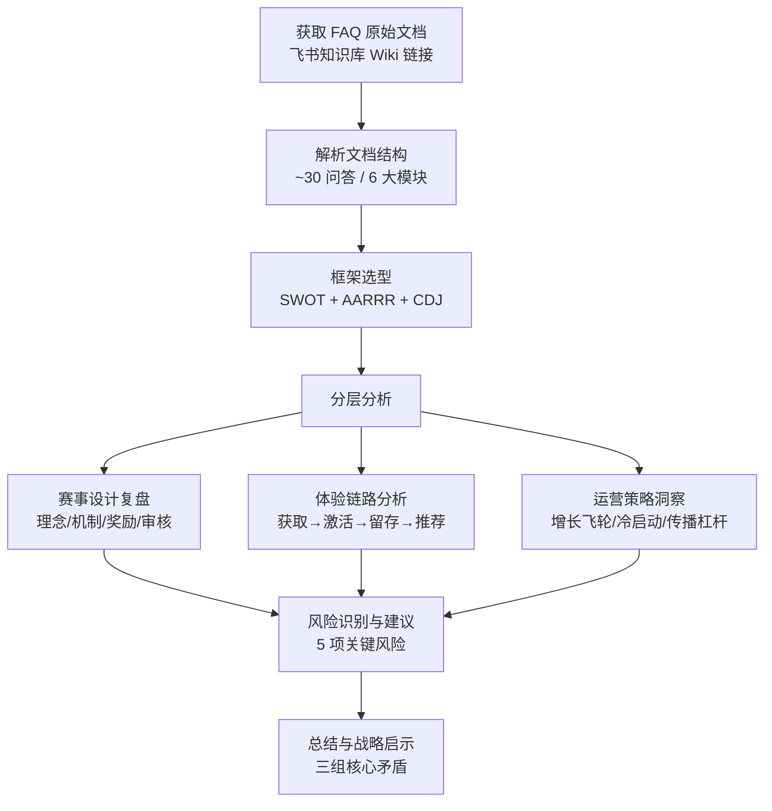

# 二、执行复盘

## 2.1 分析流程回顾



## 2.2 FAQ 文档结构拆解

| 模块 | 问答数量 | 核心关注点 |
|------|---------|-----------|
| 一、报名相关 | 11 | 参赛资格、报名流程、审核标准、组队限制 |
| 二、初赛相关 | 6 | 提交内容、部署要求、Session ID、多作品规则 |
| 三、晋级通道与抖音人气 | 6 | 双通道机制、人气分计算、公示流程 |
| 四、奖励与领取 | 6 | 分层奖励、领取流程、发放时间、税务说明 |
| 五、账号、资格与作品要求 | 5 | 账号一致性、开发工具限制、原创要求 |
| 六、公示、交流与异议 | 3 | 结果查询、申诉渠道、社群入口 |

## 2.3 赛事设计框架分析

### 2.3.1 核心设计理念：零门槛 + 工具驱动

赛事明确提出「0 门槛，面向所有人开放」的定位，底层逻辑并非传统技术竞赛的「选拔精英」，而是以 AI 工具（TRAE Work）为核心杠杆的「赋能大众」策略。

从战略角度看，赛事同时承担三重目标：(1) **拉新获客**——通过赛事吸引用户在 TRAE 平台注册与使用；(2) **产品验证**——借助参赛者真实使用场景打磨 TRAE Work 的产品体验；(3) **社区冷启动**——以赛事内容填充 TRAE 官方中文社区的内容生态。

### 2.3.2 SWOT 分析

| 维度 | 优势/机会 | 劣势/威胁 |
|------|----------|----------|
| **S 优势** | 四大赛道覆盖广泛场景；社会公益赛题拓宽参与动机；报名审核不评判创意好坏，降低竞争焦虑 | FAQ 信息密度高，检索特定问题困难；仅支持个人参赛，限制作品复杂度；多创意得分只取最高，可能造成失落感 |
| **W 劣势** | （见优势列右侧） | 审核周期「每个工作日」造成周末提交者等待断裂；奖励领取出错率高（两种失败场景）；报名不通过只能重发帖，无法修改再审 |
| **O 机会** | 双通道晋级扩大覆盖人群；抖音通道利用 UGC 传播产生自然裂变；7 月中旬截止给足打磨时间 | 抖音人气通道存在刷量作弊风险；排名仅公示 TOP 100，多数参赛者缺乏反馈；国际版用户奖励仅限中国版月卡 |
| **T 威胁** | （见机会列右侧） | 初赛 Demo 质量评判标准模糊；评审压力后置（报名不筛质量 → 初赛大量作品涌入）；刷量争议可能导致公信力受损 |

### 2.3.3 奖励体系：分层激励与心理锚定

赛事的奖励体系呈现清晰的金字塔结构：

```
报名成功奖（¥99 速通月卡 + 门票）
    → 初赛参与奖（¥100 礼包，TOP 2,000）
        → 复赛晋级奖（¥239 月卡 + 导师）
            → 决赛奖金（1 万–35 万现金）
```

这一设计精准利用了行为经济学中的「沉没成本」与「损失厌恶」心理——报名即获奖励，增强继续参赛的动机；不主动领取奖励则失效，制造紧迫感。

**关键设计**：奖励「领取」而非「自动发放」是一个精心设计的转化动作——迫使用户访问大赛官网，完成二次触达，增加平台粘性。但同时引入了一个操作摩擦点。

### 2.3.4 审核与合规机制

FAQ 明确列出审核的三个维度：内容完整性、表达清晰性、原创合规。审核「不评判创意好坏」的策略降低了报名阶段的竞争焦虑，提升了参与率。但这也意味着初赛阶段的评审压力被后置——评审团队需要在大量合规作品中真正筛选出优质 Demo，对评审的人力与标准提出了更高要求。

## 2.4 AARRR 体验链路分析

### 2.4.1 获取（Acquisition）：报名阶段的摩擦点

报名设计上强调「简单」——仅需一篇社区帖 + HTML 产物。但实际存在四个潜在摩擦点：

- **注册摩擦**：需同时拥有 TRAE 中国版账号与社区账号，且手机号必须一致，构成双重注册门槛
- **审核等待**：周期为「每个工作日」，周末节假日顺延，最长可能等待 3 天
- **领取断点**：报名通过后需手动登录官网领取奖励，遗忘即错过
- **修改限制**：审核不通过时修改旧帖不重新审核，只能重新发帖，「废弃」旧帖体验不佳

### 2.4.2 激活（Activation）：从创意到 Demo 的能力跃迁

报名只需一句话生成 HTML，初赛却需「可交互、可体验的 Demo + 开发截图 + Session ID」。FAQ 通过直播、教程、社群答疑弥合这一差距，但其有效性取决于支持资源的覆盖密度和质量。

初赛不强制部署上线——HTML 打包上传即可，硬件赛道可用 Bilibili 视频替代。这降低了技术门槛，但也引入了质量评判标准的模糊性。

### 2.4.3 留存与推荐（Retention & Referral）

- **社区留存**：大赛专区下设报名、初赛、交流三个专区，形成「参赛者—评审—观众」的内容三角
- **抖音裂变**：人气分 = 点赞 + 评论×2 + 收藏 + 转发，评论权重×2 倾向于鼓励互动深度。但「单条点赞 ≥ 500 才计分」设置了较高门槛
- **传播限制**：作品发布后不得删除或私密、不得含二维码/站外链接——防止营销引流，但也限制正常分享自由度

> **体验链路总体评价**：设计逻辑清晰、激励层层递进，但在「报名审核等待 → 领取奖励 → 初赛打磨」三个节点上存在体验断裂风险，需运营侧介入弥补。

## 2.5 运营策略分析

### 2.5.1 增长飞轮设计

```
参赛者产生创意内容（社区帖子）
    → 内容吸引观众和新参赛者
        → 新参赛者注册 TRAE 并使用产品
            → 产品体验驱动口碑传播
                → 更多参赛者加入（循环）
```

飞轮能否转动取决于三个执行质量：社区审核效率、产品上手体验、优质内容的曝光机制。

### 2.5.2 抖音传播杠杆的精细化设计

| 规则设计 | 表面意图 | 深层策略意图 |
|----------|----------|--------------|
| 评论权重 ×2 | 鼓励深度互动 | 评论数据更难批量伪造，提高刷量成本 |
| 点赞 ≥ 500 才计分 | 筛选优质传播内容 | 降低人工审核成本——仅关注达到传播阈值的内容 |
| 同一作品只取最高一条 | 防止刷量，公平竞争 | 激励参赛者优化单条内容质量，而非铺量发布 |
| TOP 100 私信校验 | 身份核验，防止冒领 | 构建官方—参赛者双向触达通道，为后续运营沉淀用户关系 |

### 2.5.3 奖励财务策略

速通 Pro 月卡的本质是产品权益而非现金——边际成本趋近于零，但产生 ¥99 的心理价值锚定。决赛奖金池 113 万元为税前金额，主办方依法代扣代缴，实际支付成本低于名义金额。整体采用「产品权益锁客 + 少量现金锚定」的组合策略。

---

*数据来源：[TRAE AI 创造力大赛 FAQ 文档](https://bytedance.larkoffice.com/wiki/Mv7CwCVNNiK2v6k28K8cP5NrnSe)*
