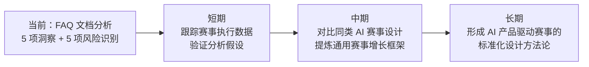

# 四、风险识别与改进建议

## 4.1 改进建议

| 序号 | 风险 | 改进措施 | 优先级 | 预期效果 |
|------|------|---------|--------|---------|
| 1 | 报名审核周期体验断裂（周末提交等待至多 3 天） | 增加自动预审机制——格式完整性与字数机器预检，通过后即时发送「已进入人工审核队列」确认 + 预计审核时间窗口 | 高 | 减少不确定性焦虑，降低冲动参赛者的流失率 |
| 2 | 奖励领取出错率高（权益冲突/风控异常两种场景） | 领取页面增加权益兼容性预检，提前告知账户状态及领取结果；为风控判断提供申诉通道，给出「异常」原因类型 | 高 | 降低领取出错导致的用户投诉与负面体验 |
| 3 | 初赛 Demo 质量评判标准缺失 | 尽早公布初赛评审维度与权重（创新性/完成度/用户体验/技术实现等）；考虑引入「社区投票」作为辅助参考 | 高 | 给参赛者明确优化方向，提升作品平均质量 |
| 4 | 抖音人气通道刷量争议风险 | 引入第三方反作弊服务辅助数据核验；公示人气榜时附带各维度明细（点赞/评论/收藏/转发）；预留候补名额 | 中 | 提升透明度和公信力，降低争议概率 |
| 5 | FAQ 信息检索效率低（约 30 问答，缺少目录导航） | 文档顶部增加分类目录（可点击跳转）；高频问题加粗高亮；社区置顶「Top 5 问题」精简版 | 低 | 提升自服务效率，降低社群重复答疑成本 |

## 4.2 行动计划

| 优先级 | 改进项 | 具体措施 | 建议时间 | 状态 |
|--------|--------|---------|---------|------|
| 高 | 初赛评审标准公布 | 发布初赛四维度评审标准及权重说明 | 初赛提交开放前 | 待规划 |
| 高 | 奖励领取预检 | 上线领取页权益兼容性检查功能 | 7 月 15 日前 | 待规划 |
| 高 | 审核自动预审 | 部署格式/字数机器预检 + 状态通知 | 报名期内 | 待规划 |
| 中 | 抖音反作弊增强 | 接入第三方数据核验服务 | 7 月 15 日前 | 待规划 |
| 低 | FAQ 导航优化 | 添加分类目录和锚点跳转 | 持续 | 待规划 |
| 低 | Top 5 FAQ 精简版 | 社区交流专区置顶高频问题 | 持续 | 待规划 |

## 4.3 可复用模式登记

| 资产 | 描述 | 复用等级 | 说明 |
|------|------|---------|------|
| 赛事增长飞轮模型 | 「报名行为 = 增长触点」的设计思维，将赛事每个步骤映射到产品增长指标 | 按场景适配 | 适用于 AI 产品的社区冷启动和用户增长场景 |
| 双通道晋级机制 | 专业评审 + UGC 人气双通道，兼顾公平性与传播性 | 直接复用 | 适用于需要同时保证专业质量与品牌传播的赛事设计 |
| 抖音传播杠杆规则设计 | 「可控的不可控」规则哲学——通过精细化规则引导而非控制 UGC 行为 | 按场景适配 | 适用于需要撬动社交媒体 UGC 的品牌活动 |
| 「有意图的摩擦」设计原则 | 区分无意义操作障碍与战略性转化节点，在体验流畅度与战略目标间平衡 | 直接复用 | 适用于增长设计中的转化节点评估 |

## 4.4 后续方向

---

*数据来源：[TRAE AI 创造力大赛 FAQ 文档](https://bytedance.larkoffice.com/wiki/Mv7CwCVNNiK2v6k28K8cP5NrnSe)*
