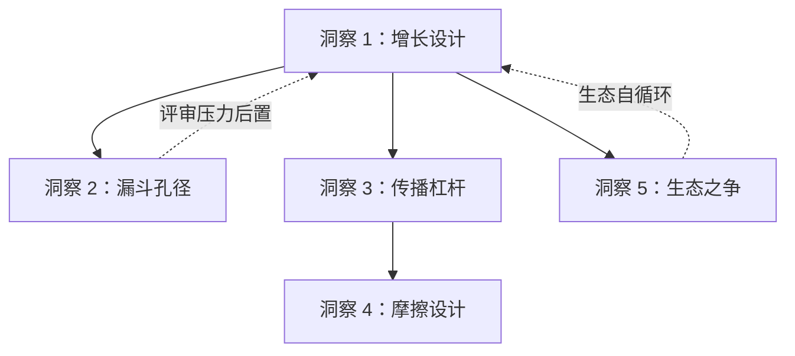

# 三、五大核心洞察（导航枢纽）

> 本文件为洞察萃取导航枢纽页。5 个洞察已原子化为独立模块，存放于 [atoms/](atoms/) 子目录，支持独立引用与增量更新。

## 洞察索引

| 编号 | 洞察主题 | 核心论点 | 原子文件 |
|------|---------|---------|---------|
| 1 | 赛事设计本质是增长设计 | FAQ 即增长策略说明书，每个参赛步骤都是增长触点 | [insight-01-contest-as-growth-engine.md](atoms/insight-01-contest-as-growth-engine.md) |
| 2 | 「不评判创意好坏」是一把双刃剑 | 报名层宽口径与初赛层精准筛选之间的结构张力 | [insight-02-no-judgment-double-edged-sword.md](atoms/insight-02-no-judgment-double-edged-sword.md) |
| 3 | 抖音人气通道是"可控的不可控" | 精细化规则下的传播杠杆设计哲学 | [insight-03-douyin-controlled-uncontrollable.md](atoms/insight-03-douyin-controlled-uncontrollable.md) |
| 4 | 奖励摩擦点是显性设计 | 「有意图的摩擦」实现二次触达+意愿确认+所有权建立 | [insight-04-reward-friction-by-design.md](atoms/insight-04-reward-friction-by-design.md) |
| 5 | 功能之争转向生态之争 | AI 产品竞争壁垒从工具能力转向生态厚度 | [insight-05-from-function-to-ecosystem.md](atoms/insight-05-from-function-to-ecosystem.md) |

## 洞察关系图

---

> **关联模块**：
> - [execution-retrospective.md](execution-retrospective.md)
> - [export-suggestions.md](export-suggestions.md)
> - *数据来源：[TRAE AI 创造力大赛 FAQ 文档](https://bytedance.larkoffice.com/wiki/Mv7CwCVNNiK2v6k28K8cP5NrnSe)*
