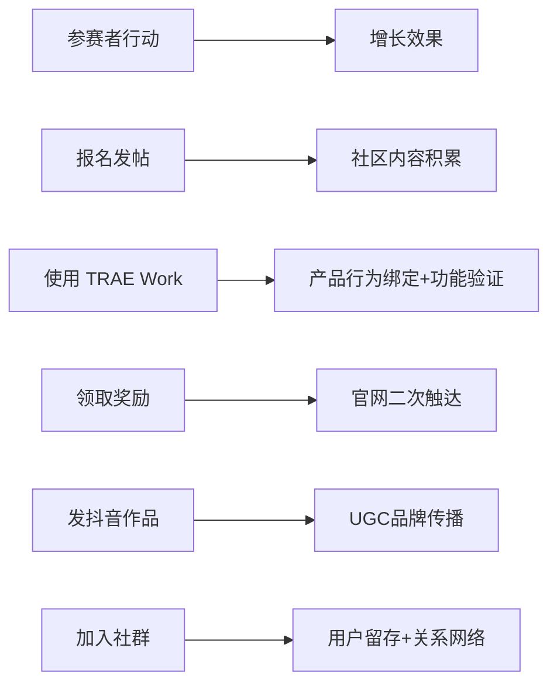

+++
id = "retrospective-trae-contest-faq-analysis-20260624-insight"
date = "2026-06-24"
type = "insight-extraction"
source = "https://bytedance.larkoffice.com/wiki/Mv7CwCVNNiK2v6k28K8cP5NrnSe"
+++

# 三、五大核心洞察

## 洞察 1：赛事设计本质是增长设计——FAQ 即增长策略说明书

浏览整份 FAQ 文档可以发现，每一个问答条目的背后，不仅是用户疑问的回应，更是对产品增长飞轮中关键节点的精心调校：

```
报名帖 → 社区内容池积累
Session ID → 产品使用行为绑定
创意 HTML → TRAE Work 能力验证
奖励领取 → 大赛官网二次触达
抖音作品发布 → UGC 裂变传播
社群答疑 → 用户留存与关系沉淀
```

**规律**：赛事并非独立于产品之外的市场活动，而是深度嵌入产品增长逻辑的系统设计。报名帖同时是社区种子内容，Session ID 同时是产品功能推广，抖音视频同时是品牌传播素材。每一个"参赛步骤"都被设计为一个"增长触点"。

**深层含义**：优秀的赛事运营不是「办一场比赛」，而是「设计一个增长引擎」。从这个意义上说，FAQ 文档本身就是一份增长策略说明书——它定义了每个增长触点的行为规范、预期产出和风险兜底。对于 AI 产品的冷启动而言，这种「赛产品一体化」的策略比单纯的市场投放或内容营销更具杠杆效应。



---

## 洞察 2：「不评判创意好坏」是一把双刃剑

报名审核「不评判创意好坏」的策略在拉新阶段极为有效——降低了参赛心理门槛，避免了初筛阶段的竞争焦虑，有利于最大化报名量。但这也产生了一个结构性问题：

**评审压力后置**：报名阶段不筛选质量 → 大量合规但质量参差不齐的作品涌入初赛 → 评审团队需要在海量作品中真正筛选优秀 Demo → 对评审标准的一致性、评审人力的充裕性、以及评审流程的公正性提出了极高要求。

**规律**：在赛事漏斗设计中，每一层筛选标准的「松」与「紧」是一个零和博弈——报名层放得越宽，初赛层的压力就越大。FAQ 中未详细披露初赛评审维度与打分标准，这使得这一结构性压力的释放路径尚不清晰。

**深层含义**：这反映了一个通用设计原则——赛事漏斗的每一层都有其最优「筛孔径」。报名层宜宽（最大化参与），初赛层宜准（精准筛选质量），复赛层宜深（深度评估潜力），决赛层宜严（严苛把关结果）。关键在于各层之间的「孔径衔接」——如果报名层的宽口径无法与初赛层的精准筛选有效衔接，漏斗就会出现「腰部膨胀」的风险。

---

## 洞察 3：抖音人气通道是"可控的不可控"——精细化规则下的传播杠杆

抖音人气通道的设计展现了一种「可控的不可控」哲学——主办方并不直接控制传播结果，但通过精细化的规则设计，将传播行为引导至期望的方向：

| 规则 | 控制的"不可控"维度 |
|------|-------------------|
| 评论权重 ×2 | 抑制纯点赞水军，引导真实互动 |
| 点赞 ≥ 500 计分 | 降低审核成本，只关注破圈内容 |
| 同作品只取最高 | 鼓励质量 > 数量 |
| 不得删除/私密 | 确保传播持续性 |
| TOP 100 私信校验 | 构建双向关系 |

**规律**：UGC 传播的本质是「不可控」的——主办方无法精确预测哪条内容会爆、谁会成为传播节点。但通过规则设计，可以将「不可控」约束在一个「可控」的框架内：让传播内容围绕作品展开（而非随意），让传播目的服务于品牌曝光（而非引流到站外），让传播结果可验证（通过数据快照与私信校验）。

**深层含义**：这是一个值得推广的「传播杠杆」设计模式——不试图控制水流的方向，而是设计河道的走向。对于任何希望撬动 UGC 传播的产品活动，这种「规则杠杆 + 用户自主」的组合策略比「中心化传播投放」更具规模效应和成本效率。

---

## 洞察 4：奖励设计中的「摩擦点」是显性设计，不是疏忽

FAQ 对奖励领取的详细说明显示，报名奖励并非自动发放，而是需要参赛者「登录大赛官网完成领取」。这看似是一个用户体验的摩擦点，但结合上下文分析，这更可能是一个显性设计而非疏忽：

1. **强制二次触达**：用户必须访问大赛官网，而非仅在社区完成报名即结束
2. **筛选真实用户**：仅真正有参赛意愿的用户才会完成领取步骤
3. **制造所有权感**：主动「领取」比被动「收到」更能建立心理所有权

**规律**：在增长设计中，并非所有摩擦都是坏的。关键在于摩擦点是否服务于战略目标——如果是「无意义的操作障碍」（如多次跳转登录），应当消除；如果是「有意义的转化节点」（如主动领取奖励以确认意愿），应当保留甚至强化。

**深层含义**：在评估一个产品设计时，不能仅从「体验流畅度」一个维度出发。FAQ 中的奖励领取流程虽然增加了操作步骤，但它同时实现了二次触达、意愿确认、和所有权建立三重战略目标。这种「有意图的摩擦」体现了设计者对用户行为心理的深入理解。

---

## 洞察 5：产品竞争已从"功能之争"转向"生态之争"

赛事设计的底层逻辑反映了当前 AI 产品竞争的核心趋势。TRAE 通过赛事构建的不是一场独立的市场活动，而是一个自生长的用户内容生态：

```
参赛者使用 TRAE 创作作品
    → 作品沉淀为社区内容资产
        → 内容吸引新用户注册并使用 TRAE
            → 更多用户→更多作品→更多内容（自循环）
```

**规律**：在 AI 工具赛道，功能差异化正在迅速缩小——各家产品的代码生成、对话交互、多模态能力趋于同质化。真正的竞争壁垒不再是「工具本身有多强」，而是「围绕工具形成的生态有多厚」：有多少人用它创作、创作了多少可展示的作品、这些作品吸引了多少新用户。

**深层含义**：赛事是冷启动生态最有效的手段之一，但关键在于赛后的生态延续。7 月 15 日报名截止、7 月下旬初赛结果公示后，TRAE 能否将赛事期间积累的社区内容、用户关系和品牌势能转化为持续运营的生态资产，将决定这次赛事投资的真正 ROI。最差的情况是「赛完即散」——内容无人维护、社区回归冷清；最好的情况是「以赛养生态」——赛事中涌现的优质创作者成为社区的长期贡献者，赛事产生的内容成为持续的流量入口。

---

*数据来源：[TRAE AI 创造力大赛 FAQ 文档](https://bytedance.larkoffice.com/wiki/Mv7CwCVNNiK2v6k28K8cP5NrnSe)*
