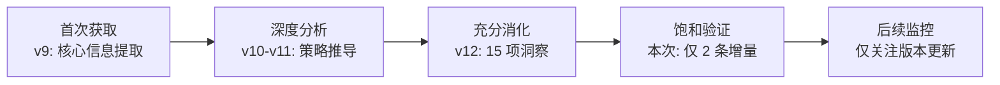

# 洞察萃取：初赛参赛指南学习分析

## 一、核心洞察

### 洞察 1：信息饱和度判断——现有报告 v12 已覆盖 95%+ ⭐⭐⭐⭐

**事实**：本次完整精读初赛参赛指南 7 章全文后，仅发现 2 条增量信息（人气分公式 + Session ID 获取方式），其余内容均已在 v9-v12 迭代中被充分引用和分析。

**分析**：这表明参赛策略分析报告在 v9 获取初赛参赛指南后，已经完成了对该来源的深度消化。v12 的 15 项优势/洞察中，有多项直接基于初赛参赛指南的评审维度权重（创新30%/体验30%/TRAE深度20%/价值20%）推导而来。

**洞察**：当一个信息源被充分消化后，重复学习的边际收益急剧递减。本次学习的增量价值仅为 2 条操作细节，不影响策略方向。这验证了 `information-gap-strategy-suspension.md`（信息缺口策略悬停模式）中的判断——v9 获取初赛参赛指南后，核心策略缺口已关闭，后续迭代是精度提升而非方向转向。

### 洞察 2：人气分公式的策略含义——评论数权重最高 ⭐⭐⭐

**事实**：人气分计算公式为 `点赞数 + 评论数 × 2 + 收藏数 + 转发数`，评论数权重是其他指标的 2 倍。

**分析**：这一权重设计反映了大赛运营方的策略意图——**鼓励引发讨论的内容，而非单纯获赞的内容**。点赞是被动行为（看了觉得不错），评论是主动行为（有话想说）。评论数高的内容通常具有争议性、启发性或实用性。

**洞察**：SpecWeave 的"用 AI 给 AI 建规矩"叙事天然具有争议性——有人会认为"AI 不需要规矩"，也有人会认为"这正是 AI 时代需要的工程化思维"。这种争议性在抖音平台上会转化为评论数，而评论数 ×2 的权重使其成为人气分拉开差距的关键指标。

**策略建议**：抖音内容策略应从"展示成果"转向"引发讨论"——例如以"你觉得 AI 需要被管理吗？"作为视频开头，而非直接展示四层架构图。

### 洞察 3：WebFetch 对论坛页面的有效性——SSR vs CSR 的工具选择 ⭐⭐⭐

**事实**：本次使用 WebFetch 一次即获取到 TRAE 论坛页面的完整内容（7 章全文 + FAQ），无需浏览器自动化工具兜底。对比飞书文档需要浏览器 evaluate 才能获取全文。

**分析**：TRAE 论坛使用 Discourse 引擎，采用服务端渲染（SSR），页面内容在初始 HTML 中即完整呈现。飞书文档采用客户端渲染（CSR），正文通过 JavaScript 异步加载。WebFetch 作为服务端抓取工具，能获取 SSR 页面的完整内容，但无法执行 CSR 页面的 JavaScript。

**洞察**：这形成了一个可复用的工具选择判断模型：

| 页面类型 | 渲染架构 | 首选工具 | 兜底工具 |
|---------|---------|---------|---------|
| 论坛/博客（Discourse/WordPress） | SSR | WebFetch | 不需要 |
| 飞书文档/Notion | CSR | 浏览器 evaluate | WebFetch（仅摘要） |
| 动态 Web 应用 | CSR/混合 | 浏览器 evaluate | WebFetch（仅摘要） |

### 洞察 4：初赛参赛指南的"实战建议"与 SpecWeave 的天然匹配 ⭐⭐

**事实**：指南第六章"怎么提高复赛入围概率"给出 6 条实战建议，SpecWeave 天然满足其中 4 条：

| 实战建议 | SpecWeave 匹配度 |
|---------|----------------|
| 写真实场景 | ✅ 142 次对话的真实协作场景 |
| 展示过程而非只放结果 | ✅ 四层架构 + 34 个模式 + 23 个脚本 = 过程展示 |
| 多用截图（≥3 张） | ⚠️ 需收集（核心待办） |
| 保留并附上 Session ID（≥3 个） | ⚠️ 需收集（核心待办） |
| 保证体验链接可用 | ⚠️ 需打包 HTML 并验证 |
| 内容原创、版权清晰 | ✅ Apache 2.0 开源 |

**洞察**：SpecWeave 的方法论体系天然适配大赛评审标准——这不是"凑"出来的匹配，而是"长"出来的匹配。142 次对话产生的体系本身就是"展示过程"的最佳实践。

---

## 二、规律认知

### 2.1 信息源消化成熟度模型

初赛参赛指南已到达第 4 阶段（饱和验证），后续仅需监控文档是否有版本更新（最后修改日期变化）。

---

*数据来源：[初赛参赛指南](https://forum.trae.cn/t/topic/22549)*
