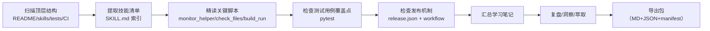

# 执行过程复盘

## 一、任务背景

用户指定本地路径 `d:\AI\external\TuyaOpen-dev-skills`，要求对该仓库进行“学习 + 复盘 + 洞察 + 萃取 + 导出”。该仓库属于外部上游项目（Tuya），核心资产不是传统代码库而是面向 AI 助手的 Skills（`SKILL.md`）与配套脚本。

本次任务目标是：

- 以“学习笔记”的形式沉淀仓库结构、技能地图、关键脚本能力
- 以“复盘 + 洞察”的形式总结其工程化方法论与可复用模式
- 以“导出包”的形式提供可直接转发的精简版报告 + 结构化 JSON 摘要

## 二、信息采集路径（事实）

### 2.1 调研步骤与对象

本次调研按“先全局结构 → 再关键文件 → 再脚本机制 → 再测试/CI”的顺序推进：

### 2.2 关键事实清单

| 事实 | 证据 |
|------|------|
| Skills 采用 “SKILL.md + references/ + scripts/” 三分结构 | [README_zh.md](https://github.com/tuya/TuyaOpen-dev-skills/blob/main/README_zh.md#L132-L136) |
| `tuyaopen/dev-loop` 明确提出 build→flash→monitor→analyze→decide 的闭环 | [tuyaopen/dev-loop/SKILL.md](https://github.com/tuya/TuyaOpen-dev-skills/blob/main/skills/tuyaopen/dev-loop/SKILL.md#L17-L31) |
| debug-helper 提供后台监控脚本，支持 `--json` 输出契约 | [monitor_helper.py](https://github.com/tuya/TuyaOpen-dev-skills/blob/main/skills/tuyaopen/debug-helper/scripts/monitor_helper.py#L12-L18) |
| 代码检查脚本包含 repo root 定位与路径越界防护 | [check_files.py](https://github.com/tuya/TuyaOpen-dev-skills/blob/main/skills/tuyaopen/code-check/scripts/check_files.py#L12-L55) |
| 测试覆盖了脚本的关键可变因素（会话目录/环境变量/向上遍历） | [tests/](https://github.com/tuya/TuyaOpen-dev-skills/tree/main/tests) |

## 三、过程分析（为什么这样做有效）

### 3.1 设计取舍：把“知识”拆成三类载体

该仓库把同一能力拆分为三类不同成本/收益的载体：

- `SKILL.md`：最小入口，保证“触发正确 + 路径正确 + 命令正确”
- `references/`：长文档不占用默认上下文，避免把智能体的“可用注意力”耗尽
- `scripts/`：把高频操作固化成可执行动作，减少语言歧义与步骤缺失

这种拆分直接对应智能体在真实执行中的三类失败模式：触发失败、上下文过载、动作不可复现。

### 3.2 脚本工程化：把“可执行”与“可编排”同时做出来

以 [monitor_helper.py](https://github.com/tuya/TuyaOpen-dev-skills/blob/main/skills/tuyaopen/debug-helper/scripts/monitor_helper.py) 为例，它不仅能跑，还刻意做了上层编排需要的“稳定契约”：

- 支持 `--json`：输出可被机器稳定解析的字段（`ok/pid/log_file/text`）
- 会话文件：将跨命令状态外部化为 `session.json`，避免内存态耦合
- 安全护栏：限制日志路径必须在 `.target_logging/` 下，且 stop 前校验 PID 归属，降低误操作风险

### 3.3 可测试性：优先测试“边界与不确定性”

pytest 的价值不在于覆盖每条分支，而在于覆盖智能体最容易踩坑的“环境不确定性”：

- repo root 解析的环境变量优先级与向上遍历
- 会话目录、会话文件的读写逻辑（易受路径与权限影响）

这使得脚本可以在不同机器/不同目录结构下仍保持可预测行为。

## 四、结论（复盘输出的核心结果）

本次学习确认：TuyaOpen-dev-skills 的核心竞争力不在“写了多少文档”，而在于把文档与脚本组织成了一个面向 AI 的可执行工作流产品。其方法论对“任何需要 AI 可靠落地的工程流程”都有复用价值。
