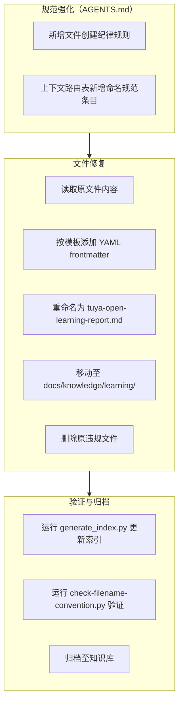

# 执行过程复盘

## 一、任务背景

用户发现 `TuyaOpen学习报告.md` 文件被放置在项目根目录，询问原因。随后要求优化 AGENTS.md 以防止同类错误再次发生，并修复现有问题。

## 二、问题发现路径分析

### 2.1 发现流程

### 2.2 违规诊断

| 违规类型 | 具体问题 | 违反规范 | 严重程度 |
|---------|---------|---------|---------|
| 文件放置 | 文件放在项目根目录 `d:\AI\` | AGENTS.md 文档边界规则：docs/ 面向人类读者 | 中 |
| 文件名 | 中文命名 `TuyaOpen学习报告.md` | file-naming-convention.md：禁止中文，要求 kebab-case | 高 |

### 2.3 根因分析

| 层面 | 根因 | 说明 |
|------|------|------|
| 规范缺失 | AGENTS.md 缺少文件创建前的强制检查规则 | 仅有 Spec 目录规范，缺少通用文档的创建纪律 |
| 路由遗漏 | 上下文路由表未包含文件命名规范 | 创建文件时无法自动路由到命名规范文档 |
| 流程漏洞 | 智能体创建新文件前未执行规范检查流程 | 缺乏"查目录 → 查命名 → 运行验证"的三步检查 |

## 三、修复流程回顾

### 3.1 修复执行流程

### 3.2 执行步骤详情

| 步骤 | 操作 | 关键产出 | 时间 |
|------|------|---------|------|
| T0 | 用户询问文件位置问题 | 问题识别：根目录放置违规 | T0 |
| T0+2min | 查阅 docs/knowledge/README.md | 确认归属目录：learning/ | T0+2min |
| T0+5min | 查阅 file-naming-convention.md | 确认命名规范：kebab-case 纯英文 | T0+5min |
| T0+8min | 诊断完成：双违规确认 | 提出修复方案 | T0+8min |
| T0+10min | 用户要求优化 AGENTS.md | 规范强化任务启动 | T0+10min |
| T0+12min | 读取 AGENTS.md 全局核心规则 | 确定新增规则位置 | T0+12min |
| T0+15min | 新增「文件创建纪律」规则 | AGENTS.md 第37行新增 | T0+15min |
| T0+18min | 上下文路由表新增命名规范条目 | AGENTS.md 第263行新增 | T0+18min |
| T0+20min | 读取 TuyaOpen学习报告.md 内容 | 获取源文件内容 | T0+20min |
| T0+25min | 添加 YAML frontmatter 并写入新位置 | `docs/knowledge/learning/tuya-open-learning-report.md` | T0+25min |
| T0+27min | 删除原违规文件 | 根目录清理完成 | T0+27min |
| T0+30min | 运行 generate_index.py | 知识库索引更新（16条） | T0+30min |
| T0+32min | 运行 check-filename-convention.py | 验证通过：所有文件名符合规范 | T0+32min |

## 四、完成情况评估

| 评估项 | 结果 | 备注 |
|--------|------|------|
| 违规文件修复 | ✅ | 文件已移动并重命名 |
| 规范强化 | ✅ | AGENTS.md 新增文件创建纪律 |
| 路由补全 | ✅ | 上下文路由表新增命名规范条目 |
| 索引更新 | ✅ | 知识库索引已刷新 |
| 自动化验证 | ✅ | check-filename-convention.py 验证通过 |
| 元数据补充 | ✅ | 添加了完整的 YAML frontmatter |

## 五、执行过程中的关键决策

| 决策节点 | 决策内容 | 依据 | 影响 |
|---------|---------|------|------|
| 文件重命名策略 | 使用 `tuya-open-learning-report.md` | kebab-case 规范 + 保持语义清晰 | 符合命名规范，便于搜索 |
| frontmatter 字段选择 | 参考 claude-tag-article.md | 保持与同类文档一致的元数据结构 | 索引系统能正确解析 |
| 规范位置选择 | AGENTS.md 全局核心规则区 | 与 Spec 目录规范并列，便于智能体读取 | 启动协议执行时可被自动加载 |
| 路由条目位置 | 上下文路由表"常规任务路由"区 | 与技术知识库查阅条目相邻 | 创建文件时可被路由到 |

## 六、导出建议执行结果

### 6.1 执行概览

基于 `export-suggestions.md` 中的改进建议，已完成全部 5 项改进措施（IMP-001 ~ IMP-005），具体执行结果如下：

### 6.2 改进措施执行详情

| IMP-ID | 改进项 | 产出物 | 执行状态 | 验证结果 |
|--------|--------|--------|---------|---------|
| IMP-001 | 文件创建指令集 | `.agents/commands/file-creation.md` | ✅ 已完成 | 包含 RACI 矩阵和三步检查流程 |
| IMP-002 | Frontmatter 批量添加脚本 | `.agents/scripts/add-frontmatter.py` | ✅ 已完成 | dry-run 模式验证通过 |
| IMP-003 | CI 文件命名检查 | `.github/workflows/filename-check.yml` | ✅ 已完成 | 工作目录配置正确 |
| IMP-004 | 文件创建前置检查模式 | `docs/retrospective/patterns/methodology-patterns/governance-strategy/file-creation-precheck-pattern.md` | ✅ 已完成 | 成熟度 L2，含 Mermaid 流程图 |
| IMP-005 | 规范可发现性保障模式 | `docs/retrospective/patterns/methodology-patterns/governance-strategy/spec-discoverability-guarantee.md` | ✅ 已完成 | 成熟度 L1，含三层映射表 |

### 6.3 关联文档更新

| 更新文件 | 更新内容 |
|---------|---------|
| `AGENTS.md` | 指令集索引新增"文件创建"条目；上下文路由表新增脚本和模式引用 |
| `.agents/commands/README.md` | 指令集清单和 RACI 矩阵新增"文件创建"指令集 |
| `docs/retrospective/patterns/methodology-patterns/CATEGORIES.md` | governance-strategy 模式数从 15→17，新增两个模式条目 |
| `docs/retrospective/patterns/methodology-patterns/README.md` | governance-strategy 模式数从 16→18 |
| `docs/retrospective/patterns/README.md` | 总模式数从 113→115，更新成熟度统计和更新日志 |

### 6.4 关键修复

在执行过程中发现并修复了两个问题：

1. **category 推断逻辑**：根级 README.md 原被标记为 `uncategorized`，已修复为 `index`
2. **CI workflow 工作目录**：添加 `working-directory: .agents/scripts` 确保脚本找到 lib/ 依赖