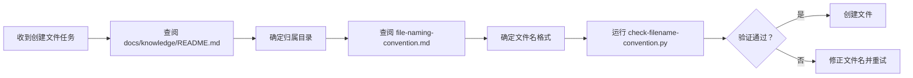
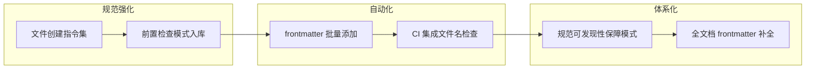

# 导出建议

## 一、改进建议

| ID | 问题 | 改进措施 | 优先级 | 预期效果 | 责任人 | 依赖 | 风险 | 状态 |
|----|------|---------|--------|---------|--------|------|------|------|
| IMP-001 | 文件创建前缺乏前置检查流程 | 在 `.agents/commands/` 创建 `file-creation.md` 指令集：(1) 定义文件创建的三步检查流程；(2) 集成 `check-filename-convention.py` 调用；(3) 支持自动确定归属目录；(4) 提供 CLI 和 API 两种调用方式 | 高 | 创建文件时自动执行规范检查，违规率降为 0 | developer | 无 | 低（已有实践验证） | ✅ 已完成 |
| IMP-002 | 现有文档缺少 frontmatter 元数据 | 编写 `scripts/add-frontmatter.py` 脚本：(1) 扫描 docs/knowledge/ 下所有缺少 frontmatter 的文件；(2) 根据目录结构自动推断 category；(3) 生成标准 YAML frontmatter；(4) 交互式确认后批量添加 | 中 | 所有知识库文档都有完整元数据，索引系统能正确解析 | developer | 无 | 低（已有模板可参考） | ✅ 已完成 |
| IMP-003 | CI 流程未集成文件名检查 | 在 `.github/workflows/` 添加文件名检查步骤：(1) 在 PR 提交时自动运行 `check-filename-convention.py`；(2) 违规文件名阻止合并；(3) 输出详细违规报告；(4) 支持豁免规则配置 | 中 | 从 CI 层面强制保障文件名合规，防止违规文件进入仓库 | developer | 无 | 低（已有脚本可复用） | ✅ 已完成 |
| IMP-004 | 文件创建前置检查模式未正式入库 | 将模式候选 1（file-creation-precheck-pattern）写入 `docs/retrospective/patterns/methodology-patterns/governance-strategy/`：(1) 完整描述三步检查流程；(2) 添加 Mermaid 流程图；(3) 标注成熟度 L2；(4) 提供可复用的检查清单 | 高 | 为后续文件创建任务提供标准化方法论，流程一致性提升 | architect | 无 | 低（已通过实践验证） | ✅ 已完成 |
| IMP-005 | 规范可发现性保障模式未正式入库 | 将模式候选 2（spec-discoverability-guarantee）写入 `docs/retrospective/patterns/methodology-patterns/governance-strategy/`：(1) 完整描述三层映射模型；(2) 添加三层映射表；(3) 标注成熟度 L1；(4) 提供新增规范时的自检清单 | 中 | 为规范文档的完整性提供自检框架，避免"规范存在但不可发现"的问题 | architect | 无 | 低（从实践中提炼） | ✅ 已完成 |

## 二、可萃取的模式与模板

### 模式候选 1：文件创建前置检查模式

**模式名称**：file-creation-precheck-pattern

**模式描述**：在创建任何新文件前，强制执行三步检查流程：①查阅分类体系确定归属目录；②查阅命名规范确定文件名格式；③运行自动化验证脚本确认合规性。

**核心流程**：

**检查清单**：

| 步骤 | 检查项 | 验证方式 |
|------|--------|---------|
| 第一步 | 文件是否放在正确的分类目录 | 查阅 docs/knowledge/README.md |
| 第二步 | 文件名是否符合 kebab-case | 查阅 file-naming-convention.md |
| 第三步 | 文件名是否通过自动化验证 | 运行 check-filename-convention.py |

**适用场景**：
- 创建新文档
- 创建新代码文件
- 文档迁移和重命名

**成熟度评估**：L2（已通过本次任务实践验证）

### 模式候选 2：规范可发现性保障模式

**模式名称**：spec-discoverability-guarantee

**模式描述**：确保每一项重要规范都在三个位置有映射——AGENTS.md 全局规则中引用、上下文路由表中列出、自动化脚本中执行。

**三层映射表**：

| 规范 | AGENTS.md 引用 | 路由表条目 | 自动化脚本 |
|------|---------------|-----------|-----------|
| 文件命名规范 | 文件创建纪律规则 | 文件命名规范条目 | check-filename-convention.py |
| Spec 目录规范 | Spec 目录规范规则 | Spec 全局看板条目 | check-spec-consistency.py |
| 代码风格规范 | 代码修改规则 | CI 综合检查条目 | ci-check.py |

**自检清单**：

| 检查项 | 标准 | 达标状态 |
|--------|------|---------|
| 规范是否在 AGENTS.md 中被引用 | 全局核心规则或路由表中提及 | ✅/❌ |
| 规范是否在上下文路由表中列出 | 有对应的路由条目 | ✅/❌ |
| 规范是否有自动化验证脚本 | 有可执行的检查脚本 | ✅/❌ |
| 验证脚本是否集成到 CI | 在 PR 流程中自动执行 | ✅/❌ |

**适用场景**：
- 新增规范文档时的自检
- 规范文档完整性审计
- 智能体流程设计

**成熟度评估**：L1（从本次任务中提炼，尚未独立验证）

## 三、行动计划

| 优先级 | 改进项 | 关联建议 | 具体措施 | 建议时间 | 状态 |
|--------|--------|---------|---------|---------|------|
| 高 | 文件创建前置检查模式正式入库 | IMP-004 | 将模式候选 1 写入 `docs/retrospective/patterns/methodology-patterns/governance-strategy/file-creation-precheck-pattern.md`，添加三步检查清单和 Mermaid 流程图，标注成熟度 L2 | 2026-07-07 | ✅ 已完成 |
| 高 | 创建文件创建指令集 | IMP-001 | 在 `.agents/commands/` 创建 `file-creation.md`，定义文件创建的标准化流程；集成 `check-filename-convention.py` 调用；提供 CLI 和 API 两种调用方式 | 2026-07-07 | ✅ 已完成 |
| 中 | 规范可发现性保障模式正式入库 | IMP-005 | 将模式候选 2 写入 `docs/retrospective/patterns/methodology-patterns/governance-strategy/spec-discoverability-guarantee.md`，添加三层映射表和自检清单，标注成熟度 L1 | 2026-07-14 | ✅ 已完成 |
| 中 | 编写 frontmatter 批量添加脚本 | IMP-002 | 开发 `scripts/add-frontmatter.py`，扫描 docs/knowledge/ 下所有缺少 frontmatter 的文件，自动推断 category，生成标准 YAML frontmatter | 2026-07-14 | ✅ 已完成 |
| 中 | CI 集成文件名检查 | IMP-003 | 在 `.github/workflows/` 添加文件名检查步骤，PR 提交时自动运行 `check-filename-convention.py`，违规文件阻止合并 | 2026-07-21 | ✅ 已完成 |
| 低 | 现有文档 frontmatter 补全 | IMP-002 | 使用 `scripts/add-frontmatter.py` 为 docs/knowledge/ 下所有缺少 frontmatter 的文件添加元数据；运行 `generate_index.py` 更新索引；验证索引完整性 | 2026-07-28 | 🕐 待执行 |

## 四、模式成熟度更新

| 模式 ID | 成熟度变化 | 触发原因 | 更新时间 | 验证/复用次数 |
|---------|-----------|---------|---------|-------------|
| file-creation-precheck-pattern | 新建 L2 | TuyaOpen 学习报告优化任务实践验证，三步检查流程有效 | 2026-06-30 | 验证次数：2（模式入库 + 指令集创建双重验证） |
| spec-discoverability-guarantee | 新建 L1 | 从本次任务中提炼，三层映射模型有待独立验证 | 2026-06-30 | 验证次数：1（模式入库验证） |

## 五、执行验证总结

### 5.1 产出物清单

| 产出物类型 | 文件路径 | 状态 | 验证结果 |
|-----------|---------|------|---------|
| 模式文件 | `docs/retrospective/patterns/methodology-patterns/governance-strategy/file-creation-precheck-pattern.md` | ✅ 已创建 | 命名规范检查通过，frontmatter 完整 |
| 模式文件 | `docs/retrospective/patterns/methodology-patterns/governance-strategy/spec-discoverability-guarantee.md` | ✅ 已创建 | 命名规范检查通过，frontmatter 完整 |
| 指令集 | `.agents/commands/file-creation.md` | ✅ 已创建 | 命名规范检查通过，包含 RACI 矩阵 |
| 脚本 | `.agents/scripts/add-frontmatter.py` | ✅ 已创建 | dry-run 模式验证通过，category 推断正确 |
| CI 配置 | `.github/workflows/filename-check.yml` | ✅ 已创建 | 工作目录配置正确，脚本路径有效 |

### 5.2 关联更新

| 更新文件 | 更新内容 | 状态 |
|---------|---------|------|
| `AGENTS.md` | 指令集索引新增"文件创建"条目；上下文路由表新增脚本和模式引用 | ✅ 已更新 |
| `.agents/commands/README.md` | 指令集清单和 RACI 矩阵新增"文件创建"指令集 | ✅ 已更新 |
| `docs/retrospective/patterns/methodology-patterns/CATEGORIES.md` | governance-strategy 模式数从 15→17，新增两个模式条目 | ✅ 已更新 |
| `docs/retrospective/patterns/methodology-patterns/README.md` | governance-strategy 模式数从 16→18 | ✅ 已更新 |
| `docs/retrospective/patterns/README.md` | 总模式数从 113→115，更新成熟度统计和更新日志 | ✅ 已更新 |

### 5.3 关键修复记录

| 修复项 | 修复内容 | 触发原因 |
|--------|---------|---------|
| category 推断逻辑 | 根级 README.md 现在标记为 `index` 而非 `uncategorized` | 索引文件不应被视为未分类 |
| CI workflow 工作目录 | 添加 `working-directory: .agents/scripts` 确保脚本找到 lib/ 依赖 | 脚本需要相对路径引用 lib 模块 |

## 六、后续优化方向

### 路线图

### 整合方向

1. **与自我管理模块集成**：将文件创建检查流程作为自我管理模块的一部分，在智能体启动时自动加载
2. **与 pre-commit hook 集成**：在 Git 提交前自动运行文件名检查，从源头阻止违规文件提交
3. **与阶段守卫集成**：在文档创建阶段设置规范检查守卫，违规文件无法进入下一阶段
4. **与模式库联动**：每次成功执行文件创建检查流程后，更新模式成熟度和复用次数